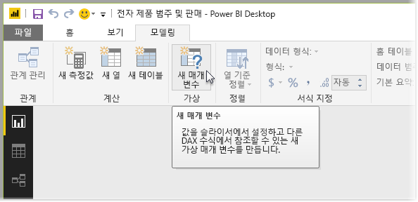
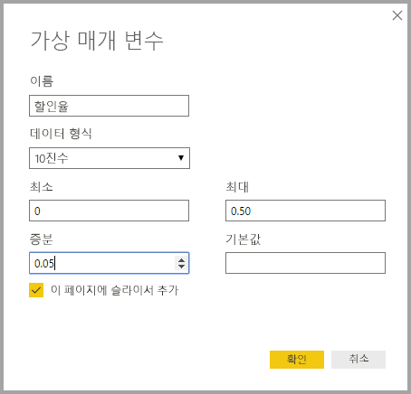
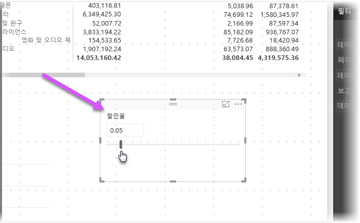
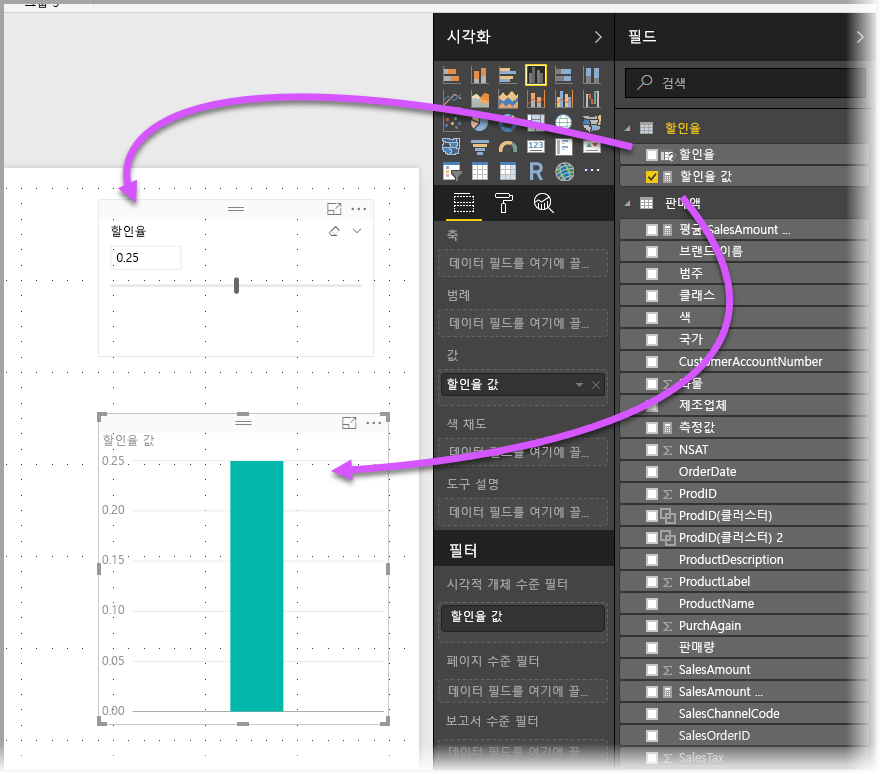
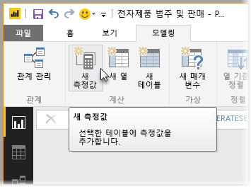
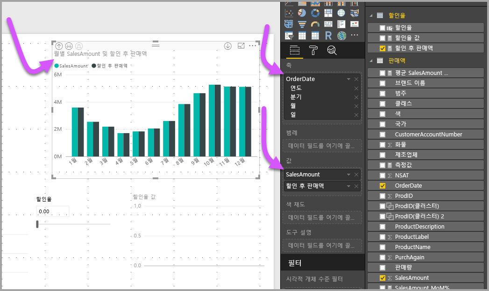
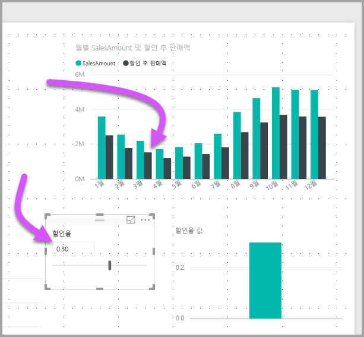

# What if 매개 변수를 사용하여 Power BI Desktop에서 변수 시각화
**Power BI Desktop** 2018년 8월 릴리스에서부터는 보고서에 대한 **What if** 변수를 만들고, 슬라이서인 변수와 상호 작용하고, 보고서에서 다른 키 값을 시각화하고 수치화할 수 있습니다.

**What if** 매개 변수는 **Power BI Desktop**의 **모델링** 탭에 있습니다. 이 탭을 선택하면 매개 변수를 구성할 수 있는 대화 상자가 나타납니다.

## What if 매개 변수 만들기
**What if** 매개 변수를 만들려면 **Power BI Desktop**의 **모델링** 탭에서 **새 매개 변수** 단추를 선택합니다. 다음 이미지에서는 *할인율*이라는 매개 변수를 만들고 *10진수*로 해당 데이터 형식을 설정했습니다. *최소* 값이 0이고 *최대* 값은 0.50(50%)입니다. 또한 *증가*를 0.05 또는 5%로 설정했습니다. 보고서에서 상호 작용할 때 매개 변수를 조정하는 정도입니다.

> [!NOTE]
> 10진수의 경우 .50이 아니라 0.50과 같이 0을 앞에 사용하도록 합니다. 그렇지 않으면 숫자의 유효성을 검사할 수 없고 **확인** 단추를 선택할 수 없습니다.
> 
> 

편의상 **이 페이지에 슬라이서 추가** 확인란은 현재 보고서 페이지에 **What if** 매개 변수를 포함한 슬라이서를 자동으로 배치합니다.

매개 변수를 만들 뿐만 아니라 **What if** 매개 변수를 만드는 작업은 **What if** 매개 변수의 현재 값을 시각화하는 데 사용할 수 있는 측정값을 만듭니다.

**What if** 매개 변수를 만들면 매개 변수 및 측정값은 모두 모델의 일부가 된다는 점을 기억합니다. 따라서 보고서 전체에서 사용 가능하고 다른 보고서 페이지에서 사용할 수 있습니다. 모델의 일부가 아니므로 보고서 페이지에서 슬라이서를 삭제할 수 있습니다. 다시 되돌리려는 경우 **필드** 목록에서 **What if** 매개 변수를 잡아서 캔버스로 끌어서 놓으면(그런 다음, 시각적 개체를 슬라이서로 변경) 매개 변수를 손쉽게 다시 보고서에 가져올 수 있습니다.

## What if 매개 변수 사용
**What if** 매개 변수를 사용하는 간단한 예제를 만들어 보겠습니다. 이전 섹션에서 **What if** 매개 변수를 만들었으므로 이제 값을 슬라이더에서 조정하는 새 측정값을 만들어 사용하도록 합니다. 이를 달성하기 위해 새 측정값을 만듭니다.

새 측정값은 단순히 할인율이 적용된 총 판매액입니다. 물론 복잡하고 흥미로운 측정값을 만들어서 보고서의 고객이 **What if** 매개 변수의 변수를 시각화할 수 있습니다. 예를 들어 영업 사원은 자신의 인센티브 특정 판매 목표 또는 백분율을 충족 하거나의 효과 확인할 경우 증가 대폭 할인으로 판매가 참조 수 있는 보고서를 만들 수 있습니다.

수식 입력줄에 다음 측정값 수식을 입력하고 이름을 **할인 후 판매액**으로 지정하면 그 결과가 표시됩니다.

그런 다음, 축에서 *OrderDate*를 포함하는 열 시각적 개체를 만들고 *SalesAmount*와 방금 만든 측정값 ‘할인 후 판매액’을 값으로 만듭니다. 

그런 다음 슬라이더를 이동하면 *할인 후 판매액* 열이 할인된 판매액을 반영하는 것을 확인할 수 있습니다.

이제 필요한 항목이 모두 준비되었습니다. 모든 상황에서 **What if** 매개 변수를 사용하여 보고서 고객이 보고서에서 만든 다양한 시나리오와 상호 작용하도록 할 수 있습니다.

