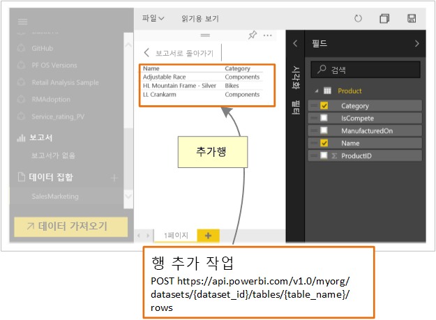

# 개발자는 Power BI API로 무엇을 할 수 있나요?

Power BI REST API를 사용하여 Power BI 보고서, 대시보드 및 타일과 통합된 앱을 만들 수 있습니다.

Power BI REST API를 사용하면 보고서, 데이터 세트 및 작업 영역과 같은 Power BI 개체에서 관리 작업을 수행할 수 있습니다.

다음은 Power BI API로 수행할 수 있는 몇 가지 작업입니다.

| **자세한 내용은** | **이 정보를 참조 합니다.** |
|----------------------------------------------------------------------------------|------------------------------------------------------------------------------------|
| Power BI 사용자 및 Power BI 비사용자를 위한 보고서, 대시보드 및 타일을 포함합니다. | [Power BI 대시보드, 보고서 및 타일을 포함 하는 방법 ](embedding-content.md) |
| Power BI 개체에서 관리 작업을 수행합니다. | [Power BI REST API 참조](https://docs.microsoft.com/rest/api/power-bi/) |
| 기존 비즈니스 워크플로를 확장하여 키 데이터를 Power BI 대시보드에 푸시 | [대시보드에 데이터 푸시 ](walkthrough-push-data.md) |
| Power BI에 인증. | [Power BI에 인증 ](get-azuread-access-token.md) |

> [!NOTE]
> Power BI API는 계속 그룹으로 앱 작업 영역을 참조합니다. 그룹에 대한 참조는 앱 작업 영역과 작업 중임을 의미합니다.

## API 개발자 도구

| 도구 | 설명 |  |  |
|-------------------------|---------------------------------------------------------------------------------------------------------------------------------------------------|---|---|
| [실습 도구](https://microsoft.github.io/PowerBI-JavaScript/demo) | Power BI JavaScript API를 사용하는 전체 예제를 사용해보세요. 이 도구로 다양한 유형의 Power BI Embedded 샘플을 빠르게 재생할 수도 있습니다. |  |  |
| [Power BI JavaScript wiki](https://github.com/Microsoft/powerbi-javascript/wiki) | Power BI JavaScript API에 대한 자세한 내용을 알아보려면 |  |  |
| [Postman](https://www.getpostman.com/) | 요청을 실행하고, 테스트하고, 디버그하고, 모니터링하고, 자동화된 테스트 등을 실행합니다. |

## Power BI로 데이터 푸시

Power BI API를 사용하여 [데이터를 데이터 세트에 푸시](walkthrough-push-data.md)할 수 있습니다. 이 기능을 사용하여 데이터 세트 내 테이블에 행을 추가할 수 있습니다. 그러면 새 데이터가 대시보드의 타일과 보고서 내 시각적 개체에 반영됩니다.

## GitHub 리포지토리

* [Power BI 개발자 샘플](https://github.com/Microsoft/PowerBI-Developer-Samples)
* [.NET SDK](https://github.com/Microsoft/PowerBI-CSharp)
* [JavaScript API](https://github.com/Microsoft/PowerBI-JavaScript)

## 다음 단계

* [데이터 세트에 데이터 푸시](walkthrough-push-data.md)
* [Power BI 사용자 지정 시각적 개체 개발](custom-visual-develop-tutorial.md)
* [Power BI REST API 참조](rest-api-reference.md)
* [Power BI REST API](https://docs.microsoft.com/rest/api/power-bi/)

궁금한 점이 더 있나요? [Power BI 커뮤니티에 질문합니다.](http://community.powerbi.com/)
