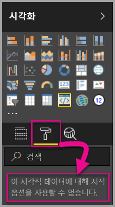
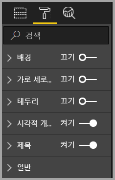
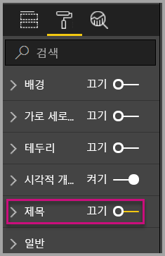
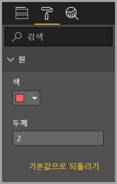
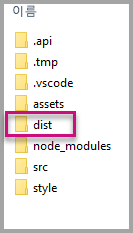
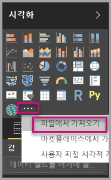
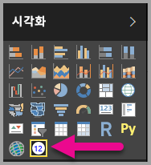

# <a name="tutorial-adding-formatting-options-to-a-power-bi-visual"></a>자습서:  Power BI 시각적 개체에 서식 옵션 추가

이 자습서에서는 시각적 개체에 공통 속성을 추가하는 방법을 살펴봅니다.

이 자습서에서는 다음 작업을 수행하는 방법을 알아봅니다.
> [!div class="checklist"]
> * 시각적 개체 속성 추가
> * 시각적 개체를 패키지합니다.
> * 사용자 지정 시각적 개체를 Power BI Desktop 보고서로 가져옵니다.

## <a name="adding-formatting-options"></a>서식 옵션 추가

1. **Power BI**에서 **페이지 서식**을 선택합니다.

    ‘이 시각적 개체에 대해 서식 옵션을 사용할 수 없습니다.’라는 메시지가 표시됩니다. 

    

2. **Visual Studio Code**에서 *capabilities.json* 파일을 엽니다.

3. **dataViewMappings** 배열 앞에 **objects**를 추가합니다(줄 8 뒤).

    ```json
    "objects": {},
    ```

    

4. **capabilities.json** 파일을 저장합니다.

5. **Power BI**에서 서식 옵션을 다시 검토합니다.

    > [!Note]
    > 서식 옵션이 변경되지 않으면 **사용자 지정 시각적 개체 다시 로드**를 선택합니다.

    

6. **제목** 옵션을 ‘끄기’로 설정합니다.  시각적 개체가 왼쪽 위 모서리에 측정값 이름을 표시하지 않는지 확인합니다.

    

    

### <a name="adding-custom-formatting-options"></a>사용자 지정 서식 옵션 추가

사용자 지정 속성을 추가하여 원의 색과 테두리 너비를 구성할 수 있습니다.

1. PowerShell에서 사용자 지정 시각적 개체를 중지합니다.

2. Visual Studio Code의 **capabilities.json** 파일에서 다음 JSON 조각을 **objects**로 레이블된 개체에 삽입합니다.

    ```json
        {
            "circle": {
                "displayName": "Circle",
                "properties": {
                    "circleColor": {
                        "displayName": "Color",
                        "description": "The fill color of the circle.",
                        "type": {
                            "fill": {
                                "solid": {
                                    "color": true
                                }
                            }
                        }
                    },
                    "circleThickness": {
                        "displayName": "Thickness",
                        "description": "The circle thickness.",
                        "type": {
                            "numeric": true
                        }
                    }
                }
            }
        }
    ```

    JSON 조각은 circleColor 및 circleThickness라는 두 개의 옵션으로 구성된 circle이라는 그룹을 설명합니다.

   

3. **capabilities.json** 파일을 저장합니다.

4. **탐색기 창**의 **src** 폴더 내부에서 **settings.ts**를 선택합니다. 이 파일은 시작 시각적 개체의 설정을 나타냅니다. 

5. **settings.ts** 파일에서 두 개의 클래스를 다음 코드로 바꿉니다.

    ```typescript
    export class CircleSettings {
        public circleColor: string = "white";
        public circleThickness: number = 2;
    }
    export class VisualSettings extends DataViewObjectsParser {
        public circle: CircleSettings = new CircleSettings();
    }
    ```

    

    이 모듈은 두 개의 클래스를 정의합니다. **CircleSettings** 클래스는 **capabilities.json** 파일에 정의된 개체와 일치하는 이름을 사용하여 두 개의 속성(**circleColor** 및 **circleThickness**)을 정의하고 기본값을 설정합니다. **VisualSettings** 클래스는 **DataViewObjectParser** 클래스를 상속하고 *capabilities.json* 파일에 정의된 개체와 일치하는 **circle**이라는 속성을 추가하고 **CircleSettings**의 인스턴스를 반환합니다.

6. **settings.ts** 파일을 저장합니다.

7. **visual.ts** 파일을 엽니다.

8. **visual.ts** 파일에서

    `VisualSettings`, `VisualObjectInstanceEnumeration` 및 `EnumerateVisualObjectInstancesOptions` 가져오기:

    ```typescript
    import { VisualSettings } from "./settings";
    import VisualObjectInstanceEnumeration = powerbi.VisualObjectInstanceEnumeration;
    import EnumerateVisualObjectInstancesOptions = powerbi.EnumerateVisualObjectInstancesOptions;
    ```

    **Visual** 클래스에서 다음 속성을 추가합니다:

    ```typescript
    private visualSettings: VisualSettings;
    ```

    이 속성은 시각적 개체 설정을 설명하는 **VisualSettings** 개체에 대한 참조를 저장합니다.

    

9. **Visual** 클래스에서 **update** 메서드 앞에 다음 메서드를 추가합니다. 이 메서드는 서식 옵션을 채우는 데 사용됩니다.

    ```typescript
    public enumerateObjectInstances(options: EnumerateVisualObjectInstancesOptions): VisualObjectInstanceEnumeration {
        const settings: VisualSettings = this.visualSettings || <VisualSettings>VisualSettings.getDefault();
        return VisualSettings.enumerateObjectInstances(settings, options);
    }
    ```

    이 메서드는 서식 옵션을 채우는 데 사용됩니다.

    

10. **update** 메서드에서 **radius** 변수 선언 뒤에 다음 코드를 추가합니다.

    ```typescript
    this.visualSettings = VisualSettings.parse<VisualSettings>(dataView);

    this.visualSettings.circle.circleThickness = Math.max(0, this.visualSettings.circle.circleThickness);
    this.visualSettings.circle.circleThickness = Math.min(10, this.visualSettings.circle.circleThickness);
    ```

    이 코드는 서식 옵션을 검색합니다. **circleThickness** 속성에 전달된 값을 조정하여 음수인 경우 0으로 변환하고 10보다 큰 경우 10으로 변환합니다.

    

11. **circle 요소**의 경우 **채우기 스타일**에 전달된 값을 다음 식으로 수정합니다.

    ```typescript
    this.visualSettings.circle.circleColor
    ```

    

12. **circle 요소**의 경우 **스트로크 너비 스타일**에 전달된 값을 다음 식으로 수정합니다.

    ```typescript
    this.visualSettings.circle.circleThickness
    ```

    

13. visual.ts 파일을 저장합니다.

14. PowerShell에서 시각적 개체를 시작합니다.

    ```powershell
    pbiviz start
    ```

15. **Power BI**의 시각적 개체 위에서 움직이는 도구 모음에서 **자동 다시 로드 토글**을 선택합니다.

16. **시각적 개체 서식** 옵션에서 **원**을 확장합니다.

    

    **색** 및 **두께** 옵션을 수정합니다.

    **두께** 옵션을 0보다 작은 값과 10보다 큰 값으로 수정합니다. 그런 다음, 시각적 개체가 값을 허용 가능한 최솟값 또는 최댓값으로 업데이트하는지 확인합니다.

## <a name="packaging-the-custom-visual"></a>사용자 지정 시각적 개체 패키지

사용자 지정 시각적 개체 프로젝트의 속성 값을 입력하고, 아이콘 파일을 업데이트한 다음, 사용자 지정 시각적 개체를 패키지합니다.

1. **PowerShell**에서 사용자 지정 시각적 개체를 중지합니다.

2. **Visual Studio Code**에서 **pbiviz.json** 파일을 엽니다.

3. **visual** 개체에서 **displayName** 속성을 *Circle Card*로 수정합니다.

    **시각화** 창에서 아이콘 위에 마우스를 놓으면 표시 이름이 표시됩니다.

    

4. **description** 속성에 다음 텍스트를 입력합니다.

    ‘원 내부에 서식이 지정된 측정값 표시’ 

5. 시각적 개체의 **supportUrl** 및 **gitHubUrl**을 채웁니다.

    예제:

    ```json
    {
        "supportUrl": "https://community.powerbi.com",
        "gitHubUrl": "https://github.com/microsoft/PowerBI-visuals-circlecard"
    }
    ```

6. **author** 개체에 사용자 정보를 입력합니다.

7. **pbiviz.json** 파일을 저장합니다.

8. **assets** 개체에서 문서는 아이콘의 경로를 정의합니다. 아이콘은 **‘시각화’** 창에 표시되는 이미지입니다.  *20px x 20px*의 **PNG** 파일이어야 합니다.

9. Windows 탐색기에서 icon.png 파일을 복사한 후 붙여넣어 assets 폴더에 있는 기본 파일을 바꿉니다.

10. Visual Studio Code의 [탐색기] 창에서 assets 폴더를 확장한 다음, icon.png 파일을 선택합니다.

11. 아이콘을 검토합니다.

    

12. Visual Studio Code에서 모든 파일이 저장되었는지 확인합니다.

13. 사용자 지정 시각적 개체를 패키지하려면 PowerShell에서 다음 명령을 입력합니다.

    ```powershell
    pbiviz package
    ```

    

이제 패키지가 프로젝트의 **dist** 폴더에 출력됩니다. 패키지에는 Power BI 서비스 또는 Power BI Desktop 보고서로 사용자 지정 시각적 개체를 가져오는 데 필요한 모든 것이 포함되어 있습니다. 사용자 지정 시각적 개체를 패키지했으므로 사용할 준비가 되었습니다.

## <a name="importing-the-custom-visual"></a>사용자 지정 시각적 개체 가져오기

이제 Power BI Desktop 보고서를 열고 Circle Card 사용자 지정 시각적 개체를 가져올 수 있습니다.

1. **Power BI Desktop**을 열고  *샘플 데이터 세트*을 사용하여 새 보고서를 생성합니다.

2. **‘시각화’** 창에서 **줄임표**를 선택한 다음, 파일에서 **가져오기**를 선택합니다. 

    

3. **가져오기 창**에서 **가져오기**를 선택합니다.

4. [열기] 창에서 프로젝트 디렉터리의 **dist** 폴더로 이동합니다.

5. **circleCard.pbiviz** 파일을 선택한 다음, **열기**를 선택합니다.

6. 시각적 개체를 성공적으로 가져온 경우 **확인**을 선택합니다.

7. 시각적 개체가 **‘시각화’** 창에 추가되었는지 확인합니다. 

    

8. **Circle Card** 아이콘 위로 마우스를 이동하여 나타나는 도구 설명을 확인합니다.

## <a name="debugging"></a>디버깅

사용자 지정 시각적 개체의 디버깅에 대한 팁은 [디버깅 가이드](https://microsoft.github.io/PowerBI-visuals/docs/how-to-guide/how-to-debug/)를 을 참조하세요.

## <a name="next-steps"></a>다음 단계

**AppSource**에 제출하여 다른 사용자가 사용할 새로 개발된 시각적 개체를 나열할 수 있습니다. 이 프로세스에 대한 자세한 내용은 [Power BI 시각적 개체를 AppSource에 게시](office-store.md)를 참조하세요.
