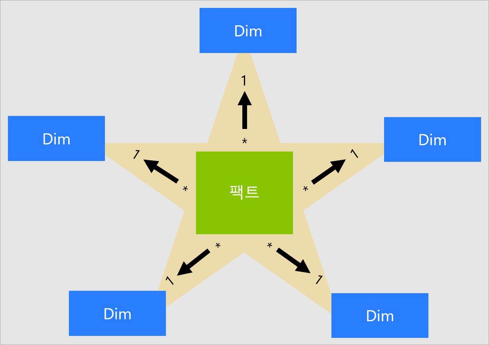
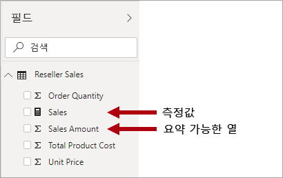
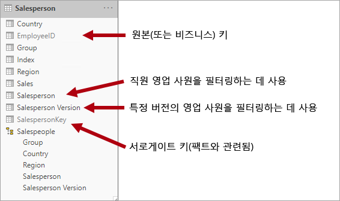
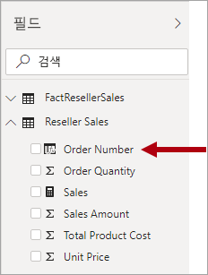

# 별모양 스키마 및 Power BI에서의 중요성 이해

이 문서는 Power BI Desktop 데이터 모델러를 대상으로 합니다. 별모양 스키마 디자인과 성능 및 유용성에 최적화된 Power BI 데이터 모델 개발과의 관련성을 설명합니다.

이 문서는 별모양 스키마 디자인을 자세히 설명하기 위한 것이 아닙니다. 자세한 내용은 Ralph Kimball et al이 저술한 **The Data Warehouse Toolkit: The Complete Guide to Dimensional Modeling**(데이터 웨어하우스 도구 키트: 차원 모델링 전체 가이드)(2쇄, 2002년)과 같은 게시된 콘텐츠를 직접 참조하세요.

## 별모양 스키마 개요

**별모양 스키마**는 관계형 데이터 웨어하우스에서 널리 채택되는 안정적인 모델링 방법입니다. 이 방법을 사용하려면 모델러가 모델 테이블을 _차원_ 또는 _팩트_로 분류해야 합니다.

**차원 테이블**은 모델링 “대상”인 비즈니스 엔터티를 설명합니다. 엔터티에는 제품, 사람, 장소, 시간 자체를 포함하는 개념 등이 있습니다. 별모양 스키마에서 가장 일관된 테이블은 날짜 차원 테이블입니다. 차원 테이블에는 고유 식별자 역할을 하는 키 열과 설명 열이 포함되어 있습니다.

**팩트 테이블**은 관찰 또는 이벤트를 저장합니다. 판매 주문, 재고 잔액, 환율, 온도 등일 수 있습니다. 팩트 테이블은 차원 테이블과 관련된 차원 키 열 및 숫자 측정값 열을 포함합니다. 차원 키 열은 팩트 테이블의 _차원성_을 결정하는 반면, 차원 키 값은 팩트 테이블의 _세분성_을 결정합니다. 예를 들어 판매 목표를 저장하도록 디자인된 팩트 테이블에 **Date** 및 **ProductKey**라는 두 개의 차원 키 열이 있다고 가정합니다. 테이블에 두 개의 차원이 있음을 쉽게 파악할 수 있습니다. 하지만 차원 키 값을 고려하지 않으면 세분성을 확인할 수 없습니다. 이 예제에서는 **Date** 열에 저장된 값이 매월 1일임을 고려합니다. 이 경우 세분성은 월-제품 수준입니다.

일반적으로 차원 테이블의 행 수는 비교적 적습니다. 반면, 팩트 테이블은 행 수가 매우 많을 수 있으며 시간이 지남에 따라 계속 증가합니다.

## Power BI 모델과 별모양 스키마의 관련성

별모양 스키마 디자인 및 이 문서에 소개된 많은 관련 개념은 성능과 유용성에 최적화된 Power BI 모델 개발과 관련성이 높습니다.

각 Power BI 보고서 시각적 개체는 Power BI 서비스에서 데이터 세트라고 불리는 Power BI 모델에 전송되는 쿼리를 생성한다는 점을 고려합니다. 이러한 쿼리는 모델 데이터를 필터링, 그룹화 및 요약하는 데 사용됩니다. 따라서 잘 디자인된 모델은 필터링 및 그룹화에 사용할 테이블과 요약에 사용할 테이블을 제공하는 모델입니다. 이 요구 사항은 별모양 스키마 디자인 원칙에 잘 맞습니다.

- 차원 테이블은 _필터링_ 및 _그룹화_를 지원합니다.
- 팩트 테이블은 _요약_을 지원합니다.

테이블 유형(차원 또는 팩트)을 구성하기 위해 모델러가 설정하는 테이블 속성은 없지만, 모델 관계에 따라 결정됩니다. 모델 관계는 두 테이블 간의 필터 전파 경로를 설정하며, 테이블 유형을 결정하는 관계의 **카디널리티** 속성입니다. 일반적인 관계 카디널리티는 “일대다” 또는 역으로 “다대일”입니다. “일” 쪽은 항상 차원 유형 테이블인 반면, “다” 쪽은 항상 팩트 유형 테이블입니다.

잘 구성된 모델 디자인에는 차원 유형 테이블 또는 팩트 유형 테이블인 테이블이 포함되어야 합니다. 단일 테이블에서 두 가지 유형을 함께 사용하면 안 됩니다. 또한 올바른 관계가 설정된 테이블을 적절한 개수만큼 제공하는 것이 좋습니다. 팩트 유형 테이블에서 항상 일관된 세분성으로 데이터를 로드하는 것도 중요합니다.

마지막으로, 최적 모델 디자인은 과학과 예술의 결합임을 이해하는 것이 중요합니다. 타당한 이유가 있을 때는 권장 지침대로 하지 않아도 됩니다.

Power BI 모델에 적용할 수 있는, 별모양 스키마 디자인과 관련된 많은 추가 개념이 있습니다. 내용은 다음과 같습니다.

- [측정값](#measures)
- [서로게이트 키](#surrogate-keys)
- [눈송이 차원](#snowflake-dimensions)
- [롤플레잉 차원](#role-playing-dimensions)
- [느린 변경 차원](#slowly-changing-dimensions)
- [정크 차원](#junk-dimensions)
- [중복 제거 차원](#degenerate-dimensions)
- [팩트리스 팩트 테이블](#factless-fact-tables)

## 측정값

별모양 스키마 디자인에서 **측정값**은 요약할 값을 저장하는 팩트 테이블 열입니다.

Power BI 모델의 **측정값** 정의는 다르지만 비슷합니다. 요약을 수행하는, [DAX(Data Analysis Expressions)](https://docs.microsoft.com/dax/data-analysis-expressions-dax-reference)로 작성된 수식입니다. 측정값 식은 SUM, MIN, MAX, AVERAGE 등의 DAX 집계 함수를 활용하여 쿼리 시간에 스칼라 값 결과를 생성하는 경우가 많습니다(값은 모델에 저장되지 않음). 측정값 식은 간단한 열 집계부터 필터 컨텍스트 및/또는 관계 전파를 재정의하는 더 복잡한 수식까지 다양할 수 있습니다. 자세한 내용은 [Power BI Desktop의 DAX 기본 사항](https://docs.microsoft.com/power-bi/desktop-quickstart-learn-dax-basics) 문서를 참조하세요.

Power BI 모델은 요약을 수행하는 다른 방법을 지원한다는 점을 이해하는 것이 중요합니다. 모든 열과 일반적으로 숫자 열은 보고서 시각적 개체 또는 질문 및 답변을 통해 요약할 수 있습니다. 대부분의 경우 측정값을 만들 필요가 없기 때문에 이 기능은 모델 개발자의 편의를 위한 것입니다. 예를 들어 가능한 각 집계 유형에 사용할 측정값을 만들 필요 없이 여러 가지 방법(sum, count, average, median, min, max 등)으로 Adventure Works 재판매인 판매 **Sales Amount** 열을 요약할 수 있습니다.

그러나 간단한 열 수준 요약의 경우에도 측정값을 만들어야 하는 두 가지 중요한 이유가 있습니다.

- 보고서 작성자가 [MDX(Multidimensional Expressions)](https://docs.microsoft.com/sql/analysis-services/multidimensional-models/mdx/mdx-query-the-basic-query?view=sql-server-2017)를 사용하여 모델을 쿼리할 것을 알고 있다면 모델에 측정값을 포함해야 합니다. MDX는 열 값을 요약할 수 없습니다. MDX를 사용하여 Power BI 데이터 세트를 쿼리하는 경우와 관련성이 매우 높으며, [Excel에서 분석](https://docs.microsoft.com/power-bi/service-analyze-in-excel)을 사용하는 경우에 해당합니다(피벗 테이블에서 MDX 쿼리 실행).
- 보고서 작성자가 특정 방식으로만 열을 요약할 수 있도록 해야 하는 경우입니다. 예를 들어 재판매인 판매 **Unit Price** 열(단가를 나타냄)은 특정 집계 함수를 사용해서 요약해야 합니다. 즉, 합계는 계산하면 안 되지만 다른 집계 함수(min, max, average 등)를 사용하여 요약할 수 있습니다. 이 경우에는 모델러가 **Unit Price** 열을 숨기고 적절한 모든 집계 함수에 사용할 측정값을 만들 수 있습니다.

이 디자인 방법은 Power BI 서비스에서 작성된 보고서와 질문 및 답변에 적합합니다. 그러나 Power BI Desktop 라이브 연결에서는 보고서 작성자가 **필드** 창에서 숨겨진 필드를 표시할 수 있으므로, 이 디자인 방법을 우회할 수 있습니다.

## 서로게이트 키

**서로게이트 키**는 별모양 스키마 모델링을 지원하기 위해 테이블에 추가하는 고유 식별자입니다. 정의에 따라 원본 데이터에서 정의되거나 저장되지 않습니다. 일반적으로, 서로게이트 키는 각 차원 테이블 행의 고유 식별자를 제공하기 위해 관계형 데이터 웨어하우스 차원 테이블에 추가됩니다.

Power BI 모델 관계는 한 테이블의 단일 고유 열을 기반으로 하며, 이 열이 다른 테이블의 단일 열에 필터를 전파합니다. 모델의 차원 유형 테이블에 단일 고유 열이 없는 경우 관계의 “일” 쪽에 사용할 고유 식별자를 추가해야 합니다. Power BI Desktop에서 [파워 쿼리 인덱스 열](https://docs.microsoft.com/powerquery-m/table-addindexcolumn)을 만들면 간편하게 추가할 수 있습니다.

인덱스 열도 추가할 수 있도록 이 쿼리를 “다” 쪽 쿼리와 병합해야 합니다. 이러한 쿼리를 모델에 로드하면, 모델 테이블 간에 일대다 관계를 만들 수 있습니다.

## 눈송이 차원

**눈송이 차원**은 단일 비즈니스 엔터티에 대한 정규화된 테이블 집합입니다. 예를 들어 Adventure Works는 범주 및 하위 범주별로 제품을 분류합니다. 범주는 하위 범주에 할당되므로, 제품이 다시 하위 범주에 할당됩니다. Adventure Works 관계형 데이터 웨어하우스에서 제품 차원은 정규화되어 세 개의 관련 테이블(**DimProductCategory**, **DimProductSubcategory**, **DimProduct**)에 저장됩니다.

상상력을 발휘한다면, 팩트 테이블에서 바깥쪽으로 배치된 정규화된 테이블이 눈송이 모양을 만드는 그림을 그릴 수 있습니다.

Power BI Desktop에서 원본 데이터에 따라 눈송이 차원 디자인을 모방하거나, 원본 테이블을 단일 모델 테이블로 통합(비정규화)할 수 있습니다. 일반적으로 단일 모델 테이블의 혜택이 여러 모델 테이블의 혜택보다 큽니다. 가장 최적 결정은 모델의 데이터 볼륨 및 유용성 요구 사항에 따라 달라질 수 있습니다.

눈송이 차원 디자인을 모방하는 경우:

- Power BI가 더 많은 테이블을 로드하므로 스토리지 및 성능 관점에서 효율성이 떨어집니다. 이러한 테이블에 모델 관계를 지원하기 위한 열을 포함해야 하며, 이로 인해 모델 크기가 커질 수 있습니다.
- 긴 관계 필터 전파 체인을 트래버스해야 하므로, 단일 테이블에 적용된 필터보다 효율성이 떨어질 가능성이 높습니다.
- **필드** 창에서 보고서 작성자에게 더 많은 모델 테이블이 표시되므로, 특히 눈송이 차원 테이블에 하나 또는 두 개의 열만 있는 경우 덜 직관적인 환경이 생성될 수 있습니다.
- 여러 테이블에 걸쳐 있는 계층 구조를 만들 수 없습니다.

단일 모델 테이블로 통합하는 경우, 차원의 최고 및 최저 세분성을 포함하는 계층 구조를 정의할 수도 있습니다. 비정규화된 중복 데이터 스토리지로 인해 특히 큰 차원 테이블의 경우 모델 스토리지 크기가 증가할 수 있습니다.

## 느린 변경 차원

SCD(**느린 변경 차원**)는 시간에 따른 차원 멤버의 변경 내용을 적절하게 관리하는 차원입니다. 비즈니스 엔터티 값이 시간에 따라 임시로 변경되는 경우에 적용됩니다. ‘느린’ 변경 차원의 좋은 예로 고객 차원, 특히 메일 주소 및 전화 번호와 같은 연락처 정보 열이 있습니다.  반면, 일부 차원은 주식 시장 가격과 같이 차원 특성이 자주 변경되는 경우 _신속하게_ 변경되는 것으로 간주됩니다. 이러한 경우의 일반적인 디자인 방법은 신속하게 변경되는 특성 값을 팩트 테이블 측정값에 저장하는 것입니다.

별모양 스키마 디자인 이론은 유형 1과 유형 2의 두 가지 일반적인 SCD 유형을 나타냅니다. 차원 유형 테이블은 유형 1 또는 유형 2이거나, 여러 다른 열에 대해 두 유형을 동시에 지원할 수도 있습니다.

### 유형 1 SCD

**유형 1** **SCD**는 항상 최신 값을 반영하고, 원본 데이터의 변경 내용이 검색되면 차원 테이블 데이터를 덮어씁니다. 이 디자인 방법은 일반적으로 고객의 메일 주소 또는 전화 번호와 같이 보충 값을 저장하는 열에 사용됩니다. 고객 메일 주소 또는 전화 번호가 변경되는 경우 차원 테이블은 고객 행을 새 값으로 업데이트합니다. 고객에게 항상 이 연락처 정보가 있는 것처럼 동작합니다.

Power BI 모델 차원 유형 테이블의 비증분 새로 고침은 유형 1 SCD와 동일한 결과를 생성합니다. 테이블 데이터를 새로 고쳐 최신 값이 로드되도록 합니다.

### 유형 2 SCD

**유형 2** **SCD**는 차원 멤버의 버전 관리를 지원합니다. 원본 시스템이 버전을 저장하지 않는 경우, 변경 내용을 검색하고 차원 테이블의 변경을 적절하게 관리하는 것은 일반적으로 데이터 웨어하우스 로드 프로세스입니다. 이 경우에는 차원 테이블이 서로게이트 키를 사용하여 차원 멤버의 _버전_에 대한 고유 참조를 제공해야 합니다. 또한 버전의 날짜 범위 유효성을 정의하는 열(예: **StartDate** 및 **EndDate**)과 현재 차원 멤버를 기준으로 쉽게 필터링하기 위한 플래그 열(예: **IsCurrent**)을 포함합니다.

예를 들어 Adventure Works는 판매 지역에 영업 사원을 할당합니다. 영업 사원이 다른 지역으로 재배치되는 경우 새 버전의 영업 사원을 만들어 기록 팩트를 이전 지역과 연결된 상태로 유지해야 합니다. 영업 사원별로 정확한 판매 기록 분석을 지원하려면 차원 테이블에 영업 사원 버전 및 관련 지역을 저장해야 합니다. 시간 유효성을 정의하는 시작 날짜 및 종료 날짜 값도 테이블에 포함되어야 합니다. 현재 버전은 빈 종료 날짜(또는 9999/12/31)를 정의할 수 있으며, 해당 행이 현재 버전임을 나타냅니다. 비즈니스 키(이 경우에는 직원 ID)가 고유하지 않으므로, 테이블에서 서로게이트 키도 정의해야 합니다.

원본 데이터가 버전을 저장하지 않는 경우 데이터 웨어하우스와 같은 중간 시스템을 사용하여 변경 내용을 검색하고 저장해야 한다는 점을 이해하는 것이 중요합니다. 테이블 로드 프로세스는 기존 데이터를 보존하고 변경 내용을 검색해야 합니다. 변경 내용이 검색되면 테이블 로드 프로세스에서 현재 버전을 만료해야 합니다. **EndDate** 값을 업데이트하고, 이전 **EndDate** 값에서 시작하는 **StartDate** 값으로 새 버전을 삽입하면 됩니다. 또한 관련 팩트는 시간 기반 조회를 사용하여 팩트 날짜와 관련된 차원 키 값을 검색해야 합니다. 파워 쿼리를 사용하는 Power BI 모델은 이 작업을 수행할 수 없습니다. 그러나 미리 로드된 SCD 유형 2 차원 테이블에서 데이터를 로드할 수 있습니다.

Power BI 모델은 변경 내용과 관계없이 멤버의 기록 데이터 쿼리를 지원해야 하며, 멤버의 특정 상태를 나타내는 멤버 버전의 기록 데이터 쿼리도 지원해야 합니다. Adventure Works와의 관계에서 이 기능을 사용하면 할당된 판매 지역과 관계없이 판매 직원을 쿼리하거나, 특정 버전의 판매 직원을 쿼리할 수 있습니다.

이 작업을 위해 Power BI 모델 차원 유형 테이블에는 영업 사원을 필터링하기 위한 열과 특정 버전의 영업 사원을 필터링하기 위한 다른 열이 포함되어야 합니다. 버전 열에서 “Michael Blythe(2008/12/15-2019/06/26)” 또는 “Michael Blythe(현재)”와 같은 명확한 설명을 제공하는 것이 중요합니다. 또한 SCD 유형 2의 기본 사항과 올바른 필터를 적용하여 적절한 보고서 디자인을 수행하는 방법을 보고서 작성자와 소비자에게 교육하는 것이 중요합니다.

시각적 개체를 통해 버전 수준으로 드릴다운할 수 있도록 계층 구조를 포함하는 것도 좋은 디자인 방법입니다.

## 롤플레잉 차원

**롤플레잉 차원**은 관련 팩트를 다르게 필터링할 수 있는 차원입니다. 예를 들어 Adventure Works의 날짜 차원 테이블에는 재판매인 판매 팩트에 대한 세 가지 관계가 있습니다. 동일한 차원 테이블을 사용하여 주문 날짜, 발송 날짜 또는 배송 날짜별로 팩트를 필터링할 수 있습니다.

데이터 웨어하우스에서 허용되는 디자인 방법은 단일 날짜 차원 테이블을 정의하는 것입니다. 쿼리 시간에 테이블을 조인하는 데 사용하는 팩트 열을 기준으로 날짜 차원의 “역할”이 설정됩니다. 예를 들어 주문 날짜별로 판매를 분석하는 경우 테이블 조인은 재판매인 판매 주문 날짜 열과 관련이 있습니다.

Power BI 모델에서는 두 테이블 간에 여러 관계를 만들어 이 디자인을 모방할 수 있습니다. Adventure Works 예제에서 날짜 테이블과 재판매인 판매 테이블 간에는 세 가지 관계가 있습니다. 이 시나리오도 가능하지만, 두 Power BI 모델 테이블 간에는 하나의 활성 관계만 있을 수 있음을 이해하는 것이 중요합니다. 나머지 관계는 모두 비활성으로 설정해야 합니다. 활성 관계가 하나뿐이므로 날짜에서 재판매인 판매로 전파되는 기본 필터가 있습니다. 이 경우에는 활성 관계가 보고서에서 사용되는 가장 일반적인 필터로 설정되었으며, Adventure Works의 주문 날짜 관계입니다.

비활성 관계를 사용하는 방법은 [USERELATIONSHIP 함수](https://docs.microsoft.com/dax/userelationship-function-dax)를 사용하는 DAX 식을 정의하는 것뿐입니다. 이 예제에서는 모델 개발자가 발송 날짜 및 배송 날짜별로 재판매인 판매를 분석할 수 있도록 측정값을 만들어야 합니다. 이 작업은 특히 재판매인 테이블에서 많은 측정값을 정의하는 경우 번거로울 수 있습니다. 또한 많은 측정값으로 인해 **필드** 창이 혼잡해집니다. 다른 제한 사항도 있습니다.

- 보고서 작성자가 측정값을 정의하는 대신 열 요약을 사용하는 경우, 보고서 수준 측정값을 작성하지 않으면 비활성 관계를 요약할 수 없습니다. 보고서 수준 측정값은 Power BI Desktop에서 보고서를 작성하는 경우에만 정의할 수 있습니다.
- 날짜와 재판매인 판매 간에 활성 관계 경로가 하나뿐이므로, 서로 다른 날짜 유형을 기준으로 재판매인 판매를 동시에 필터링할 수 없습니다. 예를 들어 발송된 판매를 기준으로 주문 날짜 판매를 그리는 시각적 개체를 생성할 수 없습니다.

이러한 제한을 극복하기 위한 일반적인 Power BI 모델링 방법은 각 롤플레잉 인스턴스의 차원 유형 테이블을 만드는 것입니다. 일반적으로 DAX를 사용하여 [계산된 테이블](https://docs.microsoft.com/dax/calculatetable-function-dax)로 추가 차원 테이블을 만듭니다. 계산된 테이블을 사용하여 모델에 **Date** 테이블, **Ship Date** 테이블, **Delivery Date** 테이블을 포함할 수 있으며, 각 테이블은 해당 재판매인 판매 테이블 열과 단일 활성 관계를 갖습니다.

이 디자인 방법을 사용하면 날짜 역할에 따라 여러 측정값을 정의할 필요가 없으며, 서로 다른 날짜 역할을 기준으로 동시에 필터링할 수 있습니다. 그러나 이 디자인 방법의 한 가지 사소한 단점은 날짜 차원 테이블이 중복되어 모델 스토리지 크기가 증가한다는 것입니다. 일반적으로 차원 유형 테이블이 팩트 유형 테이블에 비해 저장하는 행 수가 적기 때문에, 이 단점이 문제가 되는 경우는 거의 없습니다.

각 역할의 모델 차원 유형 테이블을 만드는 경우 다음과 같은 좋은 디자인 방법을 준수합니다.

- 열 이름이 자체 설명되도록 지정합니다. 모든 날짜 테이블에 **Year** 열이 있을 수 있지만(열 이름은 테이블 내에서 고유함), 기본적으로 자체 설명되는 시각적 개체 제목은 아닙니다. **Ship Date** 테이블에는 **Ship Year** 등의 연도 열이 있도록 각 차원 역할 테이블의 열 이름을 바꾸는 것이 좋습니다.
- 해당하는 경우, 테이블 설명이 **필드** 창 도구 설명을 통해 필터 전파가 구성된 방식에 대한 피드백을 보고서 작성자에게 제공해야 합니다. 이러한 명확성은 많은 팩트 유형 테이블을 필터링하는 데 사용되는 **Date** 등의 일반적으로 명명된 테이블이 모델에 포함되어 있는 경우에 중요합니다. 예를 들어 이 테이블에 재판매인 판매 주문 날짜 열에 대한 활성 관계가 있는 경우 “주문 날짜를 기준으로 재판매인 판매 필터링”과 같은 테이블 설명을 제공하는 것이 좋습니다.

## 정크 차원

**정크 차원**은 특히 적은 특성(1개일 수 있음)으로 구성된 차원이 많고, 이러한 특성의 값이 적은 경우에 유용합니다. 주문 상태 열 또는 고객 인구 통계 열(성별, 연령 그룹 등)에 적합합니다.

정크 차원의 디자인 목표는 많은 “작은” 차원을 단일 차원으로 통합하여 모델 스토리지 크기를 줄이는 동시에, 표시되는 모델 테이블 수를 줄여 **필드** 창을 깔끔하게 정리하는 것입니다.

정크 차원 테이블은 일반적으로 모든 차원 특성 멤버의 카티전 곱이며, 서로게이트 키 열이 있습니다. 서로게이트 키는 테이블의 각 행에 대한 고유 참조를 제공합니다. 데이터 웨어하우스에서 차원을 작성하거나, 파워 쿼리를 통해 [전체 외부 쿼리 조인](https://docs.microsoft.com/powerquery-m/table-join)을 수행한 다음, 서로게이트 키(인덱스 열)를 추가하는 쿼리를 만들어 차원을 작성할 수 있습니다.

이 쿼리는 차원 유형 테이블로 모델에 로드합니다. 또한 이 쿼리를 팩트 쿼리와 병합해야 하므로, “일대다” 모델 관계 생성을 지원하기 위해 인덱스 열이 모델에 로드됩니다.

## 중복 제거 차원

**중복 제거 차원**은 필터링에 필요한 팩트 테이블의 특성을 참조합니다. Adventure Works의 재판매인 판매 주문 번호가 좋은 예입니다. 이 경우, 이 열 하나만으로 구성된 독립 테이블을 만드는 것은 모델 스토리지 크기를 늘리고 **필드** 창을 혼잡하게 하므로 좋은 모델 디자인이 아닙니다.

Power BI 모델에서 판매 주문 번호를 기준으로 필터링하거나 그룹화할 수 있도록 팩트 유형 테이블에 판매 주문 번호 열을 추가하는 것이 적절할 수 있습니다. 앞에서 소개한, 한 테이블에 여러 다른 테이블 유형을 함께 사용하지 않아야 한다는 규칙의 예외입니다. 즉, 일반적으로 모델 테이블은 차원 유형이거나 팩트 유형이어야 합니다.

## 팩트리스 팩트 테이블

**팩트리스 팩트** 테이블에는 측정값 열이 없습니다. 차원 키만 포함합니다.

팩트리스 팩트 테이블은 차원 키로 정의된 관찰을 저장할 수 있습니다. 예를 들어 특정 날짜 및 시간에 특정 고객이 웹 사이트에 로그인했습니다. 팩트리스 팩트 테이블의 행 수를 계산하는 측정값을 정의하여 얼마나 많은 고객이 언제 로그인했는지 분석할 수 있습니다.

팩트리스 팩트 테이블의 더 매력적인 용도는 차원 간의 관계를 저장하는 것으로, 다대다 차원 관계를 정의하는 데 권장되는 Power BI 모델 디자인 방법입니다. 다대다 차원 관계 디자인에서는 팩트리스 팩트 테이블을 _브리징 테이블_이라고 합니다.

예를 들어 영업 사원이 하나 ‘이상’의 판매 지역에 할당될 수 있습니다.  브리징 테이블은 영업 사원 키와 지역 키라는 두 개의 열로 구성된 팩트리스 팩트 테이블로 디자인됩니다. 중복 값이 두 열에 모두 저장될 수 있습니다.

이 다대다 디자인 방법은 잘 문서화되어 있으며, 브리징 테이블이 없어도 구현할 수 있습니다. 그러나 브리징 테이블 방법은 두 차원을 관련 짓는 경우의 가장 좋은 사례로 간주됩니다. 자세한 내용은 [Power BI Desktop의 다대다 카디널리티를 사용한 관계](https://docs.microsoft.com/power-bi/desktop-many-to-many-relationships)를 참조하세요.

## 다음 단계

별모양 스키마 디자인 또는 Power BI 모델 디자인에 대한 자세한 내용은 다음 문서를 참조하세요.

- [차원 모델링 Wikipedia 문서](https://go.microsoft.com/fwlink/p/?linkid=246459)
- [Power BI Desktop에서 관계 만들기 및 관리](../desktop-create-and-manage-relationships.md)
- [Power BI Desktop의 다대다 카디널리티를 사용한 관계](../desktop-many-to-many-relationships.md)
- [단계별 학습 환경 모델링](/learn/modules/model-data-power-bi/)