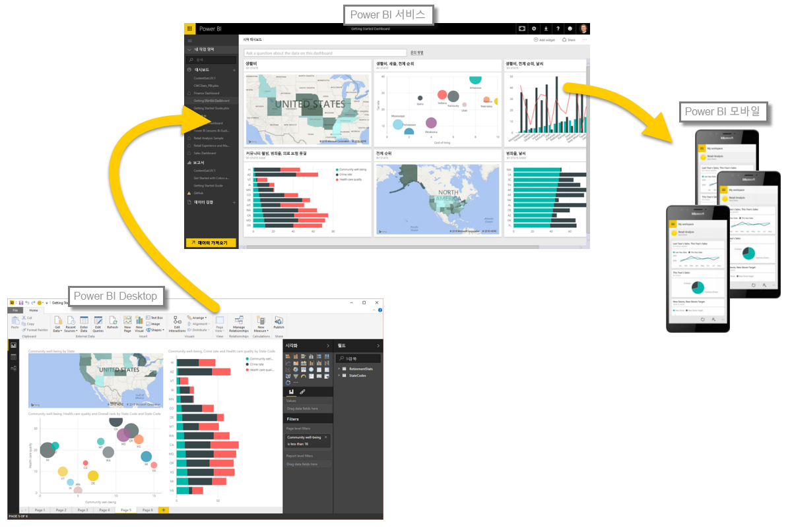

이 첫 번째 단원에서 다룬 내용을 간략히 검토해 보겠습니다.

**Power BI**는 데이터를 대화형 정보로 변환하는 소프트웨어 서비스, 앱 및 커넥터의 컬렉션입니다. Excel 통합 문서와 같은 단일 기본 원본의 데이터를 사용하거나 여러 데이터베이스 및 클라우드 원본에서 데이터를 가져와서 복합적인 데이터 세트 및 보고서를 만들 수 있습니다. Power BI는 원하는 만큼 단순할 수도 있고, 복잡한 글로벌 비즈니스에 필요한 엔터프라이즈 수준일 수도 있습니다.

Power BI는 **Power BI Desktop**, **Power BI 서비스** 및 **Power BI 모바일**이라는 세 가지 주요 요소로 구성됩니다. 이러한 요소가 모두 함께 작동하여 데이터를 원하는 방식으로 만들고, 상호 작용하고, 공유하고, 사용할 수 있도록 해줍니다.

다음과 같은 Power BI의 기본 구성 요소에 대해 살펴보았습니다.

* **시각화** – 데이터의 시각적 표현이며, 시각적 개체라고도 합니다.
* **데이터 세트** - Power BI에서 시각화를 만드는 데 사용하는 데이터의 컬렉션입니다.
* **보고서** – 하나 이상의 페이지에 걸쳐 있는 데이터 세트의 시각적 개체 컬렉션
* **대시보드** - 보고서에서 작성된 시각적 개체의 단일 페이지 컬렉션입니다.
* **타일** - 보고서 또는 대시보드에 있는 단일 시각화 요소입니다.

여기에서는 **Will Thompson**의 둘러보기 가이드를 통해 동영상 둘러보기로 Power BI를 살펴보았습니다. Will은 Power BI를 사용하여 데이터를 분석 및 시각화하는 방법에 대해 간략하게 설명했습니다.

<!---
In **Power BI Desktop**, we connected to a basic Excel file, created visualizations, then published those visualizations to the service. Even if you use Power BI only with your Excel workbooks, you can gain amazing visual insights with those Excel workbooks, and both interact and share it in ways never before possible.
-->
**Power BI 서비스**에서는 몇 번의 클릭만으로 대시보드를 만들었습니다. 계속해서 Power BI 서비스를 살펴보고 즉시 사용 가능한 시각적 개체 및 보고서의 컬렉션인 **콘텐츠 팩**을 사용했으며 **소프트웨어서비스**에 연결하여 콘텐츠 팩을 채우고 데이터에 의미를 부여했습니다.

또한 **질문 및 답변**이라는 자연어 쿼리를 사용하여 답변에 대해 질문하고 Power BI에서 이러한 질문을 바탕으로 시각적 개체를 만들도록 했습니다. 마지막으로, Power BI 서비스로 돌아간 경우 데이터가 새 데이터임을 알 수 있도록 데이터에 대한 **새로 고침 일정**을 설정했습니다.

## 다음 단계
**축하합니다!** Power BI에 대한 **단계별 학습** 과정의 첫 번째 단원을 완료하셨습니다. 이제 Power BI에 대한 논리적 작업 흐름의 다음 단계인 **데이터 가져오기** 단원을 진행할 수 있는 기초를 다졌습니다.

앞서 언급했듯이 이 과정은 다음과 같은 Power BI의 일반적인 작업 흐름에 따라 지식을 구축합니다.

* **Power BI Desktop**으로 데이터를 가져와 보고서를 만듭니다.
* 새 시각화 요소를 만들거나 대시보드를 작성하는 Power BI 서비스에 **게시**합니다.
* 대시보드를 다른 사람, 특히 현재 작업 중인 사람과 **공유**합니다.
* **Power BI 모바일** 앱에서 공유 대시보드 및 보고서를 보고 상호 작용합니다.

이 모든 작업을 직접 수행하지 않을 수도 있습니다. 어떤 사람은 다른 사람이 만든 대시보드를 서비스에서 볼 수만 있습니다. 하지만 이 과정의 모든 단원을 *살펴볼* 것이므로 이러한 대시보드를 만드는 방법 및 대시보드를 데이터에 연결하는 방법을 이해할 수 있으며, 자신만의 대시보드를 만들 수도 있을 것입니다. 

다음 단원에서 뵙겠습니다!

