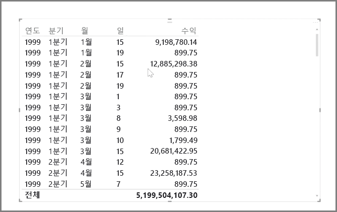
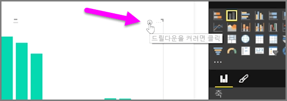
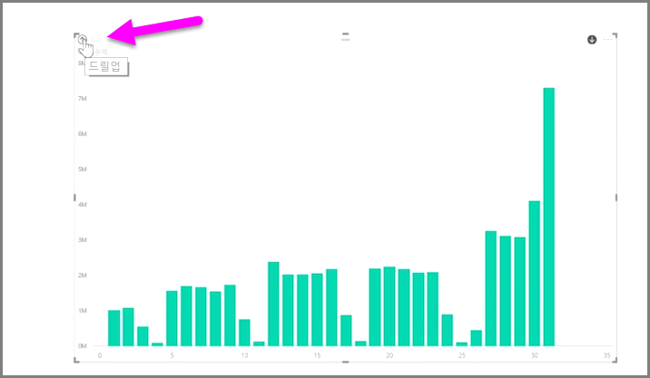
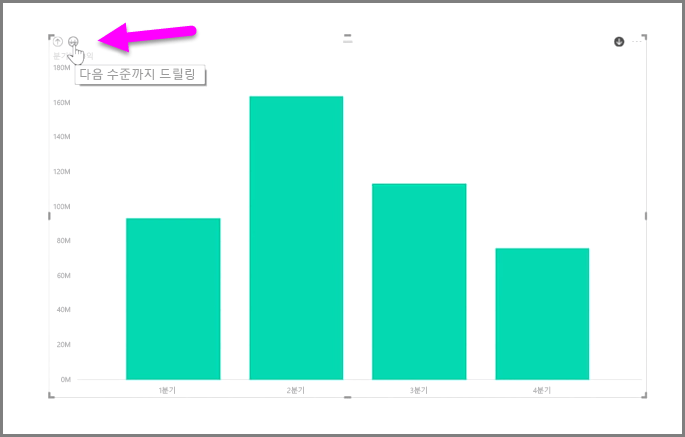
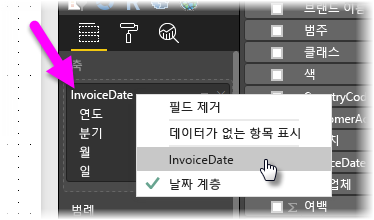

Power BI를 사용하여 시간 기반 데이터를 쉽게 분석할 수 있습니다. Power BI Desktop의 모델링 도구는 년, 분기, 월 및 일을 한 번의 클릭으로 드릴다운할 수 있는 생성된 필드를 자동으로 포함합니다.  

날짜 필드를 사용하여 보고서에서 테이블 시각화 요소를 만든 경우 Power BI Desktop은 기간별 분석 결과를 자동으로 포함합니다. 예를 들어 다음 그림과 같이 **날짜** 테이블의 단일 날짜 필드가 Power BI에서 년, 분기, 월 및 일로 자동으로 구분됩니다.

시각화는 기본적으로 데이터를 *년* 수준에서 표시하지만 시각적 개체 오른쪽 위에 있는 **드릴다운**을 설정하여 이를 변경할 수 있습니다.

이제 차트에서 막대 또는 선을 클릭하면 시간 계층의 다음 수준으로 드릴다운됩니다(예: 년에서 분기로).   계층의 가장 세분화된 수준(이 예제의 경우 일)에 도달할 때까지 계속 드릴다운할 수 있습니다.  다시 시간 계층 위로 이동하려면 시각적 개체 왼쪽 위에 있는 **드릴업**을 클릭합니다.

시각적 개체 오른쪽 위에 있는 **모두 드릴** 양방향 화살표를 사용하여 선택된 하나의 기간 대신 시각적 개체에 표시된 모든 데이터를 드릴다운할 수도 있습니다.

모델에 날짜 필드가 있는 경우 Power BI는 여러 시간 계층에 대한 서로 다른 뷰를 자동으로 생성합니다.

날짜 계층 구조를 사용하지 않고 개별 날짜로 돌아오려면 **필드**에서 열 이름을 마우스 오른쪽 단추로 클릭한 다음(다음 그림에서는 열 이름이 *InvoiceDate*), **날짜 계층 구조**가 아니라 표시되는 메뉴에서 열 이름을 선택합니다. 그러면 시각화는 날짜 계층을 사용하지 않고 열 데이터에 근거한 데이터를 표시합니다. 날짜 계층 구조를 사용하여 다시 돌아가야 합니까? 아닙니다 - 다시 마우스 오른쪽 단추로 클릭하고 메뉴에서 **날짜 계층 구조**를 선택하기만 하면 됩니다.

## 다음 단계
**축하합니다!** Power BI에 대한 **단계별 학습** 과정의 이 단원을 완료하셨습니다. 에 대 한 파악 했으므로 *모델링* 데이터 준비가 재미에 대해 자세히 알아보려면 다음 섹션에서 대기 중인 항목: **시각화**합니다.

앞서 언급했듯이 이 과정은 다음과 같은 Power BI의 일반적인 작업 흐름에 따라 지식을 구축합니다.

* **Power BI Desktop**으로 데이터를 가져와 보고서를 만듭니다.
* 새 시각화 요소를 만들고 대시보드를 작성하는 Power BI 서비스에 **게시**합니다.
* 대시보드를 다른 사람, 특히 현재 작업 중인 사람과 **공유**합니다.
* **Power BI 모바일** 앱에서 공유 대시보드 및 보고서를 보고 상호 작용합니다.

이 모든 작업을 직접 수행하지 않을 수도 있지만 대시보드를 만드는 방법 및 대시보드를 데이터에 연결하는 방법을 이해할 수 있으며, 이 과정을 완료한 경우 자신만의 대시보드를 만들 수도 있을 것입니다. 

다음 단원에서 뵙겠습니다!

