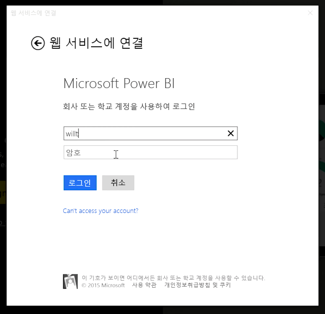
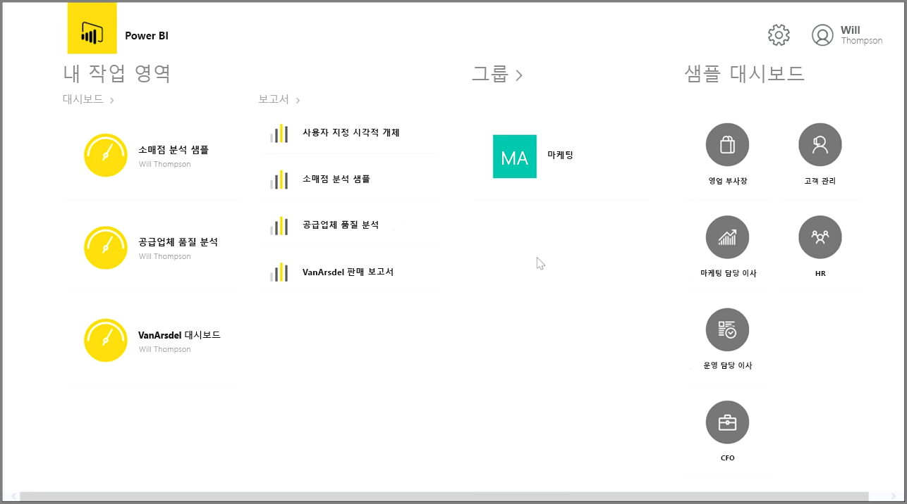
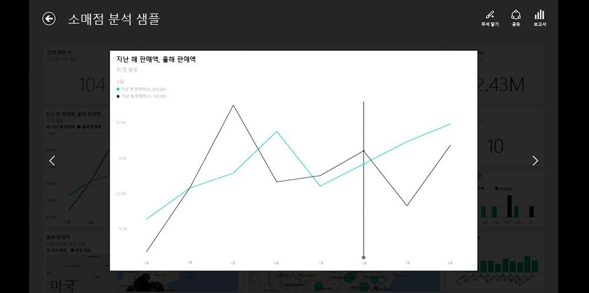
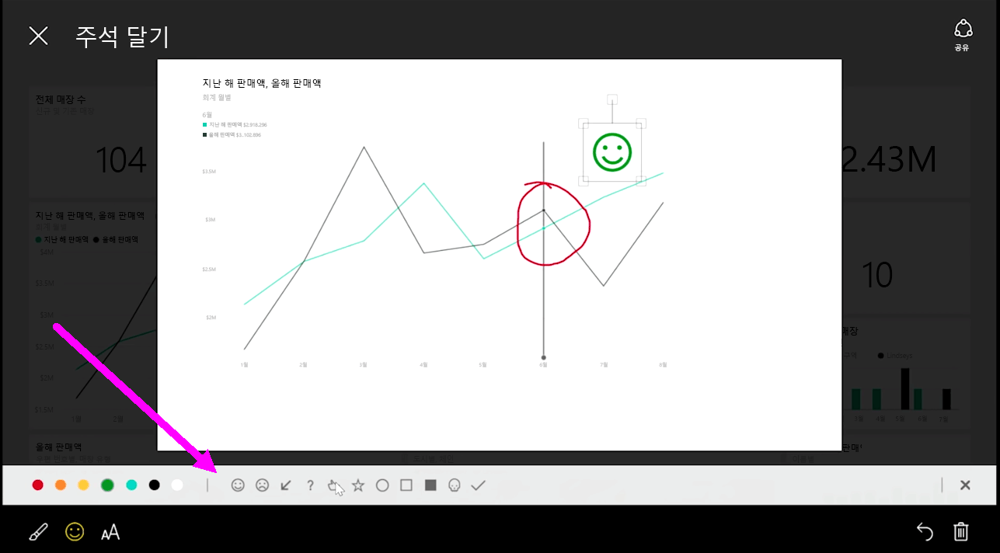

이동 중에 데이터를 추적하려는 경우 Power BI의 iOS, Android 및 Windows 장치용 모바일 애플리케이션 중 하나를 사용할 수 있습니다.

Power BI 앱을 사용할 경우 먼저 Power BI 서비스 계정 정보를 사용하여 계정에 로그인합니다. Windows 모바일 디바이스(이 예제의 경우 태블릿)의 로그인은 다음과 같습니다.

첫 화면에는 보고서, 대시보드 및 그룹을 포함하여 액세스할 수 있는 모든 콘텐츠가 표시됩니다. 영감을 얻거나 Power BI 기능을 확인하는 데 사용할 수 있는 샘플 대시보드도 있습니다. 앱은 터치 기반이므로 대시보드 또는 보고서를 탭하여 전체 화면을 표시한 다음 손가락으로 스크롤할 수 있습니다.

대시보드 중 하나를 탭하여 열 수 있습니다. 대시보드 내에서 대시보드 타일을 탭하면 더 큰 뷰에서 해당 타일에 포커스가 지정됩니다.

오른쪽 위에 있는 **주석** 단추를 탭하여 발견한 정보에 주석을 달 수도 있습니다. 이를 통해 포커스가 있는 타일에서 특정 관심 영역을 강조 표시할 수 있습니다. 주석 도구는 화면 아래쪽을 따라 있습니다.

오른쪽 위에 있는 **공유** 링크를 탭하여 주석이 지정된 타일을 공유합니다.

타일의 기본 보고서를 보려면 오른쪽 위에 있는 **보고서** 링크를 탭합니다. 그러면 웹 브라우저 또는 Power BI Desktop에서 보는 것과 동일한 시각화가 표시되며, 막대를 탭하거나, 드릴다운하거나, 슬라이서를 사용하여 보고서와 상호 작용할 수 있는 기능이 포함됩니다.

