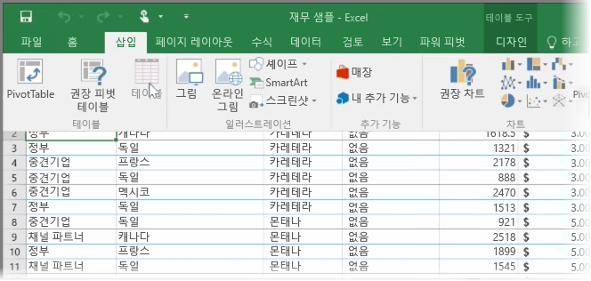
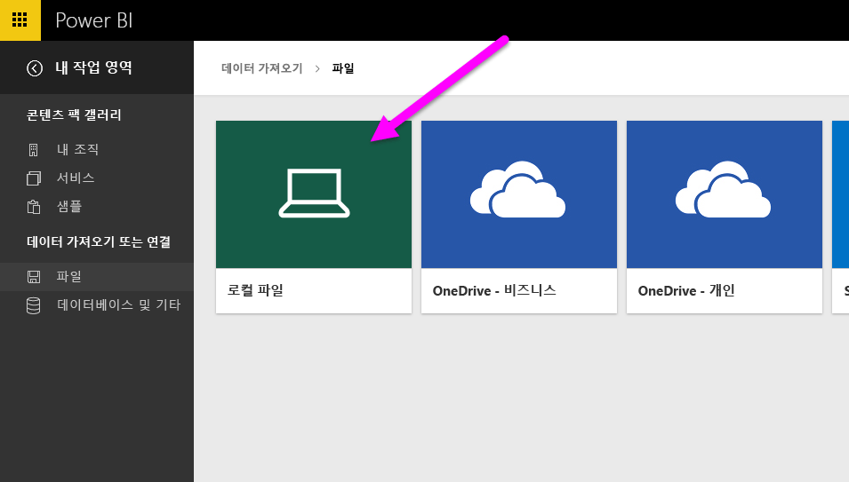
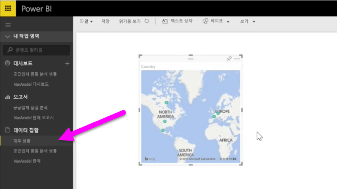

이 항목에서는 먼저 로컬 드라이브에서 간단한 **표**가 포함된 Excel 통합 문서 파일을 Power BI로 가져올 수 있는 방법을 알아봅니다. 그런 다음 보고서를 만들어 Power BI에서 해당 표의 데이터를 탐색하는 방법을 알아봅니다.

## 데이터 형식이 표로 지정되었는지 확인하세요.
Power BI에서 통합 문서의 데이터를 가져오려면 해당 데이터가 **표 형식으로 지정**되어야 합니다. 이는 간단합니다. Excel에서 셀 범위를 강조 표시한 다음 Excel 리본의 **삽입** 탭에서 **표**를 클릭합니다.

각 열에 적절한 이름이 있어야 합니다. Power BI에서 보고서를 만들 때 원하는 데이터를 보다 쉽게 찾을 수 있습니다.

## 로컬 드라이브에서 가져오기
파일을 보관하는 위치에 상관없이 Power BI를 사용하여 쉽게 가져올 수 있습니다. Power BI에서 **데이터 가져오기** > **파일** > **로컬 파일**을 사용하여 원하는 Excel 파일을 찾아서 선택합니다.

Power BI로 가져온 후 보고서 작성을 시작할 수 있습니다.

파일이 로컬 드라이브에 있지 않아도 됩니다. OneDrive 또는 SharePoint 팀 사이트에 파일을 저장하는 것이 더 좋습니다. 여기에 대해서는 이후 항목에서 자세히 살펴보겠습니다.

## 보고서 만들기 시작
통합 문서의 데이터를 가져오면 Power BI에 데이터 세트가 생성됩니다. 이는 **데이터 세트** 아래에 표시됩니다. 이제 보고서 및 대시보드를 만들어 데이터 탐색을 시작할 수 있습니다. 데이터 세트 옆의 **열기 메뉴** 아이콘을 클릭한 다음, **탐색**을 클릭하기만 하면 됩니다. 새로운 빈 보고서 캔버스가 나타납니다. 오른쪽의 **필드** 아래에 테이블 및 열이 표시됩니다. 캔버스에서 새 시각화를 만들 필드를 선택합니다.

**시각화** 아래에서 시각화 유형을 변경하고 **필터** 및 기타 속성을 적용할 수 있습니다.

