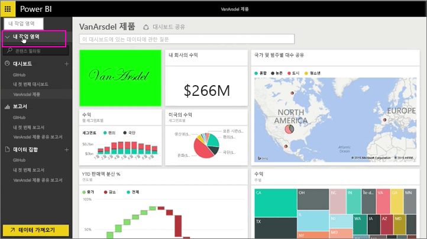
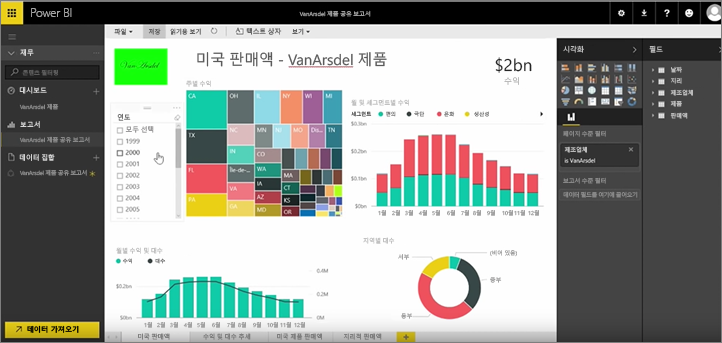

이전 단원에서 이미 콘텐츠 팩 및 그룹을 만들었습니다. 이 단원에서는 그룹의 모든 사용자를 위한 콘텐츠 팩 인스턴스를 만듭니다.

내 작업 영역에서 시작합니다.

이전 단원에서 만든 재무 그룹으로 다시 전환합니다.

그룹에 아직 대시보드, 보고서 또는 데이터 세트가 없습니다. 제가 만든 콘텐츠 팩을 사용하도록 하겠습니다. 타사 서비스 대신 제 조직에서 콘텐츠 팩을 찾아봅니다.

1분 전에 만든 콘텐츠 팩을 찾았습니다. 사용자가 쉽게 찾을 수 있도록 적절한 제목, 설명 및 이미지를 지정하는 것이 중요합니다. 콘텐츠 팩에 연결합니다.

Power BI에서 콘텐츠 팩에 있는 대시보드, 보고서 및 데이터 세트를 가져옵니다.

데이터 세트를 선택하면 Power BI에서 콘텐츠 팩을 개인 설정할지 묻습니다.

변경할 수 있는 콘텐츠 팩의 복사본을 만들고 게시된 버전의 콘텐츠 팩에서 연결을 해제합니다. 콘텐츠 팩 작성자가 게시된 버전을 변경한 경우 이러한 업데이트는 자동으로 제공되지 않습니다.

하지만 원하는 경우 대시보드, 보고서 및 데이터 세트를 편집할 수 있습니다.

따라서 콘텐츠 팩을 사용하면 조직의 다른 사람이 만든 콘텐츠를 간편하게 다시 사용할 수 있습니다.

다음 단원으로 넘어가겠습니다!

