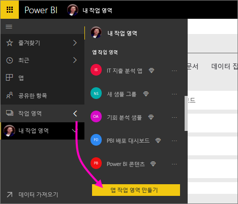
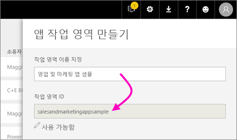
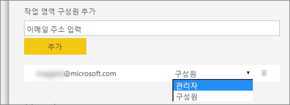
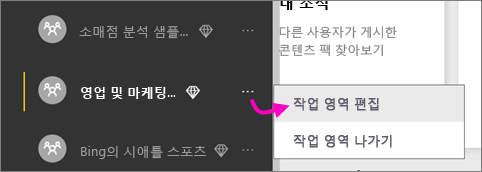

1. 먼저 작업 영역을 만듭니다. **작업 영역** > **앱 작업 영역 만들기**를 선택합니다. 
   
     
   
    사용자와 동료가 공동 작업하는 콘텐츠를 넣는 곳이 됩니다.

2. 작업 영역에 이름을 지정합니다. 해당하는 **작업 영역 ID**를 사용할 수 없는 경우 편집하여 고유한 ID를 입력합니다.
   
     또한 앱의 이름도 됩니다.
   
     

3. 설정할 몇 가지 옵션이 있습니다. **공개**를 선택할 경우 조직의 누구나 작업 영역에 있는 것을 볼 수 있습니다. 한편으로, **비공개**는 해당 작업 영역의 구성원만 콘텐츠를 볼 수 있음을 의미합니다.
   
     
   
    그룹을 만든 후에 공개/개인 설정을 변경할 수 없습니다.

4. 또한, 구성원이 **편집**할 수 있거나 **보기 전용** 액세스 권한을 가질지 선택할 수도 있습니다.
   
     
   
     콘텐츠를 편집할 수 있도록 앱 작업 영역에 사용자를 추가합니다. 콘텐츠를 보기만 하려면 작업 영역에 추가하지 마십시오. 앱을 게시할 때 해당 사용자를 포함할 수 있습니다.

5. 작업 영역에 대한 액세스 권한을 원하는 사람의 메일 주소를 추가하고 **추가**를 선택합니다. 개인이 아닌 그룹 별칭은 추가할 수 없습니다.

6. 각 사용자가 구성원 또는 관리자인지 결정합니다.
   
     
   
    관리자는 다른 구성원 추가를 포함해 작업 영역 자체를 편집할 수 있습니다. 구성원은 보기 전용 액세스 권한이 있는 경우를 제외하고 작업 영역의 콘텐츠를 편집할 수 있습니다. 관리자 및 멤버는 앱을 게시할 수 있습니다.

7. **저장**을 선택합니다.

Power BI는 작업 영역을 만들고 엽니다. 구성원으로 속해 있는 작업 영역 목록에 나타납니다. 사용자가 관리자이므로, 줄임표(…)를 선택하여 뒤로 이동한 후 새 구성원을 추가하거나 권한을 변경하여 변경 사항을 적용할 수 있습니다.

