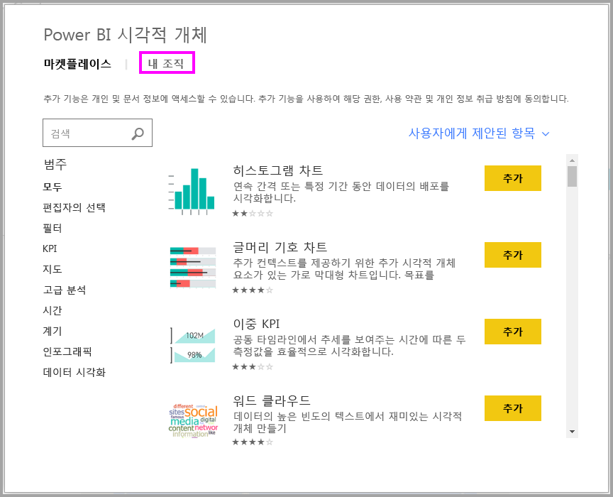
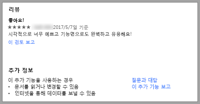
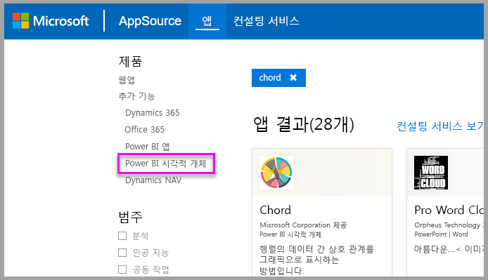
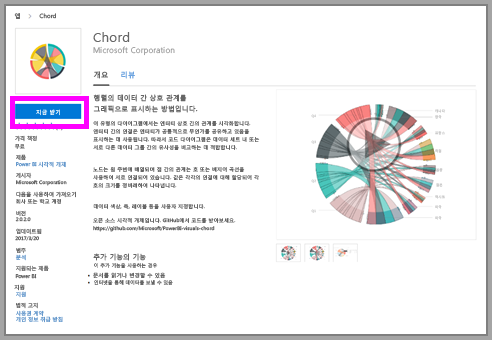

# Power BI의 사용자 지정 시각적 개체

만들거나 Power BI 보고서를 편집 하는 경우에 다양 한 유형의 시각적 개체를 사용할 수 있습니다. 이러한 시각적 개체에 대 한 아이콘이 표시 된 **시각화** 창입니다. 다운로드할 때 이러한 시각적 개체 제공 패키징된 [Power BI Desktop](https://powerbi.microsoft.com/desktop/) 열거나 합니다 [Power BI 서비스](https://app.powerbi.com)합니다.

그러나이 시각적 개체이 집합이 제한 아닙니다. 맨 아래에서 줄임표 (...)를 선택 하면 보고서 시각적 개체의 다른 원본-사용할 수 있게 됩니다*사용자 지정 시각적 개체*합니다.

개발자는 사용자 지정 시각적 개체 SDK를 사용 하 여 사용자 지정 시각적 개체를 만듭니다. 이러한 시각적 개체 사용 비즈니스 사용자가 자신의 비즈니스에 가장 맞는 방식으로 해당 데이터를 볼 수 있습니다. 그런 다음 보고서 작성자가 보고서로 사용자 지정 시각적 파일을 가져올 하 고 Power BI 시각적 개체와 사용할 수 있습니다. 사용자 지정 시각적 개체는 Power BI에서 주요 구성 되며 강조 표시, 편집, 공유 및 등 필터링 할 수 있습니다.

사용자 지정 시각적 개체는 세 가지 방법으로 배포 됩니다.

* 사용자 지정 시각적 개체 파일
* 조직의 시각적 개체
* 마켓플레이스 시각적 개체

## 사용자 지정 시각적 개체 파일

사용자 지정 시각적 개체는 제공 하는 데이터 렌더링에 대 한 코드를 포함 하는 패키지입니다. 사용자 지정 시각적 개체를 만들고 단일 패키지 있습니다 누구나 `.pbiviz` 파일을 Power BI 보고서로 가져올 수 있습니다.

> [!WARNING]
> 사용자 지정 시각적 개체는 보안 또는 개인 정보 관련 위험이 있는 코드를 포함할 수 있습니다. 작성자 및 사용자 지정 시각적 개체 원본 보고서로 가져오기 전에 신뢰할 수 있는지 확인 합니다.

## 조직의 시각적 개체

Power BI 관리자 승인 및 사용자 지정 시각적 개체를 보고서 작성자가 쉽게 검색, 업데이트 하 고 사용할 수 있는 조직에 배포 합니다. 관리자가 쉽게 관리할 수 있습니다 (예: 버전 업데이트, 사용/사용 안 함) 이러한 시각적 개체입니다.

 [조직의 시각적 개체에 대해 자세히 알아보세요](power-bi-custom-visuals-organization.md)합니다.

## 마켓플레이스 시각적 개체

커뮤니티 회원과 Microsoft가 공용 혜택에 대 한 사용자 지정 시각적 개체를 제공 하 고 하도록 게시 합니다 [AppSource](https://appsource.microsoft.com/marketplace/apps?product=power-bi-visuals) marketplace. 다운로드할 수 있습니다 시각적 개체 Power BI 보고서에 추가할 메시지를 표시 합니다. Microsoft가 테스트 하 고 기능 및 품질에 대 한 이러한 사용자 지정 시각적 개체를 승인 합니다.

[AppSource](developer/office-store.md)란? Microsoft 소프트웨어에 대 한 앱, 추가 기능 및 확장을 찾을 수 있는 곳입니다. [AppSource](https://appsource.microsoft.com/) 수백만 명의 Office 365, Azure, Dynamics 365, Cortana, 및는 솔루션을 위해 Power BI 작업을 보다 효율적으로, insightfully를 완료 하 려 하는 제품의 아름 답게 풀어 가세요 전보다 사용자를 연결 합니다.

### 인증 시각적 개체

Power BI 인증 시각적 개체는 마켓플레이스 시각적 개체 추가 엄격한 품질 테스트 통과 같은 추가적인 시나리오 에서도 지원 됩니다 [전자 메일 구독](https://docs.microsoft.com/power-bi/service-report-subscribe), 및 [PowerPoint로내보내기](https://docs.microsoft.com/power-bi/service-publish-to-powerpoint).
인증된 사용자 지정 시각적 개체 목록을 보거나 사용자 고유의 개체를 제출하려면 [인증된 사용자 지정 시각적 개체](https://docs.microsoft.com/power-bi/power-bi-custom-visuals-certified)를 참조하세요.

웹 개발자로서 고유한 시각화를 만들고 AppSource에 추가하는 데 관심이 있나요? 참조 [Power BI 사용자 지정 시각적 개체 개발](developer/custom-visual-develop-tutorial.md) 배우고 하는 방법 [AppSource에 사용자 지정 시각적 개체 게시](https://docs.microsoft.com/power-bi/developer/office-store)합니다.

### 파일에서 사용자 지정 시각적 개체 가져오기

1. 맨 아래에서 줄임표를 선택 합니다 **시각화** 창입니다.

    

2. 드롭다운에서 **파일에서 가져오기**를 선택합니다.

    

3. 파일 열기 메뉴에서 선택 합니다 `.pbiviz` 파일 가져오기 및 선택 하려는 **오픈**합니다. 사용자 지정 시각적 개체 아이콘의 맨 아래에 추가 됩니다 하 **시각화** 창 이며 이제 보고서에서 사용할 수 있습니다.

    

### 조직의 시각적 개체 가져오기

1. 맨 아래에서 줄임표를 선택 합니다 **시각화** 창입니다.

    

2. 드롭다운에서 **마켓플레이스에서 가져오기**를 선택합니다.

    

3. 상단 탭 메뉴에서 **내 조직**을 선택합니다.

    

4. 목록을 스크롤하여 가져오려는 시각적 개체를 검색합니다.

    

5. 선택 **추가** 를 사용자 지정 시각적 개체를 가져옵니다. 해당 아이콘의 맨 아래에 추가 됩니다 하 **시각화** 창 이며 이제 보고서에서 사용할 수 있습니다.

    

## Microsoft AppSource에서 사용자 지정 시각적 개체 다운로드 또는 가져오기

다운로드 및 사용자 지정 시각적 개체 가져오기에 대 한 두 가지 옵션이 있습니다:에서 Power BI 내에서 들어오고 합니다 [AppSource 웹 사이트](https://appsource.microsoft.com/)합니다.

### Power BI 내에서 사용자 지정 시각적 개체 가져오기

1. 맨 아래에서 줄임표를 선택 합니다 **시각화** 창입니다.

    

2. 드롭다운에서 **마켓플레이스에서 가져오기**를 선택합니다.

    

3. 목록을 스크롤하여 가져오려는 시각적 개체를 검색합니다.

    

4. 시각적 개체 중 하나에 대해 자세한 알아보려면 해당 시각적 개체를 강조 표시하여 선택합니다.

    

5. 세부 정보 페이지에서는 스크린샷, 비디오, 자세한 설명 등을 볼 수 있습니다.

    

6. 아래쪽으로 스크롤하여 리뷰를 확인합니다.

    

7. 선택 **추가** 를 사용자 지정 시각적 개체를 가져옵니다. 해당 아이콘의 맨 아래에 추가 됩니다 하 **시각화** 창 이며 이제 보고서에서 사용할 수 있습니다.

    

### Microsoft AppSource에서 사용자 지정 시각적 개체 다운로드 및 가져오기

1. [Microsoft AppSource](https://appsource.microsoft.com)에서 시작하고 **앱**의 탭을 선택합니다.

    

2. [앱 결과 페이지](https://appsource.microsoft.com/marketplace/apps)로 이동하여 각 범주에서 *Power BI 앱*을 비롯하여 각 범주의 상위 앱을 볼 수 있습니다. 사용자 지정 시각적 개체를 선택 해 서 살펴볼 **Power BI 시각적 개체** 결과 범위를 좁힐 왼쪽된 탐색 목록에서.

    

3. AppSource는 각 사용자 지정 시각적 개체에 대한 타일을 표시합니다.  각 타일에 대 한 간략 한 설명과 다운로드 링크를 사용 하 여 사용자 지정 시각적 스냅숏을 있습니다. 자세한 내용을 보려면 타일을 선택합니다.

    

4. 세부 정보 페이지에서는 스크린샷, 비디오, 자세한 설명 등을 볼 수 있습니다. 선택 **지금** 를 사용자 지정 시각적 개체를 다운로드 하 여 사용 약관에 동의 합니다.

    

5. 링크를 선택하여 사용자 지정 시각적 개체를 다운로드합니다.

    

    다운로드 페이지에는 Power BI Desktop 및 Power BI 서비스에 사용자 지정 시각적 개체를 가져오는 방법에 대 한 지침 포함 됩니다.

    사용자 지정 시각적 개체가 포함되고 그 기능이 소개되어 있는 샘플 보고서를 다운로드할 수도 있습니다.

    

6. 저장 된 `.pbiviz` 파일과 다음 Power BI를 엽니다.

7. 가져오기는 `.pbiviz` 보고서 파일입니다. 위의 [파일에서 사용자 지정 시각적 개체 가져오기](#import-a-custom-visual-from-a-file) 섹션을 참조하세요.

## 고려 사항 및 제한 사항

* 사용자 지정 시각적 개체는 가져올 때 특정 보고서에 추가됩니다. 다른 보고서에서 시각적 개체를 사용하려는 경우 또한 해당 보고서로 가져와야 합니다. 사용자 지정 시각적 개체가 있는 보고서가 **다른 이름으로 저장** 옵션을 사용하여 저장될 때 사용자 지정 시각적 개체의 복사본이 새 보고서와 함께 저장됩니다.

* 표시 되지 않는 경우는 **시각화** 보고서 권한을 편집할 필요가 없음을 의미 하는 창입니다.  사용자 지정 시각적 개체를 편집할 수 있는 보고서에만 추가할 수 있으며 사용자와 공유한 보고서에는 추가할 수 없습니다.

## 문제 해결

문제를 해결 하려면 참조 [Power BI 사용자 지정 시각적 개체 문제 해결](power-bi-custom-visuals-troubleshoot.md)합니다.

## FAQ

자세한 내용 및 질문과 대답은 [Power BI 사용자 지정 시각적 개체에 대한 질문과 대답](power-bi-custom-visuals-faq.md#organizational-custom-visuals)을 참조하세요.

## 다음 단계

* [Power BI 보고서의 시각화](visuals/power-bi-report-visualizations.md)

궁금한 점이 더 있나요? [Power BI 커뮤니티를 이용](http://community.powerbi.com/)하세요.
