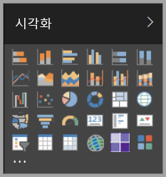
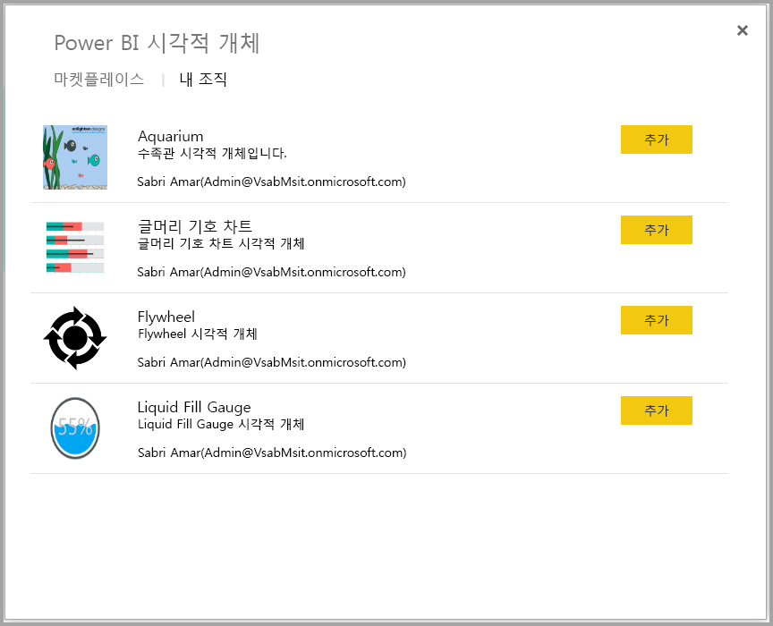
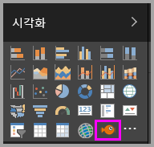
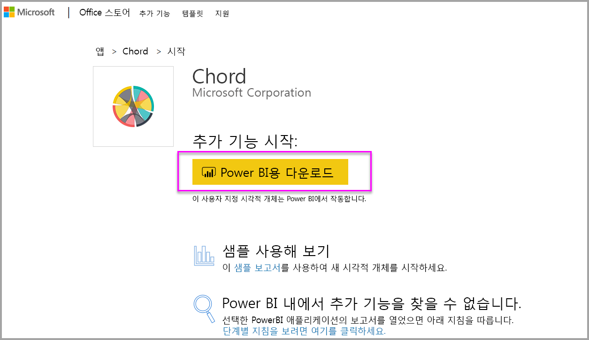

# Power BI의 시각적 개체

Power BI 보고서를 만들거나 편집할 때 다양한 유형의 시각적 개체를 사용할 수 있습니다. 이러한 시각적 개체에 대한 아이콘은 **시각화** 창에 표시됩니다. 이러한 시각적 개체는 [Power BI Desktop](https://powerbi.microsoft.com/desktop/)을 다운로드하거나 [Power BI 서비스](https://app.powerbi.com)를 열 때 사전 패키지 형태로 제공됩니다.

그러나 이 시각적 개체 세트에 국한되지 않습니다. 하단의 줄임표(...)를 선택하면 *Power BI 시각적 개체*의 다른 보고서 시각적 개체 원본을 사용할 수 있습니다.

개발자는 Power BI 시각적 개체 SDK를 사용하여 Power BI 시각적 개체를 만듭니다. 이러한 시각적 개체를 통해 비즈니스 사용자는 해당 비즈니스에 가장 적합한 방식으로 데이터를 볼 수 있습니다. 그런 다음, 보고서 작성자는 사용자 지정 시각적 개체 파일을 보고서로 가져와서 다른 Power BI 시각적 개체처럼 사용할 수 있습니다. Power BI 시각적 개체는 Power BI에서 가장 중요하며 필터링, 강조 표시, 편집, 공유 등이 가능합니다.

Power BI 시각적 개체는 세 가지 방법으로 배포됩니다.

* 사용자 지정 시각적 개체 파일
* 조직의 시각적 개체
* 마켓플레이스 시각적 개체

## 사용자 지정 시각적 개체 파일

Power BI 시각적 개체는 제공되는 데이터를 렌더링하기 위한 코드가 포함된 패키지입니다. 누구나 사용자 지정 시각적 개체를 만들고 단일 `.pbiviz` 파일로 패키지화한 다음, Power BI 보고서로 가져올 수 있습니다.

> [!WARNING]
> 사용자 지정 시각적 개체는 보안 또는 개인 정보 위험이 있는 코드를 포함할 수 있습니다. 보고서로 가져오기 전에 작성자 및 사용자 지정 시각적 개체 원본을 신뢰할 수 있는지 확인합니다.

## 조직의 시각적 개체

Power BI 관리자는 조직에서 Power BI 시각적 개체를 승인하고 배포합니다. 작성자는 해당 Power BI 시각적 개체의 보고서를 쉽게 검색, 업데이트 및 사용할 수 있습니다. 관리자는 이러한 시각적 개체를 쉽게 관리할 수 있습니다(예: 버전 업데이트, 비활성화/활성화).

 [조직 시각적 개체에 대해 자세히 알아봅니다](power-bi-custom-visuals-organization.md).

## 마켓플레이스 시각적 개체

커뮤니티 멤버와 Microsoft는 모두 공익을 위해 Power BI 시각적 개체를 [AppSource](https://appsource.microsoft.com/marketplace/apps?product=power-bi-visuals) 마켓플레이스에 게시했습니다. 이러한 시각적 개체를 다운로드하여 Power BI 보고서에 추가할 수 있습니다. Microsoft는 이들 Power BI 시각적 개체의 기능과 품질을 테스트하고 승인했습니다.

[AppSource](developer/office-store.md)란? Microsoft 소프트웨어에 대한 앱, 추가 기능 및 확장을 찾을 수 있는 곳입니다. AppSource는 Office 365, Azure, Dynamics 365, Cortana 및 Power BI와 같은 수백만 명의 제품 사용자를 이전보다 더 효율적이고 통찰력 있고, 멋진 작업을 수행할 수 있도록 도와주는 솔루션과 연결합니다.

### 인증 시각적 개체

Power BI 인증 시각적 개체는 추가적인 엄격한 품질 테스트를 통과한 마켓플레이스 시각적 개체이며, [이메일 구독](service-report-subscribe.md), [PowerPoint로 내보내기](service-publish-to-powerpoint.md) 등과 같은 추가적인 시나리오에서도 지원됩니다.
인증된 Power BI 시각적 개체 목록을 보거나 사용자 고유의 시각적 개체를 제출하려면 [인증된 Power BI 시각적 개체](power-bi-custom-visuals-certified.md)를 참조하세요.

웹 개발자로서 고유한 시각화를 만들고 AppSource에 추가하는 데 관심이 있나요? [Power BI 사용자 지정 시각적 개체 개발](developer/custom-visual-develop-tutorial.md)을 참조하고, [AppSource에 Power BI 시각적 개체를 게시](developer/office-store.md)하는 방법을 알아봅니다.

### 파일에서 사용자 지정 시각적 개체 가져오기

1. **시각화** 창 아래쪽에서 줄임표(...)를 선택합니다.

    

2. 드롭다운에서 **파일에서 가져오기**를 선택합니다.

    

3. 파일 **열기** 메뉴에서 가져올 `.pbiviz` 파일을 선택한 다음, **열기**를 선택합니다. 사용자 지정 시각적 개체의 아이콘은 **시각화** 창 맨 아래에 추가되어 이제 보고서에서 사용할 수 있습니다.

    

### 조직의 시각적 개체 가져오기

1. **시각화** 창 아래쪽에서 줄임표(...)를 선택합니다.

    

2. 드롭다운에서 **마켓플레이스에서 가져오기**를 선택합니다.

    

3. 상단 탭 메뉴에서 **내 조직**을 선택합니다.

    

4. 목록을 스크롤하여 가져오려는 시각적 개체를 검색합니다.

    

5. **추가**를 선택하여 사용자 지정 시각적 개체를 가져옵니다. 해당 아이콘은 **시각화** 창 맨 아래에 추가되어 이제 보고서에서 사용할 수 있습니다.

    

## Microsoft AppSource에서 Power BI 시각적 개체 다운로드 또는 가져오기

Power BI 시각적 개체는 Power BI 내에서 그리고 [AppSource 웹 사이트](https://appsource.microsoft.com/)에서 다운로드하고 가져올 수 있습니다.

### Power BI 내에서 Power BI 시각적 개체 가져오기

1. **시각화** 창 아래쪽에서 줄임표(...)를 선택합니다.

    

2. 드롭다운에서 **마켓플레이스에서 가져오기**를 선택합니다.

    

3. 목록을 스크롤하여 가져오려는 시각적 개체를 검색합니다.

    

4. 시각적 개체 중 하나에 대해 자세한 알아보려면 해당 시각적 개체를 강조 표시하여 선택합니다.

    

5. 세부 정보 페이지에서는 스크린샷, 비디오, 자세한 설명 등을 볼 수 있습니다.

    

6. 아래쪽으로 스크롤하여 리뷰를 확인합니다.

    

7. **추가**를 선택하여 사용자 지정 시각적 개체를 가져옵니다. 해당 아이콘은 **시각화** 창 맨 아래에 추가되어 이제 보고서에서 사용할 수 있습니다.

    

### Microsoft AppSource에서 Power BI 시각적 개체 다운로드 및 가져오기

1. [Microsoft AppSource](https://appsource.microsoft.com)에서 시작하고 **앱**의 탭을 선택합니다.

    

2. [앱 결과 페이지](https://appsource.microsoft.com/marketplace/apps)로 이동하여 각 범주에서 *Power BI 앱*을 비롯하여 각 범주의 상위 앱을 볼 수 있습니다. 우리는 Power BI 시각적 개체를 찾고 있으므로 왼쪽 탐색 목록에서 **Power BI 시각적 개체**를 선택하여 결과를 좁히겠습니다.

    

3. AppSource는 각 사용자 지정 시각적 개체에 대한 타일을 표시합니다.  각 타일에는 간단한 설명과 다운로드 링크가 포함된 사용자 지정 시각적 개체 스냅샷이 있습니다. 자세한 내용을 보려면 타일을 선택합니다.

    

4. 세부 정보 페이지에서는 스크린샷, 비디오, 자세한 설명 등을 볼 수 있습니다. **지금 받기**를 선택하여 사용자 지정 시각적 개체를 다운로드한 다음, 사용 약관에 동의합니다.

    

5. 링크를 선택하여 사용자 지정 시각적 개체를 다운로드합니다.

    

    다운로드 페이지에는 Power BI Desktop 및 Power BI 서비스로 사용자 지정 시각적 개체를 가져오는 방법에 대한 지침도 포함되어 있습니다.

    사용자 지정 시각적 개체가 포함되고 그 기능이 소개되어 있는 샘플 보고서를 다운로드할 수도 있습니다.

    

6. `.pbiviz` 파일을 저장한 다음, Power BI를 엽니다.

7. `.pbiviz` 파일을 보고서로 가져옵니다. 위의 [파일에서 사용자 지정 시각적 개체 가져오기](#import-a-custom-visual-from-a-file) 섹션을 참조하세요.

## 고려 사항 및 제한 사항

* 사용자 지정 시각적 개체는 가져올 때 특정 보고서에 추가됩니다. 다른 보고서에서 시각적 개체를 사용하려는 경우 또한 해당 보고서로 가져와야 합니다. 사용자 지정 시각적 개체가 있는 보고서가 **다른 이름으로 저장** 옵션을 사용하여 저장될 때 사용자 지정 시각적 개체의 복사본이 새 보고서와 함께 저장됩니다.

* **시각화** 창이 표시되지 않으면 보고서 편집 권한이 없음을 의미합니다.  Power BI 시각적 개체는 사용자가 편집할 수 있는 보고서에만 추가할 수 있으며, 사용자와 공유만 된 보고서에는 추가할 수 없습니다.

## 문제 해결

문제를 해결하려면 [Power BI Power BI 시각적 개체 문제 해결](power-bi-custom-visuals-troubleshoot.md)을 참조하세요.

## FAQ

자세한 내용 및 질문과 대답은 [Power BI Power BI 시각적 개체에 대한 질문과 대답](power-bi-custom-visuals-faq.md#organizational-visuals)을 참조하세요.

## 다음 단계

* [Power BI 보고서의 시각화](visuals/power-bi-report-visualizations.md)

궁금한 점이 더 있나요? [Power BI 커뮤니티를 이용](http://community.powerbi.com/)하세요.
