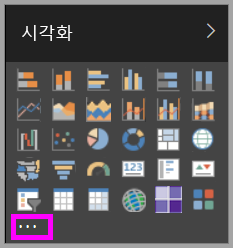
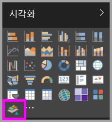
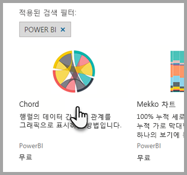

# Power BI의 사용자 지정 시각적 개체
Power BI 보고서를 만들거나 편집 할 때 사용할 수 있는 다양한 유형의 시각적 개체가 있습니다. 이러한 시각적 개체는 **시각화** 창에 표시됩니다. Power BI Desktop을 다운로드하거나 Power BI 서비스(app.powerbi.com)를 열면 이 시각적 개체 집합이 "사전 패키지 형태"로 제공됩니다. 

하지만 이 시각적 개체 집합에 국한되지 않으며, 타원을 선택하면 *사용자 지정 시각적 개체*라는 보고서 시각적 개체의 다른 원본이 열립니다.

사용자 지정 시각적 개체는 커뮤니티의 회원과 Microsoft에 의해 만들어지고 [AppSource](https://appsource.microsoft.com/marketplace/apps?product=power-bi-visuals)에서 호스팅됩니다. 이러한 시각적 개체는 다운로드하여 Power BI 보고서에 추가할 수 있습니다. 이러한 모든 사용자 지정 시각적 개체는 Microsoft에서 승인되고 Power BI에 포함된 사전 패키지 형태의 시각화와 유사한 역할을 합니다. 즉, 이 개체를 필터링하고 강조 표시하고 편집하고 공유할 수 있습니다. 

AppSource란? 간단히 말해서, Microsoft 소프트웨어에 대한 앱, 추가 기능 및 확장을 찾을 수 있는 곳입니다. [AppSource](https://appsource.microsoft.com)는 전보다 효율적이고, 멋지고, 통찰력 있게 작업할 수 있도록 도와주는 솔루션을 수백만 명의 Office 365, Azure, Dynamics 365, Cortana 및 Power BI 제품 사용자와 연결해 줍니다.

## 두 가지 유형의 사용자 지정 시각적 개체

AppSource에서 제공되는 Power BI 사용자 지정 시각적 개체는 **승인** 및 **인증** 등의 두 가지 범주로 분류됩니다. *AppSource 승인* 시각적 개체는 브라우저, 보고서 및 대시보드에서 실행됩니다.  *Power BI 인증* 시각적 개체는 엄격한 테스트를 거치며 [이메일 구독](service-report-subscribe.md), [PowerPoint로 내보내기](service-publish-to-powerpoint.md) 등과 같은 추가적인 시나리오에서도 지원됩니다.

인증된 사용자 지정 시각적 개체 목록을 보거나 사용자 고유의 개체를 제출하려면 [인증된 사용자 지정 시각적 개체](power-bi-custom-visuals-certified.md)를 참조하세요.

웹 개발자로서 고유한 시각화를 만들고 AppSource에 추가하는 데 관심이 있나요?  [개발자 도구 시작하기](service-custom-visuals-getting-started-with-developer-tools.md)를 참조하고 [AppSource에 사용자 지정 시각적 개체를 게시](https://appsource.microsoft.com/marketplace/apps?product=power-bi-visuals)하는 방법을 알아봅니다.

## Microsoft AppSource에서 사용자 지정 시각적 개체 다운로드 또는 가져오기
사용자 지정 시각적 개체는 Power BI 내에서 그리고 AppSource 웹 사이트에서 다운로드하고 가져올 수 있습니다. 

###    Power BI 내에서 사용자 지정 시각적 개체 가져오기
1. 시각화 창 아래쪽에서 줄임표(...)를 선택합니다. 

    

2. 드롭다운에서 **스토어에서 가져오기**를 선택합니다.

    

3. 목록을 스크롤하여 가져오려는 시각적 개체를 검색합니다. 

    

4.  시각적 개체 중 하나에 대해 자세한 알아보려면 해당 시각적 개체를 강조 표시하여 선택합니다.

    

5.  세부 정보 페이지에서는 스크린샷, 비디오, 자세한 설명 등을 볼 수 있습니다. 

    

6. 아래쪽으로 스크롤하여 리뷰를 확인합니다.

    

7.    **추가**를 선택하여 사용자 지정 시각적 개체를 가져옵니다. 사용자 지정 시각적 개체의 아이콘은 시각화 창 맨 아래에 추가되어 이제 보고서에서 사용할 수 있습니다.

       

###    Microsoft AppSource에서 사용자 지정 시각적 개체 다운로드 및 가져오기

1. [Microsoft AppSource](https://appsource.microsoft.com)에서 시작하고 **앱**의 탭을 선택합니다. 

    

2. 이 작업을 수행하면 [앱 결과 페이지](https://appsource.microsoft.com/en-us/marketplace/apps)로 이동하여 각 범주에서 *Power BI 앱*을 비롯하여 각 범주의 상위 앱을 볼 수 있습니다. 그러나 사용자 정의 시각적 개체를 찾기 때문에 왼쪽 탐색 목록에서  **Power BI 시각적 개체**를 선택하여 결과를 좁히겠습니다.

    

3. AppSource는 각 사용자 지정 시각적 개체에 대한 타일을 표시합니다.  각 타일에는 사용자 지정 시각적 개체의 스냅숏이 있고 간단한 설명과 다운로드 링크를 제공합니다. 자세한 내용을 보려면 타일을 선택합니다. 

    

4. 세부 정보 페이지에서는 스크린샷, 비디오, 자세한 설명 등을 볼 수 있습니다. **지금 받기**를 선택하여 사용자 지정 시각적 개체를 다운로드한 다음 사용 약관에 동의합니다. 

    

5. 링크를 선택하여 사용자 지정 시각적 개체를 다운로드합니다.

    

    다운로드 페이지에는 Power BI Desktop 및 Power BI 서비스로 사용자 지정 시각적 개체를 가져오는 방법에 대한 지침도 포함되어 있습니다.

    사용자 지정 시각적 개체가 포함되고 그 기능이 소개되어 있는 샘플 보고서를 다운로드할 수도 있습니다.

    

6. .Pbiviz 파일을 저장한 다음 Power BI를 엽니다.    
7. 사용자 지정 시각적 개체를 추가할 보고서를 열고 **시각화** 창의 아래쪽에서 줄임표> **파일에서 가져오기**를 선택합니다.  

      

8. 사용자 지정 시각적 개체 파일을 선택하여 해당 사용자 지정 시각적 개체의 아이콘을 **시각화** 창의 아래쪽에 추가합니다. 이제 사용자 지정 시각적 개체를 보고서에서 사용할 수 있습니다.

    
    
##    고려 사항 및 문제 해결

- 사용자 지정 시각적 개체는 가져올 때 특정 보고서에 추가됩니다. 다른 보고서에서 시각적 개체를 사용하려는 경우 또한 해당 보고서로 가져와야 합니다. 사용자 지정 시각적 개체가 있는 보고서가 **이름으로 저장** 옵션을 사용하여 저장될 때 사용자 지정 시각적 개체의 복사본이 새 보고서와 함께 저장됩니다.

- **시각화** 창이 표시되지 않으면 보고서에 대한 편집 권한이 없다는 의미입니다.  사용자 지정 시각적 개체를 편집할 수 있는 보고서에만 추가할 수 있으며 사용자와 공유한 보고서에는 추가할 수 없습니다.

궁금한 점이 더 있나요? [Power BI 커뮤니티를 이용하세요.](http://community.powerbi.com/)

