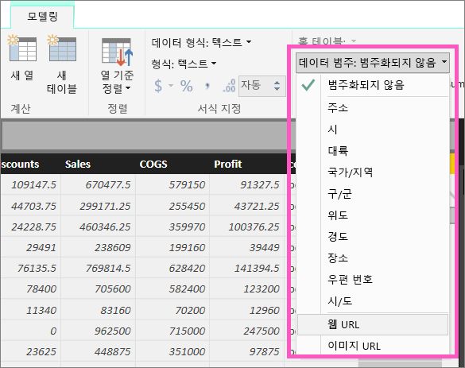

# 테이블에서 하이퍼링크
이 항목에서는 하이퍼링크를 만들어 Power BI Desktop을 사용하는 방법을 배웁니다. 만든 후에는 보고서 테이블 및 행렬에 하이퍼링크를 추가하려면 Desktop 또는 Power BI 서비스를 사용합니다. 

> **참고**: Power BI 서비스를 사용하여 [대시보드의 타일](service-dashboard-edit-tile.md)에 하이퍼링크와 [대시보드에 텍스트 상자](service-dashboard-add-widget.md)를 즉시 만들 수 있습니다. Power BI 서비스 및 Power BI Desktop을 사용하여 [보고서의 입력란](service-add-hyperlink-to-text-box.md)에 하이퍼링크를 즉시 만들 수 있습니다.
> 
> 

## Power BI Desktop을 사용하여 표 또는 행렬에서 하이퍼링크를 만들려면
테이블과 행렬의 하이퍼링크는 Power BI Desktop에서 만들 수 있으며 Power BI 서비스에서는 만들 수 없습니다. 통합 문서를 Power BI로 가져오기 전에 Excel 파워 피벗에서 하이퍼링크를 만들 수도 있습니다. 아래에서는 두 방법을 모두 설명합니다.

## Power BI Desktop에서 표 또는 행렬 하이퍼링크 만들기
하이퍼링크를 추가하는 절차는 가져온 데이터인지 또는 DirectQuery를 사용하여 연결된 데이터인지에 따라 달라집니다. 아래에서는 두 시나리오를 모두 설명합니다.

### Power BI로 가져온 데이터인 경우
1. 하이퍼링크가 데이터 집합에서 필드로 존재하지 않는 경우 Power BI Desktop을 사용하여 [사용자 지정 열](desktop-common-query-tasks.md)로 추가합니다.
2. 데이터 보기에서 열을 선택한 다음 **모델링** 탭에서 **데이터 범주** 드롭다운을 선택합니다.
   
    
3. **웹 URL**을 선택합니다.
4. 보고서 보기로 전환하고 웹 URL로 분류되는 필드를 사용하여 테이블이나 행렬을 만듭니다. 하이퍼링크는 밑줄과 함께 파란색으로 표시됩니다.
   
    
5. 테이블에서 긴 URL을 표시하지 않으려는 경우 하이퍼링크 아이콘 으로 대신 표시할 수 있습니다. 행렬에서 아이콘을 표시할 수 없습니다.
   
   * 차트를 선택하여 활성화합니다.
   * 페인트 롤러 아이콘 을 선택하여 서식 창을 엽니다.
   * **값**을 확장하고 **URL 아이콘**을 찾고 **On 상태로 전환합니다.**
6. (선택 사항) [Desktop에서 Power BI 서비스에 보고서를 게시](guided-learning/publishingandsharing.yml?tutorial-step=2)하고 Power BI 서비스에서 보고서를 엽니다. 하이퍼링크도 이 보고서에서 작동됩니다.

### DirectQuery와 연결된 데이터인 경우
새 열은 DirectQuery 모드에서 만들 수 없습니다.  하지만 데이터에 URL이 이미 포함되어 있으면 해당 데이터를 하이퍼링크로 만들 수 있습니다.

1. 보고서 보기에서 URL을 포함하고 있는 필드를 사용하여 테이블을 만듭니다.
2. 열을 선택한 다음 **모델링** 탭에서 **데이터 범주** 드롭다운을 선택합니다.
3. **웹 URL**을 선택합니다. 하이퍼링크는 밑줄과 함께 파란색으로 표시됩니다.
4. (선택 사항) [Desktop에서 Power BI 서비스에 보고서를 게시](guided-learning/publishingandsharing.yml?tutorial-step=2)하고 Power BI 서비스에서 보고서를 엽니다. 하이퍼링크도 이 보고서에서 작동됩니다.

## Excel 파워 피벗에서 표 또는 행렬 하이퍼링크 만들기
Power BI 테이블 및 행렬에 하이퍼링크를 추가하는 다른 방법은 Power BI에서 해당 데이터 집합에 가져오고 연결하기 전에 하이퍼링크를 만드는 것입니다. 이 예제에서는 Excel 통합 문서를 사용합니다.

1. Excel에서 통합 문서를 엽니다.
2. **PowerPivot** 탭을 선택한 후 **관리**를 선택합니다.
   
   
3. 파워 피벗이 열리면 **고급** 탭을 선택합니다.
   
   
4. Power BI 테이블에서 하이퍼링크로 전환하려는 URL을 포함하는 열에 커서를 놓습니다.
   
   > **참고**: URL은 **http:// , https://** 또는 **www**로 시작해야 합니다.
   > 
   > 
5. **보고 속성** 그룹에서 **데이터 범주** 드롭다운을 선택하고 **웹 URL**을 선택합니다. 
   
   
6. Power BI 서비스 또는 Power BI Desktop에서 이 통합 문서를 연결하거나 가져옵니다.
7. URL 필드를 포함하는 테이블 시각화를 만듭니다.
   
   

## 고려 사항 및 문제 해결
Q: 사용자 지정 URL을 테이블 또는 행렬의 하이퍼링크로 사용할 수 있나요?    
A: 아니요. 링크 아이콘을 사용할 수 있습니다. 하이퍼링크의 텍스트를 사용자 지정해야 하고 URL 목록이 짧은 경우, 대신 텍스트 상자를 사용해 보세요.

## 다음 단계
[Power BI 보고서의 시각화](power-bi-report-visualizations.md)

[Power BI - 기본 개념](service-basic-concepts.md)

궁금한 점이 더 있나요? [Power BI 커뮤니티를 이용하세요.](http://community.powerbi.com/)

