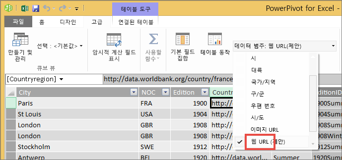

# 테이블 또는 행렬에 하이퍼링크(URL) 추가
이 토픽에서는 테이블에 하이퍼링크(URL)를 추가하는 방법을 배웁니다. Power BI Desktop을 사용하여 데이터 세트에 하이퍼링크(URL)를 추가합니다. Power BI Desktop 또는 Power BI 서비스에서 보고서 테이블 및 행렬에 하이퍼링크를 추가할 수 있습니다. 그런 다음 URL 또는 링크 아이콘을 표시하거나 다른 열을 링크 텍스트로 서식 지정할 수 있습니다.

Power BI 서비스 및 Power BI Desktop에서 [보고서의 텍스트 상자](service-add-hyperlink-to-text-box.md)에 하이퍼링크를 만들 수도 있습니다. Power BI 서비스에서 [대시보드의 타일](service-dashboard-edit-tile.md) 및 [대시보드의 텍스트 상자](service-dashboard-add-widget.md)에 하이퍼링크를 추가할 수 있습니다. 

## Power BI Desktop에서 하이퍼링크로 URL 서식 지정

Power BI Desktop에서는 URL이 포함된 필드를 하이퍼링크로 서식 지정할 수 있지만 Power BI 서비스에서는 불가능합니다. 통합 문서를 Power BI로 가져오기 전에 [Excel 파워 피벗에서 하이퍼링크를 서식 지정](#create-a-table-or-matrix-hyperlink-in-excel-power-pivot)할 수도 있습니다.

1. Power BI Desktop에서 하이퍼링크가 포함된 필드가 데이터 세트에 아직 존재하지 않으면 [사용자 지정 열](desktop-common-query-tasks.md)로 추가합니다.

    > [!NOTE]
    > DirectQuery 모드에서는 열을 만들 수 없습니다.  하지만 데이터에 URL이 이미 포함되어 있으면 하이퍼링크로 전환할 수 있습니다.

2. 데이터 뷰에서 열을 선택합니다. 

3. **모델링** 탭에서 **데이터 범주** > **웹 URL**을 선택합니다.
   
    

    > [!NOTE]
    > URL은 특정 접두사로 시작해야 합니다. 전체 목록은 이 문서의 [고려 사항 및 문제 해결](#considerations-and-troubleshooting)을 참조하세요.

## 하이퍼링크가 있는 테이블 또는 행렬 만들기

1. [하이퍼링크를 URL로 서식 지정](#format-a-url-as-a-hyperlink-in-power-bi-desktop)한 다음 보고서 뷰로 전환합니다.
2. 웹 URL로 분류한 필드를 사용하여 테이블 또는 행렬을 만듭니다. 하이퍼링크는 밑줄과 함께 파란색으로 표시됩니다.

    

## URL 대신 하이퍼링크 아이콘 표시

테이블에서 긴 URL을 표시하지 않으려는 경우 하이퍼링크 아이콘  사용합니다. 

> [!NOTE]
> 행렬에서는 아이콘을 표시할 수 없습니다.
   
1. 먼저 [하이퍼링크가 있는 테이블을 만듭니다](#create-a-table-or-matrix-with-a-hyperlink).

2. 테이블을 선택하여 활성화합니다.

    **서식** 아이콘을 선택하여 서식 탭을 엽니다.

    **값**을 확장하고 **URL 아이콘**을 찾아 **설정** 상태로 전환합니다.

    

1. (선택 사항) Power BI Desktop에서 Power BI 서비스에 [보고서를 게시](desktop-upload-desktop-files.md)합니다. Power BI 서비스에서 보고서를 열면 Power BI 서비스에서도 하이퍼링크가 작동합니다.

## 링크 텍스트를 하이퍼링크로 서식 지정

또한 테이블의 다른 필드를 하이퍼링크로 서식 지정하면 URL 열이 없어도 됩니다. 이 경우 열을 웹 URL로 서식 지정하지 않습니다.

> [!NOTE]
> 행렬에서는 다른 필드를 하이퍼링크로 서식 지정할 수 없습니다.

1. 하이퍼링크가 있는 필드가 데이터 세트에 아직 없다면 Power BI Desktop을 사용하여 [사용자 지정 열](desktop-common-query-tasks.md)로 추가합니다. DirectQuery 모드에서 열을 만들 수 없습니다.  하지만 데이터에 URL이 이미 포함되어 있으면 하이퍼링크로 전환할 수 있습니다.

2. 보고서 뷰에서 링크 텍스트로 서식 지정하려는 열이 포함 된 테이블 또는 행렬을 만듭니다.

3. 테이블을 선택한 상태에서 **서식** 아이콘을 선택하여 서식 탭을 엽니다.

4. **조건부 서식**을 확장하고 상자에 있는 이름이 링크 텍스트로 사용할 열인지 확인합니다. **URL 아이콘**을 찾아 **설정** 상태로 전환합니다.

    

5. **웹 URL** 대화 상자에서 **Based on field** 상자의 URL이 포함된 필드를 선택하고 **확인**을 선택합니다.

    

    이제 해당 열의 텍스트가 링크로 서식 지정되었습니다.

    

1. (선택 사항) Power BI Desktop에서 Power BI 서비스에 [보고서를 게시](desktop-upload-desktop-files.md)합니다. Power BI 서비스에서 보고서를 열면 Power BI 서비스에서도 하이퍼링크가 작동합니다.

## Excel 파워 피벗에서 표 또는 행렬 하이퍼링크 만들기

Power BI 테이블 및 행렬에 하이퍼링크를 추가하는 다른 방법은 Power BI에서 해당 데이터 세트에 가져오고 연결하기 전에 하이퍼링크를 만드는 것입니다. 이 예제에서는 Excel 통합 문서를 사용합니다.

1. Excel에서 통합 문서를 엽니다.
2. **PowerPivot** 탭을 선택한 후 **관리**를 선택합니다.
   
   
1. 파워 피벗이 열리면 **고급** 탭을 선택합니다.
   
   
4. Power BI 테이블에서 하이퍼링크로 전환하려는 URL을 포함하는 열에 커서를 놓습니다.
   
   > [!NOTE]
   > URL은 특정 접두사로 시작해야 합니다. 전체 목록은 [고려 사항 및 문제 해결](#considerations-and-troubleshooting)을 참조하세요.
   > 
   
5. **보고 속성** 그룹에서 **데이터 범주** 드롭다운을 선택하고 **웹 URL**을 선택합니다. 
   
   

6. Power BI 서비스 또는 Power BI Desktop에서 이 통합 문서를 연결하거나 가져옵니다.
7. URL 필드를 포함하는 테이블 시각화를 만듭니다.
   
   

## 고려 사항 및 문제 해결

URL은 다음 중 하나로 시작해야 합니다.
- http
- https
- -mailto
- file
- ftp
- news
- telnet

Q: 사용자 지정 URL을 테이블 또는 행렬의 하이퍼링크로 사용할 수 있나요?    
A: 아니요. 링크 아이콘을 사용할 수 있습니다. 하이퍼링크의 텍스트를 사용자 지정해야 하고 URL 목록이 짧은 경우, 대신 텍스트 상자를 사용해 보세요.

## 다음 단계
[Power BI 보고서의 시각화](visuals/power-bi-report-visualizations.md)

[Power BI 서비스의 디자이너를 위한 기본 개념](service-basic-concepts.md)

추가 질문이 있으신가요? [Power BI 커뮤니티를 이용하세요.](https://community.powerbi.com/)

