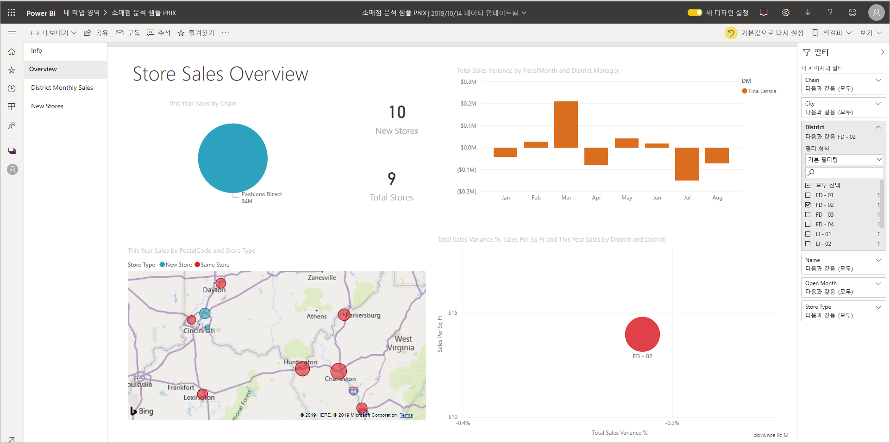
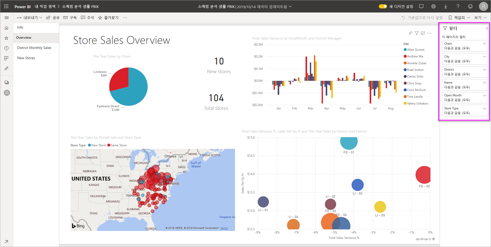
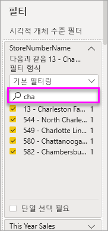
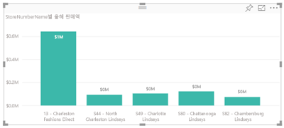
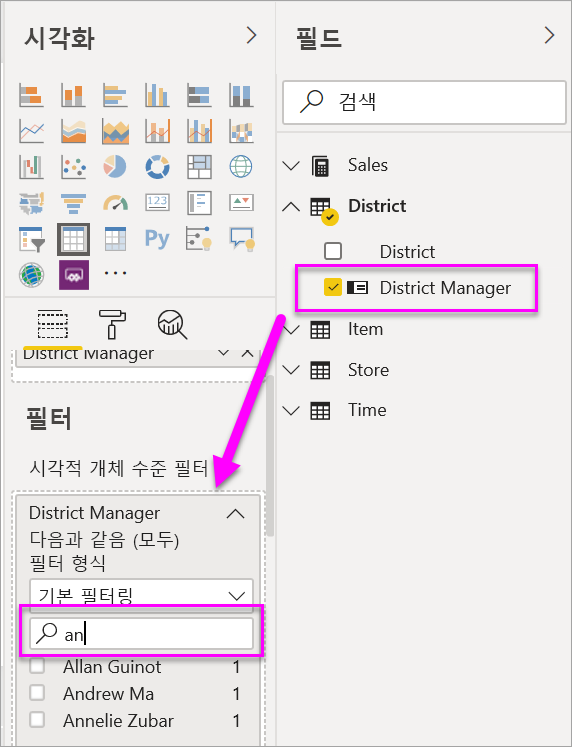
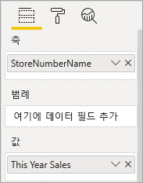
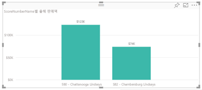
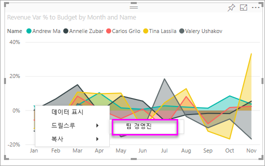

# Power BI의 보고서에 필터 추가

[!INCLUDE [power-bi-service-new-look-include](includes/power-bi-service-new-look-include.md)]

이 문서에서는 Power BI의 보고서에 페이지 필터, 시각화 필터, 보고서 필터 또는 드릴스루 필터를 추가하는 방법을 설명합니다. 이 문서의 예제는 Power BI 서비스에 있습니다. 단계는 Power BI Desktop과 거의 동일합니다.

**알고 계십니까?** Power BI에는 새 필터 환경이 있습니다. [Power BI 보고서의 새 필터 환경](power-bi-report-filter.md)에 대해 자세히 알아보세요.

Power BI에서는 수동과 자동, 드릴스루 및 통과 등 다양한 종류의 필터를 제공합니다. [다양한 종류의 필터](power-bi-report-filter-types.md)에 대해 읽어 보세요.

## 편집용 보기 또는 읽기용 보기의 필터
읽기용 보기 및 편집용 보기의 다음 두 가지 보기에서 보고서를 조작할 수 있습니다. 읽기용 보기 및 편집용 보기. 사용할 수 있는 필터링 기능은 현재 보기에 따라 달라집니다. 자세한 내용은 모든 [필터 및 Power BI 보고서에서 강조 표시 정보](power-bi-reports-filters-and-highlighting.md)를 참조하세요.

이 문서는 보고서 **편집용 보기**에서 필터를 만드는 방법에 관해 설명합니다.  읽기용 보기에서 필터에 대한 자세한 내용은 [보고서 읽기용 보기에서 필터로 상호 작용](consumer/end-user-report-filter.md)을 참조하세요.

필터가 ‘유지’되기 때문에 보고서에서 다른 곳으로 이동할 때 Power BI에는 필터, 슬라이서 및 기타 데이터 보기 변경 내용이 그대로 유지됩니다.  따라서 보고서로 돌아올 때 떠난 위치를 다시 선택할 수 있습니다. 필터 변경 내용을 유지하지 않으려면 위의 메뉴 모음에서 **기본값으로 다시 설정**을 선택합니다.

## 필터 창의 필터 수준
데스크톱 또는 Power BI 서비스를 사용하는지에 따라 필터 창이 보고서 캔버스의 오른쪽에 표시됩니다. 필터 창이 표시되지 않는 경우 오른쪽 위 모서리의 ">" 아이콘을 선택하여 확장합니다.

보고서의 세 가지 수준, 즉 시각적 개체 수준, 페이지 수준 및 보고서 수준의 필터를 설정할 수 있습니다. 드릴스루 필터를 설정할 수도 있습니다. 이 문서에서는 다양한 수준에 대해 설명합니다.

## 시각적 개체에 필터 추가
두 가지 방법으로 특정 시각적 개체에 시각적 개체 수준 필터를 추가할 수 있습니다. 

* 시각화에서 이미 사용 중인 필드를 필터링합니다.
* 시각화에서 사용하고 있지 않은 필드를 식별하고 **시각적 수준 필터** 버킷에 직접 해당 필드를 추가합니다.

이 절차에서는 소매점 분석 샘플을 사용합니다. 이 경우 이 샘플을 다운로드하고 설명을 따라 진행합니다. [소매점 분석 샘플](sample-retail-analysis.md)을 다운로드합니다.

### 시각적 개체에서 필드 필터링

1. **보고서 편집**을 선택하여 편집용 보기에서 보고서를 엽니다.
   
   

2. 시각화와 필터 창 및 필드 창을 엽니다(이미 열리지 않은 경우).
   
   
3. 시각적 개체를 선택하여 활성화합니다. 시각적 개체에서 사용 중인 모든 필드는 **필드** 창에 있고 **시각적 수준 필터** 제목 아래의 **필터** 창에도 나열됩니다.
   
   
4. 이 시점에서 시각화하여 이미 사용 중인 필드에 필터를 추가합니다. 
   
    **시각적 수준 필터** 영역으로 아래로 스크롤하고 화살표를 선택하여 필터링할 필드를 확장합니다. 이 예제에서는 **StoreNumberName**을 필터링합니다.
     
     
    
    **기본**, **고급** 또는 **상위 N개** 필터링 컨트롤을 설정합니다. 이 예제에서는 기본 필터링에서 **cha**를 검색하고 해당하는 5개의 저장소를 선택합니다.
     
     
   
    시각적 개체가 바뀌면서 새 필터가 반영됩니다. 필터와 함께 보고서를 저장할 경우 보고서 구독자는 시작 문자로 필터링된 시각적 개체를 볼 수 있고 읽기용 보기에서 필터를 조작하여 값을 선택하거나 지울 수 있습니다.
     
    
    
    시각적 개체에서 사용된 필드에 필터를 사용하고 해당 필드가 집계(예: 합계, 평균 또는 개수)된 경우 각 데이터 요소의 ‘집계된’ 값을 필터링하게 됩니다.  따라서 위에서 **올해 판매액 > 500000**인 시각적 개체를 필터링하도록 요청하면 **13 - Charleston Fashion Direct** 데이터 요소만 결과에 표시됩니다. [모델 측정값](desktop-measures.md) 필터는 항상 데이터 요소의 집계된 값에 적용됩니다.

### 시각적 개체에 없는 필드를 사용하여 필터링

이제 새 필드를 시각화에 시각적 수준 필터로 추가하겠습니다.
   
1. [필드] 창에서 새 시각적 수준 필터로 추가하려는 필드를 선택하고 **시각적 수준 필터 영역**으로 끌어 놓습니다.  이 예제에서는 **지역 관리자**를 **시각적 수준 필터** 버킷으로 끌어놓고, **an**을 검색하고, 해당하는 3명의 관리자를 선택합니다. 
     
    

    **지역 관리자**는 시각화 자체에 ‘추가되는 것이 아닙니다’.  시각화는 여전히 **StoreNumberName** 축과 **올해 판매** 값으로 구성됩니다.  
     
    

    또한 이제 시각화 자체가 필터링되어 특정 매장에서 올해 해당 관리자의 판매만 표시합니다.
     
    

    필터와 함께 보고서를 저장할 경우 보고서 구독자는 읽기용 보기에서 **지역 관리자** 필터를 조작하여 값을 선택하거나 지울 수 있습니다.
    
    ‘숫자 열’을 필터 창으로 끌어 시각적 개체 수준 필터를 만드는 경우 ‘기본 데이터 행’에 필터가 적용됩니다.   예를 들어 **UnitCost** 필드에 필터를 추가하고 **UnitCost** > 20으로 설정하면 시각적 개체에 표시된 데이터 요소의 총 단위 비용과 관계없이 단위 비용이 20보다 큰 제품 행의 데이터만 표시됩니다.

## 전체 페이지에 필터 추가

전체 페이지를 필터링하는 페이지 수준 필터를 추가할 수도 있습니다.

1. **보고서 편집**을 선택하여 편집용 보기에서 보고서를 엽니다.
   
   
2. 시각화와 필터 창 및 필드 창을 엽니다(이미 열리지 않은 경우).
3. [필드] 창에서 새 페이지 수준 필터로 추가하려는 필드를 선택하고 **페이지 수준 필터** 영역으로 끌어 놓습니다.  
4. 필터링할 값을 선택하고 **기본** 또는 **고급** 필터링 컨트롤을 설정합니다.
   
   페이지의 모든 시각화는 변경 사항에 맞게 다시 그려집니다.
   
   

    필터와 함께 보고서를 저장할 경우 보고서 구독자는 읽기용 보기에서 필터를 조작하여 값을 선택하거나 지울 수 있습니다.

## 드릴스루 필터 추가
Power BI 서비스 및 Power BI Desktop의 드릴스루를 사용하여 공급 업체, 고객 또는 제조업체와 같이 특정 엔터티에 초점을 맞춘 *대상* 보고서 페이지를 만들 수 있습니다. 이제 다른 보고서 페이지에서 사용자는 초점을 맞춘 페이지에 대한 해당 엔터티 및 드릴스루의 데이터 요소를 마우스 오른쪽 단추로 클릭할 수 있습니다.

### 드릴스루 필터 만들기
과정을 따르려면 [고객 수익성 샘플](sample-customer-profitability.md)을 다운로드합니다. 경영진 비즈니스 영역에 초점을 두는 페이지를 원하는 경우를 가정해 봅니다.

1. **보고서 편집**을 선택하여 편집용 보기에서 보고서를 엽니다.
   
   

1. 보고서에 새 페이지를 추가하고 이름을 **팀 경영진**으로 지정합니다. 이 페이지는 드릴스루 *대상*이 됩니다.
2. 팀 경영진의 비즈니스 영역에 대한 주요 메트릭을 추적하는 시각화를 추가합니다.    
3. 드릴스루 필터 웰에 **경영진 > 경영진 이름**을 추가합니다.    
   
    
   
    Power BI는 보고서 페이지에 뒤로 화살표를 추가합니다.  뒤로 화살표를 선택하면 사용자는 *원본* 보고서 페이지(드릴스루로 선택했을 때 있었던 페이지)로 돌아갑니다. 뒤로 화살표는 읽기용 보기에서만 작동합니다.
   
     

### 드릴스루 필터 사용
드릴스루 필터의 작동 방식을 살펴보겠습니다.

1. **팀 성과 기록표** 보고서 페이지를 시작합니다.    
2. 사용자가 Andrew Ma이며 사용자의 데이터에 대해서만 필터링된 팀 경영진 보고서 페이지를 보려고 한다고 가정합니다.  왼쪽 위 영역 차트에서 녹색 데이터 요소를 마우스 오른쪽 단추로 클릭하여 드릴스루 메뉴 옵션을 엽니다.
   
    
3. **드릴스루 > 팀 경영진**을 선택하여 **팀 경영진**이라는 보고서 페이지로 드릴스루합니다. 페이지가 필터링되어 마우스 오른쪽 단추로 클릭한 데이터 요소에 대한 정보를 표시합니다. 이 경우 Andrew Ma입니다. 드릴스루 필터 웰에 있는 필드만이 드릴스루 보고서 페이지에 전달됩니다.  
   
    

## 전체 보고서를 필터링하는 보고서 수준 필터 추가

1. **보고서 편집**을 선택하여 편집용 보기에서 보고서를 엽니다.
   
   

2. 아직 열려 있지 않은 경우 시각화와 필터 창 및 필드 창을 엽니다.
3. [필드] 창에서 새 보고서 수준 필터로 추가하려는 필드를 선택하고 **보고서 수준 필터** 영역으로 끌어 놓습니다.  
4. 필터링하려는 값을 선택합니다.

    활성 페이지와, 보고서의 모든 페이지에서 시각적 개체가 바뀌면서 새 필터가 반영됩니다. 필터와 함께 보고서를 저장할 경우 보고서 구독자는 읽기용 보기에서 필터를 조작하여 값을 선택하거나 지울 수 있습니다.

1. 뒤로 화살표를 선택하여 이전 보고서 페이지로 돌아갑니다.

## 고려 사항 및 문제 해결

- 필드 창이 표시되지 않으면 보고서 [편집용 보기](service-interact-with-a-report-in-editing-view.md)에 있는지 확인하십시오.    
- 필터를 많이 변경하고 보고서 작성자 기본 설정으로 되돌리려는 경우 위의 메뉴 모음에서 **기본값으로 다시 설정**을 선택합니다.

## 다음 단계
[보고서 필터 창 둘러보기](consumer/end-user-report-filter.md)

[필터 및 보고서에서 강조 표시](power-bi-reports-filters-and-highlighting.md)

[Power BI의 다양한 종류의 필터](power-bi-report-filter-types.md)

궁금한 점이 더 있나요? [Power BI 커뮤니티를 이용하세요.](http://community.powerbi.com/)

