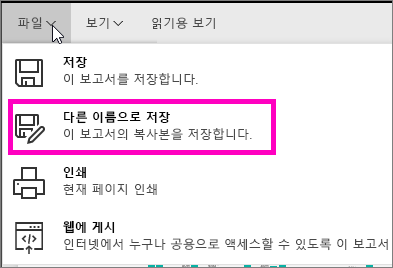

# 기존 보고서에서 새 보고서 만들기
이미 데이터 집합에 연결하는 보고서가 있고 다시 사용하거나 수정하려고 하는 몇 가지 시각적 개체가 있을 수 있습니다.  새 보고서에 대한 기준으로 해당 보고서를 단순히 복사할 수 없습니까?  수행할 작업:

1. [보고서를 엽니다](service-report-open.md).
2. **파일** 메뉴에서 **다른 이름으로 저장**을 선택합니다.
   
   
3. 새 보고서의 이름을 입력하고 **저장**을 선택합니다.
   
   
   
   새 보고서가 Power BI의 현재 작업 영역에 저장되었다는 성공 메시지가 표시됩니다.
   
   
4. 작업 영역의 **보고서** 탭을 열고 새 보고서를 선택하여 엽니다. 필요에 따라 유지하지 않으려는 시각적 개체를 삭제하고 다른 시각적 개체를 수정하고 새 시각적 개체를 추가합니다.
   
   
5. 이제 새 보고서로 마음껏 업데이트하고 편집하세요.

## 다음 단계:
[새 시각화 만들기](power-bi-report-add-visualizations-ii.md)

필요하지 않은 [시각화 삭제](service-delete.md)
