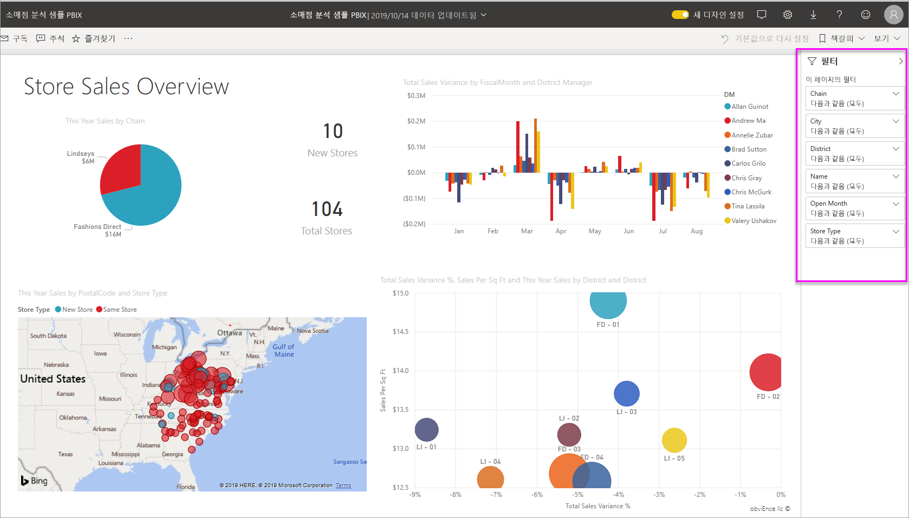
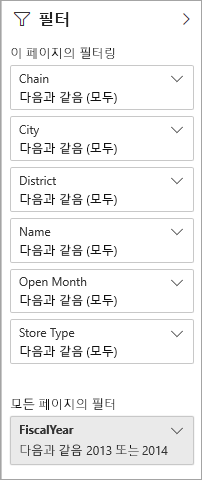
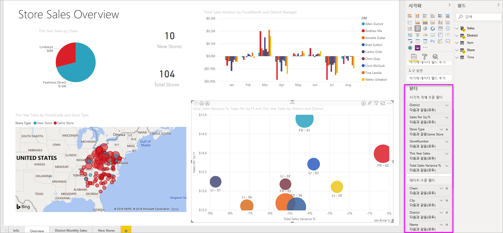

# 필터 및 Power BI 보고서에서 강조 표시 정보
***필터***는 사용자가 집중하려는 데이터를 제외한 나머지를 모두 제거합니다.  ***강조*** 는 데이터를 제거하지 않고 볼 수 있는 데이터의 하위 집합을 강조 표시하므로 필터링이 아닙니다. 강조되지 않은 데이터는 볼 수 있지만 흐리게 표시됩니다.

다양한 방법으로 Power BI에서 보고서를 필터링하고 강조 표시할 수 있습니다. 모든 해당 정보를 하나의 문서에 배치하는 것을 혼란스러울 수 있으므로 다음과 같이 구분했습니다.

* 필터 및 강조 표시에 대한 소개(지금 읽고 있는 문서)
* [소유하고 있는 편집용 보기/보고서에서 필터 및 강조 표시를 만들고 사용](power-bi-report-add-filter.md)할 수 있는 방법입니다. 보고서에 대한 편집 권한이 있는 경우 보고서에서 필터 및 강조 표시를 만들고 수정 및 삭제할 수 있습니다.
* [사용자와 공유되거나 보고서 읽기용 보기의 보고서에서 필터 및 강조 표시를 사용](service-reading-view-and-editing-view.md)할 수 있는 방법입니다. 수행할 수 있는 작업은 보다 제한적이지만 Power BI는 여전히 다양한 필터링 및 강조 표시 옵션을 제공합니다.  
* 필터의 종류(예: 날짜 및 시간, 숫자, 텍스트) 및 기본 및 고급 옵션의 차이점 자세히 살펴보기를 포함하는 [편집용 보기에서 사용할 수 있는 필터 및 강조 표시 제어의 자세한 둘러보기](power-bi-how-to-report-filter.md)입니다.
* 이제 필터 및 강조 표시가 기본적으로 작동하는 방법을 배웠으므로 [페이지 필터 및 상호 강조 표시에서 시각화 방식을 변경하는 방법에 대해 알아봅니다](service-reports-visual-interactions.md).

> [!TIP]
> Power BI는 데이터 연결 방식을 어떻게 알고 있습니까?  Power BI는 기본 [데이터 모델](https://support.office.com/article/Create-a-Data-Model-in-Excel-87e7a54c-87dc-488e-9410-5c75dbcb0f7b?ui=en-US&rs=en-US&ad=US)에 속하는 다양한 테이블과 필드 사이의 관계를 사용하여 보고서 페이지의 항목이 서로 상호 작용하도록 합니다.
> 
> 

## 필터 창을 사용하여 보고서에서 필터 및 강조 표시에 대한 소개
 이 아티클에서는 Power BI 서비스의 필터링 및 강조 표시를 소개합니다.  하지만 환경은 Power BI Desktop과 거의 동일합니다.  

필터 및 강조 표시는 **필터** 창을 사용하거나 보고서 자체에서 직접 선택하여(애드혹, 페이지의 맨 아래 참조) 적용될 수 있습니다. 필터 창은 보고서에서 사용되는 테이블 및 필드와 있는 경우 적용된 필터를 보여 줍니다. 필터는 **페이지 수준 필터**, **보고서 수준**, **드릴스루** 및 **시각적 개체 수준**으로 나뉩니다.  보고서 캔버스에서 시각화를 선택한 경우 시각적 수준 필터만 표시됩니다.

> [!TIP]
> 팁: 필터 옆에 **모두**라는 단어가 있는 경우 이는 전체 필드가 필터로 포함되고 있는 것을 의미합니다.  예를 들어 아래 스크린샷의 **Chain(All)** 은 이 보고서 페이지가 모든 상점 체인에 대한 데이터를 포함한다는 것을 알려줍니다.  반면 **FiscalYear는 2013 또는 2014입니다**의 보고서 수준 필터는 보고서가 2013 및 2014년의 회계 연도에 대한 데이터만을 포함한다는 것을 알려줍니다.
> 
> 

## 읽기용 보기 및 편집용 보기의 필터
보고서는 [읽기용 보기와 편집용 보기](service-reading-view-and-editing-view.md)의 두 가지 방식으로 조작할 수 있습니다.  또한 사용할 수 있는 필터링 기능은 현재 모드에 따라 달라집니다.

* 편집용 보기에서는 보고서, 페이지, 드릴스루 및 시각적 개체 필터를 추가할 수 있습니다. 보고서를 저장하는 경우 모바일 앱에서 여는 경우에도 필터를 보고서와 함께 저장합니다. 읽기용 보기에서 보고서를 보는 사람들은 사용자가 추가한 필터로 상호 작용할 수 있지만 새 필터를 추가할 수 없습니다.
* 읽기용 보기에서 이미 보고서에 존재하는 필터로 상호 작용하고 선택을 저장할 수 있습니다.  하지만 새 필터를 추가할 수 없습니다.

### 읽기용 보기에서 필터 창
읽기용 보기에서만 보고서에 대한 액세스가 있는 경우 필터 창은 다음과 유사하게 표시됩니다.

따라서 보고서의 이 페이지에는 6개의 페이지 수준 필터와 1개의 보고서 수준 필터가 있습니다.

시각적 수준 필터가 있는지 확인하려면 시각적 개체를 선택합니다. 아래 이미지에서 거품형 차트에는 6개의 필터가 적용되었습니다.

읽기용 보기에서 기존 필터를 수정하여 데이터를 탐색합니다. 모바일 앱에서 보고서를 여는 경우에도 변경 내용을 보고서와 함께 저장합니다. [Power BI 서비스의 보고서 읽기용 보기 및 편집용 보기](service-reading-view-and-editing-view.md) 아티클에서 방법을 알아보세요.

### 편집용 보기에서 필터 창
보고서에 대한 소유자 권한이 있는 경우 편집용 보기에서 열면 **필터**는 사용할 수 있는 여러 개의 편집 창 중 하나인 것을 확인할 수 있습니다.

따라서 읽기용 보기(위)에서 보고서의 이 페이지에는 6개의 페이지 수준 필터와 1개의 보고서 수준 필터가 있는 것을 확인할 수 있습니다. 그리고 거품형 차트를 선택하여 6개의 시각적 수준 필터가 적용된 것을 알 수 있습니다.

하지만 편집용 보기에서 필터 및 강조 표시를 사용하여 수행할 수 있는 작업이 훨씬 더 많습니다. 주요 차이점은 새 필터를 추가할 수 있는 것입니다. [보고서에 필터 추가](power-bi-report-add-filter.md) 문서에서 이를 수행하는 방법 및 더 자세히 알아보기

## 임시 필터링 및 강조 표시
보고서 캔버스의 필드를 선택하여 페이지의 나머지 부분을 필터링 및 강조 표시합니다. 동일한 시각적 개체의 빈 공간을 선택하여 제거합니다. 이러한 종류의 필터링 및 강조 표시는 데이터 영향을 신속하게 탐색하는 흥미로운 방법입니다. 이러한 종류의 교차 필터링 및 교차 강조 표시의 작동 방법을 미세 조정하려면 [시각적 상호 작용](service-reports-visual-interactions.md)을 참조하세요.

보고서를 종료하면 변경 내용이 저장됩니다. 필터링 실행을 취소하고 보고서 작성자가 설정한 기본 필터링, 분할, 드릴 및 정렬로 돌아가려면 위의 메뉴 모음에서 **기본값으로 다시 설정**을 선택합니다.

## 다음 단계
[필터로 조작 및 강조 표시(읽기용 보기)](service-reading-view-and-editing-view.md)

[보고서에 필터 추가(편집용 보기)](power-bi-report-add-filter.md)

[보고서 필터 둘러보기](power-bi-how-to-report-filter.md)

[보고서 시각적 개체가 서로 교차 필터링 및 교차 강조 표시되는 방식 변경](service-reports-visual-interactions.md)

[Power BI의 보고서](service-reports.md)에 대해 자세히 알아보기

궁금한 점이 더 있나요? [Power BI 커뮤니티를 이용하세요.](http://community.powerbi.com/)

