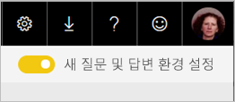
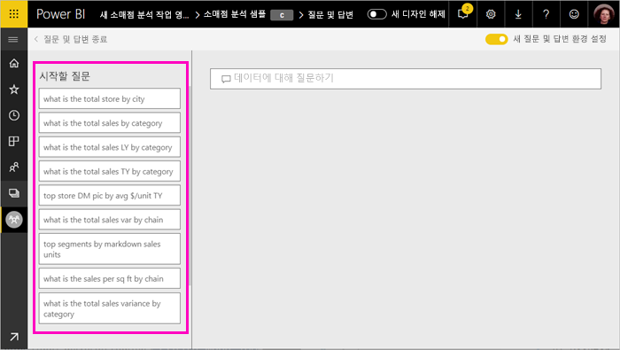
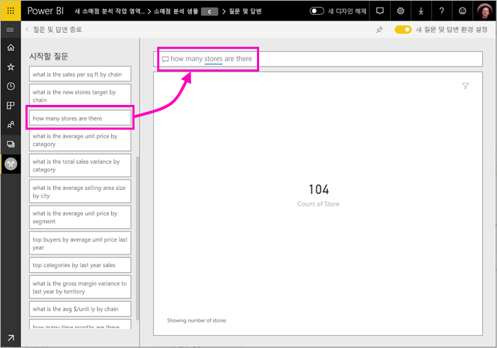
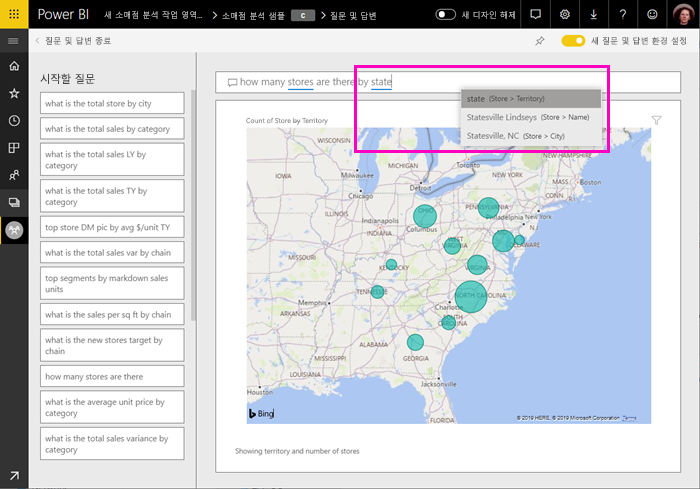
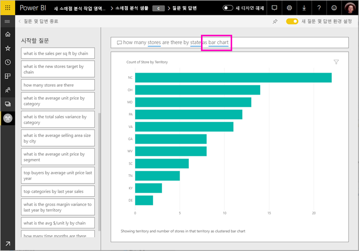
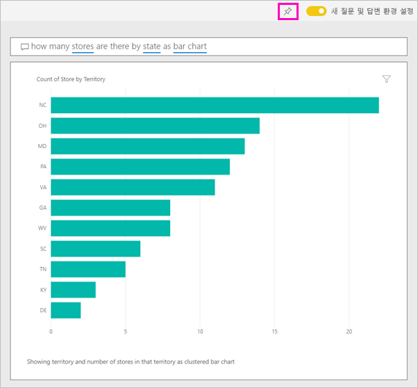
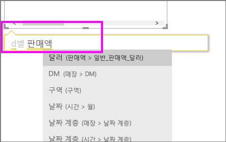
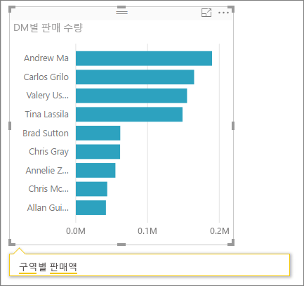

# Power BI q&a를 사용 하 여 데이터 탐색 및 시각적 개체 만들기

경우에 따라 자연어를 사용하여 질문을 하면 가장 빠르게 사용자 데이터로 답변을 받을 수 있습니다. Power BI의 질문 및 답변 기능을 사용 하면 자신만의 데이터를 탐색할 수 있습니다.  이 문서의 첫 번째 부분에서 Power BI 서비스에서 대시보드 질문 및 답변 사용 되는 방법을 보여 줍니다. 두 번째 부분에서는 수행할 수 있는 질문 및 답변을 사용 하 여 Power BI 서비스 또는 Power BI Desktop에서 보고서를 만들 때를 보여 줍니다. 자세한 배경 정보를 참조 하세요. 합니다 [소비자에 대 한 q&a](consumer/end-user-q-and-a.md) 문서. 

[Power BI 모바일 앱에서 q&a](consumer/mobile/mobile-apps-ios-qna.md) 하 고 [질문 및 답변과 Power BI Embedded](developer/qanda.md) 별도 문서에 나와 있습니다. 

질문 및 답변은 대화형으로 재미도 합니다. 종종 시각화 기능을 이용 하는 흥미로운 경로 표시 하는 대로 질문 중 하나는 다른 사용자에 게 연결 됩니다. Amanda가 질문 및 답변을 사용하여 시각화를 만들고, 시각적 개체를 자세히 살펴보고, 대시보드에 고정하는 과정을 시청합니다.

<iframe width="560" height="315" src="https://www.youtube.com/embed/qMf7OLJfCz8?list=PL1N57mwBHtN0JFoKSR0n-tBkUJHeMP2cP" frameborder="0" allowfullscreen></iframe>

## 1부: Power BI 서비스의 대시보드에서 질문 및 답변 사용

Power BI 서비스 (app.powerbi.com)에서 대시보드는 이러한 데이터 집합에 포함 된 데이터에 대 한 질문을 올릴 수 있도록 하나 이상의 데이터 집합에서 고정 한 타일을 포함 합니다. 어떤 보고서 및 데이터 집합을 만드는 데 사용 된 대시보드를 보려면 선택 **관련 항목 보기** 메뉴 모음에서.

질문 및 답변 질문 상자 자연어를 사용 하 여 질문을 입력할 대시보드의 왼쪽 위 모퉁이 있습니다. 질문 및 답변 상자에 표시 되지 않나요? 참조 [고려 사항 및 문제 해결](consumer/end-user-q-and-a.md#considerations-and-troubleshooting) 에 **소비자에 대 한 q&a** 문서.  질문 및 답변을 입력 하 고 답변을 찾아보십시오 (데이터 집합)의 위치를 파악 라는 단어를 인식 합니다. 또한 자동 완성, 재작성, 기타 텍스트 및 시각적 보조 기능으로 질문을 만들 수 있도록 지원합니다.

질문에 대한 답변이 대화형 시각화로 표시되고 질문을 수정함에 따라 업데이트됩니다.

1. 대시보드를 열고 질문 상자에 커서를 놓습니다. 오른쪽 위 모서리에서 선택 **새 답변 경험**합니다.

    

1. 입력을 시작하기 전에 질문 및 답변이 제안과 함께 새 화면을 표시하여 질문 형성을 돕습니다. 구 및 기본 데이터 집합에 있는 테이블의 이름을 포함 하는 전체 질문을 확인 하 고 데이터 집합 소유자가 만든 경우 전체 질문이 표시 표시도 될 수 있습니다 [추천 질문](service-q-and-a-create-featured-questions.md),

   

   시작 지점으로 이러한 질문 중 하나를 선택 하 고 질문을 특정 답을 찾을 수를 더욱 구체화할 수 있습니다. 또는 테이블 이름을 사용 하 여 새 질문을 입력할 수 있습니다.

2. 질문의 목록에서 선택 하거나 사용자 고유의 질문을 입력 하 고 드롭다운 제안에서 선택 합니다.

   

3. 입력할 때 질문 및 답변 표시 하는 데 가장 적합 한 시각화를 선택 합니다.

   

4. 시각화가 바뀌면서 때 동적으로 질문을 수정 합니다.

   

1. 질문을 입력하면 Power BI는 해당 대시보드에 타일이 있는 데이터 세트를 사용하여 가장 적합한 답변을 찾습니다.  모든 타일이 *datasetA*에 있는 경우 답변은 *datasetA*에서 제공됩니다.  타일의 경우 *datasetA* 하 고 *datasetB*, 이러한 두 데이터 집합에서 가장 적합 한 답변에 대 한 질문 및 답변을 검색 합니다.

   > [!TIP]
   > *datasetA*에 타일이 하나만 있는 경우 대시보드에서 제거하면 질문 및 답변에서 datasetA  에 더 이상 액세스할 수 없으므로 주의해야 합니다.
   >

5. 때 만족 하면 결과 시각화 오른쪽 위 모서리에서 고정 아이콘을 선택 하 여 대시보드를 고정 합니다. 대시보드를 사용자와 공유하거나 앱의 일부인 경우 고정할 수 없습니다.

   

## 2부: Power BI 서비스 또는 Power BI Desktop의 보고서에서 질문 및 답변 사용

질문 및 답변을 사용하여 데이터 세트를 탐색하고 보고서 및 대시보드에 시각화를 추가합니다. 보고서는 단일 데이터 세트를 기반으로 하며 완전히 비어 있을 수도 있고 시각화로 가득한 페이지를 포함할 수도 있습니다. 하지만 보고서가 비어 있다고 해서 살펴볼 데이터가 하나도 없다는 뜻은 아닙니다. 데이터 세트는 보고서와 연결되어 있으며 사용자가 살펴보고 시각화를 만들기를 기다립니다.  보고서를 만드는 데 사용되는 데이터 세트를 보려면 Power BI 서비스 읽기용 보기에서 보고서를 열고 메뉴 모음에서 **관련 항목 보기**를 선택합니다.

보고서에서 질문 및 답변을 사용 하 여 보고서와 기본 데이터 집합에 대 한 편집 권한이 있어야 합니다. 에 [소비자에 대 한 질문 및 답변](consumer/end-user-q-and-a.md) 이것을 참조 하세요를 *작성자* 시나리오입니다. 대신 라면 *소비* 질문 및 답변 사용자와 공유한 보고서를 사용할 수 없습니다.

1. 편집용 보기 (Power BI 서비스) 또는 보고서 보기 (Power BI Desktop)에서 보고서를 열고 선택 **질문** 메뉴 모음에서.

    **Power BI Desktop**    
    

    **서비스**    
    

2. 질문 및 답변 질문 상자는 보고서 캔버스에 표시됩니다. 아래 예에서는 질문 상자가 다른 시각화 위에 표시됩니다. 그래도 문제는 없지만 질문을 하기 전에 보고서에 빈 페이지를 추가하는 것이 더 좋을 것 같습니다.

    

3. 질문 상자에 커서를 놓습니다. 사용자가 입력하면 질문 및 답변에서는 질문을 쉽게 완성할 수 있도록 제안 사항을 표시합니다.

   

4. 질문을 입력하면 질문 및 답변에서 답변을 표시하는 데 가장 적합한 [시각화](visuals/power-bi-visualization-types-for-reports-and-q-and-a.md)를 선택합니다. 그러면 질문을 수정할 때 시각화가 동적으로 변경됩니다.

   

5. 원하는 시각화가 완성되면 ENTER를 선택합니다. 시각화를 보고서와 함께 저장하려면 **파일 > 저장**을 선택합니다.

6. 새 시각화와 상호 작용합니다. 시각화를 만드는 방법은 중요하지 않습니다. 동일한 대화형 작업, 서식 지정 및 기능을 모두 사용할 수 있습니다.

   

   Power BI 서비스에서 시각화를 만들었으면 [대시보드에 고정](service-dashboard-pin-tile-from-q-and-a.md)할 수 있습니다.

## 질문 및 답변에 사용할 시각화 알리기
질문 및 답변으로 데이터가 자체적으로 알릴 수 있도록 할 뿐만 아니라 답변을 표시하는 방법을 Power BI에 알려줄 수 있습니다. 질문 끝에 "as a"를 추가하기만 하면 됩니다.  예를 들어 "show inventory volume by plant as a map" 및 "show total inventory as a card"를 입력합니다.  직접 시도해 봅니다.

## 고려 사항 및 문제 해결
- 라이브 연결 또는 게이트웨이를 사용하여 데이터 세트에 연결한 경우 질문 및 답변을 [해당 데이터 세트에 대해 활성화](service-q-and-a-direct-query.md)해야 합니다.

- 우리는 보고서를 열었으므로 질문 및 답변 옵션이 표시되지 않습니다. Power BI 서비스를 사용하는 경우 편집용 보기에서 보고서를 열어야 합니다. 즉, 해당 보고서에 대 한 편집 권한이 없는 및 해당 특정 보고서와 q&a를 사용 하 여 편집용 보기를 열 수 없으면입니다.

## 다음 단계

- [소비자에 대 한 질문과 대답](consumer/end-user-q-and-a.md)   
- [질문 및 답변에서 질문하기 위한 팁](consumer/end-user-q-and-a-tips.md)   
- [질문 및 답변을 위한 통합 문서 준비](service-prepare-data-for-q-and-a.md)  
- [Q&a에 대 한 온-프레미스 데이터 집합 준비](service-q-and-a-direct-query.md)   
- [Q&A에서 대시보드에 타일 고정](service-dashboard-pin-tile-from-q-and-a.md)
