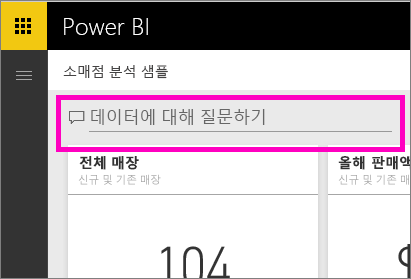
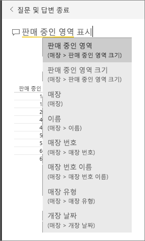
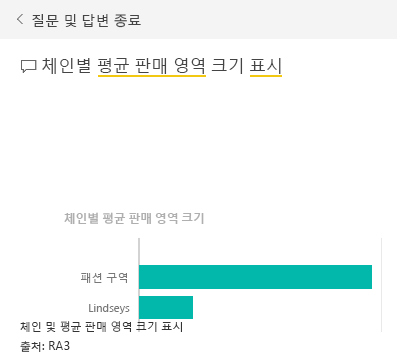
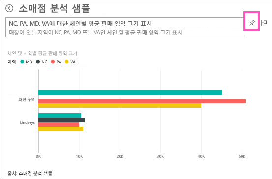
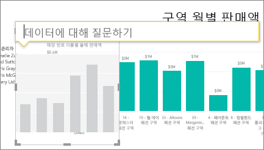
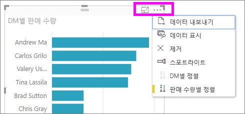

# 자습서: 질문 및 답변을 사용하여 시각화를 만들고 보고서를 작성하는 방법
[질문 및 답변 개요](power-bi-q-and-a.md)에서는 Power BI 질문 및 답변을 소개하고 *소비자*(대시보드 및 보고서를 소비자와 공유)와 *작성자*(기본 보고서 및 데이터 집합 소유)를 구분했습니다. 이 자습서의 첫 번째 부분은 주로 Power BI 서비스를 사용하여 대시보드를 소비하는 사람들을 위해 설계되었습니다. 두 번째 부분은 Power BI 서비스 또는 Power BI Desktop을 사용하여 보고서를 만드는 사람들을 위해 설계되었습니다. [질문 및 답변과 Power BI Mobile](mobile-apps-ios-qna.md) 및 [질문 및 답변과 Power BI Embedded](developer/qanda.md)는 별도의 문서에서 다룹니다.

질문 및 답변은 대화형으로 재미도 있으며 시각화가 진행하는 흥미로운 경로를 표시함에 따라 대개 하나의 질문은 다른 항목으로 연결됩니다. Amanda가 질문 및 답변을 사용하여 시각화를 만들고, 시각적 개체를 자세히 살펴보고, 대시보드에 고정하는 과정을 시청합니다.

<iframe width="560" height="315" src="https://www.youtube.com/embed/qMf7OLJfCz8?list=PL1N57mwBHtN0JFoKSR0n-tBkUJHeMP2cP" frameborder="0" allowfullscreen></iframe>

## 1부: Power BI 서비스의 대시보드에서 질문 및 답변 사용(app.powerbi.com)
대시보드에는 하나 이상의 데이터 집합에서 고정된 타일이 포함되어 있으므로 이러한 데이터 집합에 포함된 데이터에 대해 질문할 수 있습니다. 대시보드를 만드는 데 사용된 보고서 및 데이터 집합을 보려면 메뉴 모음에서 **관련 항목 보기**를 선택합니다.

질문 및 답변 질문 상자는 대시보드의 왼쪽 위 모서리에 있으며, 자연어를 사용하여 질문을 입력할 수 있습니다. 질문 및 답변에서 사용자가 입력한 단어를 인식하고 답변이 있는 위치(데이터 집합)를 찾아냅니다. 또한 자동 완성, 재작성, 기타 텍스트 및 시각적 보조 기능으로 질문을 만들 수 있도록 지원합니다.

질문에 대한 답변이 대화형 시각화로 표시되고 질문을 수정함에 따라 업데이트됩니다.

1. 대시보드를 열고 질문 상자에 커서를 놓습니다. 입력을 시작하기 전에 질문 및 답변이 제안과 함께 새 화면을 표시하여 질문 형성을 돕습니다. [기본 데이터 집합](service-get-data.md)에 테이블 이름이 표시되며 데이터 집합 소유자가 [추천 질문](service-q-and-a-create-featured-questions.md)을 만든 경우 전체 질문이 표시될 수도 있습니다.

   

   시작 지점으로 항상 이러한 질문 중 하나를 선택하고 지속적으로 질문을 구체화하여 사용자가 찾고 있는 특정 대답을 찾을 수 있습니다. 또는 테이블 이름을 사용하여 새 질문을 입력할 수 있습니다.

2. 데이터 집합 옵션 중에서 선택하거나 원하는 질문을 입력하고 드롭다운 제안에서 선택합니다.

   

3. 질문을 입력하면 질문 및 답변에서 답변을 표시하는 데 가장 적합한 [시각화](power-bi-visualization-types-for-reports-and-q-and-a.md)를 선택합니다. 그러면 질문을 수정할 때 시각화가 동적으로 변경됩니다.

   

4. 질문을 입력하면 Power BI는 해당 대시보드에 타일이 있는 데이터 집합을 사용하여 가장 적합한 답변을 찾습니다.  모든 타일이 datasetA 에 있는 경우 답변은 datasetA 에서 제공됩니다.  타일이 *datasetA* 및 *datasetB* 에 있는 경우 질문 및 답변은 이러한 두 데이터 집합에서 가장 적합한 답변을 검색합니다.

   > [!TIP]
   > *datasetA* 에 타일이 하나만 있는 경우 대시보드에서 제거하면 질문 및 답변에서 datasetA 에 더 이상 액세스할 수 없으므로 주의해야 합니다.
   >
   >
5. 결과에 만족했으면 오른쪽 상단에 있는 고정 아이콘을 선택하여 [시각화를 대시보드에 고정](service-dashboard-pin-tile-from-q-and-a.md)합니다. 대시보드를 사용자와 공유하거나 앱의 일부인 경우 고정할 수 없습니다.

   

##    2부: Power BI 서비스 또는 Power BI Desktop의 보고서에서 질문 및 답변 사용

질문 및 답변을 사용하여 데이터 집합을 탐색하고 보고서 및 대시보드에 시각화를 추가합니다. 보고서는 단일 데이터 집합을 기반으로 하며 완전히 비어 있을 수도 있고 시각화로 가득한 페이지를 포함할 수도 있습니다. 하지만 보고서가 비어 있다고 해서 살펴볼 데이터가 하나도 없다는 뜻은 아닙니다. 데이터 집합은 보고서와 연결되어 있으며 사용자가 살펴보고 시각화를 만들기를 기다립니다.  보고서를 만드는 데 사용되는 데이터 집합을 보려면 Power BI 서비스 읽기용 보기에서 보고서를 열고 메뉴 모음에서 **관련 항목 보기**를 선택합니다.

보고서에서 질문 및 답변을 사용하려면 보고서 및 기본 데이터 집합에 대한 편집 권한이 있어야 합니다. [질문 및 답변 개요 항목](power-bi-q-and-a.md)에서는 이것을 *작성자* 시나리오라고 불렀습니다. 그 대신 공유되는 보고서를 *소비*하는 경우 질문 및 답변을 사용할 수 없습니다.

1. 편집용 보기(Power BI 서비스) 또는 보고서 보기(Power BI Desktop)에서 보고서를 열고 메뉴 모음에서 **질문하기**를 선택합니다.

    **데스크톱**    
    

    **서비스**    
    

2. 질문 및 답변 질문 상자는 보고서 캔버스에 표시됩니다. 아래 예에서는 질문 상자가 다른 시각화 위에 표시됩니다. 그래도 문제는 없지만 질문을 하기 전에 [보고서에 빈 페이지를 추가](power-bi-report-add-page.md)하는 것이 더 좋을 것 같습니다.

    

3. 질문 상자에 커서를 놓습니다. 사용자가 입력하면 질문 및 답변에서는 질문을 쉽게 완성할 수 있도록 제안 사항을 표시합니다.

   

4. 질문을 입력하면 질문 및 답변에서 답변을 표시하는 데 가장 적합한 [시각화](power-bi-visualization-types-for-reports-and-q-and-a.md)를 선택합니다. 그러면 질문을 수정할 때 시각화가 동적으로 변경됩니다.

   

5. 원하는 시각화가 완성되면 ENTER를 선택합니다. 시각화를 보고서와 함께 저장하려면 **파일 > 저장**을 선택합니다.

6. 새 시각화와 상호 작용합니다. 시각화를 만드는 방법은 중요하지 않습니다. 동일한 대화형 작업, 서식 지정 및 기능을 모두 사용할 수 있습니다.

  

  Power BI 서비스에서 시각화를 만들었으면 [대시보드에 고정](service-dashboard-pin-tile-from-q-and-a.md)할 수 있습니다.

## 질문 및 답변에 사용할 시각화 알리기.
질문 및 답변으로 데이터에 자체적으로 알릴 수 있도록 할 뿐만 아니라 답변을 표시하는 방법을 Power BI에 알려줄 수 있습니다. 질문 끝에 "<visualization type>으로"를 추가하기만 하면 됩니다.  예를 들어 "show inventory volume by plant as a map" 및 "show total inventory as a card"를 입력합니다.  직접 시도해 봅니다.

##  고려 사항 및 문제 해결
- 라이브 연결 또는 게이트웨이를 사용하여 데이터 집합에 연결한 경우 질문 및 답변을 [해당 데이터 집합에 대해 활성화](service-q-and-a-direct-query.md)해야 합니다.

- 우리는 보고서를 열었으므로 질문 및 답변 옵션이 표시되지 않습니다. Power BI 서비스를 사용하는 경우 편집용 보기에서 보고서를 열어야 합니다. 편집용 보기를 열 수 없으면 해당 보고서에 대한 편집 권한이 없다는 의미이며 해당 보고서에 질문 및 답변을 사용할 수 없습니다.

## 다음 단계
[Power BI의 질문 및 답변](power-bi-q-and-a.md) 으로 돌아가기  
[자습서: 소매점 판매 샘플에서 질문 및 답변 사용](power-bi-visualization-introduction-to-q-and-a.md)   
[질문 및 답변에서 질문하기 위한 팁](service-q-and-a-tips.md)   
[질문 및 답변을 위한 통합 문서 준비](service-prepare-data-for-q-and-a.md)  
[질문 및 답변에 대한 온-프레미스 데이터 집합 준비](service-q-and-a-direct-query.md)
[질문 및 답변에서 대시보드에 타일 고정](service-dashboard-pin-tile-from-q-and-a.md)
