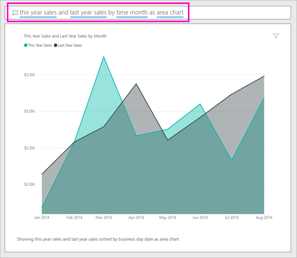

# Power BI 질문 및 답변으로 시각적 개체 만들기

경우에 따라 자연어를 사용하여 질문을 하면 가장 빠르게 사용자 데이터로 답변을 받을 수 있습니다.  이 문서에서는 동일한 시각화를 만드는 두 가지 방법(첫 번째는 질문 및 답변으로 질문하고 두 번째는 보고서에서 빌드)을 살펴봅니다. Power BI 서비스를 사용하여 보고서에서 시각적 개체를 만들지만, 프로세스는 Power BI Desktop을 사용할 때와 거의 동일합니다.

단계를 따르려면 편집할 수 있는 보고서를 사용해야 하므로 Power BI에 제공되는 샘플 중 하나를 사용하겠습니다.

## Q&A로 시각적 개체 만들기

질문 및 답변을 사용하여 이 꺾은선형 차트를 만들려면 어떻게 해야 하나요?

1. Power BI 작업 영역에서 **데이터 가져오기** \> **샘플** \> **소매점 분석 샘플** > **연결**을 선택하세요.

1. 소매점 분석 샘플 대시보드를 열고 질문 및 답변 상자에 커서를 놓은 다음, **데이터에 대해 질문**합니다.

    

2. 질문 및 답변 상자에 다음과 같은 질문을 입력합니다.
   
    **this year sales and last year sales by month as area chart**
   
    질문을 입력하면 질문 및 답변에서 답변을 표시하는 데 가장 적합한 시각화를 선택합니다. 그러면 질문을 수정할 때 시각화가 동적으로 변경됩니다. 또한 Q&A를 사용하면 제안, 자동 완성 및 맞춤법 수정을 통해 질문에 서식을 지정할 수 있습니다. 질문 및 답변에서 "this year sales and last year sales by *time month* as area chart"로 문구를 조금 변경할 것을 권장합니다.  

    

4. 문장을 선택하여 제안을 수락합니다. 
   
   질문 입력을 완료하면 대시보드에 표시되는 것과 동일한 차트가 생성됩니다.
   
   

4. 대시보드로 차트를 고정하려면 고정 아이콘을 선택합니다.  을 탭합니다.

## 보고서 편집기에서 시각적 개체 만들기

1. 소매점 분석 샘플 대시보드로 다시 이동합니다.
   
2. 대시보드에는 "Last Year Sales and This Year Sales"에 대한 동일한 영역 차트 타일이 포함되어 있습니다.  이 타일을 선택합니다. 질문 및 답변을 사용하여 만든 타일을 선택하지 않습니다. 선택하면 질문 및 답변이 열립니다. 원래 영역 차트 타일은 보고서에서 생성되었으므로 이 시각화를 포함하는 페이지로 보고서가 열립니다.

    

1. **보고서 편집**을 선택하여 편집용 보기에서 보고서를 엽니다.  보고서의 소유자가 아닌 경우 편집용 보기에서 보고서를 여는 옵션이 없습니다.
   
    
4. 영역형 차트를 선택하고 **필드** 창의 설정을 검토합니다.  보고서 작성자는 세 가지 값(**Sales** 테이블의 **Last Year Sales**와 **This Year Sales > Value** 및 **Time** 테이블의 **FiscalMonth**)을 선택하고 **축** 및 **값**에서 구성하여 이 차트를 작성했습니다.
   
    

    동일한 시각적 개체가 생성되었음을 확인할 수 있습니다. 이 방법으로 시각화를 만드는 것은 그다지 복잡하지 않습니다. 그러나 질문 및 답변을 사용하면 더 쉽게 만들 수 있습니다.

## 다음 단계

- [대시보드 및 보고서에서 Q&A 사용](power-bi-tutorial-q-and-a.md)  
- [소비자를 위한 Q&A](consumer/end-user-q-and-a.md)
- [Power BI의 질문 및 답변에서 데이터가 잘 작동하도록 설정](service-prepare-data-for-q-and-a.md)

궁금한 점이 더 있나요? [Power BI 커뮤니티를 이용하세요.](https://community.powerbi.com/)

