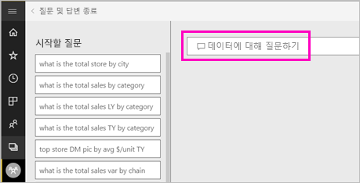

# Power BI Q&A를 사용하여 시각적 개체 만들기

경우에 따라 자연어를 사용하여 질문을 하면 가장 빠르게 사용자 데이터로 답변을 받을 수 있습니다. 이 문서에서, 동일한 시각화를 만드는 두 가지 다른 방법을 살펴봅니다. 먼저, 질문 및 답변에 질문하고 둘째, 보고서에서 작성하는 것입니다. 보고서에서 시각적 개체를 빌드하기 위해 Power BI 서비스를 이용하지만, 그 프로세스는 Power BI Desktop을 사용하므로 거의 동일합니다.

단계를 따르려면 편집할 수 있는 보고서를 사용해야 하므로 Power BI에 제공되는 샘플 중 하나를 사용하겠습니다.

## 질문 및 답변을 사용하여 시각적 개체 만들기

Q&A를 사용하여 이 꺾은선형 차트를 만드는 방법은 무엇인가요?

1. Power BI 작업 영역에서 **데이터 가져오기** \> **샘플** \> **소매점 분석 샘플** > **연결**을 선택하세요.

1. 소매점 분석 샘플 대시보드를 열고 질문 및 답변 상자의 **데이터에 대해 질문하기**에 커서를 놓습니다.

    

2. 질문과 대답 상자에 다음과 같은 질문을 입력합니다.
   
    **this year sales and last year sales by month as area chart**
   
    질문을 입력하면, 질문 및 답변에서 답변을 표시하는 데 가장 적합한 시각화를 선택합니다. 그리고 질문을 수정할 때 시각화가 동적으로 변경됩니다. 또한 Q&A를 사용하면 제안, 자동 완성 및 맞춤법 수정을 통해 질문에 서식을 지정할 수 있습니다. 질문 및 답변은 작은 단어 변경을 권장합니다. "this year sales and last year sales by time month as area chart".  

    

4. 제안을 수락하기 위해 문장을 선택합니다. 
   
   질문 입력을 완료하면, 결과는 대시보드에 표시되는 차트와 동일합니다.
   
   

4. 대시보드로 차트를 고정하려면, 오른쪽 위 모서리의 고정 아이콘 을 선택합니다.

## 보고서 편집기에서 시각적 개체 만들기

1. 소매점 분석 샘플 대시보드로 다시 이동합니다.
   
2. 대시보드는 "Last Year Sales and This Year Sales"에 대한 동일한 영역 차트 타일을 포함합니다. 이 타일을 선택합니다. Q&A를 사용하여 만든 타일을 선택하지 마세요. 그것을 선택하면 Q&A가 열립니다. 원래 영역 차트 타일은 보고서에서 생성되었으므로 보고서는 이 시각화를 포함하는 페이지로 열립니다.

    

1. **보고서 편집**을 선택하여 편집용 보기에서 보고서를 엽니다. 보고서의 소유자가 아닌 경우 편집용 보기에서 보고서를 여는 옵션이 없습니다.
   
    
4. 영역형 차트를 선택하고 **필드** 창의 설정을 검토합니다. 보고서 작성자는 다음 세 가지 값을 선택하여 이 차트를 작성했으며( **Sales** 테이블에서 **Last Year Sales** 와 **This Year Sales > Value** 및 **Time** 테이블에서 **FiscalMonth**) **축** 및 **값** 영역으로 끌기합니다.
   
    

    동일한 시각적 개체로 끝난 것을 확인할 수 있습니다. 이러한 방식은 아주 복잡하지 않습니다. 하지만 질문 및 답변을 사용하는 것이 더 쉽습니다!

## 다음 단계

- [대시보드 및 보고서에서 질문 및 답변 사용](power-bi-tutorial-q-and-a.md)  
- [소비자에 대한 질문과 답변](consumer/end-user-q-and-a.md)
- [Power BI의 질문 및 답변에서 데이터가 잘 작동하도록 설정](service-prepare-data-for-q-and-a.md)

궁금한 점이 더 있나요? [Power BI 커뮤니티를 이용하세요.](http://community.powerbi.com/)

