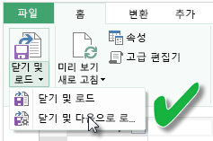
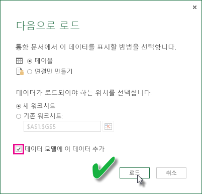

# 로컬 드라이브에 있는 Excel 통합 문서로부터 만들어진 데이터 세트 새로 고침
## 무엇이 지원되나요?
Power BI에서 지금 새로 고침 및 새로 고침 예약은 다음 데이터 원본에 연결하고 Excel 데이터 모델에 데이터를 로드하는 데 파워 쿼리(Excel 2016에서 데이터 가져오기 및 변환) 또는 파워 피벗을 사용하는 로컬 드라이브에서 가져온 Excel 통합 문서에서 만든 데이터 세트에 지원됩니다.  

### Power BI 게이트웨이 - 개인
* 파워 쿼리에 표시된 모든 온라인 데이터 원본.
* Hadoop 파일(HDFS) 및 Microsoft Exchange를 제외하고 파워 쿼리에 표시되는 모든 온-프레미스 데이터 원본.
* 파워 피벗에 표시된 모든 온라인 데이터 원본.\*
* Hadoop 파일(HDFS) 및 Microsoft Exchange를 제외하고 파워 피벗에 표시되는 모든 온-프레미스 데이터 원본.

<!-- Refresh Data sources-->
[!INCLUDE [refresh-datasources](./includes/refresh-datasources.md)]

> **참고:**  
> 
> * 게이트웨이는 Power BI가 온-프레미스 데이터 원본에 연결하고 데이터 세트를 새로 고치기 위해 설치되고 실행됩니다.
> * Excel 2013을 사용하여 Power Query를 최신 버전으로 업데이트하도록 합니다.
> * 데이터가 워크시트 또는 연결된 테이블에만 존재하는 로컬 드라이브에서 가져온 Excel 통합 문서에 새로 고침은 지원되지 않습니다. 새로 고침은 OneDrive에서 저장되고 가져온 경우 워크시트 데이터에 지원됩니다. 자세히 알아보려면 [OneDrive 또는 SharePoint Online에 있는 Excel 통합 문서로부터 만들어진 데이터 세트 새로 고침](refresh-excel-file-onedrive.md)을 참조하세요.
> * 로컬 드라이브에서 가져온 Excel 통합 문서에서 만든 데이터 세트를 새로 고칠 때 데이터 원본에서 쿼리된 데이터만 새로 고쳐집니다. Excel 또는 파워 피벗에서 데이터 모델의 구조를 변경하는 경우 예를 들어 새 측정값을 만들거나 열의 이름을 변경하면 해당 변경 내용은 데이터 세트에 복사되지 않습니다. 이러한 변경을 수행해도 통합 문서를 다시 업로드하거나 다시 게시해야 합니다. 통합 문서의 구조에 대한 일반 변경을 수행할 때 다시 업로드하지 않고 해당 사항을 Power BI의 데이터 세트에 반영하려면 OneDrive에 통합 문서를 배치하는 것이 좋습니다. Power BI는 OneDrive에서 저장하고 가져온 통합 문서에서 구조 및 워크시트 데이터를 모두 자동으로 새로 고칩니다.
> 
> 

## 데이터를 Excel 데이터 모델에 로드하려면 어떻게 해야 하나요?
파워 쿼리(Excel 2016에서 데이터 가져오기 및 변환)를 사용하여 데이터 원본에 연결할 때 데이터를 로드하기 위한 몇 가지 옵션이 있습니다. 데이터 모델에 데이터를 로드하려면 **에 로드** 대화 상자에서 **데이터 모델에 이 데이터 추가** 옵션을 선택해야 합니다.

> [!NOTE]
> 여기의 이미지는 Excel 2016을 보여줍니다.
> 
> 

**탐색기**에서 **...에 로드**를 클릭합니다.  
    

또는 탐색 창에서 **편집** 을 클릭하는 경우 쿼리 편집기를 엽니다. 여기서 **닫기 및 ...에 로드**를 클릭할 수 있습니다.  
    

그런 다음 **에 로드**에서 **데이터 모델에 이 데이터 추가**를 선택해야 합니다.  
    

### 파워 피벗에서 외부 데이터 가져오기를 사용할 경우 어떻게 되나요?
그러나 문제가 되지 않습니다. 파워 피벗을 사용하여 온-프레미스 또는 온라인 데이터 원본에서 데이터에 연결하고 쿼리할 때마다 데이터는 데이터 모델에 자동으로 로드됩니다.

## 새로 고침을 예약하려면 어떻게 해야 하나요?
새로 고침 일정을 설정하면 Power BI는 업데이트된 데이터에 대한 쿼리에 데이터 세트의 연결 정보 및 자격 증명을 사용하여 데이터 원본에 직접 연결한 다음, 업데이트된 데이터를 데이터 세트에 로드합니다. 또한 Power BI 서비스에 있는 데이터 세트에 기반한 보고서 및 대시보드의 모든 시각화는 업데이트됩니다.

새로 고침 예약을 설치하는 방법에 대한 세부 정보는 [새로 고침 예약 구성](refresh-scheduled-refresh.md)을 참조하세요.

## 오류가 발생할 때
무언가 잘못된 경우, 이는 일반적으로 Power BI가 데이터 원본에 로그인할 수 없기 때문이거나 데이터 세트가 온-프레미스 데이터 원본에 연결된 경우 게이트웨이가 오프라인 상태이기 때문입니다. Power BI가 데이터 원본에 로그인할 수 있는지 확인합니다. 데이터 소스에 로그인할 때 사용하는 암호를 변경하거나 Power BI가 데이터 원본에서 로그아웃된 경우, 데이터 원본 자격 증명에서 다시 데이터 원본에 로그인을 시도해야 합니다.

**새로 고침 실패 알림 전자 메일을 내게 보내기를 체크된 상태**로 남겨두어야 합니다. 예약된 새로 고침이 실패하는 경우 바로 알아야 합니다.

>[!IMPORTANT]
>새로 고침은 파워 피벗에 연결하고 쿼리된 OData 피드에 지원되지 않습니다. OData 피드를 데이터 원본으로 사용하는 경우 파워 쿼리를 사용합니다.

## 문제 해결
경우에 따라 데이터 새로 고침이 예상대로 진행되지 않을 수 있습니다. 일반적으로 이것은 게이트웨이와 관련된 문제입니다. 게이트웨이 문제 해결 문서에서 도구 및 알려진 문제를 살펴 보세요.

[온-프레미스 데이터 게이트웨이 문제 해결](service-gateway-onprem-tshoot.md)

[Power BI 게이트웨이 - 개인 문제 해결](service-admin-troubleshooting-power-bi-personal-gateway.md)

## 다음 단계
궁금한 점이 더 있나요? [Power BI 커뮤니티를 이용하세요.](http://community.powerbi.com/)

