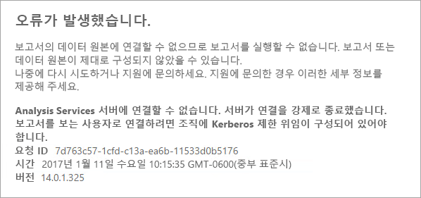
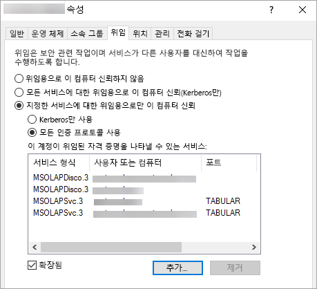

# <a name="configure-kerberos-to-use-power-bi-reports"></a>Power BI 보고서를 사용하도록 Kerberos 구성
<iframe width="640" height="360" src="https://www.youtube.com/embed/vCH8Fa3OpQ0?showinfo=0" frameborder="0" allowfullscreen></iframe>

분산된 환경의 경우 Power BI 보고서 내에서 사용된 데이터 소스에 Kerberos 인증을 위해 Report Server를 구성하는 방법을 알아봅니다.

Power BI Report Server는 Power BI 보고서를 호스트하는 기능을 포함합니다. 여러 데이터 원본은 보고서 서버에서 사용할 수 있습니다. 이 문서에서는 특히 SQL Server Analysis Services에 초점을 맞추지만 개념을 사용할 수 있으며 해당 사항을 SQL Server와 같은 다른 데이터 원본에 적용할 수 있습니다.

단일 컴퓨터에서 Power BI Report Server, SQL Server 및 Analysis Services를 설치할 수 있으며 추가 구성 없이 모든 항목이 작동해야 합니다. 이 기능은 테스트 환경에 적합합니다. 이러한 서비스를 분산된 환경이라는 별도 컴퓨터에 설치한 경우 오류가 발생할 수 있습니다. 이 환경에서는 Kerberos 인증을 사용해야 합니다. 이를 구현하는 데 필요한 구성이 없습니다. 

특히, 제한된 위임을 구성해야 합니다. Kerberos를 사용자 환경에 구성했지만 제한된 위임에 구성되지 않을 수 있습니다.

## <a name="error-running-report"></a>오류 실행 보고서
Report Server가 제대로 구성되지 않은 경우 다음과 같은 오류가 나타날 수 있습니다.

    Something went wrong.

    We couldn’t run the report because we couldn’t connect to its data source. The report or data source might not be configured correctly. 

기술 세부 정보 내에서 다음과 같은 메시지가 표시됩니다.

    We couldn’t connect to the Analysis Services server. The server forcibly closed the connection. To connect as the user viewing the report, your organization must have configured Kerberos constrained delegation.



## <a name="configuring-kerberos-constrained-delegation"></a>Kerberos 제한 위임 구성
Kerberos 제한 위임이 작동하기 위해 구성해야 하는 몇 가지 항목이 있습니다. 서비스 계정의 SPN(서비스 주체 이름) 및 위임 설정을 포함합니다.

> [!NOTE]
> SPN 및 위임 설정을 구성하려면 사용자가 도메인 관리자여야 합니다.
> 
> 

다음을 구성하거나 유효성을 검사해야 합니다.

1. Report Server 구성 내의 인증 형식
2. Report Server 서비스 계정의 SPN
3. Analysis Services 서비스의 SPN
4. Analysis Services 컴퓨터의 SQL Browser 서비스에 대한 SPN 명명된 인스턴스 전용입니다.
5. Report Server서비스 계정의 위임 설정

## <a name="authentication-type-within-report-server-configuration"></a>Report Server 구성 내의 인증 형식
Kerberos 제한 위임을 허용하도록 Report Server에 대한 인증 형식을 구성해야 합니다. 이 작업은 **rsreportserver.config** 파일 내에서 수행됩니다. 이 파일의 기본 위치는 `C:\Program Files\Microsoft Power BI Report Server\PBIRS\ReportServer`입니다.

rsreportserver.config 파일 내에서 **Authentication/AuthenticationTypes** 섹션을 찾습니다.

RSWindowsNegotiate가 표시되어 있고 인증 형식 목록에서 첫 번째인지 확인하려고 합니다. 다음과 유사하게 나타납니다.

```
<AuthenticationTypes>
    <RSWindowsNegotiate/>
    <RSWindowsNTLM/>
</AuthenticationTypes>
```

구성 파일을 변경해야 하는 경우 변경 내용이 적용되도록 Report Server를 중지하고 시작하려고 합니다.

자세한 내용은 [Report Server에서 Windows 인증 구성](https://docs.microsoft.com/sql/reporting-services/security/configure-windows-authentication-on-the-report-server)을 참조하세요.

## <a name="spns-for-the-report-server-service-account"></a>Report Server 서비스 계정의 SPN
다음으로, Report Server에서 유효한 SPN을 사용할 수 있는지 확인해야 합니다. 이 항목은 Report Server에 구성된 서비스 계정에 기반합니다.

### <a name="virtual-service-account-or-network-service"></a>가상 서비스 계정 또는 네트워크 서비스
Report Server를 가상 서비스 계정 또는 네트워크 서비스 계정에 대해 구성한 경우 작업을 수행할 필요가 없습니다. 컴퓨터 계정의 컨텍스트입니다. 컴퓨터 계정에는 기본적으로 HOST SPN이 있습니다. 이 항목은 HTTP 서비스를 처리하고 Report Server에서 사용됩니다.

컴퓨터 계정과 동일하지 않은 가상 서버 이름을 사용하는 경우 HOST 항목에서 처리하지 않고 가상 서버 호스트 이름의 SPN을 수동으로 추가해야 합니다.

### <a name="domain-user-account"></a>도메인 사용자 계정
Report Server가 도메인 사용자 계정을 사용하도록 구성된 경우 해당 계정에 HTTP SPN을 수동으로 만들어야 합니다. 이렇게 하려면 Windows와 함께 제공되는 setspn 도구를 사용합니다.

> [!NOTE]
> SPN을 만들기 위해 도메인 관리자 권한이 필요합니다.
> 
> 

두 개의 SPN을 만드는 것이 좋습니다. 하나는 NetBIOS 이름을 갖고 다른 하나는 FQDN(정규화된 도메인 이름)을 갖습니다. SPN은 다음과 같은 형식이어야 합니다.

    <Service>/<Host>:<port>

Power BI Report Server는 HTTP 서비스를 사용합니다. HTTP SPN의 경우 포트를 나열하지 않습니다. 여기에서 관심이 있는 서비스는 HTTP입니다. SPN의 호스트는 URL에서 사용하는 이름이 됩니다. 일반적으로 컴퓨터 이름입니다. 부하 분산 장치 뒤에 있다면 가상 이름일 수 있습니다.

> [!NOTE]
> 브라우저의 주소 표시줄에 입력한 내용을 보거나 웹 포털 URL 탭의 Report Server 구성 관리자에서 보면 URL을 확인할 수 있습니다.
> 
> 

컴퓨터 이름이 ContosoRS이면 SPN은 다음과 같습니다.

| SPN 형식 | SPN |
| --- | --- |
| FQDN(정규화된 도메인 이름) |HTTP/ContosoRS.contoso.com |
| NetBIOS |HTTP/ContosoRS |

### <a name="location-of-spn"></a>SPN 위치
그러면 SPN을 어디에 배치하나요? SPN은 서비스 계정에 사용하는 모든 항목에 배치됩니다. 가상 서비스 계정 또는 네트워크 서비스를 사용하는 위치는 경우 컴퓨터 계정이 됩니다. 앞에서 설명했지만 가상 URL에서 이 작업을 수행하기만 하면 됩니다. Report Server 서비스 계정에 도메인 사용자를 사용하는 경우 해당 도메인 사용자 계정에 SPN을 배치합니다.

예를 들어, 네트워크 서비스 계정을 사용하고 컴퓨터 이름이 ContosoRS인 경우 ContosoRS에 SPN을 배치합니다.

RSService라는 도메인 사용자 계정을 사용하는 경우 RSService에 SPN을 배치합니다.

### <a name="using-setspn-to-add-the-spn"></a>SetSPN을 사용하여 SPN 추가
SetSPN 도구를 사용하여 SPN을 추가할 수 있습니다. 컴퓨터 계정과 도메인 사용자 계정을 사용하여 위와 동일한 예제를 따릅니다.

FQDN과 NetBIOS SPN의 경우 컴퓨터 계정에 SPN을 배치하면 contosoreports라는 가상 URL을 사용하는 경우 다음과 비슷하게 표시됩니다.

      Setspn -a HTTP/contosoreports.contoso.com ContosoRS
      Setspn -a HTTP/contosoreports ContosoRS

FQDN과 NetBIOS SPN의 경우 도메인 사용자 계정에 SPN을 배치하면 SPN의 호스트에 컴퓨터 이름을 사용하는 경우 다음과 비슷하게 표시됩니다.

      Setspn -a HTTP/ContosoRS.contoso.com RSService
      Setspn -a HTTP/ContosoRS RSService

## <a name="spns-for-the-analysis-services-service"></a>Analysis Services 서비스의 SPN
Analysis Services의 SPN은 Power BI Report Server를 사용한 작업과 비슷합니다. 명명된 인스턴스가 있는 경우 SPN의 형식은 약간 다릅니다.

Analysis Services에서는 MSOLAPSvc.3이라는 서비스를 사용합니다. SPN에서 포트 위치의 인스턴스 이름을 지정합니다. SPN의 호스트 부분은 컴퓨터 이름 또는 클러스터 가상 이름입니다.

Analysis Services SPN의 예는 다음과 같습니다.

| 형식 | 형식 |
| --- | --- |
| 기본 인스턴스 |MSOLAPSvc.3/ContosoAS.contoso.com<br>MSOLAPSvc.3/ContosoAS |
| 명명된 인스턴스 |MSOLAPSvc.3/ContosoAS.contoso.com:INSTANCENAME<br>MSOLAPSvc.3/ContosoAS:INSTANCENAME |

SPN의 배치는 Power BI Report Server에 언급된 작업과 비슷합니다. 서비스 계정에 기반합니다.  로컬 시스템 또는 네트워크 서비스를 사용하는 경우 컴퓨터 계정의 컨텍스트입니다. Analysis Services 인스턴스에 도메인 사용자 계정을 사용하는 경우 해당 도메인 사용자 계정에 SPN을 배치합니다.

### <a name="using-setspn-to-add-the-spn"></a>SetSPN을 사용하여 SPN 추가
SetSPN 도구를 사용하여 SPN을 추가할 수 있습니다. 이 예제에서 컴퓨터 이름은 ContosoAS입니다.

FQDN과 NetBIOS SPN의 경우 컴퓨터 계정에 SPN을 배치하면 다음과 비슷하게 표시됩니다.

    Setspn -a MSOLAPSvc.3/ContosoAS.contoso.com ContosoAS
    Setspn -a MSOLAPSvc.3/ContosoAS ContosoAS

FQDN과 NetBIOS SPN의 경우 도메인 사용자 계정에 SPN을 배치하면 다음과 비슷하게 표시됩니다.

    Setspn -a MSOLAPSvc.3/ContosoAS.contoso.com OLAPService
    Setspn -a MSOLAPSvc.3/ContosoAS OLAPService

## <a name="spns-for-the-sql-browser-service"></a>SQL Browser 서비스의 SPN
Analysis Services 명명된 인스턴스가 있는 경우 브라우저 서비스의 SPN이 있는지 확인해야 합니다. Analysis Services에 대해 고유합니다.

SQL Browser의 SPN은 Power BI Report Server를 사용한 작업과 비슷합니다.

SQL Browser의 경우 MSOLAPDisco.3이라는 서비스를 사용합니다. SPN에서 포트 위치의 인스턴스 이름을 지정합니다. SPN의 호스트 부분은 컴퓨터 이름 또는 클러스터 가상 이름입니다.
인스턴스 이름 또는 포트에 대한 어떤 항목을 지정할 필요가 없습니다.

Analysis Services SPN의 예는 다음과 같습니다.

    MSOLAPDisco.3/ContosoAS.contoso.com
    MSOLAPDisco.3/ContosoAS

SPN의 배치는 Power BI Report Server에 언급된 작업과 비슷합니다. 여기서 차이점은 SQL Browser가 항상 로컬 시스템 계정으로 실행된다는 것입니다. 즉, 해당 SPN은 컴퓨터 계정에서 지속됩니다. 

### <a name="using-setspn-to-add-the-spn"></a>SetSPN을 사용하여 SPN 추가
SetSPN 도구를 사용하여 SPN을 추가할 수 있습니다. 이 예제에서 컴퓨터 이름은 ContosoAS입니다.

FQDN과 NetBIOS SPN의 경우 컴퓨터 계정에 SPN을 배치하면 다음과 비슷하게 표시됩니다.

    Setspn -a MSOLAPDisco.3/ContosoAS.contoso.com ContosoAS
    Setspn -a MSOLAPDisco.3/ContosoAS ContosoAS

자세한 내용은 [SQL Server Browser 서비스의 SPN이 필요합니다.](https://support.microsoft.com/kb/950599)를 참조하세요.

## <a name="delegation-settings-on-the-report-server-service-account"></a>Report Server 서비스 계정의 위임 설정
구성해야 하는 마지막 부분은 Report Server 서비스 계정에 대한 위임 설정입니다. 다른 도구를 사용하여 이러한 단계를 수행할 수 있는 있습니다. 이 문서에서는 Active Directory 사용자 및 컴퓨터에 대해 설명하겠습니다.

Active Directory 사용자 및 컴퓨터 내에서 Report Server 서비스 계정의 속성으로 이동하여 시작합니다. 가상 서비스 계정 또는 네트워크 서비스를 사용했거나 도메인 사용자 계정인 경우 컴퓨터 계정입니다.

프로토콜 전송을 사용하여 제한된 위임을 구성하려고 합니다. 제한된 위임을 사용하여 위임하려고 하는 서비스를 노출해야 합니다. Analysis Services 서비스 SPN 및 SQL Browser SPN을 Power BI Report Server가 위임할 수 있는 목록에 추가합니다.

1. Report Server 서비스 계정을 마우스 오른쪽 단추로 클릭하고 **속성**을 선택합니다.
2. **위임** 탭을 선택합니다.
3. **지정한 서비스에 대한 위임의 경우 이 컴퓨터 신뢰**를 선택합니다.
4. **모든 인증 프로토콜 사용**을 선택합니다.
5. **이 계정이 위임된 자격 증명을 표시할 수 있는 서비스**에서 **추가**를 선택합니다.
6. 새 대화 상자에서 **사용자 또는 컴퓨터**를 선택합니다.
7. Analysis Services 서비스의 서비스 계정을 입력하고 **확인**을 선택합니다.
8. 만든 SPN을 선택합니다. `MSOLAPSvc.3`로 시작합니다. FQDN 및 NetBIOS SPN 모두를 추가한 경우 둘 다 선택합니다. 하나만 표시될 수 있습니다.
9. **확인**을 선택합니다.  이제 목록에서 SPN이 표시됩니다.
10. 경우에 따라 **확장됨**을 선택하여 목록에서 FQDN과 NetBIOS SPN을 모두 표시할 수 있습니다.
11. **추가**를 다시 선택합니다. 이제 SQL Browser SPN을 추가합니다.
12. 새 대화 상자에서 **사용자 또는 컴퓨터**를 선택합니다.
13. SQL Browser 서비스를 사용하는 컴퓨터의 컴퓨터 이름을 입력하고 **확인**을 선택합니다.
14. 만든 SPN을 선택합니다. `MSOLAPDisco.3`로 시작합니다. FQDN 및 NetBIOS SPN 모두를 추가한 경우 둘 다 선택합니다. 하나만 표시될 수 있습니다.
15. **확인**을 선택합니다. **확장됨**을 선택한 경우 대화 상자는 다음과 유사하게 표시됩니다.
    
    
16. **확인**을 선택합니다.
17. Power BI Report Server를 다시 부팅합니다.

## <a name="running-a-power-bi-report"></a>Power BI 보고서 실행
위의 구성이 모두 배치되면 보고서가 제대로 표시되어야 합니다. 


대부분의 경우 이 구성이 Kerberos를 사용하여 작동하는 반면 사용자 환경에 따라 다른 구성이 있을 수 있습니다. 보고서가 로드되지 않은 경우 도메인 관리자에게 알려서 추가로 조사하거나 지원을 문의합니다.

## <a name="next-steps"></a>다음 단계
[관리자 개요](admin-handbook-overview.md)  
[Power BI Report Server 설치](install-report-server.md)  

궁금한 점이 더 있나요? [Power BI 커뮤니티에 질문합니다.](https://community.powerbi.com/)

