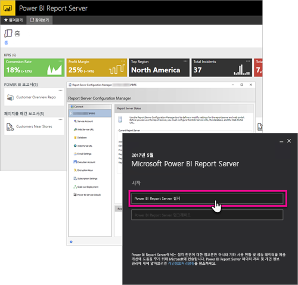

# 개발자 안내서 개요, Power BI Report Server
Power BI, 모바일, 페이지가 매겨진 보고서 및 KPI를 보고, 저장하고 관리하는 온-프레미스 위치인 Power BI Report Server의 개발자 안내서를 시작합니다.

이 안내서는 개발자로서 Power BI Report Server를 사용해야 하는 옵션을 강조 표시합니다.

## 포함
URL에 쿼리 문자열 매개 변수 `?rs:Embed=true`를 추가하여 Power BI Report Server 내의 보고서를 iFrame 내에 포함할 수 있습니다. 다른 보고서 형식뿐만 아니라 Power BI 보고서에서도 작동합니다.

### 보고서 뷰어 컨트롤
페이지가 매겨진 보고서에서 보고서 뷰어 컨트롤을 활용할 수 있습니다. 이를 통해 .NET 창 또는 웹 응용 프로그램 내에 컨트롤을 배치할 수 있습니다. 자세한 내용은 [보고서 뷰어 컨트롤 시작](https://docs.microsoft.com/sql/reporting-services/application-integration/integrating-reporting-services-using-reportviewer-controls-get-started)을 참조하세요.

## API
Power BI Report Server를 조작하는 몇 가지 API 옵션이 있습니다. 다음 항목이 포함됩니다.

* [REST API](rest-api.md)
* [URL 액세스](https://docs.microsoft.com/sql/reporting-services/url-access-ssrs)
* [WMI 공급자](https://docs.microsoft.com/sql/reporting-services/wmi-provider-library-reference/reporting-services-wmi-provider-library-reference-ssrs)

오픈 소스 [PowerShell 유틸리티](https://github.com/Microsoft/ReportingServicesTools)를 사용하여 Report Server를 관리할 수도 있습니다.

> [!NOTE]
> 현재 PowerShell 유틸리티는 Power BI Desktop 파일(.pbix)을 지원하지 않습니다.
> 
> 

## 사용자 지정 확장
확장 라이브러리는 Power BI Report Server에 포함된 일련의 클래스, 인터페이스 및 값 형식입니다. 이 라이브러리는 시스템 기능에 대한 액세스 권한을 제공하고 Power BI Report Server 구성 요소를 확장하는 데 Microsoft .NET Framework 응용 프로그램을 사용할 수 있는 기반으로 설계되었습니다.

여러 종류의 확장을 빌드할 수 있습니다.

* 데이터 처리 확장
* 배달 확장
* 페이지가 매겨진 보고서의 확장 렌더링
* 보안 확장

자세한 내용은 [확장 라이브러리](https://docs.microsoft.com/sql/reporting-services/extensions/reporting-services-extension-library)을 참조하세요.

## 다음 단계
[보고서 뷰어 컨트롤 시작](https://docs.microsoft.com/sql/reporting-services/application-integration/integrating-reporting-services-using-reportviewer-controls-get-started)  
[웹 서비스 및 .NET Framework를 사용하여 응용 프로그램 빌드](https://docs.microsoft.com/sql/reporting-services/report-server-web-service/net-framework/building-applications-using-the-web-service-and-the-net-framework)  
[URL 액세스](https://docs.microsoft.com/sql/reporting-services/url-access-ssrs)  
[확장 라이브러리](https://docs.microsoft.com/sql/reporting-services/extensions/reporting-services-extension-library)  
[WMI 공급자](https://docs.microsoft.com/sql/reporting-services/wmi-provider-library-reference/reporting-services-wmi-provider-library-reference-ssrs)

궁금한 점이 더 있나요? [Power BI 커뮤니티에 질문합니다.](https://community.powerbi.com/)

