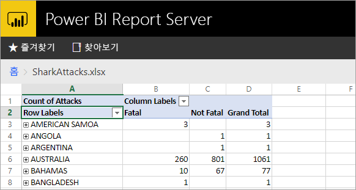
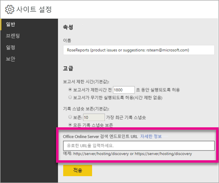

# <a name="configure-your-report-server-to-host-excel-workbooks-using-office-online-server-oos"></a>OOS(Office Online Server)를 사용하여 Excel 통합 문서를 호스트하도록 보고서 서버 구성
웹 포털에서 Power BI 보고서를 보는 것 외에도 Power BI Report Server에서는 OOS([Office Online Server](https://docs.microsoft.com/officeonlineserver/office-online-server-overview))를 사용하여 Excel 통합 문서를 호스트할 수 있습니다. 보고서 서버가 셀프 서비스 Microsoft BI 콘텐츠를 게시하고 볼 수 있는 단일 위치가 됩니다.



## <a name="prepare-server-to-run-office-online-server"></a>Office Online Server를 실행하기 위한 서버 준비
Office Online 서버를 실행하게 되는 서버에서 이러한 절차를 수행합니다. 이 서버는 Windows Server 2012 R2 또는 Windows Server 2016이어야 합니다. Windows Server 2016은 Office Online Server 2017년 4월 이상이 필요합니다.

### <a name="install-prerequisite-software-for-office-online-server"></a>Office Online Server를 위한 필수 구성 요소 소프트웨어 설치
1. 관리자로 Windows PowerShell 프롬프트를 열고 이 명령을 실행하여 필요한 역할 및 서비스를 설치합니다.
   
    **Windows Server 2012 R2:**
   
    ```
    Add-WindowsFeature Web-Server,Web-Mgmt-Tools,Web-Mgmt-Console,Web-WebServer,Web-Common-Http,Web-Default-Doc,Web-Static-Content,Web-Performance,Web-Stat-Compression,Web-Dyn-Compression,Web-Security,Web-Filtering,Web-Windows-Auth,Web-App-Dev,Web-Net-Ext45,Web-Asp-Net45,Web-ISAPI-Ext,Web-ISAPI-Filter,Web-Includes,InkandHandwritingServices,NET-Framework-Features,NET-Framework-Core,NET-HTTP-Activation,NET-Non-HTTP-Activ,NET-WCF-HTTP-Activation45,Windows-Identity-Foundation,Server-Media-Foundation
    ```
   
    **Windows Server 2016:**
   
    ```
    Add-WindowsFeature Web-Server,Web-Mgmt-Tools,Web-Mgmt-Console,Web-WebServer,Web-Common-Http,Web-Default-Doc,Web-Static-Content,Web-Performance,Web-Stat-Compression,Web-Dyn-Compression,Web-Security,Web-Filtering,Web-Windows-Auth,Web-App-Dev,Web-Net-Ext45,Web-Asp-Net45,Web-ISAPI-Ext,Web-ISAPI-Filter,Web-Includes,NET-Framework-Features,NET-Framework-45-Features,NET-Framework-Core,NET-Framework-45-Core,NET-HTTP-Activation,NET-Non-HTTP-Activ,NET-WCF-HTTP-Activation45,Windows-Identity-Foundation,Server-Media-Foundation
    ```
   
    메시지가 표시되면 서버를 다시 시작합니다.
2. 다음 소프트웨어를 설치합니다.
   
   * [.NET Framework 4.5.2](https://go.microsoft.com/fwlink/p/?LinkId=510096)
   * [Visual Studio 2013용 Visual C++ 재배포 가능 패키지](https://www.microsoft.com/download/details.aspx?id=40784)
   * [Visual Studio 2015용 Visual C++ 재배포 가능 패키지](https://go.microsoft.com/fwlink/p/?LinkId=620071)
   * [Microsoft.IdentityModel.Extention.dll](https://go.microsoft.com/fwlink/p/?LinkId=620072)

### <a name="install-office-online-server"></a>Office Online Server 설치
외부 데이터 액세스(예: 파워 피벗)를 사용하는 Excel Online 기능을 사용하려는 경우 Office Online Server가 Windows 기반 인증을 사용하여 액세스하려는 외부 데이터 원본과 함께 사용자의 것과 동일한 Active Directory 포리스트에 있어야 합니다.

1. [VLSC(Volume Licensing Service Center)](http://go.microsoft.com/fwlink/p/?LinkId=256561)에서 Office Online Server를 다운로드합니다. 다운로드는 VLSC 포털에서 이러한 Office 제품 아래에 있습니다. 개발 목적으로 MSDN 구독자 다운로드에서 OOS를 다운로드할 수 있습니다.
2. Setup.exe를 실행합니다.
3. **Microsoft 소프트웨어 사용 조건 읽기** 페이지에서 **동의함**을 선택하고 **계속**을 선택합니다.
4. **파일 위치 선택** 페이지에서 Office Online Server 파일을 설치할 폴더를 선택(예: *C:\Program Files\Microsoft Office Web Apps*)하고 **지금 설치**를 선택합니다. 지정한 폴더가 존재하지 않으면 Setup에서 해당 폴더를 만듭니다.
   
    시스템 드라이브에 Office Online Server를 설치하는 것이 좋습니다.
5. Setup에서 Office Online Server 설치를 완료하면 **닫기**를 선택합니다.

### <a name="install-language-packs-for-office-web-apps-server-optional"></a>Office Web Apps Server를 위한 언어 팩 설치(선택 사항)
Office Online 서버 언어 팩을 사용하면 사용자가 웹 기반 Office 파일을 다국어로 볼 수 있습니다.

언어 팩을 설치하려면 다음 단계를 수행합니다.

1. [Microsoft 다운로드 센터](http://go.microsoft.com/fwlink/p/?LinkId=798136)에서 Office Online Server 언어 팩을 다운로드합니다.
2. **wacserverlanguagepack.exe**를 실행합니다.
3. Office Online Server 언어 팩 마법사의 **Microsoft 소프트웨어 사용 조건 읽기** 페이지에서 **동의함**을 선택하고 **계속**을 선택합니다.
4. Setup에서 Office Online Server 설치를 완료하면 **닫기**를 선택합니다.

## <a name="deploy-office-online-server"></a>Office Online Server 배포
### <a name="create-the-office-online-server-farm-https"></a>Office Online Server 팜(HTTPS) 만들기
New-OfficeWebAppsFarm 명령을 사용하여 다음 예제에 나온 대로 단일 서버로 구성된 새 Office Online Server 팜을 만듭니다.

```
New-OfficeWebAppsFarm -InternalUrl "https://server.contoso.com" -ExternalUrl "https://wacweb01.contoso.com" -CertificateName "OfficeWebApps Certificate"
```

**매개 변수**

* **– InternalURL**은 http://servername.contoso.com과 같은 Office Online Server를 실행하는 서버의 FQDN(정규화된 도메인 이름)입니다.
* **–ExternalURL**은 인터넷에서 액세스할 수 있는 FQDN입니다.
* **–CertificateName**은 인증서의 식별 이름입니다.

### <a name="create-the-office-online-server-farm-http"></a>Office Online Server 팜(HTTP) 만들기
New-OfficeWebAppsFarm 명령을 사용하여 다음 예제에 나온 대로 단일 서버로 구성된 새 Office Online Server 팜을 만듭니다.

```
New-OfficeWebAppsFarm -InternalURL "http://servername" -AllowHttp
```

**매개 변수**

* **–InternalURL**은 http://servername과 같은 Office Online Server를 실행하는 서버의 이름입니다.
* **-AllowHttp**는 HTTP를 사용하도록 팜을 구성합니다.

### <a name="verify-that-the-office-online-server-farm-was-created-successfully"></a>Office Online Server 팜이 성공적으로 만들어졌는지 확인합니다.
팜이 만들어진 후 팜에 대한 세부 정보가 Windows PowerShell 프롬프트에 표시됩니다. Office Online Server가 올바르게 설치 및 구성되어 있는지 확인하려면 다음 예에서 같이 웹 브라우저를 사용하여 Office Online Server 검색 URL에 액세스합니다. 검색 URL은 *InternalUrl* Office Online Server 팜을 구성할 때 사용자가 지정한 매개 변수로, 뒤에 */hosting/discovery*가 옵니다.

```
<InternalUrl>/hosting/discovery
```

Office Online Server가 예상대로 작동하는 경우 WOPI(웹 응용 프로그램 열기 플랫폼 인터페이스 프로토콜) 검색 XML 파일이 웹 브라우저에 표시됩니다. 해당 파일의 처음 몇 줄은 다음 예제와 유사합니다.

```
<?xml version="1.0" encoding="utf-8" ?> 
- <wopi-discovery>
- <net-zone name="internal-http">
- <app name="Excel" favIconUrl="<InternalUrl>/x/_layouts/images/FavIcon_Excel.ico" checkLicense="true">
<action name="view" ext="ods" default="true" urlsrc="<InternalUrl>/x/_layouts/xlviewerinternal.aspx?<ui=UI_LLCC&><rs=DC_LLCC&>" /> 
<action name="view" ext="xls" default="true" urlsrc="<InternalUrl>/x/_layouts/xlviewerinternal.aspx?<ui=UI_LLCC&><rs=DC_LLCC&>" /> 
<action name="view" ext="xlsb" default="true" urlsrc="<InternalUrl>/x/_layouts/xlviewerinternal.aspx?<ui=UI_LLCC&><rs=DC_LLCC&>" /> 
<action name="view" ext="xlsm" default="true" urlsrc="<InternalUrl>/x/_layouts/xlviewerinternal.aspx?<ui=UI_LLCC&><rs=DC_LLCC&>" /> 
```

### <a name="configure-excel-workbook-maximum-size"></a>Excel 통합 문서에 대한 최대 크기 구성
Power BI Report Server의 모든 파일에 대한 최대 파일 크기는 100MB입니다. 동기화를 유지하려면 OOS에서 수동으로 설정해야 합니다.

```
Set-OfficeWebAppsFarm -ExcelWorkbookSizeMax 100
```

## <a name="using-effectiveusername-with-analysis-services"></a>Analysis Services와 함께 EffectiveUserName 사용
EffectiveUserName을 사용하는 Excel 통합 문서 내 연결을 위해 Analysis Services에 대한 라이브 연결을 허용하기 위함입니다. EffectiveUserName을 사용하기 위한 OOS의 경우 OOS 서버의 컴퓨터 계정을 Analysis Services 인스턴스에 대한 관리자로 추가해야 합니다. 이 작업을 수행하려면 SQL Server 2016용 Management Studio 이상이 필요합니다.

현재 포함된 Analysis Services 연결만 Excel 통합 문서 내에서 지원됩니다. 사용자의 계정에는 사용자를 프록시하는 기능을 사용할 수 없으므로 Analysis Services에 연결할 수 있는 권한이 있어야 합니다.

OOS Server에서 다음 PowerShell명령을 실행합니다.

```
Set-OfficeWebAppsFarm -ExcelUseEffectiveUserName:$true
Set-OfficeWebAppsFarm -ExcelAllowExternalData:$true
Set-OfficeWebAppsFarm -ExcelWarnOnDataRefresh:$false
```

## <a name="configure-a-power-pivot-instance-for-data-models"></a>데이터 모델에 대한 파워 피벗 인스턴스 구성
Analysis Services 파워 피벗 모드 인스턴스를 설치하면 파워 피벗을 사용하는 Excel 통합 문서를 사용할 수 있습니다. 인스턴스 이름이 *POWERPIVOT*인지 확인합니다. OOS 서버의 컴퓨터 계정을 Analysis Services 파워 피벗 모드 인스턴스에 대한 관리자로 추가합니다. 이 작업을 수행하려면 SQL Server 2016용 Management Studio 이상이 필요합니다.

OOS가 파워 피벗 모드 인스턴스를 사용하도록 다음 명령을 실행합니다.

```
New-OfficeWebAppsExcelBIServer -ServerId <server_name>\POWERPIVOT
```

위의 Analysis Services 단계에서 아직 외부 데이터를 허용하지 않은 경우 다음 명령을 실행합니다.

```
Set-OfficeWebAppsFarm -ExcelAllowExternalData:$true
```

### <a name="firewall-considerations"></a>방화벽 고려 사항
방화벽 문제를 방지하기 위해 포트 2382와 2383를 열어야 할 수도 있습니다. 또한 응용 프로그램 방화벽 정책으로 파워 피벗 인스턴스에 대해 *msmdsrv.exe*를 추가할 수 있습니다.

## <a name="configure-power-bi-report-server-to-use-the-oos-server"></a>OOS Server를 사용하도록 Power BI Report Server 구성
**사이트 설정**의 **일반** 페이지에서 OOS 검색 URL을 입력합니다. OOS 검색 URL은 OOS Server를 배포할 때 사용된 *InternalUrl*로, 뒤에 */hosting/discovery*가 옵니다. 예를 들어 HTTP에 대해서는 `http://servername/hosting/discovery`입니다. 또한 HTTPS에 대해서는 `https://server.contoso.com/hosting/discovery`입니다.

**사이트 설정**으로 이동하려면 오른쪽 위에 있는 **기어 아이콘**을 선택하고 **사이트 설정**을 선택합니다.

**시스템 관리자** 역할이 있는 사용자에게만 Office Onlien Server 검색 URL 설정이 표시됩니다.



검색 URL을 입력하고 **적용**을 선택한 후, 웹 포털 내에서 Excel 통합 문서를 선택하면 웹 포털 내에서 통합 문서가 표시됩니다.

## <a name="limitations-and-considerations"></a>제한 사항 및 고려 사항
* Power BI Report Server 내에서 Excel 통합 문서를 볼 수 있는 기능은 현재 미리 보기로 제공됩니다.
* 통합 문서로 읽기 전용 기능만 사용할 수 있습니다.

## <a name="next-steps"></a>다음 단계
[관리자 안내서](admin-handbook-overview.md)  
[빠른 시작: Power BI Report Server 설치](quickstart-install-report-server.md)  
[보고서 작성기 설치](https://docs.microsoft.com/sql/reporting-services/install-windows/install-report-builder)  
[SSDT(SQL Server Data Tools) 다운로드](http://go.microsoft.com/fwlink/?LinkID=616714)

궁금한 점이 더 있나요? [Power BI 커뮤니티에 질문합니다.](https://community.powerbi.com/)

