# 자습서: VM에서 Power BI Report Server 웹 포털 탐색
이 자습서에서는 샘플 Power BI 및 페이지를 매긴 보고서와 KPI를 표시, 편집 및 관리해 볼 수 있도록 Power BI Report Server가 이미 설치된 Azure 가상 머신을 만듭니다.

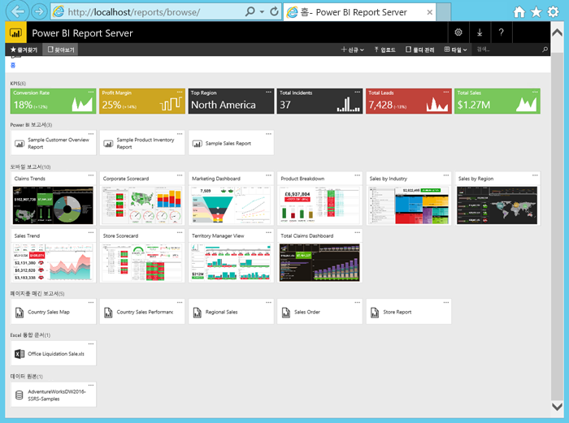

다음은 이 자습서에서 수행할 작업입니다.

> [!div class="checklist"]
> * VM 만들기 및 연결
> * Power BI Report Server 웹 포털 시작 및 탐색
> * 즐겨찾기 항목 태그 지정
> * Power BI 보고서 보기 및 편집
> * 페이지를 매긴 보고서 보기, 관리 및 편집
> * Excel Online에서 Excel 통합 문서 보기

이 자습서를 사용하려면 Azure 구독이 필요합니다. 구독이 없는 경우 시작하기 전에 [체험 계정](https://azure.microsoft.com/free/?WT.mc_id=A261C142F)을 만드세요.

## Power BI Report Server VM 만들기

다행히 Power BI 팀은 Power BI Report Server가 설치되어 제공되는 VM을 만들었습니다.

1. Azure Marketplace에서 Power BI Report Server를 선택 합니다. 이 링크가 직접 열립니다. [Power BI Report Server](https://azuremarketplace.microsoft.com/marketplace/apps/reportingservices.technical-preview?tab=Overview)합니다.  

2. **지금 받기**를 선택합니다.
3. 공급자의 사용 약관 및 개인 정보 취급 방침에 동의하려면 **계속**을 선택합니다.

4. **만들기**를 선택합니다.

    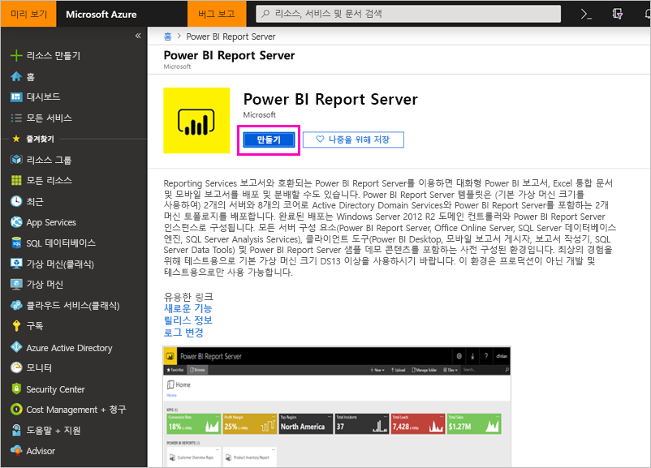

5. **1 단계의 기본 사항**에 대 한 **VM 이름**, 호출할 **reportservervm**합니다.

    Power BI 보고서 서버 VM 이름 대시를 포함할 수 없습니다.

5. 사용자 이름 및 암호를 만듭니다.

6. 에 대 한 **리소스 그룹**를 선택 **새로 만들기**를 호출 하 고 **reportserverresourcegroup** > **확인**합니다.

    이 자습서를 두 번 이상 진행하는 경우 두 번째에는 리소스 그룹에 다른 이름을 지정해야 합니다. 하나의 구독에 동일한 리소스 그룹 이름을 두 번 사용할 수 없습니다. 

    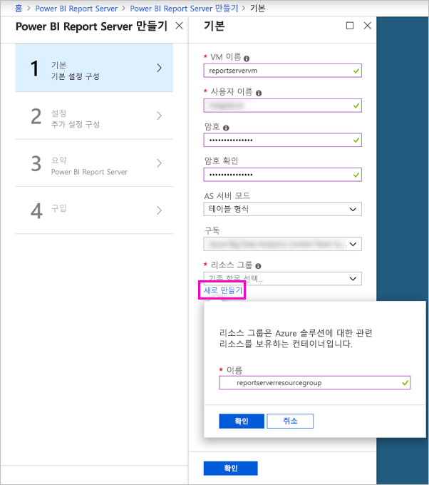

7. 다른 기본값을 유지한 다음, **확인**을 선택합니다.

8. **단계 2 설정**, 기본값을 그대로 유지 > **확인**합니다.
 
    합니다 **SQL Storage 계정** 하 고 **진단 저장소 계정** 값도 고유 해야 합니다. 이 자습서를 통해 두 번 이상 이동 하는 경우 다른 이름을 지정 해야 합니다.

9. **단계 3 요약**, 선택 항목 검토 > **확인**합니다.

10. **단계 4 구입**, 사용자 및 개인정보 처리 방침 약관을 검토할 > **만들기**합니다.

    합니다 **Power BI Report Server에 대 한 배포 제출 중** 프로세스는 몇 분 정도 걸릴 수 있습니다.

## 가상 머신에 연결

1. Azure 왼쪽 탐색 창에서 **가상 머신**을 선택합니다. 

2. **이름으로 필터링** 상자에 “보고서”를 입력합니다. 

3. 이름이 **REPORTSERVERVM**인 VM을 선택합니다.

    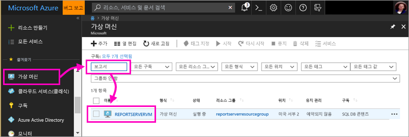

4. REPORTSERVERVM 가상 머신 아래에서 **연결**을 선택합니다.

    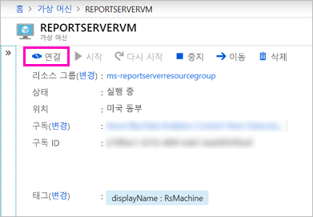

5. 에 **가상 컴퓨터에 연결** 기본값을 그대로 유지 하 고 선택 하는 창 **RDP 파일 다운로드**합니다.

1. 에 **원격 데스크톱 연결** 대화 상자에서 **Connect**합니다.

6. VM에 대해 만든 이름 및 암호를 입력한 다음, **확인**을 선택합니다.

7. 다음 대화 상자 표시 **원격 컴퓨터의 id를 식별할 수 없는**합니다. **예**를 선택합니다.

   새 VM이 열립니다.

## VM의 Power BI Report Server

VM이 열리면 다음 항목이 데스크톱에 표시됩니다.

|숫자  |의미  |
|---------|---------|
| | 샘플 Power BI(.PBIX) 보고서 |
| | Power BI Report Server 설명서에 대한 링크 |
| | Power BI Report Server (2019 년 1 월)에 대 한 액세스에 최적화 된 Power BI Desktop 시작 |
| | 브라우저에서 Power BI Report Server 웹 포털 열기 |
| | 페이지를 매긴(.RDL) 보고서를 만들기 위한 SQL Server Data Tools 시작 |

**보고서 서버 웹 포털** 아이콘을 두 번 클릭합니다. 브라우저에서 `http://localhost/reports/browse`가 열립니다. 웹 포털에서 유형별로 그룹화된 다양한 파일이 표시됩니다. 

|숫자  |의미  |
|---------|---------|
| | 웹 포털에서 만들어진 KPI |
| |  Power BI(.PBIX) 보고서  |
| | SQL Server 모바일 보고서 게시자에서 만들어진 모바일 보고서  |
| |  보고서 작성기 또는 SQL Server Data Tools에서 만들어진 페이지를 매긴 보고서  |
| | Excel 통합 문서   | 
| | 페이지를 매긴 보고서의 데이터 원본 | 

## 즐겨찾기 태그 지정
즐겨찾기에 추가하려는 보고서 및 KPI를 태그로 지정할 수 있습니다. 웹 포털 및 Power BI 모바일 앱 모두에서 단일 즐겨찾기 폴더에 수집되기 때문에 쉽게 찾을 수 있습니다. 

1. **Profit Margin** KPI > **즐겨찾기에 추가**의 오른쪽 위 모서리에서 줄임표( **…** )를 선택합니다.
   
    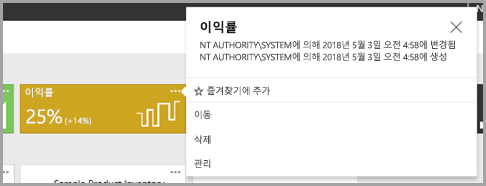
2. 웹 포털의 즐겨찾기 페이지에서 다른 즐겨찾기와 함께 보려는 **즐겨찾기**를 웹 포털 리본에서 선택합니다.
   
    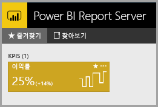

3. **찾아보기**를 선택하여 웹 포털로 돌아갑니다.
   
## 목록 보기에서 항목 보기
기본적으로 웹 포털은 타일 보기에 해당 콘텐츠를 표시합니다.

한 번에 여러 항목을 쉽게 이동하거나 삭제하는 목록 보기로 전환할 수 있습니다. 

1. **타일** > **목록**을 선택합니다.
   
    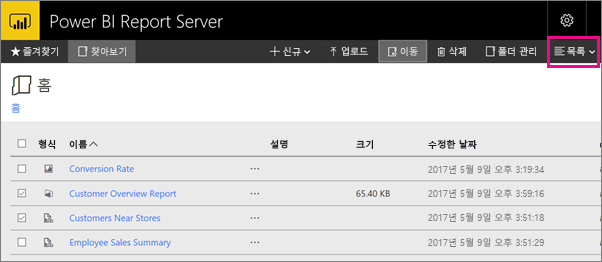

2. 타일 보기로 돌아갑니다. **목록** > **타일**을 선택합니다.

## Power BI 보고서

웹 포털에서 Power BI 보고서를 보고 조작하고 웹 포털에서 바로 Power BI Desktop을 시작할 수 있습니다.

### 새 Power BI 보고서

1. **Power BI 보고서** 아래 웹 포털에서 **샘플 고객 개요 보고서**를 선택합니다. 보고서가 브라우저에서 열립니다.

1. 트리 맵에서 미국 블록을 선택하여 다른 시각적 개체의 관련 값을 강조 표시하는 방법을 확인합니다.

    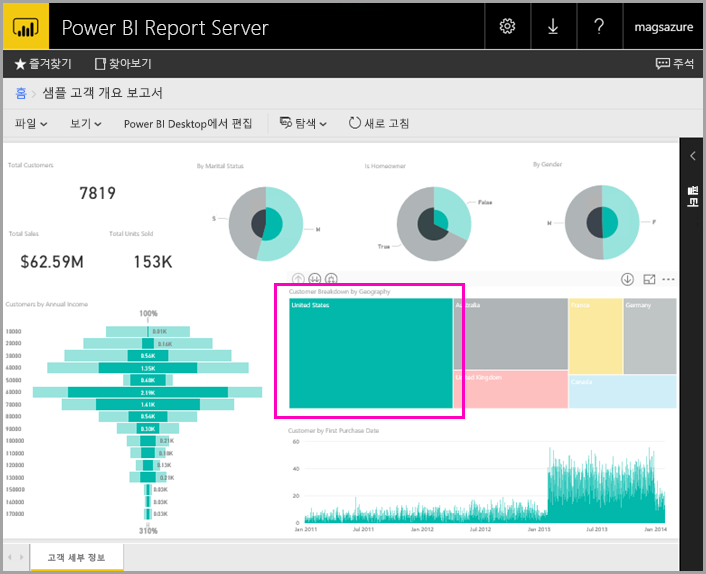

### Power BI Desktop에서 편집

1. **Power BI Desktop에서 편집**을 선택합니다.

1. **허용**을 선택하여 이 웹 사이트가 컴퓨터에서 프로그램을 열도록 허용합니다. 

     보고서가 Power BI Desktop에서 열립니다. 위쪽 막대에서 "Power BI Desktop (2019 년 1 월)"에서 이름을 note 합니다. Power BI Report Server에 최적화된 버전입니다.

    VM에 설치된 Power BI Desktop의 버전을 사용합니다. 도메인 간 이동하여 보고서를 업로드할 수 없습니다.

3. [필드] 창에서 Customers 테이블을 확장하고 직업 필드를 보고서 수준 필터로 끌어옵니다.

    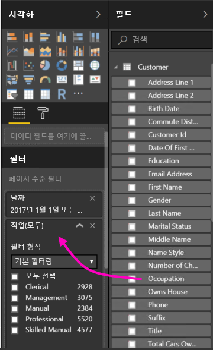

1. 보고서를 저장합니다.

1. 브라우저에서 보고서로 돌아가서 브라우저 **새로 고침** 아이콘을 선택합니다.

    

8. 오른쪽의 **필터** 창을 확장하여 추가한 **직업** 필터를 확인합니다. **전문가**를 선택합니다.

    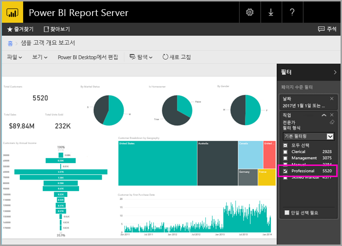

3. **찾아보기**를 선택하여 웹 포털로 돌아갑니다.

## 페이지를 매긴(.RDL) 보고서

웹 포털에서 페이지를 매긴 보고서를 보고 관리하고 보고서 작성기를 시작할 수 있습니다.

### 페이지를 매긴 보고서 관리

1. **페이지를 매긴 보고서** 아래 웹 포털에서 **판매 주문** > **관리** 옆에 있는 줄임표(...)를 선택합니다.

1. **매개 변수**를 선택하고 **SalesOrderNumber**의 기본값을 **SO50689**로 변경하고  >  **적용**을 선택합니다.

   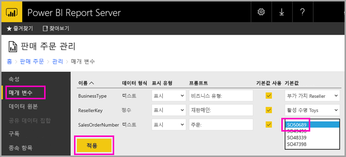

3. **찾아보기**를 선택하여 웹 포털로 돌아갑니다.

### 페이지를 매긴 보고서 보기

1. 웹 포털에서 **판매 주문**을 선택합니다.
 
3.  보고서가 설정한 **Order** 매개 변수, **SO50689**로 열립니다. 

    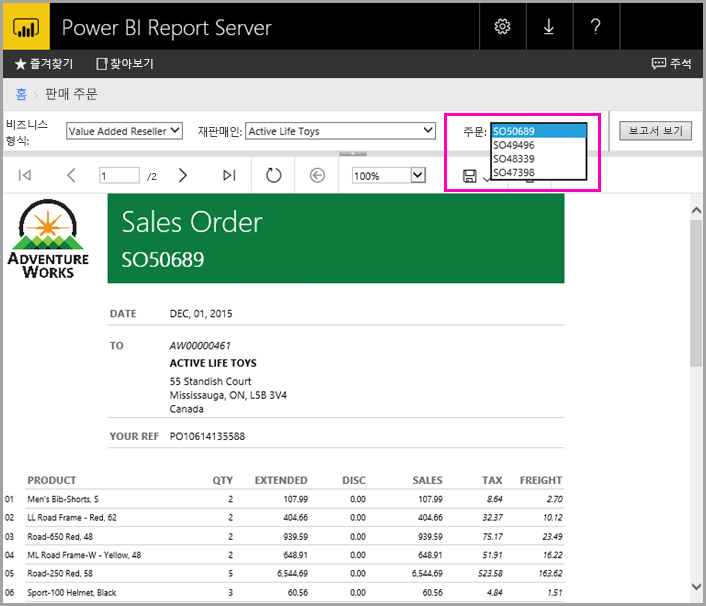

    기본값을 변경하지 않고 여기서 다른 매개 변수와 함께 해당 매개 변수를 변경할 수 있습니다.

1. **Order** **SO48339** > **보고서 보기**를 선택합니다.

4. 이는 2페이지 중 1페이지입니다. 오른쪽 화살표를 선택하여 두 번째 페이지를 표시합니다. 테이블이 해당 페이지에서 계속됩니다.

    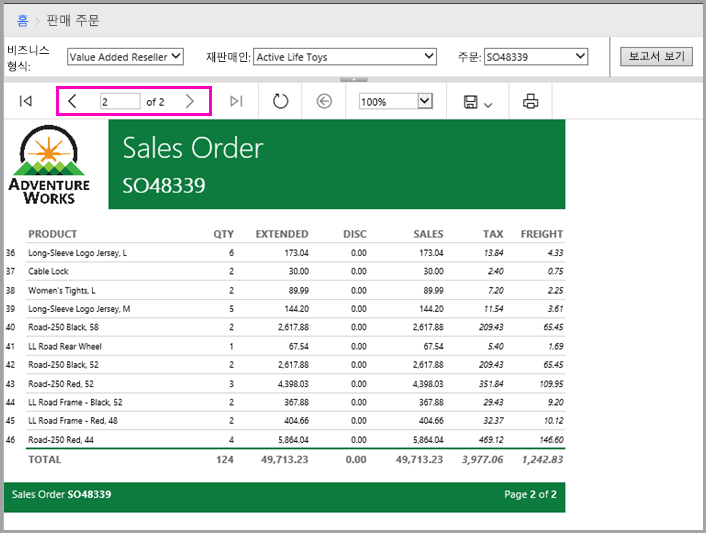

5. **찾아보기**를 선택하여 웹 포털로 돌아갑니다.

### 페이지를 매긴 보고서 편집

보고서 작성기에서 페이지를 매긴 보고서를 편집할 수 있고 브라우저에서 바로 보고서 작성기를 시작할 수 있습니다.

1. 웹 포털에서 **판매 주문** > **보고서 작성기에서 편집** 옆에 있는 줄임표(...)를 선택합니다.

1. **허용**을 선택하여 이 웹 사이트가 컴퓨터에서 프로그램을 열도록 허용합니다.

1. 판매 주문 보고서가 보고서 작성기의 디자인 보기에서 열립니다.

    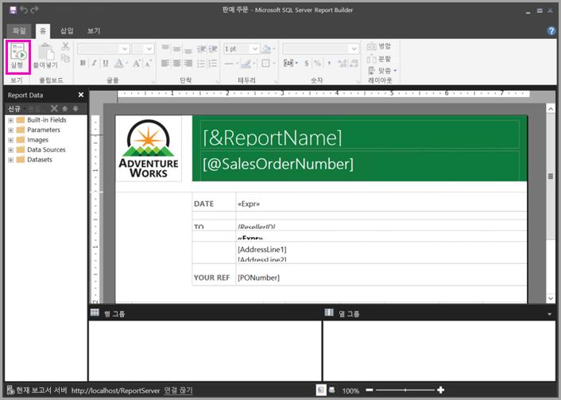

1. **실행**을 선택하여 보고서를 미리 봅니다.

    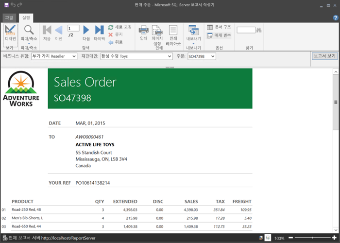

5. 보고서 작성기를 닫고 브라우저로 돌아갑니다.

## Excel 통합 문서 보기

Power BI Report Server의 Excel Online에서 Excel 통합 문서를 보고 조작할 수 있습니다. 

1. Excel 통합 문서 **Office Liquidation Sale.xlsx**를 선택합니다. 자격 증명을 요청하는 메시지가 표시될 수 있습니다. **취소**를 선택합니다. 
    웹 포털에서 열립니다.
1. 슬라이서에서 **어플라이언스**를 선택합니다.

    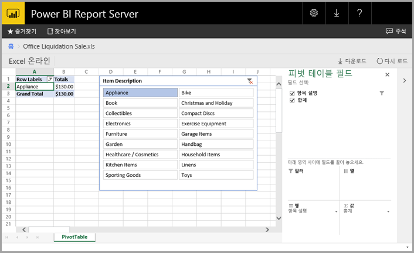

1. **찾아보기**를 선택하여 웹 포털로 돌아갑니다.

## 리소스 정리

이제 이 자습서를 완료했으므로 리소스 그룹, 가상 머신 및 모든 관련 리소스를 삭제합니다. 

- 이를 수행하려면 VM에 대한 리소스 그룹을 선택하고 **삭제**를 선택합니다.

## 다음 단계

이 자습서에서는 Power BI Report Server를 사용하여 VM을 만들었습니다. 웹 포털의 일부 기능을 사용해 보았고 각 편집기에서 Power BI 보고서와 페이지를 매긴 보고서를 열었습니다. 이 VM에는 SQL Server Analysis Services 데이터 원본이 설치되어 있으므로 동일한 데이터 원본을 사용하여 사용자 고유의 Power BI 및 페이지가 매겨진 보고서를 만들어 볼 수 있습니다. 

Power BI Report Server에 대한 보고서를 만드는 방법을 자세히 알아보려면 계속 진행합니다.

> [!div class="nextstepaction"]
> [Power BI Report Server용 Power BI 보고서 만들기](./quickstart-create-powerbi-report.md)

