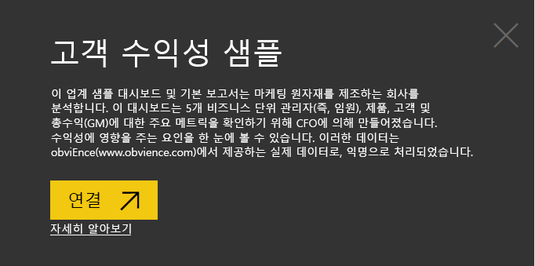
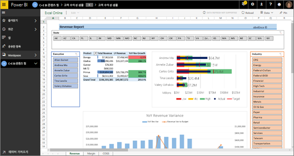
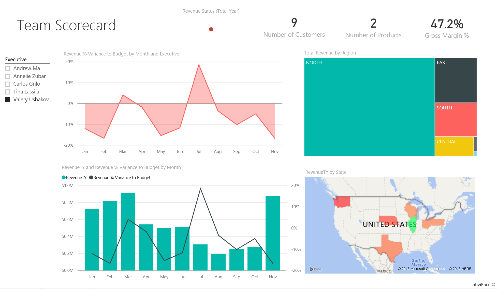
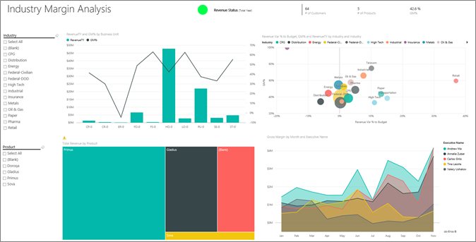
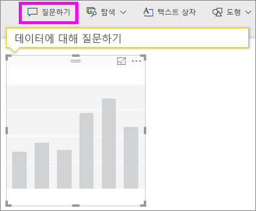
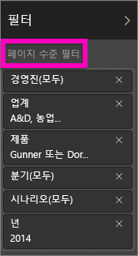

# Power BI용 고객 수익성 샘플 둘러보기

고객 수익성 샘플 콘텐츠 팩은 마케팅 자료를 제조하는 회사에 대한 대시보드, 보고서 및 데이터 세트를 포함합니다. CFO는 5개 비즈니스 단위 관리자(임원), 제품, 고객 및 GM(총수익)에 대한 주요 메트릭을 확인하기 위해 이 대시보드를 만들었습니다. 수익성에 영향을 주는 요인을 한눈에 볼 수 있습니다.

이 샘플은 비즈니스 중심 데이터, 보고서 및 대시보드가 포함된 Power BI를 사용하는 방법을 보여 주는 시리즈의 일부입니다. [obviEnce](http://www.obvience.com/)에서 익명화된 실제 데이터로 생성되었습니다. 데이터는 콘텐츠 팩, .pbix Power BI Desktop 파일 또는 Excel 통합 문서 등 여러 형식으로 사용할 수 있습니다. [Power BI용 샘플](sample-datasets.md)을 참조하세요. 

이 자습서에서는 Power BI 서비스의 고객 수익성 샘플 콘텐츠 팩을 살펴봅니다. Power BI Desktop 및 Power BI 서비스의 보고서 환경은 비슷하므로 Power BI Desktop에서 샘플 .pbix 파일을 사용하여 이 자습서를 따라 해도 좋습니다. 

Power BI 라이선스가 없어도 Power BI Desktop의 샘플을 살펴볼 수 있습니다. Power BI Pro 라이선스가 없다면 샘플을 Power BI 서비스의 내 작업 영역에 저장하면 됩니다. 

## 샘플 가져오기

이 샘플을 사용하려면 먼저 샘플을 [콘텐츠 팩](#get-the-content-pack-for-this-sample), [.pbix 파일](#get-the-pbix-file-for-this-sample) 또는 [Excel 통합 문서](#get-the-excel-workbook-for-this-sample)로 다운로드해야 합니다.

### 이 샘플의 콘텐츠 팩 가져오기

1. Power BI 서비스(app.powerbi.com)를 열고 로그인한 다음, 샘플을 저장할 작업 영역을 엽니다.

   Power BI Pro 라이선스가 없다면 샘플을 내 작업 영역에 저장하면 됩니다.

2. 왼쪽 아래 모서리에서 **데이터 가져오기**를 선택합니다.

   
3. **데이터 가져오기** 페이지가 표시되면 **샘플**을 선택합니다.

4. **고객 수익성 샘플**을 선택한 다음, **연결**을 선택합니다.  

    
5. Power BI에서 콘텐츠 팩을 가져온 다음, 새 대시보드, 보고서 및 데이터 세트를 현재 작업 영역에 추가합니다.

    

### 이 샘플의 .pbix 파일 가져오기

또는 고객 수익성 샘플을 Power BI Desktop에서 사용하도록 설계된 [.pbix 파일](https://download.microsoft.com/download/6/A/9/6A93FD6E-CBA5-40BD-B42E-4DCAE8CDD059/Customer%20Profitability%20Sample%20PBIX.pbix)로 다운로드할 수 있습니다.

### 이 샘플의 Excel 통합 문서 다운로드

이 샘플의 데이터 원본을 보려면 [Excel 통합 문서](https://go.microsoft.com/fwlink/?LinkId=529781)로도 제공됩니다. 통합 문서에는 보고 수정할 수 있는 파워 뷰 시트가 포함됩니다. 원시 데이터를 보려면 데이터 분석 추가 기능을 사용하도록 설정한 다음, **파워 피벗 > 관리**를 선택합니다. 파워 뷰와 파워 피벗 추가 기능을 사용하도록 설정하려면 [내부 Excel 자체에서 Excel 샘플 살펴보기](sample-datasets.md#optional-take-a-look-at-the-excel-samples-from-inside-excel-itself)에서 자세한 내용을 참조하세요.

## 대시보드가 시사하는 점은 무엇입니까?

샘플을 저장한 작업 영역에서 고객 수익성 대시보드를 찾아서 선택합니다.

### 회사 범위의 대시보드 타일
1. Power BI 서비스에서 대시보드를 엽니다. 이 대시보드 타일은 CFO에게 중요한 회사 메트릭을 개략적으로 보여 줍니다. 관심을 끄는 무언가를 발견하면 타일을 선택하여 데이터를 살펴볼 수 있습니다.

2. 대시보드의 왼쪽에 있는 타일을 검토합니다.

    

   다음 세부 정보를 참고하세요.
   - 회사의 총이익은 42.5%입니다.
   - 고객은 80곳 입니다.
   - 5가지 다른 제품을 판매합니다.
   - 예산 대비 수익% 분산이 2월에 가장 낮았으며, 그 다음인 3월에 가장 높았습니다.
   - 수익의 대부분은 동부 및 북부 지역에서 발생합니다. 총이익은 예산을 초과한 적이 없으며 ER-0 및 MA-0 사업부에 추가 조사가 필요합니다.
   - 해당 연도의 전체 수익은 예산에 가깝습니다.

### 관리자 전용 대시보드 타일
대시보드의 오른쪽에 있는 타일에서는 팀 성과 기록표를 제공합니다. CFO는 관리자를 추적해야 하며, 이러한 타일에는 GM%를 사용하여 개략적인 수익 개요가 제공됩니다. 관리자가 예상하지 못한 GM% 추세가 나타날 경우 추가로 조사할 수 있습니다.

관리자별 대시보드 타일을 분석하면 다음과 같은 관찰이 가능합니다.

- Carlos를 제외한 모든 경영진이 이미 매출 목표를 초과했습니다. 그러나 Carlos의 실제 매출이 가장 높습니다.
- 3월 이후 Annelie의 GM%가 가장 낮지만 꾸준한 증가가 보입니다.
- 반면, Valery의 GM%는 대폭 하락했습니다.
- Andrew는 불안정한 한 해를 보냈습니다.

## 대시보드의 기본 데이터 살펴보기
이 대시보드에는 보고서와 Excel 통합 문서에 연결된 타일이 있습니다.

### Excel Online 데이터 원본 열기
이 대시보드의 두 타일, **목표 및 실제**와 **전년 대비 수익 성장**이 Excel 통합 문서에서 고정되었습니다. 그러므로 이 타일 중 하나를 선택하면 Power BI에서 데이터 원본(이 경우 Excel Online)을 엽니다.

1. Excel에서 고정된 타일 중 하나를 선택합니다. Excel Online이 Power BI 서비스 내에서 열립니다.
2. 통합 문서에 데이터 가치가 있는 탭이 3개 있습니다. **수익**을 엽니다.
3. Carlos가 아직 목표를 달성하지 못한 이유를 살펴보겠습니다.  

    a. **경영진** 슬라이더에서 **Carlos Grilo**를 선택합니다.   

    b. 첫 번째 피벗 테이블을 보면, 상위 제품인 Primus에 대한 Carlos의 매출 증가가 작년보다 152% 감소했습니다. **전년 대비 매출 차이** 차트에 따르면 Carlos는 대부분의 달에 예산을 밑돌았습니다.  

    

    

4. 계속 탐색하세요. 흥미로운 항목을 찾으면 오른쪽 위에서 **고정** 아이콘 을 선택하여 [대시보드에 고정](service-dashboard-pin-tile-from-excel.md)합니다.

5. 대시보드로 돌아가려면 브라우저의 뒤로 화살표를 사용합니다.

### 기본 Power BI 보고서 열기
고객 수익성 샘플 대시보드의 많은 타일이 기본 고객 수익성 샘플 보고서에서 고정되어 있습니다.

1. 이러한 타일 중 하나를 선택하여 읽기용 보기에서 보고서를 엽니다.

   타일이 Q&A에서 생성된 경우 타일을 선택하면 Q&A 창이 열립니다. 대시보드로 돌아가서 다른 타일을 시도해보려면 **Q&A 종료**를 선택합니다.

2. 보고서에는 3개의 페이지가 있습니다. 보고서 아래쪽에 있는 각 탭은 서로 다른 페이지를 나타냅니다.

    

    * **팀 성과 기록표**는 관리자 5명의 성과와 이들의 “비즈니스 기록”에 중점을 둡니다.
    * **업계 수익 분석**은 업계 전체에서 돌아가는 상황과 비교하여 수익성을 분석하는 방법을 제공합니다.
    * **경영진 성과 기록표**는 각 관리자에 대한 보기를 사용자 지정 페이지 크기 형식으로 제공합니다.

### 팀 성과 기록표

팀 멤버 중 두 명에 주목하여 어떤 인사이트를 얻을 수 있는지 알아보겠습니다. 

1. 왼쪽의 **Executive** 슬라이서에서 Andrew의 이름을 선택하여 Andrew에 대한 데이터만 표시하도록 보고서 페이지를 필터링합니다.

   * 간략히 KPI를 보려면 Andrew의 **수익 상태(연간 총액)** 를 확인합니다. 녹색이므로 성과가 좋다는 의미입니다.
   * **Revenue % Variance to Budget by Month and Executive**(월 및 경영진별 예산 대비 수익 % 분산) 차트는 2월의 부진을 제외하고는 Andrew가 잘하고 있다는 것을 보여줍니다. Andrew의 주요 지역은 동부 지역이며, 고객 49곳과 7가지 제품 중 5가지를 취급합니다. Andrew의 GM%는 가장 높지도, 가장 낮지도 않습니다.
   * **월별 RevenueTY 및 예산 대비 수익 % 분산** 차트는 꾸준하고 지속적인 수익을 보여줍니다. 하지만 지역 트리맵에서 **중부**에 대한 사각형을 선택하여 필터링하면 Andrew는 3월에 인디애나에서만 수익이 있는 것을 알 수 있습니다. 이 추세가 의도적인 상황인가요? 아니면 살펴봐야 하는 상황인가요?

2. 이제 Valery를 봅시다. **Executive** 슬라이서에서 Valery 이름을 선택하여 Valery의 데이터만 표시되도록 보고서 페이지를 필터링합니다. 

   

   * **수익 상태(연간 총액)** 의 빨간색 KPI를 볼 수 있습니다. 이 항목은 추가 조사가 확실히 필요합니다.
   * Valery의 매출 차이도 걱정스러운 상태입니다. Valery는 설정된 매출 이익을 달성하지 못했습니다.
   * Valery는 불과 9명의 고객만 보유하고 있으며, 겨우 2개 제품만 취급하고 거의 북부 지역의 고객들하고만 일합니다. 이 특수한 상황이 메트릭의 광범위한 변동을 설명해 줍니다.
   * 트리맵의 **북부** 사각형을 선택하면 Valery의 북부 지역 총수익이 전체 수익과 일치하는 것으로 표시됩니다.
   * 다른 **지역별 총 매출** 사각형을 선택하면 GM%의 범위가 23%~79%라는 흥미로운 사실을 확인할 수 있습니다. Valery의 매출은 북부 지역을 제외한 모든 지역에서 계절성이 상당히 높습니다.

3. Valery의 영역에서 실적이 저조한 이유를 계속 살펴봅시다. 지역, 다른 사업부 및 보고서의 다음 페이지: **업계 수익 분석**을 살펴봅니다.

### 업계 이익 분석
이 보고서 페이지는 데이터의 다른 조각을 제공합니다. 전체 업계의 총수익을 세그먼트 단위로 나누어 보여줍니다. CFO는 이 페이지를 통해 회사 및 비즈니스 단위 메트릭을 업계 메트릭과 비교하여 추세와 수익성을 설명할 수 있도록 지원합니다. **월별 및 임원별 총이익 %** 차트가 이 페이지에 있는 이유가 궁금할 수 있습니다. 이 페이지는 팀 전용 페이지이기 때문입니다. 여기에 있으면 비즈니스 단위 관리자로 페이지를 필터링할 수 있습니다.  

1. 업계별로 수익성이 어떻게 달라지는가? 제품 및 고객을 어떻게 업계 별로 나누는가? 이러한 질문에 답하려면 왼쪽 상단에서 하나 이상의 업계를 선택합니다(CPG 업계에서 시작). 필터를 지우려면 지우개 아이콘을 선택합니다.

2. **예산 대비 수익 Var %, GM% 및 업계별 RevenueTY** 버블 차트에서 CFO는 가장 큰 거품을 찾습니다. 이것이 수익에 가장 큰 영향을 주기 때문입니다. 업계 세그먼트별로 각 관리자의 영향을 쉽게 보려면, 영역 차트에서 각 관리자의 이름을 차례로 선택하여 페이지를 필터링합니다.

3. 차트에서 각 관리자를 선택할 때 다음 세부 정보를 참고하세요.
   * Andrew의 영향 영역은 여러 다른 업계 세그먼트에 다양한 GM%(대부분 긍정적인 쪽) 및 Var%로 걸쳐져 있습니다.
   * Annelie가 연방 부문과 Gladius 제품에 중점을 둔 소수의 업계 부문에만 집중한다는 점을 제외하고 Annelie의 차트도 비슷합니다.
   * Carlos는 수익이 좋은 서비스 세그먼트에 명확히 중점을 두고 있습니다. Carlos는 하이테크 부문의 Var%도 대폭 상승했으며, 새로운 부문인 산업에서 예산 대비 독보적인 성과를 거두었습니다.
   * Tina는 소수의 부문만 취급하며 GM%가 가장 높지만, 거품 크기가 대체로 작기 때문에 Tina가 회사의 최종 결산 결과에 미치는 영향이 극히 적음을 확인할 수 있습니다.
   * 단 하나의 제품만 담당하는 Valery는 불과 5개의 업계 세그먼트만 담당합니다. Valery의 업계 영향은 계절성과 관련이 있지만 항상 큰 거품을 생성하므로 회사의 최종 결산 결과에 상당한 영향을 미침을 나타냅니다. 업계 부문이 저조한 성과를 설명해 주나요?

### 경영진 성과 기록표
이 페이지에는 사용자 지정 페이지 크기 형식이 있습니다.

## 질문 및 답변에 질문하여 데이터를 더 보기
분석을 통해 어떤 업계가 Valery에게 가장 많은 수익을 거둘 수 있게 하는지 확인할 수도 있습니다. 질문 및 답변을 사용해 봅시다.

1. **보고서 편집**을 선택하여 편집용 보기에서 보고서를 엽니다. 편집용 보기는 자신이 보고서를 소유한 경우에만 사용할 수 있습니다. 이러한 보기는 *작성자* 모드라고도 합니다. 대신 이 보고서가 나에게만 공유된 경우에는 편집용 보기에서 열 수 없습니다.

2.  대시보드 맨 위에서 **질문하기**를 선택하여 Q&A 질문 상자를 엽니다.

    

3. 질문 상자에 *total revenue by industry for Valery*를 입력합니다. 질문을 입력하면 시각화가 어떻게 업데이트되는지 확인합니다.

    

   보시다시피, Valery의 가장 큰 수익 영역은 유통 업계입니다.

### 필터를 추가하여 더 자세히 보기
배포 업계를 살펴보겠습니다.  

1. **업계 수익 분석** 보고서 페이지를 엽니다.
2. 보고서 페이지에서 시각화를 선택하지 않고 오른쪽 필터 창을 확장합니다(이미 확장되어 있지 않은 경우). **필터** 창은 **페이지 수준 필터**만 표시합니다.  

   
3. **업계**에 대한 필터를 찾아 화살표를 선택하여 목록을 확대합니다. 유통 업계에 대한 페이지 필터를 추가해 보겠습니다. 먼저 **모두 선택** 확인란을 지워 모든 선택을 취소합니다. 그런 다음, **배포**만 선택합니다.  

   
4. **월별 및 임원별 총이익%** 차트는 Valery와 Tina만 이 업계의 고객을 보유하고 있으며, Valery는 6월에서 11월까지만 이 업계에서 일했음을 보여줍니다.   
5. **월별 및 임원별 총수익** 차트 범례에서 **Tina**를 선택한 후 **Valery**를 선택합니다. **제품별 총 수익** 차트에서 Tina가 차지하는 부분은 Valery에 비해 작다는 것을 알 수 있습니다.
6. 실제 수익을 보려면 대시보드에서 질문 및 답변 상자를 선택하고 *total revenue by executive for distribution by scenario*를 입력합니다.  

     

    다른 업계에 대해서도 비슷하게 탐색할 수 있으며, 시각적 개체에 고객을 추가하여 Valery의 활동의 원인을 이해할 수도 있습니다.

## 다음 단계: 데이터에 연결
이 환경은 변경 내용을 저장하지 않도록 선택할 수 있으므로 안전하게 이용할 수 있습니다. 그러나 변경 내용을 저장하면 언제든지 이 샘플의 새 복사본에 대해 **데이터 가져오기**를 선택할 수 있습니다.

이 둘러보기가 Power BI 대시보드, 질문 및 답변, 보고서를 통해 샘플 데이터를 파악하는 방법을 확인하는 데 도움이 되었기를 바랍니다. 이제 사용자 데이터에 연결할 차례입니다. Power BI를 사용하여 다양한 데이터 원본에 연결할 수 있습니다. 더 자세히 알아보려면 [Power BI 서비스 시작하기](service-get-started.md)를 참조하세요.

