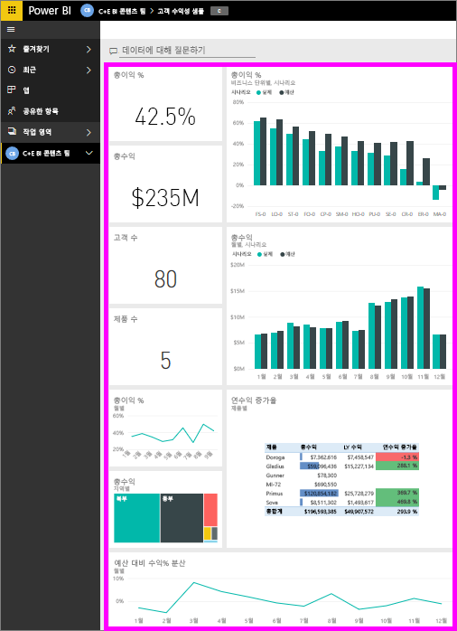
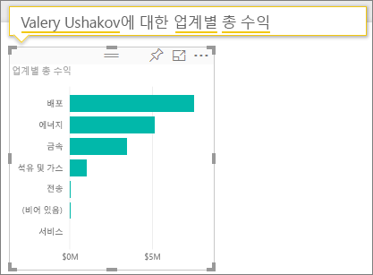
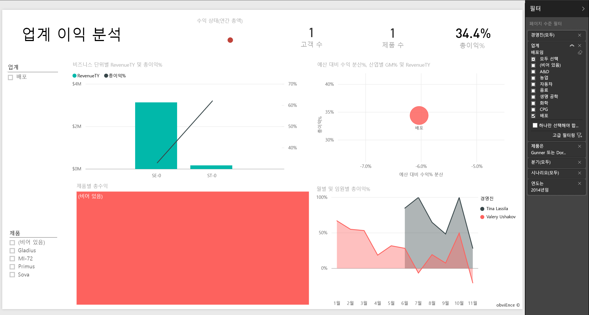
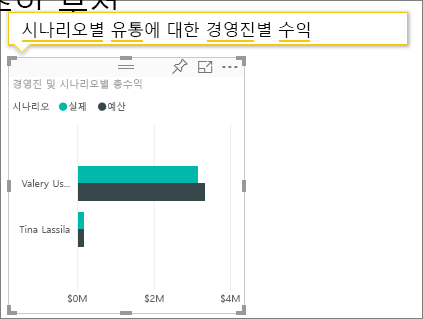

# Power BI용 고객 수익성 샘플: 둘러보기

## 고객 수익성 샘플 개요
“고객 수익성 샘플” 콘텐츠 팩은 마케팅 자료를 제조하는 회사에 대한 대시보드, 보고서 및 데이터 집합을 포함합니다. 이 대시보드는 5개 비즈니스 단위 관리자(즉, 임원), 제품, 고객 및 총수익(GM)에 대한 주요 메트릭을 확인하기 위해 CFO에 의해 만들어졌습니다. 수익성에 영향을 주는 팩트를 한 눈에 볼 수 있습니다.

이 샘플은 비즈니스 중심 데이터, 보고서 및 대시보드가 포함된 Power BI를 사용하는 방법을 보여 주는 시리즈의 일부입니다. 이 샘플은 익명화된 obviEnce([www.obvience.com](http://www.obvience.com/))의 실제 데이터입니다. 데이터는 콘텐츠 팩/앱, Excel 통합 문서 또는 .pbix Power BI Desktop 파일 등 여러 형식으로 사용할 수 있습니다. [샘플 데이터 집합](sample-datasets.md)을 참조하세요.

## 필수 조건
함께 진행해볼까요? 자습서에서는 Power BI 서비스 및 “고객 수익성” 샘플 콘텐츠 팩을 사용합니다.  보고서 환경은 비슷하므로 Power BI Desktop과 샘플 PBIX 파일을 사용하여 따라 할 수도 있습니다. 콘텐츠 팩 및 PBIX 파일에 연결하기 위한 지침은 다음과 같습니다.

### 이 샘플의 콘텐츠 팩 가져오기

1. Power BI 서비스(app.powerbi.com)를 열고 로그인합니다.
2. 왼쪽 아래 모서리에서 **데이터 가져오기**를 선택합니다.

    
3. 데이터 가져오기 페이지가 표시되면 **샘플** 아이콘을 선택합니다.

   
4. **고객 수익성 샘플**을 선택한 다음 **연결**을 선택합니다.  

   
5. Power BI에서 콘텐츠 팩을 가져와 새 대시보드, 보고서 및 데이터 집합을 현재 작업 영역에 추가합니다. 새 콘텐츠에는 노란색 별표가 표시됩니다. 샘플을 사용하여 Power BI 실행을 테스트해 보세요.  

   

### 이 샘플의 .pbix 파일 가져오기

또는 Power BI Desktop에 사용하도록 설계된 .pbix 파일로 샘플을 다운로드할 수 있습니다.
[고객 수익성 샘플](http://download.microsoft.com/download/6/A/9/6A93FD6E-CBA5-40BD-B42E-4DCAE8CDD059/Customer Profitability Sample PBIX.pbix)

### 이 샘플의 Excel 통합 문서 다운로드

이 샘플의 데이터 원본을 자세히 살펴보려는 경우 [(Excel 통합 문서)](http://go.microsoft.com/fwlink/?LinkId=529781)로도 제공됩니다. 통합 문서에는 보고 수정할 수 있는 파워 뷰 시트가 포함됩니다. 원시 데이터를 보려면 **파워 피벗 > 관리**를 선택합니다.

## 대시보드가 시사하는 점은 무엇입니까?

**내 작업 영역** 아래에서 고객 수익성 샘플에 대한 대시보드를 찾습니다.

### 회사 범위의 대시보드 타일
1. Power BI 서비스에서 대시보드를 엽니다. 이 대시보드 타일은 CFO에게 중요한 높은 수준의 회사 메트릭을 보여줍니다.  관심을 끄는 무언가를 발견하면 타일을 선택하여 데이터를 상세히 확인할 수 있습니다.

2. 대시보드의 왼쪽에 있는 타일을 검토합니다.

    

- 우리 회사의 총수익은 42.5%입니다.
- 80명의 고객이 있습니다.
- 5가지 제품을 판매합니다.
- 2월에 가장 낮은 수익 분산 %를 잡았으며, 그 다음인 3월에 가장 높게 잡았습니다.
- 수익의 대부분은 동부 및 북부 지역에서 얻습니다. 총수익은 일부 추가 조사가 필요한 ER-0 및 MA-0으로 예산을 결코 초과하지 않습니다.
- 해당 연도의 전체 수익은 예산에 가깝습니다.

### 관리자 전용 대시보드 타일
대시보드의 오른쪽에 있는 타일에서는 팀 성과 기록표를 제공합니다. CFO는 관리자들을 추적해야 하며, 이 타일들은 GM%를 사용하여 높은 수준의 개요를 제공합니다. GM% 추세를 어떤 관리자에게도 예상하지 않는 경우, 더 조사할 수 있습니다.

- Carlos를 제외한 모든 경영진이 이미 매출 목표를 초과했습니다. 그러나 Carlos의 실제 매출이 가장 높습니다.
- 3월 이후 Annelie의 GM%가 가장 낮지만 꾸준한 증가가 보입니다.
- 반면 Valery의 GM%가 현저히 떨어진 것을 확인했습니다.
- Andrew는 불안한 한 해를 보냈습니다.

## 대시보드의 기본 데이터 살펴보기
이 대시보드에는 보고서와 Excel 통합 문서에 연결된 타일이 있습니다.

### Excel Online 데이터 원본 열기
이 대시보드의 두 타일, “목표 및 실제”와 “전년동기대비 수익 성장”이 Excel 통합 문서에서 고정되었습니다. 그러므로 이 타일 중 하나를 선택하면 Power BI에서 데이터 원본(이 경우 Excel Online)을 엽니다.

1. Excel에서 고정된 타일 중 하나를 선택합니다. Excel Online이 Power BI 서비스 내에서 열립니다.
2. 통합 문서에 데이터가 있는 탭이 3개 있습니다. “수익”을 엽니다.
3. Carlos가 아직 목표를 달성하지 못한 이유를 살펴보겠습니다.  
    a. “경영진” 슬라이더에서 **Carlos Grilo**를 선택합니다.   
    b. 첫 번째 피벗 테이블을 보면, Carlos의 상위 제품인 Primus에 대한 수익이 작년보다 152% 감소했습니다. 그리고 전년동기대비 차트에 따르면, 대부분의 달에 예산을 초과하지 않았습니다.  

    

    

4. 계속 살펴보면서 흥미로운 항목을 찾으면 오른쪽 위에서 **고정** 을 선택하여 [대시보드에 고정](service-dashboard-pin-tile-from-excel.md)합니다.

5. 대시보드로 돌아가려면 브라우저의 뒤로 화살표를 사용합니다.

### 기본 Power BI 보고서 열기
고객 수익성 샘플 대시보드의 대부분의 타일이 기본 고객 수익성 샘플 보고서에서 고정되어 있습니다.

1. 이러한 타일 중 하나를 선택하여 읽기용 보기에서 보고서를 엽니다.

2. 보고서는 3페이지로 구성되어 있습니다. 보고서 아래의 각 탭은 페이지를 나타냅니다.

    

    * “팀 성과 기록표”는 관리자 5명의 성과와 그들의 “비즈니스 기록”에 중점을 둡니다.
    * “업계 수익 분석”은 업계 전체에서 돌아가는 상황과 비교하여 수익성을 분석하는 방법을 제공합니다.
    * “경영진 성과 기록표”는 각 관리자가 Cortana에서 볼 수 있는 형식으로 제공합니다.

### 팀 성과 기록표

팀 멤버 중 두 명에 주목하여 어떤 통찰력을 얻을 수 있는지 보겠습니다. 왼쪽 슬라이서에서 Andrew의 이름을 선택하여 Andrew에 대한 데이터만 표시하도록 보고서 페이지를 필터링합니다.

* KPI를 신속하게 보려면, Andrew의 **수익 상태**를 봅니다 - 녹색입니다. 성과가 좋습니다.
* “월별 예산에 대한 수익 변동 %” 영역 차트는 2월의 부진을 제외하고는 Andrew가 전체적으로 꽤 잘 하고 있음을 보여줍니다. 그의 주요 영역은 동부이며, 그는 49고객과 5(7) 제품을 취급합니다. 그의 GM%는 최상도 최하도 아닙니다.
* “월별 예산에 대한 RevenueTY 및 수익 변동 %”는 꾸준한 수익 내용을 보여줍니다. 그러나 지역 트리맵 **중앙**의 사각형을 클릭하여 필터링하면 Andrew가 3월에 인디애나에서만 수익이 있다는 것을 알게 됩니다. 의미가 있거나 더 살펴봐야 하는 내용인가요?

이제 Valery를 봅시다. 슬라이서에서 Valery의 이름을 선택하여 그녀에 대한 데이터만 표시하도록 보고서 페이지를 필터링합니다.  

* **RevenueTY 상태**에 대한 빨간색 KPI를 볼 수 있습니다. 분명히 더 조사해 봐야 합니다.
* 그녀의 수익 분산 역시 걱정스러운 그림으로 채워져 있습니다. 그녀는 자신의 수익을 충족시키지 못하고 있습니다.
* Valery는 불과 9고객만 보유하고 있으며, 겨우 2개 제품만 취급하고 거의 북부의 고객들하고만 일합니다. 이 특수한 상황이 그녀의 메트릭의 넓은 변동폭을 설명해 줍니다.
* 트리맵의 **북부** 사각형을 선택하면 Valery의 북부에서의 총수익이 그녀의 전체 수익과 일치함을 보여줍니다.
* 다른 **지역** 사각형을 선택하면 흥미로운 사실을 알 수 있습니다. 북부를 제외한 모든 지역에서의 23%에서 79%까지의 그녀의 GM% 범위 및 수익 숫자가 매우 계절에 좌우됩니다.

왜 Valery의 영역이 잘 돌아가지 못하는지 더 알아봅시다. 지역, 다른 비즈니스 단위 및 보고서의 다음 페이지 “업계 수익 분석”을 봅니다.

### 업계 수익 분석
이 보고서 페이지는 데이터의 다른 조각을 제공합니다. 전체 업계의 총수익을 세그먼트 단위로 나누어 보여줍니다. CFO 는 이 페이지를 사용하여 회사 및 비즈니스 단위 메트릭을 업계 메트릭과 비교해서 추세와 수익성을 설명합니다. 왜 “월별 및 임원 이름별 총수익” 영역형 차트가 팀 전용인 이 페이지에 있는지 궁금할 것입니다. 여기에 있으면 비즈니스 단위 관리자로 페이지를 필터링할 수 있습니다.  

업계별로 수익성이 어떻게 달라지는가? 제품 및 고객을 어떻게 업계 별로 나누는가? 왼쪽 위에서 하나 이상의 업계를 선택합니다. (CPG 업계에서 시작) 필터를 지우려면 지우개 아이콘을 선택합니다.

거품형 차트에서 CFO는 수익에 가장 큰 영향을 미치는 가장 큰 거품을 찾습니다. 영역형 차트에서 이름을 클릭하여 관리자로 페이지를 필터링하면 업계 세그먼트별로 각 관리자가 미치는 영향을 쉽게 볼 수 있습니다.

* Andrew의 영향 영역은 여러 다른 업계 세그먼트에 다양한 GM%(대부분 긍정적인 쪽) 및 Var%로 걸쳐져 있습니다.
* Annelie의 차트는 그녀가 연방 세그먼트에 중점을 둔 소수의 업계 세그먼트 및 Gladius 제품에 중점을 둔 업계 세그먼트에만 중점을 둔다는 사실을 제외하고는 유사합니다.
* Carlos는 서비스 세그먼트에 명확한 중점을 두고 좋은 수익을 거둡니다. 그는 하이테크 세그먼트에 대한 분산도 %를 대폭 향상시켰으며, 그에게는 새로운 세그먼트인 업계도 예산에 비해 잘 수행했습니다.
* Tina는 소수의 세그먼트만 취급하여 가장 높은 GM%을 나타내지만, 가장 작은 크기의 그녀의 거품은 회사의 결론에 그녀가 미치는 영향이 가장 작음을 나타냅니다.
* 단 하나의 제품만 담당하는 Valery는 불과 5개의 업계 세그먼트에서만 일합니다. 그녀가 업계에 미치는 영향은 계절에 의존하지만 언제나 회사의 결론에 중대한 영향을 미침을 나타내는 큰 거품을 생성합니다. 업계가 그녀의 부정적인 성능을 설명해 줍니까?

### 경영진 성과 기록표
이 페이지는 Cortana의 답변 카드 형식입니다. 자세한 내용은 [Cortana 답변 카드 만들기](service-cortana-answer-cards.md)를 참조하세요.

## 질문 및 답변에 질문하여 데이터를 더 보기
우리의 분석은 어느 업계가 Valery에게 가장 많은 수익을 거둘 수 있게 하는지 확인하는 데 도움을 줍니다. 질문 및 답변을 사용해 봅시다.

1. **보고서 편집**을 선택하여 편집용 보기에서 보고서를 엽니다. 편집용 보기는 사용자가 보고서를 “소유”하는 경우에만 사용할 수 있습니다. 이를 **작성자** 모드라고 합니다. 이 보고서가 사용자와 공유되는 경우에는 편집용 보기에서 열 수 없습니다.

2.  맨 위 메뉴 모음에서 **질문하기**를 선택하여 질문 및 답변 상자를 엽니다.

    

3. **Valery에 대한 업계별 총 수익**을 입력합니다. 질문을 입력하면 시각화가 어떻게 업데이트되는지 확인합니다.

    

   배포는 Valery에게 있어 가장 큰 수익 영역입니다.

### 필터를 추가하여 더 자세히 보기
*배포* 업계를 살펴보겠습니다.  

1. “업계 수익 분석” 보고서 페이지를 엽니다.
2. 보고서 페이지에서 시각화를 선택하지 않고 오른쪽 필터 창을 확장합니다(이미 확장되어 있지 않은 경우). 필터 창은 페이지 수준 필터만 표시합니다.  

   
3. **업계**에 대한 필터를 찾아 화살표를 선택하여 목록을 확대합니다. 유통 업계에 대한 페이지 필터를 추가해 보겠습니다. 먼저 **모두 선택** 확인란을 지워 모든 선택을 취소합니다. 그런 다음, **유통**만 선택합니다.  

   
4. “월별 및 임원 이름별 총수익” 영역형 차트는 Valery와 Tina만이 이 업계의 고객을 보유하고 있으며, Valery는 6월에서 9월까지만 이 업계에서 일했음을 보여줍니다.   
5. "월별 및 임원별 총수익" 영역별 차트 범례에서 **Tina**를 선택한 후 **Valery**를 선택합니다. “제품별 총 수익”에서 Tina가 차지하는 부분은 Valery에 비해 매우 작음을 알 수 있습니다.
6. 실제 수익을 보려면 질문 및 답변을 사용하여 **경영진의 시나리오별 배포에 대한 총 수익**을 문의합니다.  

     

    다른 업계에 대해서도 비슷하게 탐색할 수 있으며, 시각적 개체에 고객을 추가하여 Valery의 활동의 원인을 이해할 수도 있습니다.

이제 재생하는 데 안전한 환경입니다. 언제든지 변경 내용을 저장하지 않도록 선택할 수 있습니다. 그러나 변경 내용을 저장하면 언제든지 이 샘플의 새 복사본에 대해 **데이터 가져오기** 로 이동할 수 있습니다.

[이 샘플에 대한 데이터 집합(Excel 통합 문서)만 다운로드](http://go.microsoft.com/fwlink/?LinkId=529781)할 수도 있습니다.

## 다음 단계: 데이터에 연결
이 둘러보기가 Power BI 대시보드, 질문 및 답변, 보고서를 통해 고객 데이터를 파악하는 방법을 확인하는 데 도움이 되었기를 바랍니다. 이제 고유한 데이터에 연결할 차례입니다. Power BI를 사용하여 다양한 데이터 소스에 연결할 수 있습니다. [Power BI 시작하기](service-get-started.md)에 대해 자세히 알아보세요.

[Power BI의 샘플로 돌아가기](sample-datasets.md)  
