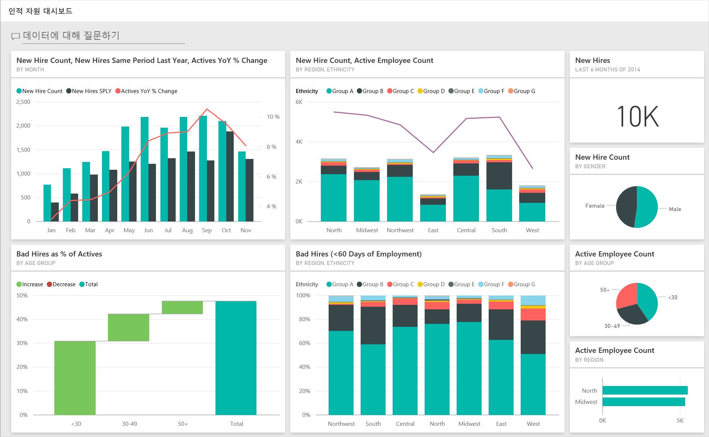
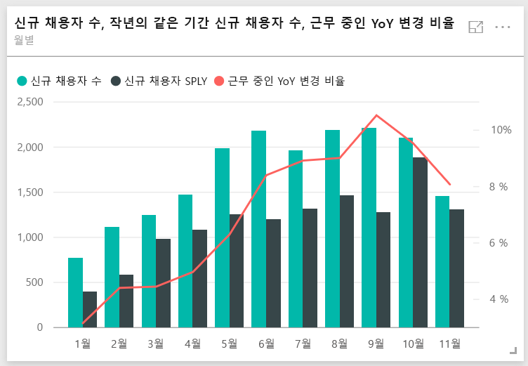
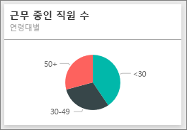
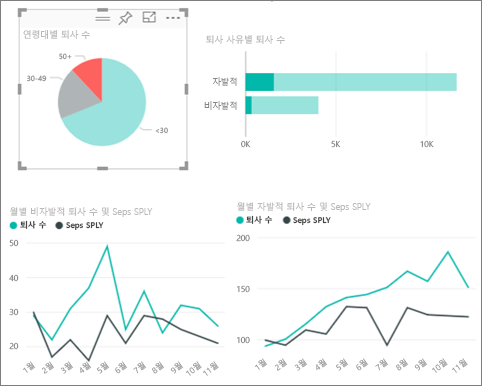
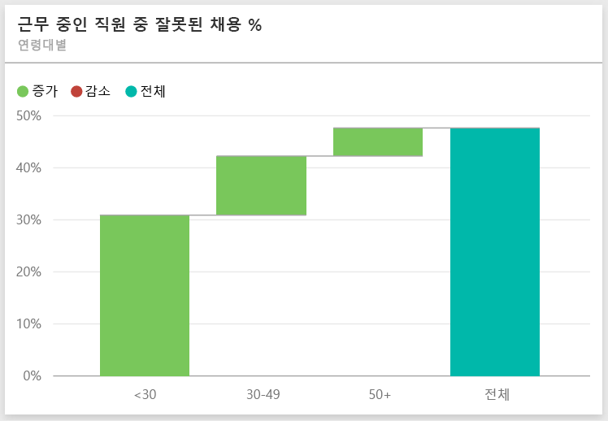
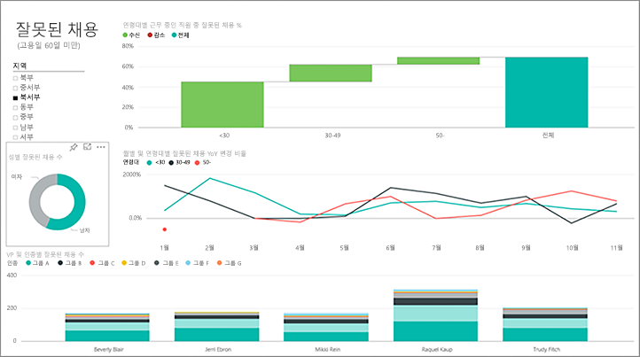
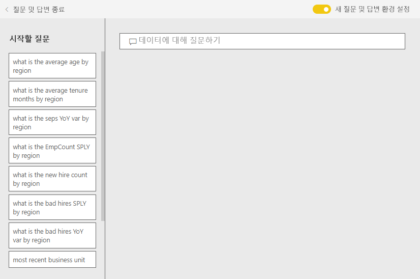

# Power BI용 인적 자원 샘플 둘러보기

## 인적 자원 샘플 개요
HR 부서는 업종이나 규모가 다른 경우에도 여러 회사에서 동일한 보고 모델을 갖습니다. 이 샘플에서는 신입, 근무 중인 직원, 퇴사한 직원을 살펴보고 채용 전략에서의 추세를 파악해 보겠습니다. 주요 목표는 다음을 이해하는 것입니다.

* 채용자
* 채용 전략의 편향
* 자발적 이직의 추세

이 샘플은 비즈니스 중심 데이터, 보고서 및 대시보드가 포함된 Power BI를 사용하는 방법을 보여 주는 시리즈의 일부입니다. 이 샘플은 익명화된 obviEnce([www.obvience.com](http://www.obvience.com/))의 실제 데이터입니다. 데이터는 콘텐츠 팩/앱, Excel 통합 문서 또는 .pbix Power BI Desktop 파일 등 여러 형식으로 사용할 수 있습니다. 자세한 내용은 [샘플 데이터 세트](sample-datasets.md)를 참조하세요.

## 필수 조건

 이 샘플을 사용하려면 먼저 샘플을 [콘텐츠 팩](https://docs.microsoft.com/power-bi/sample-human-resources#get-the-content-pack-for-this-sample), [pbix 파일](http://download.microsoft.com/download/6/9/5/69503155-05A5-483E-829A-F7B5F3DD5D27/Human%20Resources%20Sample%20PBIX.pbix) 또는 [Excel 통합 문서](http://go.microsoft.com/fwlink/?LinkId=529780)로 다운로드해야 합니다.

### 이 샘플의 콘텐츠 팩 가져오기

1. Power BI 서비스(app.powerbi.com)를 열고 로그인합니다.
2. 왼쪽 아래 모서리에서 **데이터 가져오기**를 선택합니다.
   
    
3. 데이터 가져오기 페이지가 표시되면 **샘플** 아이콘을 선택합니다.
   
   
4. **인적 자원 샘플**을 선택한 다음 **연결**을 선택합니다.  
   
   
5. Power BI에서 콘텐츠 팩을 가져와 새 대시보드, 보고서 및 데이터 세트를 현재 작업 영역에 추가합니다. 새 콘텐츠에는 노란색 별표가 표시됩니다. 
   
   
  
### 이 샘플의 .pbix 파일 가져오기

또는 Power BI Desktop에 사용하도록 설계된 .pbix 파일로 샘플을 다운로드할 수 있습니다. 

 * [인적 자원 샘플 PBIX](http://download.microsoft.com/download/6/9/5/69503155-05A5-483E-829A-F7B5F3DD5D27/Human%20Resources%20Sample%20PBIX.pbix)

### 이 샘플의 Excel 통합 문서 다운로드
[이 샘플에 대한 데이터 세트(Excel 통합 문서)만 다운로드](http://go.microsoft.com/fwlink/?LinkId=529780)할 수도 있습니다. 통합 문서에는 보고 수정할 수 있는 파워 뷰 시트가 포함됩니다. 원시 데이터를 보려면 **파워 피벗 > 관리**를 선택합니다.

## 신입
먼저 신규 채용자를 살펴보겠습니다.

1. 작업 영역에서 **대시보드** 탭을 선택하고 인사 관리 대시보드를 엽니다.
2. 대시보드에서 **월별 신규 채용자 수, 작년의 같은 기간 신규 채용자 수, 근무 중인 YoY 변경** **비율** 타일을 선택합니다.  
     

   인적 자원 샘플 보고서가 **신규 채용자** 페이지에 열립니다.  

   

다음을 확인합니다.

* **월별 신규 채용자 수, 신규 채용자 SPLY 및 근무 중인 YoY 변경 비율** 콤보 차트는 작년에 비해 올해 매달 더 많은 직원을 고용했으며, 일부 월에서는 훨씬 더 많은 직원을 고용했음을 보여줍니다.
* **지역 및 민족별 신규 채용자 수와 근무 중인 직원 수**콤보 차트에서 **동부** 지역의 사람을 거의 채용하지 않았음을 알았습니다.
* **연령대별 신규 채용자 수 YoY Var** 폭포 차트에서는 주로 젊은 직원을 채용하고 있음을 알 수 있습니다. 이는 업무가 대체로 파트타임이기 때문입니다.
* **성별 신규 채용자 수** 원형 차트는 상당히 균등하게 나뉘어 있음을 보여줍니다.

성비가 고르지 않은 지역 등, 다른 정보를 알 수 있나요?  연령, 성별, 지역 및 인종 그룹 간 관계를 살펴보려면 차트에서 다른 연령대 그룹과 성별을 선택하세요.

맨 위 탐색 모음에서 대시보드의 이름을 선택하여 대시보드로 돌아갑니다.

## 현재 근무 중인 직원과 전 직원 비교
현재 근무 중인 직원과 회사를 떠난 직원의 데이터를 살펴보겠습니다.

대시보드에서 **연령대별 근무 중인 직원 수** 타일을 선택합니다.  

인적 자원 샘플 보고서가 **Active Employees vs. Separations**(근무 중인 직원 수와 퇴사한 직원 수 비교) 페이지에 열립니다.  

**관련 항목**:

* 왼쪽 콤보 차트는 근무 중인 직원과 퇴사한 직원의 연도별 변화를 나타냅니다. 올해 급속한 채용으로 근무 중인 직원이 더 많지만 지난 해보다 퇴사한 직원도 더 많습니다.
* 8월에는 다른 달에 비해 더 많은 퇴사자가 있었습니다. 다른 연령대, 성별 또는 지역을 선택하면 이상 값을 확인할 수 있습니다.
* 원형 차트를 보면 성별과 연령대별로 근무 중인 직원이 매우 고르게 나뉜 것을 알 수 있습니다. 연령대별로 다른 성별 구분을 확인하려면 다른 연령대를 선택합니다. 모든 연령대에서 성별이 고르게 분포되어 있습니까?

## 퇴사 사유
편집용 보기에서 보고서를 살펴보겠습니다. 왼쪽 위에서 **보고서 편집** 을 선택합니다.

원형 차트를 변경하여 근무 중인 직원이 아닌 퇴사 직원을 표시합니다.

1. **연령대별 근무 중인 직원 수** 원형 차트를 선택합니다.
2. **필드**에서 **직원** 옆에 있는 화살표를 선택하여 직원 테이블을 확장합니다. **근무 중인 직원 수** 옆의 확인란을 선택 취소하여 해당 필드를 제거합니다.
3. 직원 테이블에서 **Separation Count** (퇴사 직원 수) 옆에 있는 확인란을 선택하여 필드의 **값** 상자에도 추가합니다.
4. 보고서 캔버스로 돌아오고, **Separation Count by Separation Reason**(퇴사 사유별 퇴사 직원 수) 막대형 차트에서 **Voluntary**(자발적) 막대를 선택합니다. 이렇게 하면 보고서에서 다른 시각적 개체에 자발적으로 남아 있는 직원 수가 강조 표시됩니다.
5. Separation Count by Age Group(연령대별 퇴사 직원 수 )원형 차트에서 50+ 조각을 클릭합니다.

   오른쪽 아래에서 사유별 퇴사 꺾은선형 차트를 살펴봅니다. 이 차트가 필터링되어 자발적 퇴사를 표시합니다.  
   

   50 + 연령대의 추세를 확인합니다. 올해 하반기에는 자발적으로 퇴시한 50세 이상 직원이 더 많습니다. 이 부분에 대해서는 추가적인 데이터 조사가 필요합니다.
6. **성별 근무 중인 직원 수** 원형 차트에 대해서도 동일한 단계를 따라 근무 중인 직원 대신 퇴사로 변경할 수 있습니다. 다른 상세 정보를 파악하기 위해 성별별 자발적 퇴사 데이터를 살펴봅니다.
7. 맨 위 탐색 모음에서 **Power BI** 를 클릭하여 대시보드로 돌아갑니다. 보고서에 대한 변경 사항을 저장하거나 저장하지 않을 수 있습니다.

## 잘못된 채용
마지막으로 살펴볼 영역은 잘못된 채용입니다. 잘모된 채용은 60일 이상 근무하지 않은 직원으로 정의합니다. 급속히 채용이 이루어지고 있습니다. 적절한 후보를 채용하고 있을까요?

1. **Bad Hires as % of Actives by Age Group** (연령대별 근무 중인 직원 중 잘못된 채용 %) 대시보드 타일을 선택합니다. 그러면 보고서의 3페이지, “잘못된 채용”이 열립니다.

     
2. 왼쪽에 있는 지역 슬라이서에서 **북서부** 확인란을 선택하고 성별에 따른 잘못된 채용에서 **남성** 조각을 선택합니다.  "잘못된 채용" 페이지에서 다른 차트를 살펴봅니다. 잘못된 채용은 여성보다 남성에서 많으며 그룹 A 잘못된 채용이 많습니다.
     
3. **Bad Hires by Gender** (성별 잘못된 채용) 도넛형 차트를 살펴보고 **지역** 슬라이서를 클릭하면 잘못된 채용이 남성보다 여성에서 더 많은 유일한 지역이 동부임을 알 수 있습니다.  
4. 맨 위 탐색 모음에서 대시보드의 이름을 선택하여 대시보드로 돌아갑니다.

## Q&A 상자에서 질문하기
[질문 및 답변 상자](power-bi-tutorial-q-and-a.md)에서 자연어로 질문을 입력할 수 있습니다. 질문 및 답변에서 사용자가 입력한 단어를 인식하고 답변이 있는 데이터 세트의 위치를 찾아냅니다.

1. 질문과 대답 질문 상자를 클릭합니다. 입력을 시작하기 전에 질문 및 답변 상자에 다음과 같은 제안이 포함되어 있는지 확인합니다.

   
2. 이러한 제안 사항 중 하나를 선택하거나 다음을 입력할 수 있습니다. **지역이 동부인 연령 그룹, 성별 및 잘못된 용 SPLY 표시**  

   

   잘못된 여성 채용의 대부분이 30세 미만임을 알 수 있습니다.

이제 재생하는 데 안전한 환경입니다. 언제든지 변경 내용을 저장하지 않도록 선택할 수 있습니다. 변경 내용을 저장하면 언제든지 이 샘플의 새 복사본에 대해 **데이터 가져오기** 로 이동할 수 있습니다.

## 다음 단계: 데이터에 연결
이 둘러보기가 Power BI 대시보드, 질문 및 답변, 보고서를 통해 HR 데이터 정보를 확인하는 데 도움이 되었기를 바랍니다. 이제 고유한 데이터에 연결할 차례입니다. Power BI를 사용하여 다양한 데이터 소스에 연결할 수 있습니다. [Power BI 시작하기](service-get-started.md)에 대해 자세히 알아보세요.  
