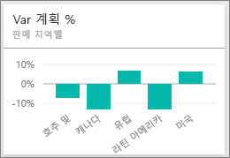

# Power BI의 IT 지출 분석 샘플: 둘러보기

## IT 지출 분석 샘플 개요
IT 지출 분석 [콘텐츠 팩](service-organizational-content-pack-introduction.md)(대시보드, 보고서 및 데이터 세트)에서는 IT 부서의 계획된 비용과 실제 비용을 비교 분석합니다. 이러한 비교는 회사에서 한 해를 얼마나 잘 계획하는지 이해하고 계획과 편차가 큰 영역을 조사하는 데 도움이 됩니다. 이 예제의 회사는 연간 계획 주기를 거친 다음 분기별로 새로운 LE(Latest Estimate)를 생성하여 회계 연도 동안 IT 지출의 변화를 분석합니다.

이 샘플은 비즈니스 중심 데이터, 보고서 및 대시보드가 포함된 Power BI를 사용하는 방법을 보여 주는 시리즈의 일부입니다. 샘플은 익명화된 obviEnce(<http://obvience.com/>)의 실제 데이터입니다.

## 필수 조건

 이 샘플을 사용하려면 먼저 샘플을 [콘텐츠 팩](https://docs.microsoft.com/power-bi/sample-it-spend#get-the-content-pack-for-this-sample), [.pbix 파일](http://download.microsoft.com/download/E/9/8/E98CEB6D-CEBB-41CF-BA2B-1A1D61B27D87/IT%20Spend%20Analysis%20Sample%20PBIX.pbix) 또는 [Excel 통합 문서](http://go.microsoft.com/fwlink/?LinkId=529783)로 다운로드해야 합니다.

### 이 샘플의 콘텐츠 팩 가져오기

1. Power BI 서비스(app.powerbi.com)를 열고 로그인합니다.
2. 왼쪽 아래 모서리에서 **데이터 가져오기**를 선택합니다.
   
    
3. 데이터 가져오기 페이지가 표시되면 **샘플** 아이콘을 선택합니다.
   
   
4. **IT 지출 분석 샘플**을 선택한 다음 **연결**을 선택합니다.  
  
   
   
5. Power BI에서 콘텐츠 팩을 가져와 새 대시보드, 보고서 및 데이터 세트를 현재 작업 영역에 추가합니다. 새 콘텐츠에는 노란색 별표가 표시됩니다. 
   
   
  
### 이 샘플의 .pbix 파일 가져오기

또는 Power BI Desktop에 사용하도록 설계된 .pbix 파일로 샘플을 다운로드할 수 있습니다. 

 * [IT 지출 분석 샘플](http://download.microsoft.com/download/E/9/8/E98CEB6D-CEBB-41CF-BA2B-1A1D61B27D87/IT%20Spend%20Analysis%20Sample%20PBIX.pbix)

### 이 샘플의 Excel 통합 문서 다운로드
[이 샘플에 대한 데이터 집합(Excel 통합 문서)만 다운로드](http://go.microsoft.com/fwlink/?LinkId=529783)할 수도 있습니다. 통합 문서에는 보고 수정할 수 있는 파워 뷰 시트가 포함됩니다. 원시 데이터를 보려면 **파워 피벗 > 관리**를 선택합니다.

## IT 지출 분석 샘플 대시보드
**Var Plan %** 및 **Variance Latest Estimate % Quarter 3**대시보드에 있는 두 개의 번호 타일은 계획 및 최신 분기 예상(LE3 = Latest Estimate Quarter 3)에 대해 얼마나 잘 수행하고 있는지를 간략하게 보여 줍니다. 전체적으로 약 6% 계획에서 벗어났습니다. 시기, 위치 및 범주 등 이러한 차이의 원인을 살펴보겠습니다.

## "YTD IT 지출 추세 분석" 페이지
**Var Plan % by Sales Region** 대시보드 타일을 선택하면 IT 지출 분석 샘플 보고서의 "IT 지출 추세 분석" 페이지로 이동합니다. 미국과 유럽의 차이는 양수이고 캐나다, 라틴 아메리카와 오스트레일리아의 차이는 음수임을 한 눈에 알 수 있습니다. 미국은 약 6% +LE 차이를 보여 주고 오스트레일리아는 약 7% -LE 차이를 보여 줍니다.

그러나 이 차트만 보고 결론을 도출하면 잘못될 수 있습니다. 상황을 올바르게 분석하려면 실제 달러 금액을 확인해야 합니다.

1. Var Plan % by Sales Region 차트에서 **Aus and NZ**를 선택하고 Var Plan by IT Area 차트를 관찰합니다.

   
2. 이제 **USA**를 선택합니다. 오스트레일리아는 미국에 비해 전체 지출 중 매우 작은 부분을 차지함을 알 수 있습니다.

    따라서 미국으로 범위를 좁혔습니다. 이제는 어떻게 할까요? 이제 미국에서 차이를 발생시키는 범주를 살펴보겠습니다.

## 데이터에 대해 질문하기
1. 맨 위 탐색 모음에서 **IT 지출 분석 샘플**을 선택하여 대시보드로 돌아갑니다.
2. 질문 상자에 "show IT areas, var plan % and var le3 % bar chart"를 입력합니다.

   

   첫 번째 IT 영역 **Infrastructure**의 백분율이 초기 차이 계획과 차이 계획 최신 예상 사이에서 현저하게 변경되었습니다.

## "YTD Spend by Cost Elements" 페이지
대시보드로 돌아가 **Var Plan %, Var LE3%** 대시보드 타일을 확인합니다.

인프라가 계획과 엄청난 양의 차이를 보여 줍니다.

1. 이 타일을 클릭하여 IT 지출 분석 샘플 보고서의 "YTD Spend by Cost Elements" 페이지로 이동합니다.
2. 왼쪽 아래의 "Var Plan % and Var LE3 % by IT Area" 차트에서 **Infrastructure** 막대를 클릭하고 왼쪽에 있는 "Var Plan % by Sales Region"에서 계획과의 차이를 관찰합니다.

    
3. 슬라이서에서 각 Cost Element Group의 이름을 클릭하여 차이가 큰 비용 요소를 찾습니다.
4. **Other** 를 선택하고 IT Area에서 **Infrastructure** 를 클릭한 다음 IT Sub Area 슬라이서에서 하위 영역을 클릭하여 차이가 가장 큰 하위 영역을 찾습니다.  

   **Networking**에서 엄청난 차이를 확인할 수 있습니다.

   분명히 회사는 직원에게 전화 서비스를 혜택으로 제공하기로 결정했지만 이 이동이 계획되지 않았습니다.

## "Plan Variance Analysis" 페이지
보고서의 맨 아래에서 "Plan Variance Analysis" 탭을 클릭하여 보고서의 페이지 3으로 이동합니다.

왼쪽에 있는 "Var Plan, and Var Plan % by Business Area" 콤보 차트에서 Infrastructure 열을 클릭하여 나머지 페이지에서 인프라 값을 강조 표시합니다.

"Var plan% by Month and Business Area" 차트에서 인프라가 월쯤 양의 차이를 보이기 시작한 후 계속 증가하는 것을 확인합니다. 또한 인프라에 대한 계획 값의 차이가 모든 비즈니스 영역에 대한 값에 비해 국가별로 어떻게 변화하는지 확인합니다. 오른쪽에 있는 "IT Area" 및 "IT Sub Areas" 슬라이서를 사용하여 나머지 페이지에서 값을 강조 표시하는 대신 필터링합니다. 오른쪽에서 다른 IT 영역을 클릭하여 다른 방식으로 데이터를 탐색합니다. IT 하위 영역을 클릭하고 해당 수준에서 차이를 확인할 수도 있습니다.

## 보고서 편집
왼쪽 위 모서리에서 **보고서 편집** 을 클릭하고 편집용 보기에서 탐색합니다.

* 각 차트의 필드, 페이지의 필터 등 페이지가 만들어지는 방법을 확인합니다.
* 동일한 데이터를 기반으로 페이지 및 차트를 추가합니다.
* 각 차트에 대한 시각화 형식을 변경합니다.
* 대시보드에 고정합니다.

이제 재생하는 데 안전한 환경입니다. 언제든지 변경 내용을 저장하지 않도록 선택할 수 있습니다. 그러나 변경 내용을 저장하면 언제든지 이 샘플의 새 복사본에 대해 데이터 가져오기로 이동할 수 있습니다.

## 다음 단계: 데이터에 연결
이 둘러보기가 Power BI 대시보드, 질문 및 답변, 보고서를 통해 IT 지출 데이터를 파악하는 방법을 확인하는 데 도움이 되었기를 바랍니다. 이제 고유한 데이터에 연결할 차례입니다. Power BI를 사용하여 다양한 데이터 소스에 연결할 수 있습니다. [Power BI 시작하기](service-get-started.md)에 대해 자세히 알아보세요.
