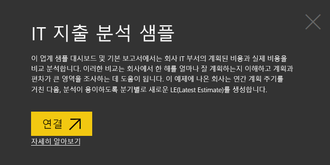
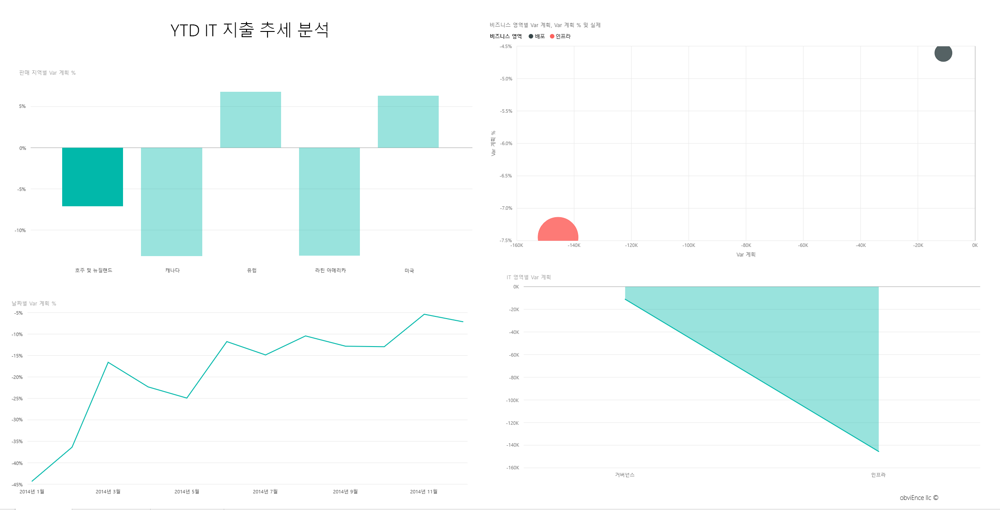
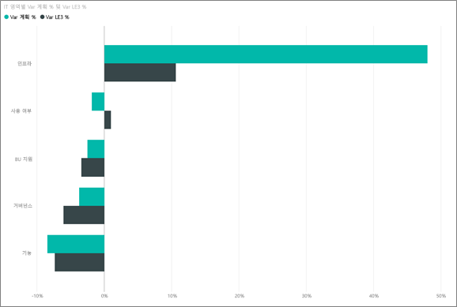
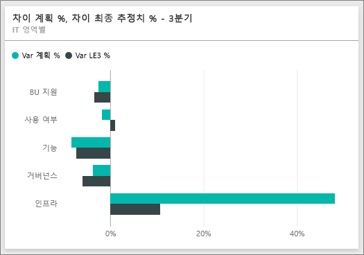
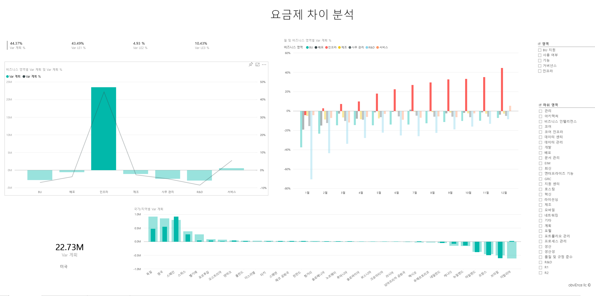

# Power BI의 IT 지출 분석 샘플: 둘러보기

IT 지출 분석 샘플 콘텐츠 팩에는 IT 부서의 계획된 비용 대 실제 비용을 분석하는 대시보드, 보고서 및 데이터 세트가 포함됩니다. 이러한 비교는 회사에서 한 해를 얼마나 잘 계획하는지 이해하고 계획과 편차가 큰 영역을 조사하는 데 도움이 됩니다. 이 예제의 회사는 연간 계획 주기를 거친 다음 분기별로 새로운 LE(Latest Estimate)를 생성하여 회계 연도 동안 IT 지출의 변화를 분석합니다.

이 샘플은 비즈니스 중심 데이터, 보고서 및 대시보드가 포함된 Power BI를 사용하는 방법을 보여 주는 시리즈의 일부입니다. [obviEnce](http://www.obvience.com/)에서 익명화된 실제 데이터로 생성되었습니다. 데이터는 콘텐츠 팩, .pbix Power BI Desktop 파일 또는 Excel 통합 문서 등 여러 형식으로 사용할 수 있습니다. [Power BI용 샘플](sample-datasets.md)을 참조하세요. 

이 자습서에서는 Power BI 서비스의 IT 지출 분석 샘플 콘텐츠 팩을 살펴봅니다. Power BI Desktop 및 Power BI 서비스의 보고서 환경은 비슷하므로 Power BI Desktop에서 샘플 .pbix 파일을 사용하여 이 자습서를 따라 해도 좋습니다. 

Power BI 라이선스가 없어도 Power BI Desktop의 샘플을 살펴볼 수 있습니다. Power BI Pro 라이선스가 없다면 샘플을 Power BI 서비스의 내 작업 영역에 저장하면 됩니다. 

## 샘플 가져오기

 이 샘플을 사용하려면 먼저 샘플을 [콘텐츠 팩](#get-the-content-pack-for-this-sample), [.pbix 파일](#get-the-pbix-file-for-this-sample) 또는 [Excel 통합 문서](#get-the-excel-workbook-for-this-sample)로 다운로드해야 합니다.

### 이 샘플의 콘텐츠 팩 가져오기

1. Power BI 서비스(app.powerbi.com)를 열고 로그인한 다음, 샘플을 저장할 작업 영역을 엽니다.

   Power BI Pro 라이선스가 없다면 샘플을 내 작업 영역에 저장하면 됩니다.

2. 왼쪽 아래 모서리에서 **데이터 가져오기**를 선택합니다.
   
   
3. **데이터 가져오기** 페이지가 표시되면 **샘플**을 선택합니다.
   
4. **IT 지출 분석 샘플**을 선택한 다음, **연결**을 선택합니다.  
  
   
   
5. Power BI에서 콘텐츠 팩을 가져온 다음, 새 대시보드, 보고서 및 데이터 세트를 현재 작업 영역에 추가합니다.
   
   
  
### 이 샘플의 .pbix 파일 가져오기

또는 Power BI Desktop에 사용하도록 디자인된 [.pbix 파일](http://download.microsoft.com/download/E/9/8/E98CEB6D-CEBB-41CF-BA2B-1A1D61B27D87/IT%20Spend%20Analysis%20Sample%20PBIX.pbix)로 IT 지출 분석 샘플을 다운로드할 수 있습니다.

### 이 샘플의 Excel 통합 문서 다운로드

이 샘플의 데이터 원본을 보려면 [Excel 통합 문서](http://go.microsoft.com/fwlink/?LinkId=529783)로도 제공됩니다. 통합 문서에는 보고 수정할 수 있는 파워 뷰 시트가 포함됩니다. 원시 데이터를 보려면 데이터 분석 추가 기능을 사용하도록 설정한 다음, **파워 피벗 > 관리**를 선택합니다. 파워 뷰와 파워 피벗 추가 기능을 사용하도록 설정하려면 [내부 Excel 자체에서 Excel 샘플 살펴보기](sample-datasets.md#optional-take-a-look-at-the-excel-samples-from-inside-excel-itself)에서 자세한 내용을 참조하세요.

## IT 지출 분석 샘플 대시보드
**Var Plan %** 및 **Variance Latest Estimate % Quarter 3** 대시보드의 왼쪽에 있는 두 개의 숫자 타일은 계획 및 최신 분기별 예상(LE3 = Latest Estimate Quarter 3)에 대해 얼마나 잘 수행하고 있는지를 간략하게 보여 줍니다. 전체적으로 약 6% 계획에서 벗어났습니다. 시기, 위치 및 범주 등 이 차이의 원인을 살펴보겠습니다.

## YTD IT 지출 추세 분석 페이지
**Var Plan % by Sales Region** 대시보드 타일을 선택하면 IT 지출 분석 샘플 보고서의 **YTD IT 지출 추세 분석** 페이지가 표시됩니다. 미국과 유럽의 차이는 양수이고 캐나다, 라틴 아메리카와 오스트레일리아의 차이는 음수임을 한눈에 알 수 있습니다. 미국은 약 6% +LE 차이를 보여 주고 오스트레일리아는 약 7% -LE 차이를 보여 줍니다.

그러나 이 차트만 보고 결론을 도출하면 잘못될 수 있습니다. 상황을 올바르게 분석하려면 실제 달러 금액을 확인해야 합니다.

1. **Var Plan % by Sales Region** 차트에서 **Aus and NZ**를 선택한 다음, **Var Plan by IT Area** 차트를 관찰합니다.

   
2. 이제 **USA**를 선택합니다. 오스트레일리아와 뉴질랜드는 미국과 비교해 전체 지출 중 매우 작은 부분을 차지함을 알 수 있습니다.

    다음으로, 미국에서 차이를 발생시키는 범주를 살펴보겠습니다.

## 데이터에 대해 질문하기
1. 맨 위 탐색 모음에서 **IT 지출 분석 샘플**을 선택하여 샘플 대시보드로 돌아갑니다.
2. **데이터에 대해 질문하기**를 선택합니다.
3. 왼쪽의 **시작하기 위한 질문** 목록에서 **IT 영역에서 계획이란?** 을 선택합니다.

   

4. 질문 및 답변 상자에서 이전 입력을 지우고 *show IT areas, var plan % and var le3 % bar chart*를 입력합니다.

   

   첫 번째 IT 영역 **Infrastructure**에서 백분율이 초기 차이 계획과 차이 계획 최신 예상 사이에서 현저하게 변경되었음을 알 수 있습니다.

## YTD Spend by Cost Elements 페이지

1. 대시보드로 돌아가서 **Variance Plan %, Variance Latest Estimate % - Quarter 3** 대시보드 타일을 확인합니다.

   

   인프라 영역에서는 계획에 대한 큰 양의 차이가 두드러진다는 것을 알 수 있습니다.

1. 이 타일을 선택하여 보고서를 열고 **YTD Spend by Cost Elements** 페이지를 확인합니다.
2. 오른쪽 아래의 **Var Plan % and Var LE3 % by IT Area** 차트에서 **Infrastructure** 막대를 선택하고 왼쪽 아래의 **Var Plan % by Sales Region** 차트에서 계획에 대한 차이 값을 관찰합니다.

    
3. **Cost Element Group** 슬라이서에서 각 이름을 선택하여 차이가 가장 큰 비용 요소를 찾습니다.
4. **Other** 를 선택하고, **IT Area** 슬라이서에서 **Infrastructure**를 선택하고, **IT Sub Area** 슬라이서에서 하위 영역을 선택하여 차이가 가장 큰 하위 영역을 찾습니다.  

   **네트워킹**에 대한 큰 차이를 확인할 수 있습니다. 이 이동이 계획되지 않았더라도 분명히 회사는 직원에게 전화 서비스를 혜택으로 제공하기로 했습니다.

## Plan Variance Analysis 페이지

1. 페이지 맨 아래에서 **Plan Variance Analysis** 탭을 선택합니다.

2. 왼쪽에 있는 **Var Plan and Var Plan % by Business Area** 차트에서 **Infrastructure** 열을 선택하여 나머지 페이지에서 인프라 비즈니스 영역 값을 강조 표시합니다.

    

   **Var plan % by Month and Business Area** 차트에서 인프라 비즈니스 영역이 2월에 양의 차이를 시작했음을 알 수 있습니다. 또한 해당 비즈니스 영역의 계획에 대한 차이 값이 모든 다른 비즈니스 영역과 비교해 국가별로 어떻게 변화하는지 알 수 있습니다. 

3. 오른쪽에 있는 **IT Area** 및 **IT Sub Area** 슬라이서를 사용하여 나머지 페이지의 값을 필터링하고 데이터를 살펴봅니다. 

## 보고서 편집
왼쪽 위 모서리에서 **보고서 편집**을 선택하여 편집용 보기에서 탐색합니다.

* 페이지가 어떻게 만들어지는지, 각 차트의 필드 및 페이지의 필터를 확인합니다.
* 동일한 데이터를 기반으로 페이지 및 차트를 추가합니다.
* 각 차트에 대한 시각화 형식을 변경합니다.
* 대시보드에 관심 있는 차트를 고정합니다.

## 다음 단계: 데이터에 연결
이 환경은 변경 내용을 저장하지 않도록 선택할 수 있으므로 안전하게 이용할 수 있습니다. 그러나 변경 내용을 저장하면 언제든지 이 샘플의 새 복사본에 대해 **데이터 가져오기**를 선택할 수 있습니다.

이 둘러보기가 Power BI 대시보드, 질문 및 답변, 보고서를 통해 샘플 데이터를 파악하는 방법을 확인하는 데 도움이 되었기를 바랍니다. 이제 사용자 데이터에 연결할 차례입니다. Power BI를 사용하여 다양한 데이터 원본에 연결할 수 있습니다. 더 자세히 알아보려면 [Power BI 서비스 시작하기](service-get-started.md)를 참조하세요.
