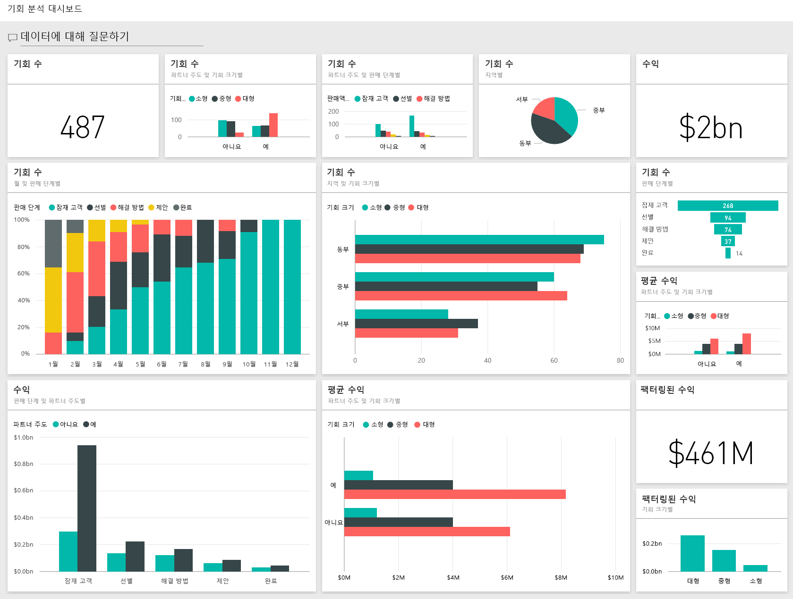
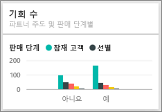
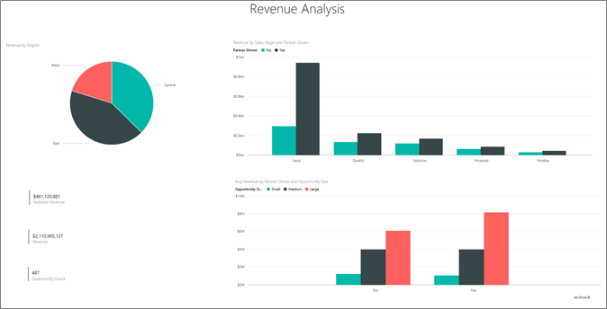

# Power BI의 기회 분석 샘플: 둘러보기

기회 분석 샘플 콘텐츠 팩은 *직접* 및 *파트너* 등 2개 영업 채널을 갖춘 소프트웨어 회사의 대시보드, 보고서 및 데이터 세트를 포함합니다. 영업 관리자는 지역, 거래 규모, 채널별로 기회와 수익을 추적하기 위해 이 대시보드를 만들었습니다.

이 샘플은 다음과 같은 두 가지 수익 측정치를 사용합니다.

* 수익: 수익에 대한 영업 직원의 추정입니다.
* 팩터링된 수익: 수익 X 가능성(%)으로 계산되며 실제 영업 수익의 더욱 정확한 예측 변수로 인정됩니다. 가능성은 거래의 현재 *영업 진행 단계*에 따라 결정됩니다.
  * 잠재 고객: 10%  
  * 선별: 20%  
  * 해결 방법: 40%  
  * 제안: 60%  
  * 완료: 80%

이 샘플은 비즈니스 중심 데이터, 보고서 및 대시보드가 포함된 Power BI를 사용하는 방법을 보여 주는 시리즈의 일부입니다. 익명화된 [obviEnce](http://www.obvience.com/)에 의해 실제 데이터로 생성되었습니다. 데이터는 콘텐츠 팩, .pbix Power BI Desktop 파일 또는 Excel 통합 문서 등 여러 형식으로 사용할 수 있습니다. [Power BI용 샘플](sample-datasets.md)을 참조하세요. 

이 자습서에서는 Power BI 서비스의 기회 분석 샘플 콘텐츠 팩을 살펴봅니다. Power BI Desktop 및 Power BI 서비스의 보고서 환경은 비슷하므로 Power BI Desktop에서 샘플 .pbix 파일을 사용하여 이 자습서를 따라 해도 좋습니다. 

Power BI 라이선스가 없어도 Power BI Desktop의 샘플을 살펴볼 수 있습니다. Power BI Pro 라이선스가 없다면 샘플을 Power BI 서비스의 내 작업 영역에 저장하면 됩니다. 

## 샘플 가져오기

이 샘플을 사용하려면 먼저 샘플을 [콘텐츠 팩](#get-the-content-pack-for-this-sample), [.pbix 파일](#get-the-pbix-file-for-this-sample) 또는 [Excel 통합 문서](#get-the-excel-workbook-for-this-sample)로 다운로드해야 합니다.

### 이 샘플의 콘텐츠 팩 가져오기

1. Power BI 서비스(app.powerbi.com)를 열고 로그인한 다음, 샘플을 저장할 작업 영역을 엽니다. 

    Power BI Pro 라이선스가 없다면 샘플을 내 작업 영역에 저장하면 됩니다.

2. 왼쪽 아래 모서리에서 **데이터 가져오기**를 선택합니다.

    
3. **데이터 가져오기** 페이지가 표시되면 **샘플**을 선택합니다.

4. **기회 분석 샘플**을 선택한 다음 **연결**을 선택합니다.  

   
5. Power BI에서 콘텐츠 팩을 가져온 다음, 새 대시보드, 보고서 및 데이터 세트를 현재 작업 영역에 추가합니다.

   

### 이 샘플의 .pbix 파일 가져오기

또는 기회 분석 샘플을 Power BI Desktop에서 사용하도록 구성된 [.pbix 파일](http://download.microsoft.com/download/9/1/5/915ABCFA-7125-4D85-A7BD-05645BD95BD8/Opportunity%20Analysis%20Sample%20PBIX.pbix)로서 다운로드할 수도 있습니다.

### 이 샘플의 Excel 통합 문서 다운로드

이 샘플의 데이터 원본을 보려면 [Excel 통합 문서](http://go.microsoft.com/fwlink/?LinkId=529782)로도 제공됩니다. 통합 문서에는 보고 수정할 수 있는 파워 뷰 시트가 포함됩니다. 원시 데이터를 보려면 데이터 분석 추가 기능을 사용하도록 설정한 다음, **파워 피벗 > 관리**를 선택합니다. 파워 뷰와 파워 피벗 추가 기능을 사용하도록 설정하려면 [내부 Excel 자체에서 Excel 샘플 살펴보기](sample-datasets.md#optional-take-a-look-at-the-excel-samples-from-inside-excel-itself)에서 자세한 내용을 참조하세요.

## 대시보드가 시사하는 점은 무엇입니까?
이 영업 관리자는 자신에게 중요한 메트릭을 추적하기 위해 대시보드를 만들었습니다. 관심을 끄는 무언가를 발견하면 타일을 선택하여 데이터를 상세히 확인할 수 있습니다.

- 회사 수익은 20억 달러이며 팩터링한 수익은 4억 6100만 달러입니다.
- 기회 개수 및 수익은 친숙한 깔때기 패턴을 따르며 각 후속 단계마다 감소하고 있습니다.
- 대부분의 기회는 동부 지역에 있습니다.
- 큰 기회는 중간 또는 소규모 기회보다 수익이 더 큽니다.
- 큰 거래가 성사된 파트너는 8백만 달러로, 직접 판매 6백만 달러보다 수익이 더 큽니다.

거래 성사를 위한 노력은 거래 규모와 관계없이 동일하므로 회사는 큰 기회에 대해 파악하기 위해 데이터를 분석해야 합니다.

1. 샘플을 저장한 작업 영역에서 **대시보드** 탭을 연 다음 **기회 분석 샘플** 대시보드를 찾아서 선택합니다.

2. **Opportunity Count by Partner Driven, Sales Stage**(파트너 주도 및 영업 단계별 기회 개수) 타일을 선택하여 기회 분석 샘플 보고서의 1페이지를 엽니다. 

    

## 보고서의 페이지 탐색

하단에서 페이지 탭을 선택하여 보고서의 각 페이지를 봅니다.

### 기회 개수 개요 페이지

다음 세부 정보를 참고하세요.
* 동부는 기회 개수의 측면에서 가장 큰 지역입니다.  
* **Opportunity Count by Region**(지역별 기회 개수) 원형 차트에서 각 지역을 차례로 선택하여 페이지를 지역으로 필터링합니다. 각 지역에서 파트너는 더 큰 기회를 훨씬 많이 추구하고 있는 것을 볼 수 있습니다.   
* **Opportunity Count by Partner Driven and Opportunity Size**(파트너 주도 및 기회 크기별 기회 개수) 세로 막대형 차트는 대부분의 큰 기회가 파트너 주도이며 대부분의 소규모 및 중간 규모 기회는 파트너 주도가 아님을 보여줍니다.
* **Opportunity Count by Sales Stage**(판매 단계별 기회 개수) 막대형 차트에서 각 **판매 단계**를 차례로 선택하여 지역별 개수의 차이를 봅니다. 동부 지역의 기회 개수가 가장 많지만, 솔루션, 제안, 완료 판매 단계에 있는 3개 지역 모두 어느 정도 동급의 개수를 가진 것을 알 수 있습니다. 이 결과는 중부와 서부에서 거래 성사율이 더 높음을 의미합니다.

### 수익 분석 페이지
이 페이지는 데이터는 유사한 형태지만 개수 대신 수익 큐브 뷰를 사용합니다.  

다음 세부 정보를 참고하세요.
* 동부는 기회 개수와 수익 면에서 모두 가장 큰 지역입니다.  
* **파트너 주도**에 대해 **예**를 선택하여 **Revenue by Sales Stage and Partner Driven**(판매 단계별 수익 및 파트너 주도) 차트를 필터링하면 수익이 $15억이고 팩터링된 수익이 $2억9400만임을 알 수 있습니다. 이 금액을 파트너 주도가 아닌 수익의 6억4400만 달러 및 1억6600만 달러와 비교합니다. 
* 파트너 주도 기회인 경우 비 파트너 주도 비즈니스의 6백만 달러보다 대형 고객의 평균 수익이 더 큽니다(8백만).  
* 파트너 주도 비즈니스에서 대규모 기회의 평균 수익은 중간 규모 기회보다 거의 2배에 가깝습니다.  
* 소형 및 중간 규모 비즈니스의 평균 수익은 파트너 주도와 비 파트너 주도 비즈니스에서 모두 비슷합니다.   

확실히 비파트너보다 파트너가 고객에게 더 잘 판매하고 있습니다. 파트너에게 더 많은 기회가 창출된다고 볼 수 있습니다.

### 지역 및 단계별 기회 개수
보고서의 이 페이지는 이전 페이지와 비슷한 방식으로 데이터를 살펴보되, 이를 지역 및 단계별로 분석합니다. 

다음 세부 정보를 참고하세요.
* **Opportunity Count by Region**(지역별 기회 개수) 원형 차트에서 **동부**를 선택하여 동부 지역으로 필터링하면 이 지역의 기회는 파트너 주도와 비파트너 주도로 균일하게 나뉘어 있음을 알 수 있습니다.
* 대규모 기회는 중부 지역에 많고 소규모 기회는 동부 지역에 많으며 중간 규모 기회는 서부에 가장 많습니다.

### 월별 예정된 기회 페이지
이 페이지에서는 비슷한 요인을 날짜 및 시간 관점에서 살펴봅니다. 
 

CFO가 이 페이지를 사용하여 작업 부하를 관리합니다. 영업 단계 및 월별 수익 기회를 살펴보면 적절하게 계획할 수 있습니다.

다음 세부 정보를 참고하세요.
* 완료 판매 단계의 평균 수익이 가장 높습니다. 이 거래를 성사시키는 것이 최우선 순위입니다.
* **월** 슬라이서에서 월을 선택하여 월별로 필터링하면 완료 단계에 있는 대규모 거래 기회가 가장 높은 달은 팩터링된 수익이 $7500만인 1월임을 알 수 있습니다. 반면 2월은 솔루션 및 제안 판매 단계에 있는 중간 규모 거래가 대부분입니다.
* 일반적으로 팩터링된 수익 수치는 영업 단계, 기회 개수, 거래 규모에 다라 변동됩니다. 오른쪽에 있는 **필터** 창을 사용하여 이런 요인에 대한 필터를 추가하면 더 자세한 인사이트를 발견할 수 있습니다.

## 다음 단계: 데이터에 연결
이 환경은 변경 내용을 저장하지 않도록 선택할 수 있으므로 안전하게 이용할 수 있습니다. 그러나 변경 내용을 저장하면 언제든지 이 샘플의 새 복사본에 대해 **데이터 가져오기**를 선택할 수 있습니다.

이 둘러보기가 Power BI 대시보드, 질문 및 답변, 보고서를 통해 샘플 데이터를 파악하는 방법을 확인하는 데 도움이 되었기를 바랍니다. 이제 사용자 데이터에 연결할 차례입니다. Power BI를 사용하여 다양한 데이터 원본에 연결할 수 있습니다. 더 자세히 알아보려면 [Power BI 서비스 시작하기](service-get-started.md)를 참조하세요.

