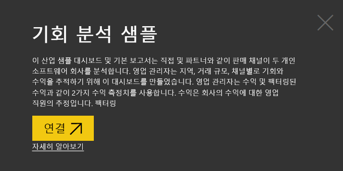

# Power BI의 기회 분석 샘플: 둘러보기

## 기회 분석 샘플 개요
**기회 분석 샘플**에는 *직접* 및 *파트너* 등의 2개 영업 채널을 갖춘 소프트웨어 회사의 대시보드(및 관련 보고서)가 포함되어 있습니다. 영업 관리자는 지역, 거래 규모, 채널별로 기회와 수익을 추적하기 위해 이 대시보드를 만들었습니다.

영업 관리자는 다음과 같은 두 가지 수익 측정치를 사용합니다.

* **수익** - 수익에 대한 영업 직원의 추정입니다.
* **팩터링한 수익** – 수익 X 가능성(%)으로 계산되며 일반적으로 실제 영업 수익의 보다 정확한 예측 변수로 인정됩니다. 가능성은 거래의 현재 ***영업 진행 단계***에 따라 결정됩니다.
  * 잠재 고객 - 10%  
  * 한정 – 20%  
  * 솔루션 – 40%  
  * 제안 - 60%  
  * 완료 - 80%

  

이 샘플은 비즈니스 중심 데이터, 보고서 및 대시보드가 포함된 Power BI를 사용하는 방법을 보여 주는 시리즈의 일부입니다. 이 샘플은 익명화된 obviEnce([www.obvience.com](http://www.obvience.com/))의 실제 데이터입니다.

## 필수 조건

 이 샘플을 사용하려면 먼저 샘플을 [콘텐츠 팩](https://docs.microsoft.com/power-bi/sample-opportunity-analysis#get-the-content-pack-for-this-sample), [.pbix 파일](http://download.microsoft.com/download/9/1/5/915ABCFA-7125-4D85-A7BD-05645BD95BD8/Opportunity-Analysis-Sample-PBIX.pbix) 또는 [Excel 통합 문서](http://go.microsoft.com/fwlink/?LinkId=529782)로 다운로드해야 합니다.

### 이 샘플의 콘텐츠 팩 가져오기

1. Power BI 서비스(app.powerbi.com)를 열고 로그인합니다.
2. 왼쪽 아래 모서리에서 **데이터 가져오기**를 선택합니다.
   
    
3. 데이터 가져오기 페이지가 표시되면 **샘플** 아이콘을 선택합니다.
   
   
4. **기회 분석 샘플**을 선택한 다음 **연결**을 선택합니다.  
  
   
   
5. Power BI에서 콘텐츠 팩을 가져와 새 대시보드, 보고서 및 데이터 집합을 현재 작업 영역에 추가합니다. 새 콘텐츠에는 노란색 별표가 표시됩니다. 
   
   
  
### 이 샘플의 .pbix 파일 가져오기

또는 Power BI Desktop에 사용하도록 설계된 .pbix 파일로 샘플을 다운로드할 수 있습니다. 

 * [기회 분석 샘플](http://download.microsoft.com/download/9/1/5/915ABCFA-7125-4D85-A7BD-05645BD95BD8/Opportunity%20Analysis%20Sample%20PBIX.pbix)

### 이 샘플의 Excel 통합 문서 다운로드
[이 샘플에 대한 데이터 집합(Excel 통합 문서)만 다운로드](http://go.microsoft.com/fwlink/?LinkId=529782)할 수도 있습니다. 통합 문서에는 보고 수정할 수 있는 파워 뷰 시트가 포함됩니다. 원시 데이터를 보려면 **파워 피벗 > 관리**를 선택합니다.

## 대시보드가 시사하는 점은 무엇입니까?
이 영업 관리자는 자신에게 중요한 메트릭을 추적하기 위해 대시보드를 만들었습니다. 관심을 끄는 무언가를 발견하면 타일을 선택하여 데이터를 상세히 확인할 수 있습니다.

1. 회사 수익은 20억 달러이며 팩터링한 수익은 4억 6100만 달러입니다.
2. 기회 개수 및 수익은 친숙한 깔때기 형태를 따르며 각 후속 단계마다 감소하고 있습니다.
3. 대부분의 기회는 동부 지역에 있습니다.
4. 큰 기회는 중간 또는 소규모 기회보다 수익이 더 큽니다.
5. 직접 판매의 6백만 달러에 비해 큰 거래가 성사된 파트너는 8백만 달러로, 수익이 더 큽니다.

거래 성사를 위한 노력은 거래 규모  규모에 관계없이 동일하므로 회사는 큰 기회에 대해 파악하기 위해 데이터를 상세 분석해야 합니다.

**파트너 주도 및 영업 단계별 기회 개수** 타일을 선택하여 보고서의 1페이지를 엽니다.  

## 보고서의 페이지 탐색
### 보고서의 1페이지 제목은 "기회 개수 개요"입니다.

* 동부는 기회 개수의 측면에서 가장 큰 지역입니다.  
* 원형 차트에서 한 번에 각 지역을 선택하여 페이지를 필터링합니다. 각 지역에서 파트너는 더 큰 기회를 훨씬 많이 추구하고 있습니다.   
* 파트너 주도 및 기회 크기별 기회 개수 열 차트는 대부분의 큰 기회가 파트너 주도이며 대부분의 소규모 및 중간 규모 기회는 파트너 주도가 아님을 명확히 보여줍니다.
* 하단 왼쪽의 막대 그래프에서 각 영업 단계를 선택해 보면, 동부가 개수의 측면에서는 가장 큰 규모의 지역이기는 하나 솔루션, 제안, 완료 단계에서는 3개 지역이 모두 비슷함을 확인할 수 있습니다. 즉 중부와 서부에서 거래 성사율이 더 높습니다.

### 보고서 2페이지의 제목은 "수익 개요"입니다.
이 페이지는 데이터는 유사한 형태지만 개수 대신 수익 큐브 뷰를 사용합니다.  

* 동부는 기회 개수와 수익면에서 모두 가장 큰 지역입니다.  
* 파트너 주도에 따른 필터링에서(맨 위 오른쪽 범례에서 **예** 선택) 매출이  15억 달러와 2억 9400만 달러임을 알 수 있습니다. 파트너 주도가 아닌 수익에서의 6440억 달러 및 1억 6600만 달러와 이 수치를 비교합니다.  
* 파트너 주도 기회인 경우 비 파트너 주도 비즈니스의 6백만 달러에 비해 대형 고객의 평균 수익이 더 큽니다(8백만).  
* 파트너 주도 비즈니스에서 대규모 기회의 평균 수익은 중간 규모 기회(4백만)에 비해 거의 2배에 가깝습니다.  
* 소형 및 중간 규모 비즈니스의 평균 수익은 파트너 주도와 비 파트너 주도 비즈니스에서 모두 비슷합니다.   

확실히 파트너가 고객에게 더 잘 판매하고 있습니다.  파트너에게 더 많은 기회가 창출된다고 볼 수 있습니다.

### 보고서 3페이지의 제목은 "지역 단계 개수"입니다.
이 페이지는 데이터와 유사하게 보이나 지역과 단계별로 상세히 설명하고 있습니다.  

* 동부로 필터링(원형 차트에서 **동쪽** 선택)하면 동부의 기회가 파트너 중심과 비 파트너 중심 모두에 균등하게 나뉘어 있음을 알 수 있습니다.
* 대규모 기회는 중부 지역에 많고 소규모 기회는 동부 지역에 많으며 중간 규모 기회는 서부에 가장 많습니다.

### 보고서 4페이지의 제목은 "예정된 기회"입니다.
다시 한 번 유사한 요인을 확인하겠지만 이번에는 날짜/시간의 관점에서 살펴보겠습니다.  

CFO가 이 페이지를 사용하여 작업 부하를 관리합니다. 영업 단계 및 월별 수익 기회를 살펴보면서 적합한 계획이 가능합니다.

* 완료 단계의 평균 수익이 가장 높습니다. 이 거래를 성사시키는 것이 최우선 순위입니다.
* 월별로 필터링(왼쪽 슬라이서에서 월 이름 선택)하면 1월이 완료 단계인 대규모 거래 기회 비율이 가장 높아, 팩터링된 수익이 7,500만 달러입니다. 반면 2월은 솔루션과 제안 단계의 중간 규모 거래가 대부분이었습니다.
* 일반적으로 팩터링된 수익 수치는 영업 단계, 기회 개수, 거래 규모에 다라 변동됩니다. 이런 요인에 대한 필터링(오른쪽의 필터 창 사용)을 추가하면 상세 정보를 파악할 수 있습니다.

이제 재생하는 데 안전한 환경입니다. 언제든지 변경 내용을 저장하지 않도록 선택할 수 있습니다. 그러나 변경 내용을 저장하면 언제든지 이 샘플의 새 복사본에 대해 **데이터 가져오기** 로 이동할 수 있습니다.

## 다음 단계: 데이터에 연결
이 둘러보기가 Power BI 대시보드, 질문 및 답변, 보고서를 통해 기회 추적 데이터에 대한 정보를 파악하는 데 도움이 되었기를 바랍니다. 이제 사용자 데이터에 연결할 차례입니다. Power BI를 사용하여 다양한 데이터 소스에 연결할 수 있습니다. [Power BI 시작하기](service-get-started.md)에 대해 자세히 알아보세요.

[샘플 다운로드](sample-datasets.md)  
