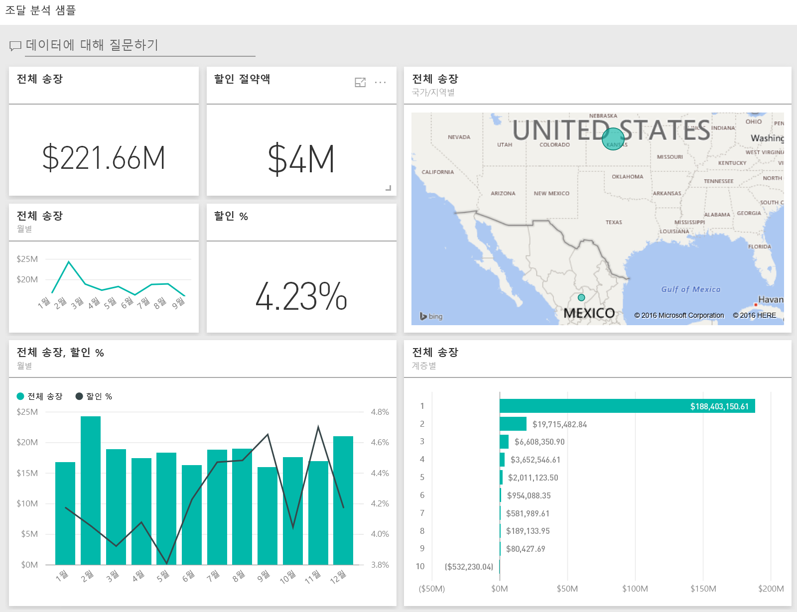
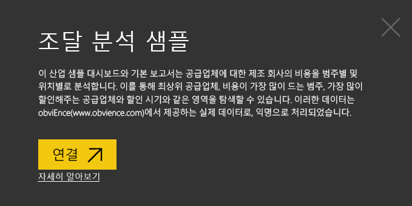
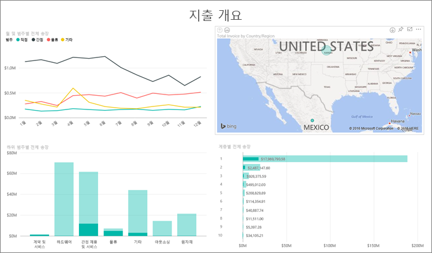
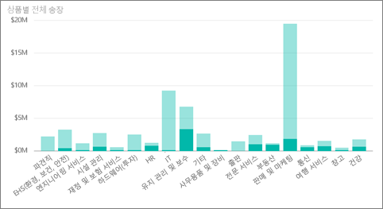
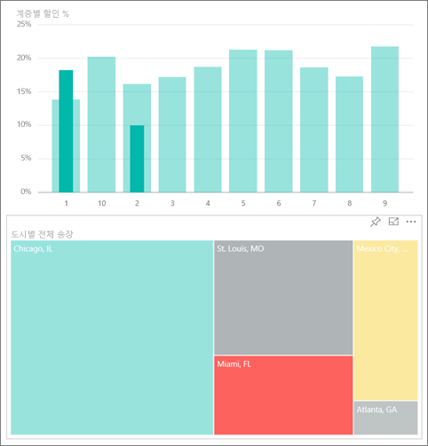
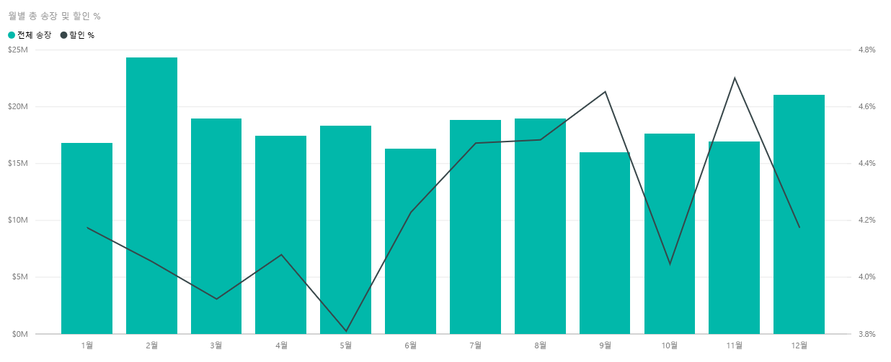

# Power BI의 조달 분석 샘플: 둘러보기

## 조달 분석 샘플 개요
이 산업 샘플 대시보드 및 기본 보고서는 범주 및 위치별로 공급업체에 대한 제조 회사의 지출을 분석할 수 있게 해 줍니다. 이 샘플에서는 다음 영역을 탐색합니다.

* 최상위 공급업체
* 가장 많이 지출하는 범주
* 최고 할인을 제공하는 공급업체 및 시기

이 샘플은 비즈니스 중심 데이터, 보고서 및 대시보드가 포함된 Power BI를 사용하는 방법을 보여 주는 시리즈의 일부입니다. 이 샘플은 익명화된 obviEnce([www.obvience.com](http://www.obvience.com/))의 실제 데이터입니다.

## 필수 조건

 이 샘플을 사용하려면 먼저 샘플을 [콘텐츠 팩](https://docs.microsoft.com/power-bi/sample-procurement#get-the-content-pack-for-this-sample), [.pbix 파일](http://download.microsoft.com/download/D/5/3/D5390069-F723-413B-8D27-5888500516EB/Procurement%20Analysis%20Sample%20PBIX.pbix) 또는 [Excel 통합 문서](http://go.microsoft.com/fwlink/?LinkId=529784)로 다운로드해야 합니다.

### 이 샘플의 콘텐츠 팩 가져오기

1. Power BI 서비스(app.powerbi.com)를 열고 로그인합니다.
2. 왼쪽 아래 모서리에서 **데이터 가져오기**를 선택합니다.
   
    
3. 데이터 가져오기 페이지가 표시되면 **샘플** 아이콘을 선택합니다.
   
   
4. **조달 분석 샘플**을 선택한 다음 **연결**을 선택합니다.  
  
   
   
5. Power BI에서 콘텐츠 팩을 가져와 새 대시보드, 보고서 및 데이터 세트를 현재 작업 영역에 추가합니다. 새 콘텐츠에는 노란색 별표가 표시됩니다. 
   
   
  
### 이 샘플의 .pbix 파일 가져오기

또는 Power BI Desktop에 사용하도록 설계된 .pbix 파일로 샘플을 다운로드할 수 있습니다. 

 * [조달 분석 샘플](http://download.microsoft.com/download/D/5/3/D5390069-F723-413B-8D27-5888500516EB/Procurement%20Analysis%20Sample%20PBIX.pbix)

### 이 샘플의 Excel 통합 문서 다운로드
[이 샘플에 대한 데이터 세트(Excel 통합 문서)만 다운로드](http://go.microsoft.com/fwlink/?LinkId=529784)할 수도 있습니다. 통합 문서에는 보고 수정할 수 있는 파워 뷰 시트가 포함됩니다. 원시 데이터를 보려면 **파워 피벗 > 관리**를 선택합니다.

## 지출 추세
먼저 범주 및 위치별 지출 추세를 살펴보겠습니다.  

1. 작업 영역에서 **대시보드** 탭을 열고 조달 분석 대시보드를 선택합니다.
2. **국가/지역별 전체 송장**대시보드 타일을 선택합니다. 그러면 "조달 분석 샘플" 보고서의 "지출 개요" 페이지가 열립니다.

    

다음 몇 가지 사항을 참고하세요.

* **Total Invoice by Month and Category**(월별 및 범주별 전체 송장) 꺾은선형 차트: **Direct**(직접) 범주의 지출은 상당히 일관되며 **Logistics**(물류)는 12월 지출이 가장 높고 **Other**(기타)는 2월이 가장 높습니다.
* **Total Invoice by Country/Region**(국가/지역별 전체 송장) 지도: 지출 대부분이 미국에 있는 경우
* **Total Invoice by Sub Category**(하위 범주별 전체 송장) 세로 막대형 차트: **Hardware**(하드웨어) 및 **Indirect Goods & Services**(간접 상품 및 서비스)가 가장 큰 지출 범주입니다.
* Total Invoice by Tier(계층별 전체 송장) 막대형 차트: 대부분의 비즈니스는 계층 1 (상위 10) 공급 업체와 이루어집니다. 때문에 공급업체 관계 관리에 도움이 됩니다.

## 멕시코에서의 지출
멕시코의 지출 영역을 살펴보겠습니다.

1. 원형 차트의 지도에서 **멕시코** 거품을 선택합니다. “Total Invoice by Sub Category”(하위 범주별 총 송장) 세로 막대형 차트에서 대부분이 **Indirect Goods & Services**(간접 상품 및 서비스) 하위 범주에 해당하는 것을 알 수 있습니다.

   
2. **Indirect Goods & Services**(간접 상품 및 서비스) 열로 드릴다운합니다.

   * 차트의 오른쪽 위에 있는 드릴다운 화살표를 를 선택합니다.
   * **Indirect Goods & Services**(간접 상품 및 서비스) 열을 선택합니다.

      이 범주 전체에서 가장 큰 지출은 판매 및 마케팅입니다.
   * 지도에서 **멕시코** 를 다시 선택합니다.

      멕시코의 이 범주에서 가장 큰 지출은 유지 관리 및 복구입니다.

      
3. 차트의 왼쪽 위에서 위쪽 화살표를 선택하여 다시 드릴업합니다.
4. 화살표를 다시 선택하면 드릴다운이 해제됩니다.  
5. 맨 위 탐색 모음에서 **Power BI**를 선택하여 작업 영역으로 돌아갑니다.

## 다른 도시 평가
강조 표시를 사용하여 다른 도시를 평가할 수 있습니다.

1. **전체 송장, 월별 할인 %** 대시보드 타일을 선택합니다. 보고서의 "할인 분석" 페이지가 열립니다.
2. **Total Invoice by City** (도시별 전체 송장) 트리맵에서 여러 도시를 선택하여 비교 결과를 확인합니다. 거의 모든 마이애미 송장의 출처는 계층 1 공급업체입니다.

   

## 공급업체 할인
공급업체에서 제공하는 할인과, 가장 큰 할인을 받는 시기도 살펴보겠습니다.

특히 다음과 같은 질문을 살펴보겠습니다.

* 할인율이 월마다 다른가요, 아니면 매달 동일한가요?
* 일부 도시가 다른 도시보다 할인율이 더 큰가요?

### 월별 할인
**Total Invoice and Discount % by Month** (전체 송장 및 월별 할인 %) 콤보 차트를 살펴보면 **2월** 이 가장 바쁜 달이고 **9월** 이 가장 덜 바쁜 달입니다. 이제 이 기간 동안 할인율을 살펴보겠습니다.
규모가 커지면 할인이 줄고 규모가 줄면 할인이 높아집니다. 할인을 더 받을수록 거래는 악화됩니다.

### 도시별 할인
살펴볼 또 다른 영역은 도시별 할인입니다. 트리맵의 각 도시를 선택하고 다른 차트가 어떻게 변화하는지 확인합니다.

* 미주리주의 세인트루이스는 2월에 전체 송장이 크게 높았으며 4월에는 할인 절약이 크게 떨어졌습니다.
* 멕시코의 멕시코시티가 할인율이 가장 높았고(11.05%) 조지아주의 아틀란타가 가장 적었습니다(0.08%).

### 보고서 편집
왼쪽 위에서 **보고서 편집** 을 선택하고 편집용 보기에서 탐색합니다.

* 페이지가 구성되는 방법을 살펴봅니다.
* 동일한 데이터를 기반으로 페이지 및 차트를 추가합니다.
* 트리맵을 도넛형 차트로 변경하는 등, 차트의 시각화 유형을 변경합니다.
* 대시보드에 고정합니다.

이제 재생하는 데 안전한 환경입니다. 언제든지 변경 내용을 저장하지 않도록 선택할 수 있습니다. 변경 내용을 저장하면 언제든지 이 샘플의 새 복사본에 대해 **데이터 가져오기** 로 이동할 수 있습니다.

## 다음 단계: 데이터에 연결
이 둘러보기가 Power BI 대시보드와 보고서를 통해 조달 데이터를 파악하는 방법을 확인하는 데 도움이 되었기를 바랍니다. 이제 사용자 데이터에 연결할 차례입니다. Power BI를 사용하여 다양한 데이터 소스에 연결할 수 있습니다. [Power BI 시작하기](service-get-started.md)에 대해 자세히 알아보세요.
