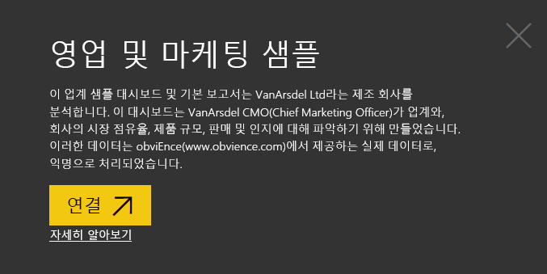
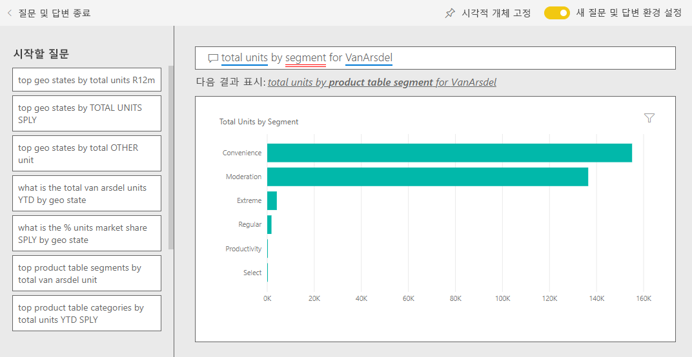
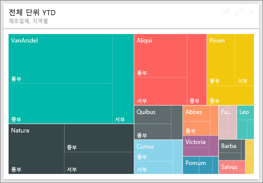
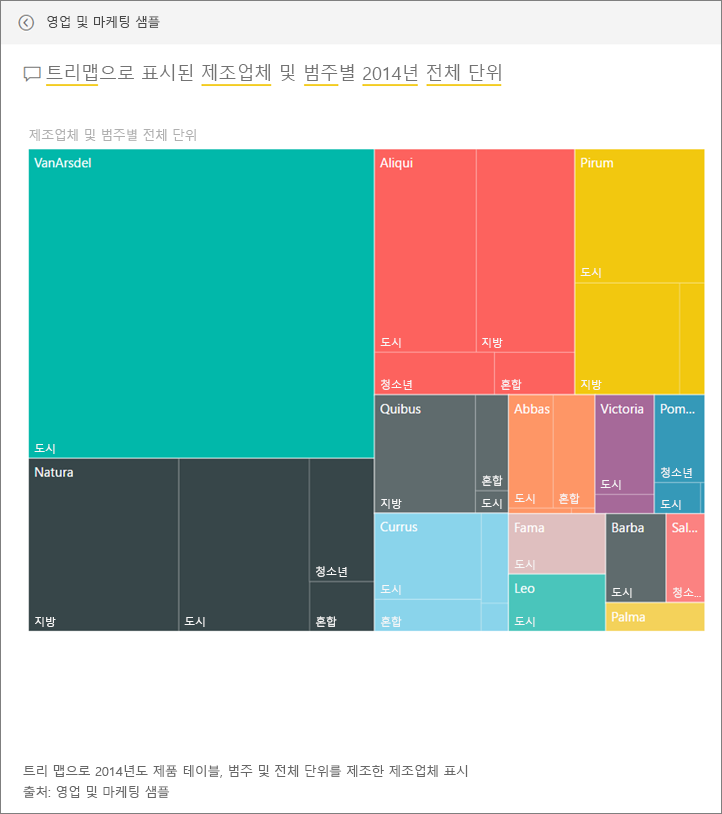
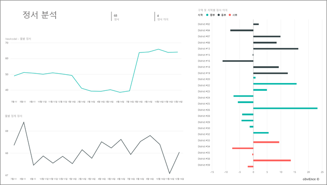
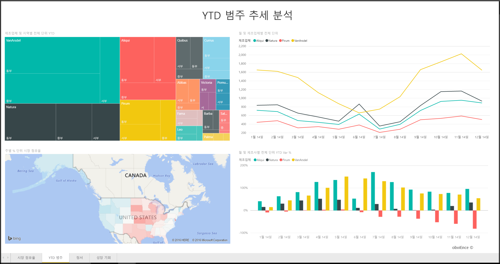
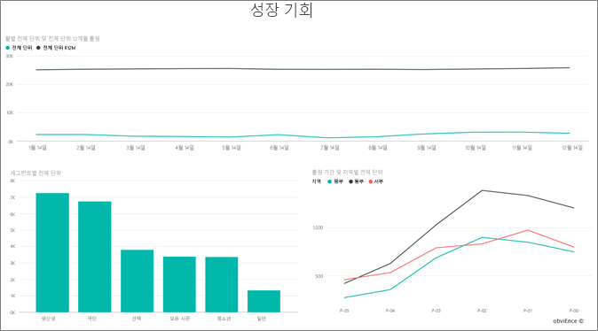

# Power BI의 영업 및 마케팅 샘플: 둘러보기

## 영업 및 마케팅 샘플 개요
**영업 및 마케팅 샘플** 에는 VanArsdel Ltd.라는 가상의 제조 회사에 대한 대시보드 및 보고서가 들어 있습니다. 이 대시보드는 VanArsdel CMO(Chief Marketing Officer)가 업계와, 회사의 시장 점유율, 제품 규모, 판매 및 인지에 대해 파악하기 위해 만들었습니다.

VanArsdel에는 많은 경쟁사가 있으나 업계 선두업체입니다. CMO는 시장 점유율을 높이고 성장 기회를 모색하고자 합니다. 하지만 어떤 이유로 VanArsdel의 시장 점유율이 떨어지기 시작했고 6월에 큰폭으로 하락했습니다.

이 샘플은 비즈니스 중심 데이터, 보고서 및 대시보드가 포함된 Power BI를 사용하는 방법을 보여 주는 시리즈의 일부입니다. 이 샘플은 익명화된 obviEnce(www.obvience.com)의 실제 데이터입니다.

## 필수 조건

 이 샘플을 사용하려면 먼저 샘플을 [콘텐츠 팩](https://docs.microsoft.com/en-us/power-bi/sample-sales-and-marketing#get-the-content-pack-for-this-sample), [.pbix](http://download.microsoft.com/download/9/7/6/9767913A-29DB-40CF-8944-9AC2BC940C53/Sales and Marketing Sample PBIX.pbix) 또는 [Excel 통합 문서](http://go.microsoft.com/fwlink/?LinkId=529785)로 다운로드해야 합니다.

### 이 샘플의 콘텐츠 팩 가져오기

1. Power BI 서비스(app.powerbi.com)를 열고 로그인합니다.
2. 왼쪽 아래 모서리에서 **데이터 가져오기**를 선택합니다.
   
    
3. 데이터 가져오기 페이지가 표시되면 **샘플** 아이콘을 선택합니다.
   
   
4. **영업 및 마케팅 샘플**을 선택한 다음 **연결**을 선택합니다.  
  
   
   
5. Power BI에서 콘텐츠 팩을 가져와 새 대시보드, 보고서 및 데이터 집합을 현재 작업 영역에 추가합니다. 새 콘텐츠에는 노란색 별표가 표시됩니다. 
   
   
  
### 이 샘플의 .pbix 파일 가져오기

또는 Power BI Desktop에 사용하도록 설계된 .pbix 파일로 샘플을 다운로드할 수 있습니다. 

 * [영업 및 마케팅 샘플](http://download.microsoft.com/download/9/7/6/9767913A-29DB-40CF-8944-9AC2BC940C53/Sales%20and%20Marketing%20Sample%20PBIX.pbix)

### 이 샘플의 Excel 통합 문서 다운로드
[이 샘플에 대한 데이터 집합(Excel 통합 문서)만 다운로드](http://go.microsoft.com/fwlink/?LinkId=529785)할 수도 있습니다. 통합 문서에는 보고 수정할 수 있는 파워 뷰 시트가 포함됩니다. 원시 데이터를 보려면 **파워 피벗 > 관리**를 선택합니다.

## 대시보드가 시사하는 점은 무엇입니까?
대시보드를 둘러보고 CMO가 고정하도록 선택한 타일을 살펴보겠습니다. 시장 점유율, 판매 및 인지에 대한 정보를 확인합니다. 또한 지역, 시간, 경쟁에 따라 분석한 데이터를 살펴봅니다.

* 왼쪽 열의 세로에 있는 번호 타일은 지난 해 업계 판매량(50K), 시장 점유율(32.86%), 판매량(16K), 인지 점수(68), 인지 차이(4), 총 판매 단위(1M)를 나타냅니다.
* 맨 위의 꺽은선형 차트는 시간 경과에 따른 시장 점유율 변동을 보여줍니다. 시장 점유율은 6월에 큰폭으로 하락했습니다. 또한 한동안 증가했던 R12M(12개월 롤링) 점유율도 정체 상태입니다.
* 가운데 세로 막대형 차트 타일 자료에서 드러나듯 최대 경쟁사는 Aliqui입니다.
* 대부분의 비즈니스는 동부 및 중부에서 이루어집니다.
* 아래쪽의 꺾은선형 차트는 6월 하락이 비수기에 따른 것이 아님을 보여줍니다. 어떤 경쟁사도 이런 추세를 보이지 않았습니다.
* 두 "총 단위" 타일은 판매된 단위를 부문 및 지역/제조사별로 보여줍니다. 업종의 최대 시장 부문은 **생산성** 및 **편의**입니다.

### Q & A를 사용하여 상세히 알아보기
#### 어떤 부문이 매출에 기여합니까? 업계 추세에 부합합니까?
1. “부문별 전체 총 단위”를 선택하면 Q&A가 열립니다.
2. 기존 쿼리 끝에 **for VanArsdel**을 입력합니다. Q&A가 이 질문을 해석하고 업데이트된 차트를 답과 함께 표시합니다. 제품 규모는 편의 및 중재에서 기인합니다.

   
3. **중재** 및 **편의** 카테고리의 점유율은 매우 높으며 회사에 경쟁력이 있는 부문입니다.
4. 맨 위 탐색 모음에서 대시보드 이름을 선택하여 대시보드로 다시 이동합니다(breadcrumbs).

#### 카테고리의 총 단위 시장 점유율이 어떻게 나타납니까?(지역 대비)
1. “제조사, 지역별 총 단위 YTD” 타일을 확인합니다. 카테고리별 총 단위 시장 점유율이 어떤지 궁금합니다.

   
2. 대시보드 위의 질문 상자에 **제조사별 총 단위 및 2014년의 범주를 트리맵으로 보기 위한** 질문을 입력합니다. 질문을 입력하면 시각화가 어떻게 업데이트되는지 확인합니다.
   
3. 결과를 비교하려면 차트를 대시보드에 고정합니다. 매우 흥미롭게도 2014년 VanArsdel은 **도시** 범주에 부합하는 제품만 판매했습니다.
4. 대시보드로 되돌아갑니다.

대시보드는 보고서의 진입점이기도 합니다.  타일이 기본 보고서를 통해 만들어진 경우 해당 타일을 클릭하면 보고서가 열립니다.

이 대시보드에서 R12M(12개월 롤링) 선은 시장 점유율이 시간 경과에 따라 증가하지 않았으며 심지어 다소 감소했음을 보여줍니다. 또한 6월에 시장 점유율이 대폭 하락한 이유는 무엇입니까? 추가적인 조사를 위해 이 시각화 요소를 클릭하면 기본 보고서가 열립니다.

### 보고서는 4페이지입니다.
#### 보고서의 1페이지는 VanArsdel의 시장 점유율에 초점을 둡니다.

1. 맨 아래의 “월별 총 단위 및 isVanArsdel” 세로 막대형 차트를 살펴보겠습니다. 검은색 열은 VanArsdel(자사) 제품, 녹색은 경쟁사 제품을 나타냅니다. 2014년 6월 VanArsdel에 발생한 하락이 경쟁사에는 없었습니다.
2. 오른쪽 가운데의 “부문별 총 범주 규모" 가로 막대형 차트를 필터링하면 VanArsdel의 상위 2개 부문이 표시됩니다. 이 필터를 만든 방법을 살펴봅니다.  

   a.  오른쪽 필터 창을 확장합니다.  
   b.  클릭하여 시각화를 선택합니다.  
   c.  시각적 수준 필터에서 **편의** 및 **중재**만 포함하도록 **부문**을 필터링합니다.  
   d.  부문을 선택하여 해당 섹션을 확장하고 **생산성**을 선택하여 해당 부문도 추가함으로써 필터를 수정합니다.  
3. "월별 총 단위 및 isVanArsdel"에서 범례의 검은색 "예"를 선택하여 VanArsdel로 페이지를 교차 필터링합니다. 생산성 부문에서는 경쟁이 없습니다.
4. 검은색 "예"를 다시 선택하여 필터를 제거합니다.
5. 꺽은선형 차트를 살펴봅니다. 월별 시장 점유율과 12개월 롤링 시장 점유율이 표시됩니다. 12개월 롤링 데이터는 월별 변동을 평준화하여 장기적 추세를 파악하는 데 도움이 됩니다. 가로 막대형 차트의 편의 및 중재를 차례로 선택하여 각 부문의 시장 점유율이 어떻게 변화했는지 확인합니다. 중재 부문은 편의 부문보다 시장 점유율 변동이 큽니다.

6월에 시장 점유율이 대폭 하락한 원인을 아직 찾고 있습니다. 인지를 확인해 보겠습니다.

#### 보고서의 3페이지는 인지에 초점을 맞춥니다.

트윗, Facebook, 블로그, 기사 등을 두 줄 꺾은선형 차트로 표시하여 인지를 나타냅니다. 맨 위 왼쪽 인지 차트는 회사 제품의 인지가 2월까지는 중간에 가까움을 보여줍니다. 이후 2월부터 크게 떨어지기 시작해 6월에 바닥을 찍었습니다. 이러한 인지 하락의 원인은 무엇일까요? 외부 원인에 대한 확인이 필요합니다. 2월에 몇 가지 기사와 블로그에서 VanArsdel의 고객 서비스를 업계 최악이라고 평가했습니다. 이러한 적대적 언론보도가 고객의 인지와 판매에 직접적인 상관 관계가 있었습니다. VanArsdel은 고객 서비스를 개선하기 위해 많은 노력을 기울였고 고객과 업계가 이를 확인했습니다. 7월에 긍정적인 인지가 상승하기 시작해 60s에서 최고 수준에 도달했습니다. 이 인지 상승은 1페이지와 3페이지의 “월별 총 단위"에 반영되었습니다. 아마도 이 사실이 부분적으로 6월의 시장 점유율 하락을 설명해 줄 수 있을 것입니다.

인지 차이에는 조사가 필요한 다른 부분이 있습니다. 즉 어느 구역에서 인지 차이가 높으며 경영진에서 어떻게 이를 이용할 수 있고 다른 구역에서 이를 어떻게 재현할 수 있는지 등을 모색할 수 있습니다. 

#### 보고서의 2페이지는 인지에 YTD 범주 추세에 초점을 맞춥니다.

* 이 범주에서는 모든 회사 중에 VanArsdel이 가장 큰 규모이며 주요 경쟁사는 Natura, Aliqui, Pirium 등입니다. 경쟁사를 지켜볼 것입니다.
* Aliqui는 성장하는 기업이지만 제품 규모가 자사에 비해 여전히 적습니다.
* 트리맵에는 VanArsdel이 녹색으로 표시되어 있습니다. 동부의 고객은 경쟁사를 선호하고, 중부에서는 자사가 선전하고 있으며 동부에서의 점유율은 가장 낮습니다.
* 지리적 요인이 판매 단위에 영향을 미칩니다. 동부는 대부분의 제조사에게 중심 지역이며 VanArsdel은 중부 지역에서도 강력한 입지를 다지고 있습니다.
* 하단 오른쪽의 “월별 및 제조사별 총 단위 YTD 변동 %” 차트를 보면 긍정적인 신호가 되는 변화가 있습니다. 즉 지난 해보다 영업이 괜찮다는 점인데 경쟁사인 Aliqui도 마찬가지입니다.

#### 보고서의 4페이지는 경쟁 제품 분석에 중점을 둡니다.

* 왼쪽 하단 차트는 VanArsdel의 가장 강력한 두 부문을 제외한 모든 범주 부문을 보여줍니다. 막대를 클릭하여 범주별로 필터링하면 VanArsdel이 확장 가능한 영역을 파악하는 데 도움이 됩니다. **익스트림** 및 **생산성** 부문은 다른 항목보다 빠르게 성장하고 있습니다.
* 그러나 이 부문에서는 경쟁하지 않고 있습니다. 이 영역으로 진입하려 한다면 데이터를 사용하여 어떤 지역에서 어떤 부문이 인기가 높은지 파악할 수 있습니다. 나아가 어떤 지역이 더 빠르게 성장하며 해당 부문에서 누가 가장 큰 경쟁사인지 등의 질문을 조사할 수 있습니다.
* 6월에 시장 점유율이 급격히 하락한 사실을 상기해 봅니다. 6월은 생산성 부문에서 중요한 달인데 자사가 전혀 경쟁하고 있지 않은 부문입니다. 이 사실이 6월의 점유율 하락을 설명해 줄 수 있습니다.

VanArsdel, 부문, 월, 지역별로 시각화를 필터링하면 VanArsdel의 성장 기회를 모색할 수 있습니다.

이제 재생하는 데 안전한 환경입니다. 언제든지 변경 내용을 저장하지 않도록 선택할 수 있습니다. 그러나 변경 내용을 저장하면 언제든지 이 샘플의 새 복사본에 대해 **데이터 가져오기** 로 이동할 수 있습니다.

## 다음 단계: 데이터에 연결
이 둘러보기가 Power BI 대시보드, 질문 및 답변, 보고서를 통해 영업 및 마케팅 데이터에 대한 정보를 파악하는 데 도움이 되었기를 바랍니다. 이제 사용자 데이터에 연결할 차례입니다. Power BI를 사용하여 다양한 데이터 소스에 연결할 수 있습니다. [Power BI 시작하기](service-get-started.md)에 대해 자세히 알아보세요.  
