# Power BI용 공급업체 품질 분석 샘플: 둘러보기

이 업계 샘플 대시보드 및 기본 보고서에서는 일반적인 공급망 문제 중 하나인 공급업체 품질 분석에 집중합니다. 이 분석에서 중요한 두 가지 기본 메트릭은 총 결함 수와 이러한 결함으로 인한 총 가동 중지 시간입니다. 

이 샘플의 기본적 목표는 다음 두 가지입니다.

* 품질과 관련하여 최고 및 최악의 공급업체를 파악합니다.
* 결함을 발견하고 거부하는 작업을 더 효율적으로 수행하여 가동 중지 시간을 최소화하는 공장을 식별합니다.

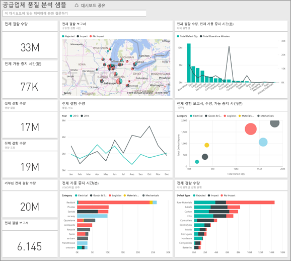

이 샘플은 비즈니스 중심 데이터, 보고서 및 대시보드가 포함된 Power BI를 사용하는 방법을 보여 주는 시리즈의 일부입니다. [obviEnce](http://www.obvience.com/)에서 익명화된 실제 데이터로 생성되었습니다. 데이터는 콘텐츠 팩, .pbix Power BI Desktop 파일 또는 Excel 통합 문서 등 여러 형식으로 사용할 수 있습니다. [Power BI용 샘플](sample-datasets.md)을 참조하세요. 

이 자습서에서는 Power BI 서비스의 공급업체 품질 분석 샘플 콘텐츠 팩을 살펴봅니다. Power BI Desktop 및 Power BI 서비스의 보고서 환경은 비슷하므로 Power BI Desktop에서 샘플 .pbix 파일을 사용하여 이 자습서를 따라 해도 좋습니다. 

Power BI 라이선스가 없어도 Power BI Desktop의 샘플을 살펴볼 수 있습니다. Power BI Pro 라이선스가 없다면 샘플을 Power BI 서비스의 내 작업 영역에 저장하면 됩니다. 

## 샘플 가져오기

이 샘플을 사용하려면 먼저 샘플을 [콘텐츠 팩](#get-the-content-pack-for-this-sample), [.pbix 파일](#get-the-pbix-file-for-this-sample) 또는 [Excel 통합 문서](#get-the-excel-workbook-for-this-sample)로 다운로드해야 합니다.

### 이 샘플의 콘텐츠 팩 가져오기

1. Power BI 서비스(app.powerbi.com)를 열고 로그인한 다음, 샘플을 저장할 작업 영역을 엽니다.

   Power BI Pro 라이선스가 없다면 샘플을 내 작업 영역에 저장하면 됩니다.

2. 왼쪽 아래 모서리에서 **데이터 가져오기**를 선택합니다.
   
   
3. **데이터 가져오기** 페이지가 표시되면 **샘플**을 선택합니다.
   
4. **공급업체 품질 분석 샘플**과 **연결**을 차례로 선택합니다.  
   
   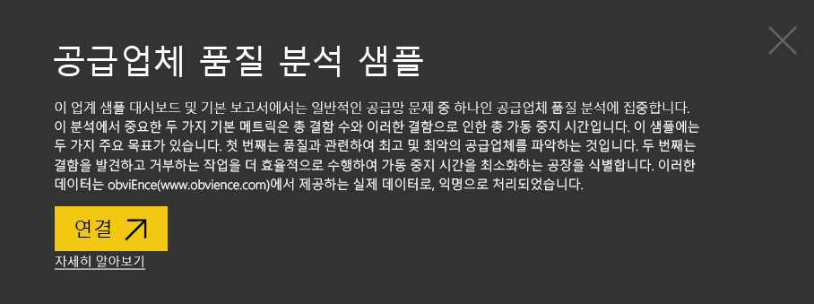

5. Power BI에서 콘텐츠 팩을 가져온 다음, 새 대시보드, 보고서 및 데이터 세트를 현재 작업 영역에 추가합니다.
   
   
  
### 이 샘플의 .pbix 파일 가져오기

또는 공급업체 품질 분석 샘플을 Power BI Desktop에서 사용하도록 설계된 [.pbix 파일](https://download.microsoft.com/download/8/C/6/8C661638-C102-4C04-992E-9EA56A5D319B/Supplier-Quality-Analysis-Sample-PBIX.pbix)로 다운로드할 수 있습니다.

### 이 샘플의 Excel 통합 문서 다운로드

이 샘플의 데이터 원본을 보려면 [Excel 통합 문서](https://go.microsoft.com/fwlink/?LinkId=529779)로도 제공됩니다. 통합 문서에는 보고 수정할 수 있는 파워 뷰 시트가 포함됩니다. 원시 데이터를 보려면 데이터 분석 추가 기능을 사용하도록 설정한 다음, **파워 피벗 > 관리**를 선택합니다. 파워 뷰와 파워 피벗 추가 기능을 사용하도록 설정하려면 [내부 Excel 자체에서 Excel 샘플 살펴보기](sample-datasets.md#optional-take-a-look-at-the-excel-samples-from-inside-excel-itself)에서 자세한 내용을 참조하세요.

## 결함이 있는 자재로 인한 가동 중지 시간
결함이 있는 자재로 인해 발생한 가동 중지 시간을 분석하고 책임 공급업체가 어느 곳인지 확인하겠습니다.  

1. 대시보드에서 **총 결함 수** 또는 **총 가동 시간(분)** 타일을 선택합니다.

   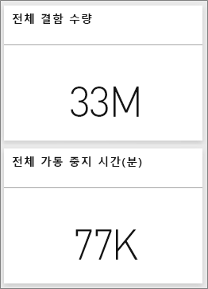  

   공급업체 품질 분석 샘플 보고서가 **가동 중지 시간 분석** 페이지에서 열립니다.

   3,300만 개의 결함 부품이 있으며 77,000분의 총 가동 중지 시간이 발생했습니다. 일부 자재는 결함 부품 수가 더 적지만 지연을 초래할 수 있어 가동 중지 시간이 길어집니다. 보고서 페이지에서 살펴보겠습니다.  
2. **자재 유형별 결함 및 가동 중지 시간(분)** 콤보 차트에서 **총 가동 중지 시간(분)** 을 살펴보면 골판 자재로 인해 가장 많은 가동 중지 시간이 발생한 것을 확인할 수 있습니다.  
3. **골판** 열을 선택하여 어느 공장이 이 결함으로 인해 가장 많은 영향을 받았고 책임 공급업체는 어디인지 확인합니다.  

     
4. **공장별 가동 중지 시간(분)** 맵에서 개별 공장을 차례로 선택하여 해당 공장에서 가동 중지 시간의 원인이 된 공급업체 또는 자재를 확인합니다.

### 최악의 공급업체는 어디입니까?
 최악의 공급업체 8곳을 찾고 이러한 공급업체로 인해 발생한 가동 중지 시간이 총 가동 중지 시간의 몇 퍼센트를 차지하는지 알아보겠습니다. **공급업체별 가동 중지 시간(분)** 영역 차트를 트리맵으로 변경하면 됩니다.  

1. 보고서의 **가동 중지 시간 분석** 페이지에서 왼쪽 위에 있는 **보고서 편집**을 선택합니다.  
2. **공급업체별 가동 중지 시간(분)** 영역 차트를 선택하고, **시각화** 창에서 **트리맵** 아이콘을 선택합니다.  

   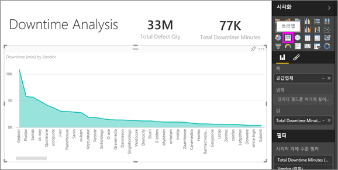  

    트리맵이 자동으로 **공급업체** 필드를 **그룹**으로 설정합니다.  

    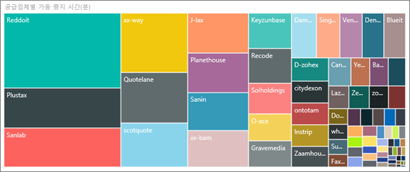  

   이 트리맵에서 상위 8개 공급업체가 트리맵 왼쪽에 있는 8개 블록임을 확인할 수 있습니다. 또한 이러한 공급업체가 전체 가동 시간(분)에서 약 50%를 차지하는 것도 볼 수 있습니다.  
3. 위쪽 탐색 창에서 **공급업체 품질 분석 샘플**을 선택하여 대시보드로 돌아갑니다.

### 공장 비교
이제 어느 공장이 결함이 있는 자재를 더 효과적으로 관리하여 가동 중지 시간을 줄이고 있는지 알아보겠습니다.  

1. 대시보드에서 **공장별, 결함 유형별 총 결함 보고서** 맵 타일을 선택합니다.      

   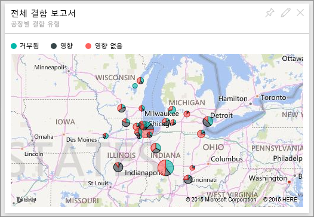  

   보고서가 **공급업체 품질 분석** 페이지에서 열립니다.  

2. **공장별, 결함 유형별 총 결함 보고서**의 범례에서 **영향** 원을 선택합니다.  

    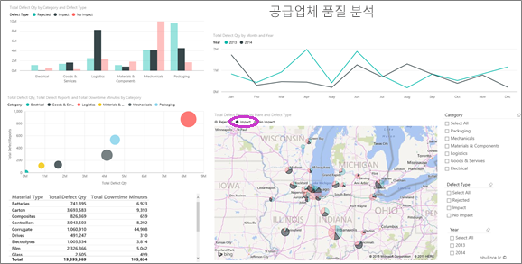  

    거품형 차트에서 **물류**가 가장 문제가 큰 범주임을 확인합니다. 총 결함 수량, 결함 보고서 및 가동 중지 시간(분)에서 거품이 가장 큽니다. 이 범주를 자세히 알아보겠습니다.  
3. 거품형 차트에서 **물류** 거품을 선택하고 일리노이주 스프링필드와 네이퍼빌에 있는 공장을 관찰합니다. 영향 횟수가 많은 스프링필드에 비해, 네이퍼빌은 거부 횟수가 많고 영향 수가 적어 결함이 있는 소모품을 효과적으로 관리하는 것으로 나타납니다.  

   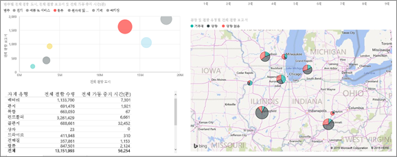  
4. 위쪽 탐색 창에서 **공급업체 품질 분석 샘플**을 선택하여 대시보드로 돌아갑니다.

## 어떤 자재 유형을 가장 잘 관리하고 있습니까?
가장 효과적으로 관리되는 자재 유형은 결함 수량과 상관없이 가동 중지 시간이 가장 적거나 영향이 없는 자재입니다.

1. 대시보드에서 **자재 유형별, 결함 유형별 총 결함 수량** 타일을 보십시오.

   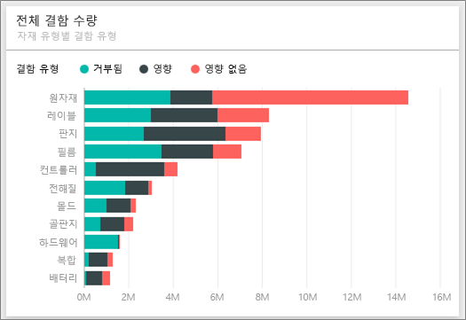

   **원자재** 자재 유형은 총 결함 수가 많지만 대부분의 결함이 거부되었거나 영향이 없습니다.

   이 자재 유형의 결함 수량이 많아도 많은 가동 중지 시간을 초래하지 않음을 확인해 보겠습니다.

2. 대시보드에서 **자재 유형별 총 결함 수량, 총 다운타임 시간(분)** 타일을 보십시오.

   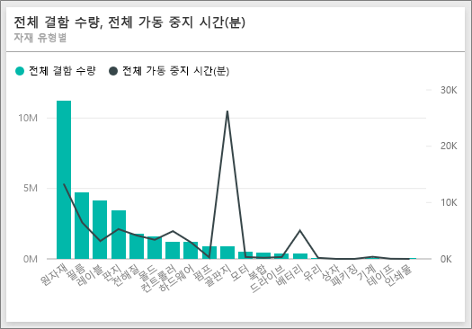

   원자재는 잘 관리되고 있는 것 같습니다. 결함 수는 많지만 총 가동 중지 시간(분)이 짧습니다.

### 결함과 연도별 가동 중지 시간 비교
1. **공장별, 결함 유형별 총 결함 보고서** 맵 타일을 선택하여 보고서의 **공급업체 품질 분석** 페이지를 엽니다.
2. **월별, 연도별 총 결함 수량** 차트에서 결함 수량이 2013년보다 2014년에 더 많은 것을 확인합니다.  

      
3. 결함이 많을수록 가동 중지 시간이 늘어났습니까? 질문 및 답변 상자에서 질문하여 확인합니다.  
4. 위쪽 탐색 창에서 **공급업체 품질 분석 샘플**을 선택하여 대시보드로 돌아갑니다.  
5. 원자재의 결함 수가 가장 많다는 것을 알기 때문에 질문 상자에 ‘show material types, year, and total defect qty’를 입력합니다.   

    2013년보다 2014년에 원자재 결함이 더 많았습니다.  

    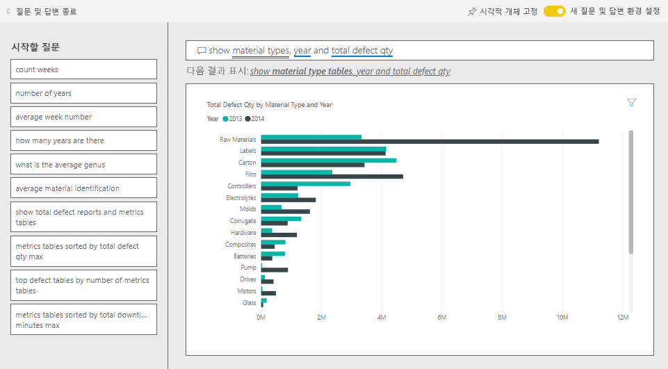  
6. 다음으로 질문을 _show material types, year, and **total downtime minutes**_ 으로 변경합니다.  

   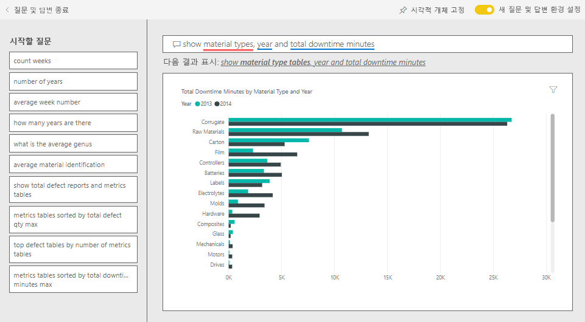

   2014년에 원자재 결함이 훨씬 많았지만 원자재 가동 중지 시간은 2013년과 2014년이 동일합니다. 2014년 원자재 결함 증가가 2014년 원자재 가동 중지 시간 증가로 이어진 것 같지는 않습니다.

### 결함과 월간 가동 중지 시간 비교
총 결함 수량과 관련된 다른 대시보드 타일을 살펴보겠습니다.  

1. 왼쪽 위에 있는 **질문 및 답변 종료**를 선택하여 대시보드로 돌아갑니다.  

    **월별, 연도별 총 결함 수량** 타일을 자세히 살펴봅니다. 2014년 상반기의 결함 수는 2013년과 비슷하지만 2014년 하반기에는 결함 수가 급증한 것을 확인할 수 있습니다.  

    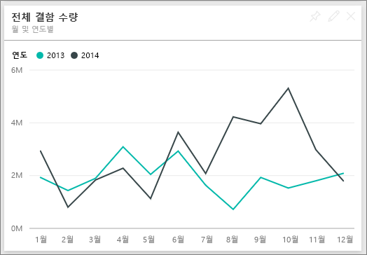  

    이러한 결함 수량이 증가하면서 가동 중지 시간(분)도 동일하게 증가되었는지 알아보겠습니다.  
2. 질문 상자에 ‘total downtime minutes by month and year as a line chart’를 입력합니다.   

   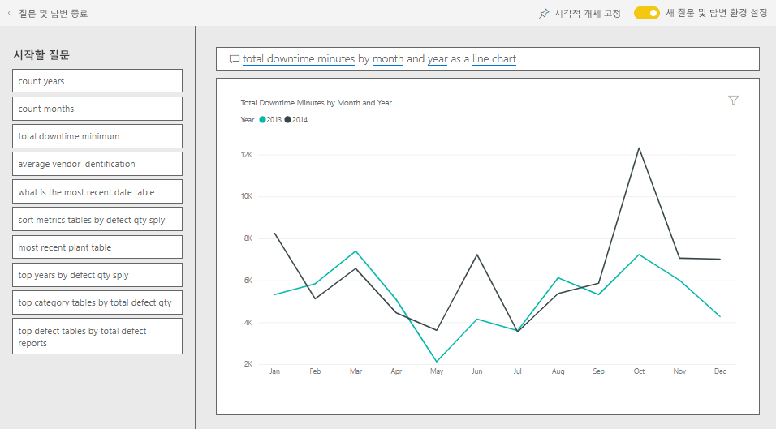

   6월과 10월에 가동 중지 시간(분)이 증가한 것 이외에, 결함 수로 인해 가동 중지 시간이 급증한 것은 아닙니다. 이 결과는 결함을 잘 관리하고 있음을 보여 줍니다.  
3. 이 차트를 대시보드에 고정하려면 질문 상자 위에 있는 고정 아이콘  을 선택합니다.  
4. 이상 월에 대해 알아보기 위해 ‘total downtime minutes in October by plant’ 등의 질문을 입력하여 10월 중 자재 유형, 공장 위치, 범주 등을 기준으로 가동 중지 시간(분)을 확인합니다.  
5. 왼쪽 위에 있는 **질문 및 답변 종료**를 선택하여 대시보드로 돌아갑니다.

## 다음 단계: 데이터에 연결
이 환경은 변경 내용을 저장하지 않도록 선택할 수 있으므로 안전하게 이용할 수 있습니다. 그러나 변경 내용을 저장하면 언제든지 이 샘플의 새 복사본에 대해 **데이터 가져오기**를 선택할 수 있습니다.

이 둘러보기가 Power BI 대시보드, 질문 및 답변, 보고서를 통해 샘플 데이터를 파악하는 방법을 확인하는 데 도움이 되었기를 바랍니다. 이제 사용자 데이터에 연결할 차례입니다. Power BI를 사용하여 다양한 데이터 원본에 연결할 수 있습니다. 더 자세히 알아보려면 [Power BI 서비스 시작하기](service-get-started.md)를 참조하세요.
