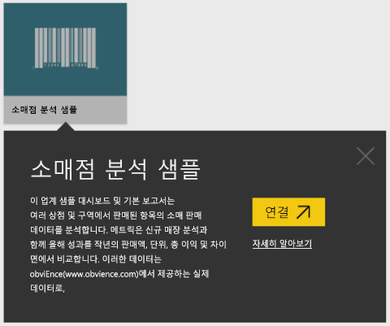
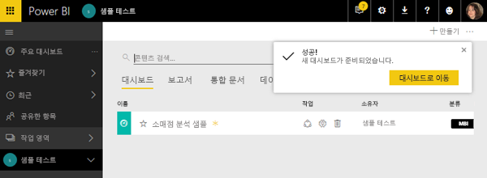
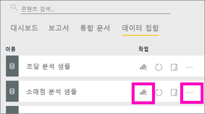

#  Power BI 서비스의 샘플에 연결

이 자습서에서는 다음을 수행하는 방법을 설명합니다. 
- 샘플 콘텐츠 팩을 가져와서 Power BI 서비스에 추가하고 콘텐츠를 엽니다. *콘텐츠 팩*은 데이터 세트가 대시보드 및 보고서와 함께 제공되는 일종의 샘플입니다. 
- Power BI Desktop에서 샘플 .pbix 파일을 엽니다.

먼저 자세히 알아보려면 [Power BI에 대한 샘플 데이터 세트](sample-datasets.md) 문서로 시작하는 것을 권장합니다. 이 문서에서는 샘플을 가져오는 방법, 샘플을 저장하는 위치, 샘플을 사용하는 방법, 각 샘플이 들려주는 몇 가지 이야기 등 샘플에 대한 모든 것을 알아볼 수 있습니다. 기본 내용을 살펴본 후에는 이 자습서로 돌아오세요.   

## 필수 조건
샘플은 Power BI 서비스 및 Power BI Desktop에 대해 사용할 수 있습니다. 과정을 따르기 위해 소매점 분석 샘플을 사용하겠습니다.

이 자습서에 사용된 *소매점 분석* 샘플 콘텐츠 팩은 대시보드, 보고서 및 데이터 세트로 구성됩니다.
이 콘텐츠 팩과 해당 시나리오를 잘 알려면 시작하기 전에 [소매점 분석 샘플을 둘러보는 것](sample-retail-analysis.md)이 좋습니다.

## 샘플 및 Power BI 서비스

1. Power BI 서비스(app.powerbi.com)를 열고 로그인합니다.
2. 왼쪽 탐색 창의 맨 아래에 있는 **데이터 가져오기** 를 선택합니다. **데이터 가져오기**가 표시되지 않으면 을 선택하여 탐색 창을 확장합니다.
   
   
5. **샘플**을 선택합니다.  
   
   
6. *소매 분석 샘플*을 선택하고 **연결**을 선택합니다.   
   
   

## 정확히 무엇을 가져왔나요?
샘플 콘텐츠 팩을 사용할 경우 **연결**을 선택하면 Power BI가 실제로 해당 콘텐츠 팩의 복사본을 가져와 자동으로 클라우드에 저장합니다. 콘텐츠 팩을 만든 사람이 데이터 세트, 보고서 및 대시보드를 포함했기 때문에 **연결**을 클릭하면 해당 항목을 가져오게 됩니다. 

1. Power BI는 새 대시보드를 만들고 **대시보드** 탭에 나열합니다. 노란색 별표로 새 대시보드를 알려줍니다.
   
   
2. **보고서** 탭을 엽니다.  여기에서 *소매점 분석 샘플*이라는 새 보고서를 볼 수 있습니다.
   
   
   
   **데이터 세트** 탭을 확인합니다.  새 데이터 세트도 있습니다.
   
   

## 새 콘텐츠 살펴보기
이제 직접 대시보드, 데이터 세트 및 보고서를 살펴봅니다. 대시보드, 보고서 및 데이터 세트를 탐색하는 여러 가지 방법 중 한 가지 방법이 아래에 설명되어 있습니다.  

> [!TIP]
> 우선 약간의 지원을 원하시나요?  이 샘플을 단계별로 안내하는 [소매점 분석 샘플 둘러보기](sample-retail-analysis.md)를 확인하세요.
> 
> 

1. **대시보드** 탭으로 다시 이동하고 *소매점 분석 샘플* 대시보드를 선택하여 여세요.    
   
   
2. 대시보드가 열립니다.  다양한 시각화 타일이 있습니다.
   
   
3. 타일 중 하나를 선택하여 원본 보고서를 엽니다.  이 예제에서는 이전 이미지에서 윤곽선이 분홍색이었던 영역형 차트를 선택합니다. 보고서에서 영역형 차트가 포함된 페이지가 열립니다.
   
    
   
   > [!NOTE]
   > 타일이 [Power BI 질문 및 답변](power-bi-tutorial-q-and-a.md)을 사용하여 생성된 경우 질문 및 답변 페이지가 대신 열립니다. 타일이 [Excel에서 고정](service-dashboard-pin-tile-from-excel.md)된 경우 Excel Online이 Power BI 내에서 열립니다.
   > 
   > 
1. **데이터 세트** 탭으로 돌아가면 데이터 세트를 살펴볼 수 있는 몇 가지 옵션이 있습니다.  Power BI Desktop 또는 Excel에서처럼 데이터 집합을 열고 모든 행과 열을 볼 수는 없습니다.  동료와 콘텐츠 팩을 공유 하는 사람은 일반적으로 동료에게 데이터에 대한 직접 액세스 권한을 제공하고자 하는 것이 아니라 유용한 정보를 공유하고자 합니다. 그렇다고 데이터 세트를 탐색할 수 없다는 의미는 아닙니다.  
   
   
   
   * 데이터 세트를 탐색하는 한 가지 방법은 처음부터 고유한 시각화 및 보고서를 만드는 것입니다.  차트 아이콘 선택  보고서 편집 모드에서 데이터 세트를 엽니다.
     
       
   * 데이터 세트를 탐색하는 또 다른 방법은 [신속한 정보 활용](consumer/end-user-insights.md)을 실행하는 것입니다. 줄임표 (...)를 선택하고 **유용한 정보 얻기**를 선택합니다. 유용한 정보가 준비되면 **정보 보기**를 선택합니다.
     
       

## 샘플 및 Power BI Desktop 
샘플 PBIX 파일을 처음으로 열면 시각화를 사용하여 보고서 페이지를 탐색하고 만들고 수정할 수 있는 보고서 뷰에 표시됩니다. Power BI Desktop의 보고서 뷰는 Power BI 서비스의 보고서 편집용 보기와 거의 동일한 디자인 환경을 제공합니다. 시각화를 이동하고, 복사 및 붙여넣고, 병합할 수 있습니다.

이들 간 차이점은 Power BI Desktop을 사용하는 경우 데이터가 보고서에서 최상의 통찰력을 지원하도록 쿼리와 데이터 모델링 작업을 수행할 수 있다는 것입니다. 로컬 드라이브든, 클라우드든 관계없이 어디든지 Power BI Desktop 파일을 저장할 수 있습니다.

1. Power BI Desktop에서 [소매점 분석 샘플 .pbix 파일](http://download.microsoft.com/download/9/6/D/96DDC2FF-2568-491D-AAFA-AFDD6F763AE3/Retail%20Analysis%20Sample%20PBIX.pbix)을 엽니다. 

    

1. 보고서 뷰에서 파일이 열립니다. 보고서 편집기 하단에 탭이 4개 있나요? 이는 이 보고서에 페이지가 4개 있다는 의미이며, 현재 “새 상점” 페이지가 선택되어 있습니다. 

    을 선택합니다.

3. 보고서 편집기에 대해 자세히 살펴보려면 [보고서 편집기 둘러보기](service-the-report-editor-take-a-tour.md)를 참조하세요.

## 정확히 무엇을 가져왔나요?
Desktop에서 샘플 PBIX 파일을 열면 Power BI가 실제로 해당 데이터의 복사본을 가져와 클라우드에 저장합니다. 데스크톱에서 보고서 ***및 기본 데이터 세트*** 에 액세스 할 수 있습니다. 데이터가 로드될 때 Power BI Desktop에서 자동으로 관계를 찾고 만들려고 합니다.  

1. 테이블 아이콘 을 선택하여 [데이터 보기](desktop-data-view.md)로 전환합니다.
 
    

    데이터 뷰는 Power BI Desktop 모델의 데이터를 검사, 탐색 및 이해하는 데 도움이 됩니다. 쿼리 편집기에서 테이블, 열 및 데이터를 보는 것과는 차이가 있습니다. 데이터 뷰에서는 모델에 데이터를 로드한 후의 데이터를 보게 됩니다.

    데이터를 모델링할 때 종종 열에서 행 수준까지, 보고서 캔버스에서 시각 효과 없이 테이블 또는 열의 실제 모습을 보려는 경우가 있습니다. 특히 측정치와 계산된 열을 만들거나, 데이터 형식 또는 데이터 범주를 파악해야 하는 경우가 여기에 해당합니다.

1.  아이콘을 선택하여 [관계 보기](desktop-relationship-view.md)로 전환합니다.
 
    

    관계 보기는 모델의 모든 테이블, 열 및 관계를 표시합니다. 여기에서 관계를 보고 변경하고 만들 수 있습니다.

## 새 콘텐츠 살펴보기
이제 직접 데이터 세트, 관계 및 보고서를 살펴봅니다. 시작하는 데 도움이 필요하면 [Desktop 시작 가이드](desktop-getting-started.md)를 참조하세요.    

## 다음 단계

- [Power BI 기본 개념](consumer/end-user-basic-concepts.md)
- [Power BI 서비스의 샘플](sample-datasets.md)
- [Power BI용 데이터 원본](service-get-data.md)

궁금한 점이 더 있나요? [Power BI 커뮤니티를 이용하세요.](http://community.powerbi.com/)
