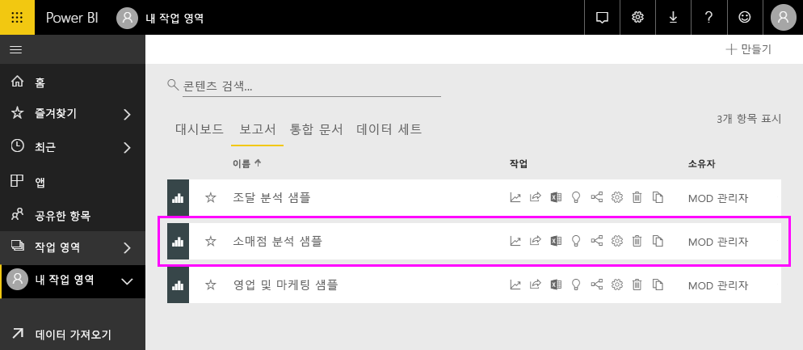
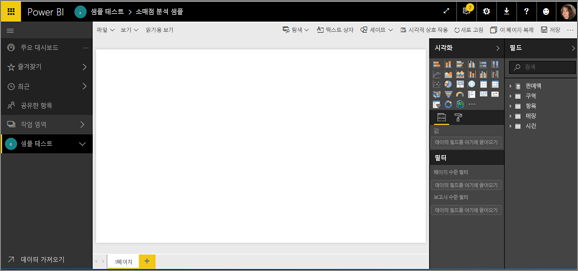
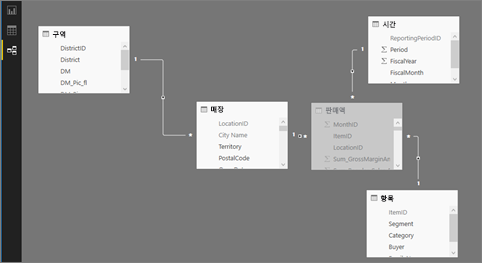

#  Power BI 서비스의 샘플에 연결

이 자습서에서는 다음을 수행하는 방법을 보여 줍니다. 
- 샘플 콘텐츠 팩을 가져와서 Power BI 서비스에 추가하고 콘텐츠를 엽니다. *콘텐츠 팩*은 데이터 세트가 대시보드 및 보고서와 함께 제공되는 일종의 샘플입니다. 
- Power BI Desktop에서 샘플 .pbix 파일을 엽니다.

자세한 배경 정보는 [Power BI의 샘플 데이터 세트](sample-datasets.md)를 참조하세요. 이 문서에서는 샘플을 가져오는 방법, 샘플을 저장할 위치, 샘플을 사용하는 방법, 각 샘플을 통해 알 수 있는 몇 가지 사실 등 샘플에 대한 모든 것을 알아볼 수 있습니다. 

## 필수 조건
Power BI 서비스 및 Power BI Desktop 샘플이 제공됩니다. 과정을 따르기 위해 소매점 분석 샘플을 사용하겠습니다.

이 자습서에 사용된 *소매점 분석* 샘플 콘텐츠 팩은 대시보드, 보고서 및 데이터 세트로 구성됩니다.
시작하기 전에 이 특정 콘텐츠 팩과 해당 시나리오를 숙지하려면 [Power BI 소매점 분석 샘플: 둘러보기](sample-retail-analysis.md)를 참조하세요.

## Power BI 서비스의 샘플

1. Power BI 서비스(app.powerbi.com)를 열고 로그인한 다음, 샘플을 저장할 작업 영역을 엽니다. 

    Power BI Pro 라이선스가 없다면 샘플을 내 작업 영역에 저장하면 됩니다.

2. 왼쪽 탐색 창의 맨 아래에 있는 **데이터 가져오기**를 선택합니다. 

   

   **데이터 가져오기**가 보이지 않으면 창의 맨 위에서  아이콘을 선택하여 탐색 창을 펼칩니다.

5. **데이터 가져오기** 페이지가 표시되면 **샘플**을 선택합니다.
   
6. **소매점 분석 샘플**을 선택한 다음 **연결**을 선택합니다.   
   
   

## 가져온 항목
샘플 콘텐츠 팩을 사용할 경우 **연결**을 선택하면 Power BI가 해당 콘텐츠 팩의 복사본을 가져와 자동으로 클라우드에 저장합니다. 콘텐츠 팩을 만든 사람이 데이터 세트, 보고서 및 대시보드를 포함했기 때문에 **연결**을 선택하면 해당 항목을 가져오게 됩니다. 

1. **연결**을 선택하면 Power BI에서 새 대시보드를 만들고 **대시보드** 탭에 나열합니다. 
   
   
2. **보고서** 탭을 엽니다. 여기에서 ‘소매점 분석 샘플’이라는 새 보고서를 볼 수 있습니다. 
   
   
   
   **데이터 세트** 탭을 확인합니다. 이 탭에도 새 데이터 세트가 있습니다.
   
   

## 새 콘텐츠 살펴보기
이제 직접 대시보드, 데이터 세트 및 보고서를 살펴봅니다. 대시보드, 보고서 및 데이터 세트를 탐색하는 여러 가지 방법이 있습니다. 다음 절차에서는 이러한 방법 중 하나를 설명합니다.  

1. **대시보드** 탭으로 다시 이동한 다음, **소매점 분석 샘플** 대시보드를 선택하여 엽니다.       

   다양한 시각화 타일이 포함된 대시보드가 열립니다.   
 
1. 대시보드에서 타일 중 하나를 선택하여 기본 보고서를 엽니다. 이 예제에서는 영역형 차트인 **회계 월별 작년 판매액, 올해 판매액**을 선택하겠습니다.  

   

   선택한 영역 차트가 포함된 페이지에서 보고서가 열립니다. 이 예제에서는 보고서의 **구역 월별 판매액** 페이지가 열립니다.
   
   
   
   > [!NOTE]
   > 타일이 [Power BI 질문 및 답변](power-bi-tutorial-q-and-a.md)을 사용하여 생성된 경우 질문 및 답변 페이지가 대신 열립니다. 타일이 [Excel에서 고정](service-dashboard-pin-tile-from-excel.md)된 경우 Excel Online이 Power BI 내에서 열립니다.
   > 
   > 
1. 동료와 콘텐츠 팩을 공유하는 사람은 일반적으로 동료에게 데이터를 직접 액세스하는 권한이 아닌 인사이트만 공유하려고 합니다. **데이터 세트** 탭에는 데이터 세트를 탐색하는 몇 가지 옵션이 있습니다. 그러나 Power BI Desktop 또는 Excel과 달리 데이터의 행과 열은 볼 수 없습니다. 
   
   
   
1. 데이터 세트를 탐색하는 한 가지 방법은 처음부터 고유한 시각화 및 보고서를 만드는 것입니다. 차트 아이콘 선택  보고서 편집 모드에서 데이터 세트를 엽니다.
     
   

1. 데이터 세트를 탐색하는 또 다른 방법은 [빠른 인사이트](consumer/end-user-insights.md)를 실행하는 것입니다. **추가 옵션**(...)을 선택한 다음, **빠른 인사이트 탐색**을 선택합니다. 유용한 정보가 준비되면 **정보 보기**를 선택합니다.
     
    

## Power BI Desktop의 샘플 
Power BI Desktop에서 샘플 .pbix 파일을 처음 열 때는 보고서 뷰에 표시되며, 여기서 시각화를 사용하여 보고서 페이지를 탐색하고 만들고 수정할 수 있습니다. Power BI Desktop의 보고서 뷰는 Power BI 서비스의 보고서 편집용 보기와 거의 동일한 디자인 환경을 제공합니다. 시각화를 이동하고, 복사 및 붙여넣고, 병합할 수 있습니다. 

Power BI 서비스에서 보고서를 편집하는 것과 달리, Power BI Desktop에서는 쿼리를 사용하고 데이터를 모델링하여 데이터가 보고서에서 최상의 인사이트를 지원하도록 할 수 있습니다. 로컬 드라이브든, 클라우드든 관계없이 어디든지 Power BI Desktop 파일을 저장할 수 있습니다.

1. [소매점 분석 샘플 .pbix 파일](http://download.microsoft.com/download/9/6/D/96DDC2FF-2568-491D-AAFA-AFDD6F763AE3/Retail%20Analysis%20Sample%20PBIX.pbix)을 다운로드하여 Power BI Desktop에서 엽니다. 

    

1. 보고서 뷰에서 파일이 열립니다. 보고서 편집기의 맨 아래에 있는 4개의 탭을 확인합니다. 이 탭은 이 보고서의 네 페이지를 나타냅니다. 이 예제에서는 **신규 매장** 페이지가 현재 선택되어 있습니다. 

    .

1. 보고서 편집기에 대한 자세한 내용은 [보고서 편집기 둘러보기](service-the-report-editor-take-a-tour.md)를 참조하세요.

## 보고서 내용
샘플 .pbix 파일을 다운로드할 때 보고서뿐만 아니라 ‘기본 데이터 세트’도 다운로드했습니다.  파일을 열면 Power BI Desktop에서 연결된 쿼리 및 관계와 함께 데이터를 로드합니다. 기본 데이터와 관계를 볼 수 있지만, 쿼리 편집기에서 기본 쿼리를 볼 수는 없습니다.

1. 테이블 아이콘 을 선택하여 [데이터 뷰](desktop-data-view.md)로 전환합니다.
 
    

    데이터 뷰에서 Power BI Desktop 모델의 데이터를 검사, 탐색 및 파악할 수 있습니다. 쿼리 편집기에서 테이블, 열 및 데이터를 보는 것과는 차이가 있습니다. 데이터 뷰의 데이터는 모델에 이미 로드되어 있습니다.

    데이터를 모델링할 때 보고서 캔버스에 시각적 개체를 만들지 않고 테이블의 행과 열에 있는 실제 내용을 보려는 경우도 있습니다. 특히 측정치와 계산된 열을 만들거나, 데이터 형식 또는 데이터 범주를 파악해야 하는 경우가 여기에 해당합니다.

1. 다음 아이콘을 선택하여 [관계 뷰](desktop-relationship-view.md)로 전환합니다. 
 
    

    관계 보기는 모델의 모든 테이블, 열 및 관계를 표시합니다. 여기에서 관계를 보고 변경하고 만들 수 있습니다.

## 다음 단계
이 환경은 변경 내용을 저장하지 않도록 선택할 수 있으므로 안전하게 이용할 수 있습니다. 그러나 변경 내용을 저장하면 언제든지 이 샘플의 새 복사본에 대해 **데이터 가져오기**를 선택할 수 있습니다.

이 둘러보기가 Power BI 대시보드, 데이터 세트, 관계 및 보고서를 통해 샘플 데이터의 인사이트를 얻을 수 있는 방법을 확인하는 데 도움이 되었기를 바랍니다. 이제 사용자 데이터에 연결할 차례입니다. Power BI를 사용하여 다양한 데이터 원본에 연결할 수 있습니다. 자세한 내용은 [Power BI 서비스 시작](service-get-started.md) 및 [Power BI Desktop 시작](desktop-getting-started.md)을 참조하세요.  

자세한 내용은 다음을 참조하세요.  
- [Power BI 서비스의 디자이너를 위한 기본 개념](service-basic-concepts.md)
- [Power BI 서비스 샘플](sample-datasets.md)
- [Power BI용 데이터 원본](service-get-data.md)

궁금한 점이 더 있나요? [Power BI 커뮤니티를 이용하세요.](http://community.powerbi.com/)
