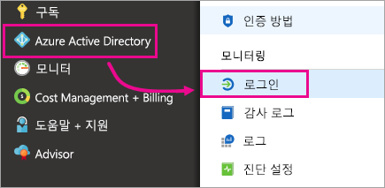

# 로그인한 Power BI 사용자 찾기
현재 테넌트 관리자이며 Power BI에 로그인했던 사람이 누구인지 알고자 하는 경우 Azure Active Directory 액세스 및 사용 보고서를 사용하여 표시 여부를 얻을 수 있습니다.

<iframe width="640" height="360" src="https://www.youtube.com/embed/1AVgh9w9VM8?showinfo=0" frameborder="0" allowfullscreen></iframe>

[새](https://docs.microsoft.com/azure/active-directory/active-directory-reporting-activity-sign-ins) 및 [클래식](https://docs.microsoft.com/azure/active-directory/active-directory-view-access-usage-reports) Azure AD(Azure Active Directory) 포털 내에서 활동 보고서에 액세스할 수 있습니다. 위의 비디오에서는 클래식 포털을 예로 사용했지만, 이 문서에서는 새 포털에 주목해 보겠습니다.

> [!NOTE]
> 이 활동 보고서는 Power BI(무료) 및 Pro 사용자를 모두 포함하지만 사용자가 소유한 라이선스를 통해 사용자를 식별하지는 않습니다.
> 
> 

## 요구 사항
로그인 활동 보고서를 보려면 다음이 필요합니다.

* 전역 관리자, 보안 관리자 또는 보안 판독기 역할의 사용자는 데이터에 액세스할 수 있습니다.
* 모든 사용자(관리자 외)는 자신의 로그인에 액세스할 수 있습니다.
* 모든 로그인 활동 보고서를 보려면 테넌트에 연결된 Azure AD Premium 라이선스가 있어야 합니다.

## Azure Portal을 사용하여 로그인 보기
Azure AD Portal을 사용하여 로그인 활동을 볼 수 있습니다.

1. **Azure Portal**을 찾아 **Azure Active Directory**를 선택합니다.
2. **활동** 아래에서 **로그인**을 선택합니다.
   
    
3. **Microsoft Power BI** 또는 **Power BI Gateway** 중 하나로 응용 프로그램을 필터링하고 **적용**을 선택합니다.
   
    **Microsoft Power BI**는 서비스와 관련된 로그인 활동을 위한 것입니다. 여기서 **Power BI Gateway**는 온-프레미스 데이터 게이트웨이에 대한 특정 로그인입니다.
   
    

## 데이터 내보내기
다음과 같은 두 가지 옵션으로 로그인 데이터를 내보낼 수 있습니다. csv 파일을 다운로드하거나 PowerShell을 사용하여 수행할 수 있습니다.

### csv 다운로드
활동 화면 내 도구 모음에서 **다운로드**를 선택할 수 있습니다. 현재 필터링된 데이터에 대한 csv 파일이 다운로드됩니다.

### PowerShell
PowerShell을 사용하여 로그인 데이터를 내보낼 수 있습니다. [샘플](https://docs.microsoft.com/azure/active-directory/active-directory-reporting-api-sign-in-activity-samples#powershell-script)은 Azure AD 설명서 내에서 사용할 수 있습니다.

> [!NOTE]
> PowerShell 샘플이 작동하려면 [Azure AD 보고 API 액세스를 위한 필수 구성 요소](https://docs.microsoft.com/en-us/azure/active-directory/active-directory-reporting-api-prerequisites)를 따라야 합니다.
> 
> 

## 데이터 보존
로그인 관련 데이터는 최대 30일 동안 사용할 수 있습니다. 자세한 내용은 [Azure Active Directory 보고서 보존 정책](https://docs.microsoft.com/azure/active-directory/active-directory-reporting-retention)을 참조하세요.

## 다음 단계
[Azure Active Directory 포털(새 포털)의 로그인 활동 보고서](https://docs.microsoft.com/azure/active-directory/active-directory-reporting-activity-sign-ins)  
[사용자의 액세스 및 사용 보고서 보기(클래식 포털)](https://docs.microsoft.com/azure/active-directory/active-directory-view-access-usage-reports#view-or-download-a-report)  
[로그인 샘플 PowerShell 스크립트](https://docs.microsoft.com/azure/active-directory/active-directory-reporting-api-sign-in-activity-samples#powershell-script)  
[Azure Active Directory 보고서 보존 정책](https://docs.microsoft.com/azure/active-directory/active-directory-reporting-retention)  
[조직 내에서 감사 사용](service-admin-auditing.md)  
[Extended Pro 평가판 활성화](service-extended-pro-trial.md)

궁금한 점이 더 있나요? [Power BI 커뮤니티에 질문합니다.](https://community.powerbi.com/)

