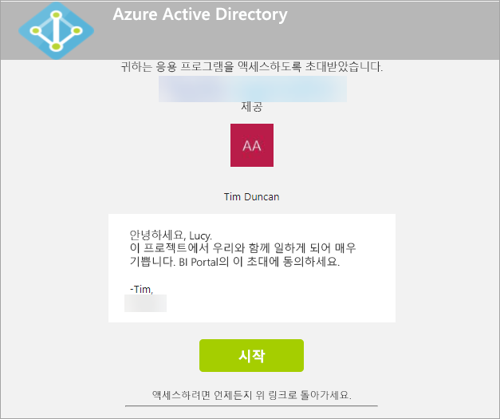
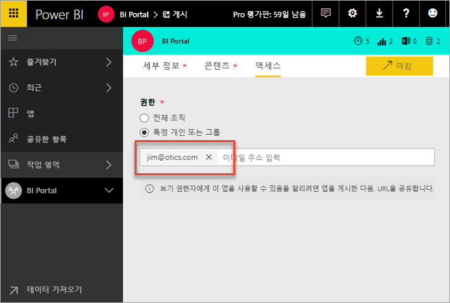

# Azure AD B2B에서 외부 게스트 사용자에게 Power BI 콘텐츠 배포

Power BI는 Azure AD B2B(Azure Active Directory Business-to-business)를 통합하므로 조직 외부의 게스트 사용자에게 Power BI 콘텐츠를 안전하게 배포하고 내부 데이터에 대한 제어를 유지 관리할 수 있습니다.

> [!VIDEO https://www.youtube.com/embed/xxQWEQ1NnlY]

> [!NOTE]
> 이 기능은 현재 Power BI 모바일 앱에는 제공되지 않습니다. 모바일 장치에서는 브라우저에서 Azure AD B2B를 사용하여 공유되는 Power BI 콘텐츠를 볼 수 있습니다. 

## 게스트 사용자 초대 

계획 초대 또는 임시 초대 등 두 가지 방법으로 게스트 사용자를 Power BI 테넌트에 초대할 수 있습니다. 초대는 외부 사용자를 조직에 최초로 초대할 때만 필요합니다.

### 계획 초대

계획 초대는 Azure AD의 Microsoft Azure Portal 안에서 또는 PowerShell을 사용하여 수행됩니다. 어떤 사용자를 초대할지 알고 있을 때 사용하는 옵션입니다. 

**Azure AD Portal에서 게스트 사용자를 만들려면 테넌트 관리자여야 합니다.**

1. [Azure Portal](https://portal.azure.com)로 이동하여 **Azure Active Directory**를 선택합니다.

2. **사용자 및 그룹** > **모든 사용자** > **새 게스트 사용자**로 이동합니다.

    

3. **이메일 주소** 및 **개인 메시지**를 입력합니다.

    

4. **초대**를 선택합니다.

여러 명의 게스트 사용자를 초대하려면 PowerShell을 사용합니다. 자세한 내용은 [Azure Active Directory B2B 공동 작업 코드 및 PowerShell 샘플](https://docs.microsoft.com/azure/active-directory/active-directory-b2b-code-samples)을 참조하세요.

게스트 사용자는 받은 이메일 초대에서 **시작**을 선택해야 합니다. 그러면 게스트 사용자가 테넌트에 추가됩니다.

### 임시 초대

언제든 초대하려면 게시할 때 앱의 액세스 목록에 외부 사용자를 추가합니다.

게스트 사용자는 앱이 자신과 공유됨을 알리는 이메일을 받게 됩니다.

게스트 사용자가 해당 조직 이메일 주소로 로그인해야 합니다. 로그인 후 초대를 수락하라는 메시지가 표시됩니다. 로그인 후 게스트 사용자가 앱 콘텐츠로 리디렉션됩니다. 앱으로 돌아가거나, 링크를 즐겨찾기로 표시하거나, 이메일을 저장합니다.

## 라이선싱

게스트 사용자가 공유된 앱을 보려면 적합한 라이선싱이 있어야 합니다. 이를 위해 세 가지 옵션이 있습니다.

### Power BI Premium 사용

Power BI Premium 용량에 앱 작업 영역을 할당하면 게스트 사용자가 Power BI Pro 라이선스 없이 앱을 사용할 수 있습니다. Power BI Premium에서는 앱이 새로 고침 비율 증대, 전용 용량, 대규모 모델 크기 등과 같은 다른 기능도 활용할 수 있습니다.

### 게스트 사용자에게 Power BI Pro 라이선스할당

테넌트 안에서 게스트 사용자에게 Power BI Pro 라이선스를 할당하면 게스트가 콘텐츠를 볼 수 있습니다.

> [!NOTE]
> 테넌트의 Power BI Pro 라이선스는 해당 사용자가 테넌트 안에서 콘텐츠에 액세스할 때만 게스트 사용자에게 적용됩니다.

### 게스트 사용자가 자신의 Power BI Pro 라이선스 사용

게스트 사용자에게 이미 테넌트 안에 할당된 Power BI Pro 라이선스가 있습니다.

## 제한 사항

* 외부 B2B 게스트는 콘텐츠 소비로만 제한됩니다. 외부 B2B 게스트는 앱, 대시보드, 보고서를 보고, 데이터를 내보내며 대시보드 및 보고서에 대한 전자 메일 구독을 만들 수 있습니다. 작업 영역에 액세스하거나 자신의 콘텐츠를 게시할 수는 없습니다.
* 이 기능은 현재 Power BI 모바일 앱에는 제공되지 않습니다. 모바일 장치에서는 브라우저에서 Azure AD B2B를 사용하여 공유되는 Power BI 콘텐츠를 볼 수 있습니다.
* Power BI에서 게스트 사용자 사용은 소버린 클라우드(정부) 내에서 지원되지 않습니다.

## 다음 단계

행 수준 보안 작동 방식 등을 포함한 자세한 내용은 [백서](https://aka.ms/powerbi-b2b-whitepaper)에서 확인하세요.

Azure Active Directory B2B에 한 정보는 [Azure AD B2B 공동 작업이란?](https://docs.microsoft.com/azure/active-directory/active-directory-b2b-what-is-azure-ad-b2b)을 참조하세요.