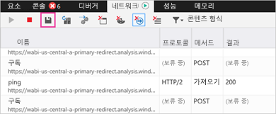

# 추가 진단 정보 캡처
## Power BI에 대한 추가 진단 정보 캡처
이 지침에서는 Power BI 웹 클라이언트에서 추가적인 진단 정보를 수동으로 수집하기 위한 두 가지 가능한 옵션을 제공합니다.  이러한 옵션 중 하나만 따르면 됩니다.

## 네트워크 캡처 - Edge 및 Internet Explorer
1. Edge 또는 Internet Explorer를 사용하여 [Power BI](https://app.powerbi.com)로 이동합니다.
2. F12 키를 눌러 Edge 개발자 도구를 엽니다.
3. 그러면 개발자 도구 창을 표시합니다. 
   
   
4. 네트워크 탭으로 전환합니다. 이미 캡처한 트래픽을 나열합니다. 
   
   
5. 창 내에서 찾고 발생할 수 있는 모든 문제를 재현할 수 있습니다. F12 키를 눌러 세션 중 언제든지 개발자 도구 창을 숨기고 표시할 수 있습니다.
6. 캡처를 중지하려면 개발자 도구 영역의 네트워크 탭에서 빨간색 사각형을 선택할 수 있습니다.
   
   
7. **HAR로 내보내기**에 대한 디스켓 아이콘을 선택합니다.
   
   
8. 파일 이름을 제공하고 HAR 파일을 저장합니다.
   
    HAR 파일에는 브라우저 창과 Power BI 사이의 네트워크 요청에 대한 모든 정보가 담겨 있습니다.  여기에는 각 요청의 활동 ID와 상세 타임스탬프, 클라이언트에 반환된 오류 정보 등이 해당합니다.  이 추적에는 화면에 표시되는 시각 효과를 입력하기 위해 사용된 데이터도 포함됩니다.
9. HAR 파일을 제공하여 검토를 지원할 수 있습니다.

궁금한 점이 더 있나요? [Power BI 커뮤니티에 질문합니다.](http://community.powerbi.com/)

