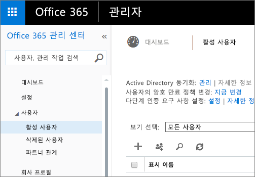
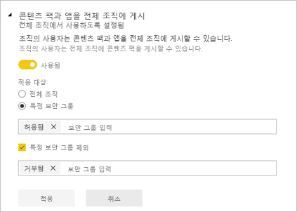
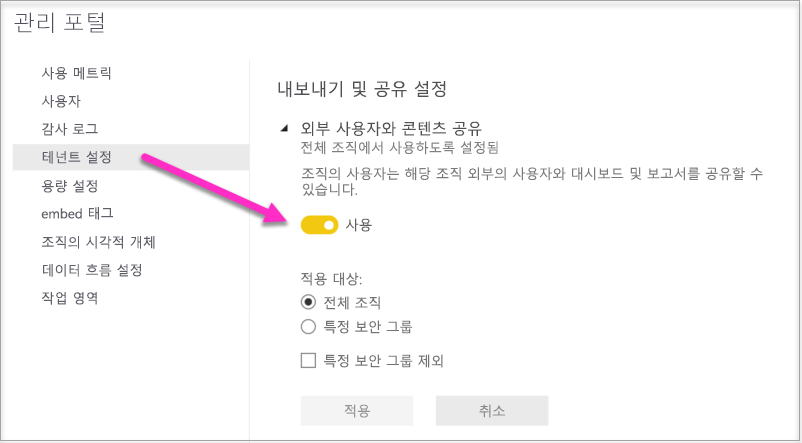
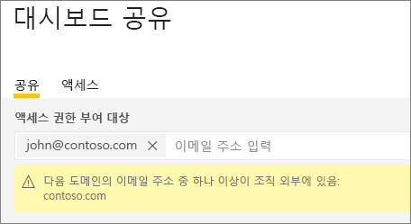
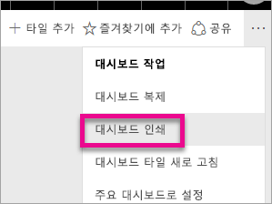
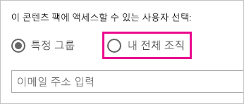
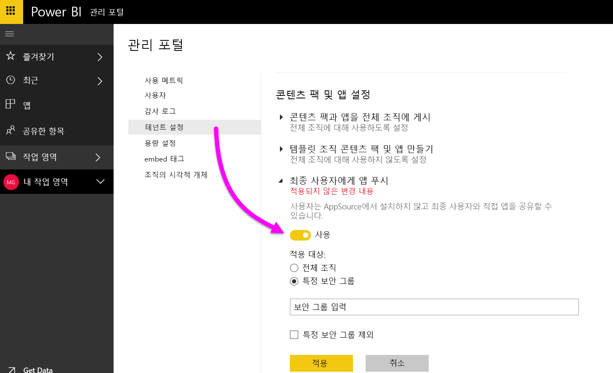
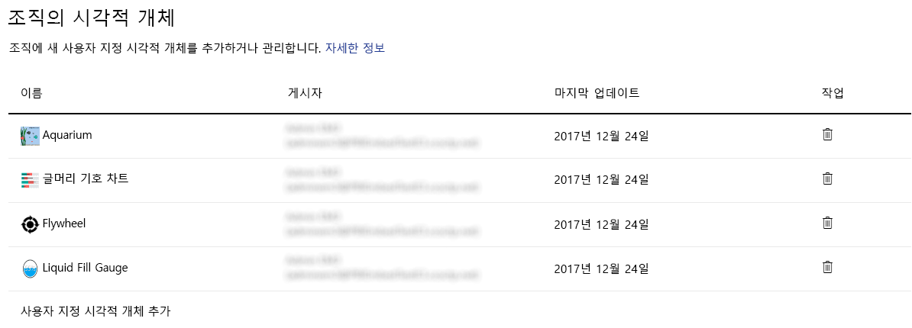

# Power BI 관리 포털

관리 포털을 통해 조직에서 Power BI의 테넌트 관리를 사용할 수 있습니다. 사용 메트릭, Office 365 관리 센터 액세스 및 설정 등과 같은 항목을 포함하고 있습니다.

회사에 대한 Power BI의 테넌트 관리는 Power BI 관리 포털을 통해 수행됩니다. 관리 포털은 Office 365의 전역 관리자이거나 Power BI 서비스 관리자 역할에 할당된 모든 사용자가 액세스할 수 있습니다. Power BI 서비스 관리자 역할에 대한 자세한 내용은 [Power BI 관리자 역할 이해](service-admin-role.md)를 참조하세요.

모든 사용자는 톱니 바퀴형 아이콘에서 **관리자 포털**을 볼 수 있습니다. 관리자가 아닌 경우 **프리미엄 설정** 섹션만 보이고, 관리 권한이 있는 용량만 확인할 수 있습니다.

## 관리 포털에 도달하는 방법

Power BI 관리 포털에 대한 액세스 권한을 얻으려면 계정이 Office 365 또는 Azure Active Directory 내에서 **전역 관리자**로 표시되거나 Power BI 서비스 관리자 역할이 할당되어야 합니다. Power BI 서비스 관리자 역할에 대한 자세한 내용은 [Power BI 관리자 역할 이해](service-admin-role.md)를 참조하세요. Power BI 관리 포털에 도달하려면 다음을 수행합니다.

1. Power BI 서비스의 오른쪽 위에서 설정 기어를 선택합니다.
2. **관리 포털**을 선택합니다.

포털 내에 6개의 탭이 있습니다. 이들을 아래에서 설명합니다.

* [사용 메트릭](#usage-metrics)
* [사용자](#users)
* [감사 로그](#audit-logs)
* [테넌트 설정](#tenant-settings)
* [프리미엄 설정](#premium-settings)
* [embed 태그](#embed-codes)
* [조직의 시각적 개체](#Organization-visuals)

## 사용 메트릭
관리 포털에서 첫 번째 탭은 **사용 메트릭**입니다. 사용 메트릭 보고서는 조직을 위한 Power BI 내에서 사용을 모니터링하는 기능을 제공합니다. 또한 조직을 위한 Power BI 내에서 가장 활발한 사용자 및 그룹이 누구인지 확인하는 기능을 제공합니다.

> [!NOTE]
> 대시보드에 처음 액세스할 때 또는 대시보드를 오랫동안 보지 않았다가 다시 방문한 후 대시보드를 로드하는 동안 로드 중 화면이 표시될 수 있습니다.

대시보드가 로드된 후 타일 섹션 두 개가 표시됩니다. 첫 번째 섹션은 개별 사용자에 대한 사용량 데이터를 포함하고 있으며 두 번째 섹션은 조직의 그룹에 대해 유사한 정보를 포함하고 있습니다.

다음은 각 타일에 표시되는 내용에 대한 요약입니다.

* 사용자 작업 영역의 모든 대시보드, 보고서 및 데이터 집합에 대한 고유한 개수입니다.
  
    

* 액세스할 수 있는 사용자 수별로 가장 많이 사용한 대시보드입니다. 예를 들어 사용자 3명과 공유하는 대시보드가 있는데 서로 다른 두 사용자가 연결한 콘텐츠 팩에 이를 추가하면 개수는 6 (1 + 3 + 2)가 됩니다
  
    

* 사용자가 연결한 가장 인기 있는 콘텐츠입니다. 사용자가 데이터 가져오기 프로세스를 통해 도달할 수 있는 모든 것, 다시 말해서 SaaS 콘텐츠 팩, 조직 콘텐츠 팩, 파일 또는 데이터베이스가 이에 해당합니다.
  
    

* 직접 만든 대시보드 및 공유하는 대시보드를 모두 포함하여 가지고 있는 대시보드 수를 기반으로 하는 최상위 사용자의 뷰입니다.
  
    

* 가지고 있는 보고서 수를 기반으로 하는 최상위 사용자의 뷰입니다.
  
    

두 번째 섹션은 동일한 유형의 정보를 보여 주지만 그룹을 기반으로 합니다. 이 뷰를 통해 조직에서 가장 활발한 그룹 및 해당 그룹이 사용 중인 정보의 종류를 확인할 수 있습니다.

이 정보를 사용하여 조직의 사용자가 Power BI를 사용하는 방법을 실제로 파악할 수 있으며 조직에서 매우 활발한 사용자 및 그룹을 인식할 수 있습니다.

## 사용자

관리 포털의 두 번째 탭은 **사용자 관리**입니다. Power BI의 경우 사용자 관리는 Office 365 관리 센터에서 수행되므로 이 섹션을 통해 Office 365 내에서 사용자, 관리자 및 그룹을 관리하는 영역에 빨리 도달할 수 있습니다.

**O365 관리 센터로 이동**을 클릭하면 테넌트의 사용자를 관리하는 Office 365 관리 센터 방문 페이지로 직접 이동합니다.

## 감사 로그

관리 포털의 세 번째 탭은 **감사 로그**입니다. 로그는 Office 365 보안 및 규정 준수 센터 내에 위치합니다. 이 섹션에서는 Office 365 내에서 해당 영역에 빠르게 액세스할 수 있습니다. 

감사 로그에 대한 자세한 내용은 [조직에서 Power BI 감사](service-admin-auditing.md)를 참조하세요.

## 테넌트 설정

관리 포털의 세 번째 탭은 **테넌트 설정**입니다. 테넌트 설정을 통해 조직에 사용할 수 있도록 만들어진 기능을 더 잘 제어할 수 있습니다. 중요한 데이터에 대한 우려가 있는 경우 일부 기능은 사용자의 조직에 적합하지 않을 수 있거나 특정 그룹에만 지정된 기능을 사용 가능하도록 할 수 있습니다. 이러한 경우 테넌트를 끌 수 있습니다.

> [!NOTE]
> 설정이 테넌트의 모든 사용자에게 적용되려면 최대 10분까지 걸릴 수 있습니다.

설정은 사용자가 제공한 설정을 기반으로 하는 세 가지 상태가 있을 수 있습니다.

### 전체 조직에 대해 사용하지 않도록 설정

기능을 사용하지 않도록 설정할 수 있으며 그렇게 하면 사용자가 사용할 수 없게 됩니다.

### 전체 조직에 대해 사용하도록 설정

전체 조직에 대해 기능을 사용하도록 설정할 수 있으며 모든 사용자가 해당 기능에 액세스할 수 있습니다.

### 조직의 하위 집합에 대해 사용하도록 설정

또한 조직의 일부에 대해 기능을 사용하도록 설정할 수도 있습니다. 이는 몇 가지 방법으로 발생할 수 있습니다. 특정 사용자 그룹을 제외하고 전체 조직에 대해 사용하도록 설정할 수 있습니다.

또한 특정 사용자 그룹에만 기능을 사용하도록 설정하고 사용자 그룹에 대해 사용하지 않도록 설정할 수도 있습니다. 이 경우 특정 사용자가 허용되는 그룹에 있더라도 해당 기능에 액세스할 수 없게 됩니다.

## 내보내기 및 공유 설정

### 외부 사용자에게 콘텐츠 공유

조직의 사용자는 조직 외부의 사용자와 대시보드를 공유할 수 있습니다.

외부 사용자와 공유할 때 표시되는 메시지는 다음과 같습니다.

### 웹에 게시

조직의 사용자는 웹에 보고서를 게시할 수 있습니다. [자세히 알아보기](service-publish-to-web.md)

사용자의 웹 게시 설정에 따라 UI에 여러 옵션이 표시됩니다.

|특정 |전체 조직에 대해 사용 |전체 조직에 대해 사용 안 함 |특정 보안 그룹   |
|---------|---------|---------|---------|
|보고서의 **파일** 메뉴 아래에 있는 **웹 게시**.|모든 사용자에 대해 사용|모든 사용자에게 표시 안 함|권한 있는 사용자 또는 그룹에만 표시.|
|**설정** 아래의 **embed 태그 관리**|모든 사용자에 대해 사용|모든 사용자에 대해 사용|모든 사용자에 대해 사용  권한 있는 사용자 또는 그룹에만 * **삭제** 옵션 제공. 모든 사용자에 대해 * **코드 가져오기** 사용.|
|관리자 포털 내의 **embed 태그**|상태는 다음 중 하나를 반영합니다. * 활성 * 지원되지 않음 * 차단됨|상태가 **사용 안 함**으로 표시됨|상태는 다음 중 하나를 반영합니다. * 활성 * 지원되지 않음 * 차단됨  테넌트 설정에 따라 사용자에게 권한이 없으면 상태가 **침해됨**으로 표시됩니다.|
|게시된 기존 보고서|모두 사용|모두 사용 안 함|보고서가 모든 사용자에 대해 계속 렌더링합니다.|

### 데이터 내보내기

조직의 사용자는 타일 또는 시각화에서 데이터를 내보낼 수 있습니다. [자세히 알아보기](power-bi-visualization-export-data.md)

> [!NOTE]
> **데이터 내보내기**를 사용하지 않도록 설정하면 사용자는 Power BI 서비스 라이브 연결과 함께 **Excel에서 분석** 기능을 사용할 수 없습니다.

### 보고서를 PowerPoint 프레젠테이션으로 내보내기

조직의 사용자는 PowerPoint 파일로 Power BI 보고서를 내보낼 수 있습니다. [자세히 알아보기](service-publish-to-powerpoint.md)

### 대시보드 및 보고서 인쇄

조직의 사용자는 대시보드 및 보고서를 인쇄할 수 있습니다. [자세히 알아보기](service-print.md)

## 콘텐츠 팩 설정

### 조직 전체에 콘텐츠 팩 게시

조직의 사용자는 전체 조직에 콘텐츠 팩을 게시할 수 있습니다.

### 템플릿 조직 콘텐츠 팩 만들기

조직의 사용자는 Power BI Desktop에서 하나의 데이터 원본을 기반으로 하는 데이터 집합을 사용하는 템플릿 콘텐츠 팩을 만들 수 있습니다.

### 최종 사용자에게 앱 푸시

테넌트 관리자를 사용하면 **테넌트 설정**에서 앱을 푸시할 수 있습니다.

   

**설정됨**으로 설정을 전환한 다음, 이 기능을 가져올 대상(전체 조직 또는 특정 보안 그룹)을 지정할 수 있습니다.

> [!NOTE]
> 테넌트 설정을 변경하면 적용하는 데 다소 시간이 걸릴 수 있습니다.

여기로 이동하여 [앱 푸시](service-create-distribute-apps.md#how-to-install-an-app-automatically-for-end-users)에 대해 자세히 알아봅니다.

## 통합 설정

### Cortana를 사용하여 데이터에 대한 질문
조직의 사용자는 Cortana를 사용하여 데이터에 대한 질문을 할 수 있습니다.

> [!NOTE]
> 이 설정은 전체 조직에 적용되며 특정 그룹에 제한될 수 없습니다.

### 온-프레미스 데이터 집합을 통해 Excel에서 분석 사용
조직의 사용자는 Excel을 사용하여 온-프레미스 Power BI 데이터 집합을 보고 상호 작용할 수 있습니다. [자세히 알아보기](service-analyze-in-excel.md)

> [!NOTE]
> **데이터 내보내기**를 사용하지 않도록 설정하면 사용자는 **Excel에서 분석** 기능을 사용할 수 없습니다.

### Power BI용 ArcGIS Maps(미리 보기) 사용

조직의 사용자는 Esri에서 제공하는 Power BI용 ArcGIS Maps(미리 보기) 시각화를 사용할 수 있습니다. [자세히 알아보기](power-bi-visualization-arcgis.md)

## 사용자 지정 시각적 개체 설정
### 전체 조직에 대해 사용자 지정 시각적 개체 사용
조직의 사용자는 사용자 지정 시각적 개체를 조작하고 공유할 수 있습니다. [자세히 알아보기](power-bi-custom-visuals.md)

> [!NOTE]
> 이 설정은 전체 조직에 적용되며 특정 그룹에 제한될 수 없습니다.

## R 시각적 개체 설정

### R 시각적 개체와 상호 작용 및 공유

조직의 사용자는 R 스크립트를 사용하여 만든 시각적 개체와 상호 작용하고 공유할 수 있습니다. [자세히 알아보기](service-r-visuals.md)

> [!NOTE]
> 이 설정은 전체 조직에 적용되며 특정 그룹에 제한될 수 없습니다.

## 감사 설정

### 내부 활동 감사 및 규정 준수를 위해 감사 로그 만들기

조직의 사용자는 감사를 사용하여 조직의 다른 사용자가 Power BI에서 수행한 작업을 모니터링할 수 있습니다. [자세히 알아보기](service-admin-auditing.md)

이 설정은 감사 로그 항목이 기록될 수 있도록 활성화되어야 합니다.

> [!NOTE]
> 이 설정은 전체 조직에 적용되며 특정 그룹에 제한될 수 없습니다.

## 대시보드 설정

### 대시보드에 대한 데이터 분류

조직의 사용자는 대시보드 보안 수준을 나타내는 분류로 대시보드를 태그할 수 있습니다. [자세히 알아보기](service-data-classification.md)

> [!NOTE]
> 이 설정은 전체 조직에 적용되며 특정 그룹에 제한될 수 없습니다.

## 개발자 설정

### 앱에 콘텐츠 포함

조직 내 사용자는 Power BI 대시보드 및 보고서를 SaaS(Software as a Service) 응용 프로그램에 포함할 수 있습니다. 이 설정을 사용하지 않도록 설정하면 사용자는 REST API를 사용하여 Power BI 콘텐츠를 해당 응용 프로그램에 포함할 수 없게 됩니다.

## 프리미엄 설정

프리미엄 설정 탭을 사용하면 조직용으로 구매한 모든 Power BI 프리미엄 용량을 관리할 수 있습니다. 조직 내 모든 사용자가 프리미엄 설정 탭을 볼 수 있으나, **용량 관리** 또는 할당 권한이 있는 사용자로 할당된 경우에만 탭 내 콘텐츠를 볼 수 있습니다. 사용자 권한이 없으면 다음과 같은 메시지가 나타납니다.

프리미엄 설정 관리에 관한 자세한 내용은 [Power BI 프리미엄 관리](service-admin-premium-manage.md)를 참조하세요.

## embed 태그

관리자는 테넌트에 대해 생성된 embed 태그를 볼 수 있습니다. 보고서를 살펴보고 embed 태그를 삭제하여 보고서를 해지하는 작업을 수행해야 합니다.

## 조직의 시각적 개체

조직의 시각적 개체 탭을 사용하면 조직 내에서 사용자 지정 시각적 개체를 배포하고 관리할 수 있습니다. 그러므로 조직의 소유 사용자 지정 시각적 개체를 쉽게 배포할 수 있습니다. 보고서 작성자의 경우 해당 시각적 개체를 쉽게 검색하고 Power BI Desktop에서 보고서로 바로 가져올 수 있습니다.
 
이 페이지에서는 현재 조직의 리포지토리에 배포된 모든 사용자 지정 시각적 개체를 보여줍니다.
 

### 새 사용자 지정 시각적 개체 추가

목록에 새 사용자 지정 시각적 개체를 추가하려면 **사용자 지정 시각적 개체 추가**를 선택합니다.

> [!WARNING]
> 사용자 지정 시각적 개체에는 보안 또는 개인 정보 관련 위험이 있는 코드가 포함될 수 있습니다. 조직의 리포지토리로 배포하기 전에 사용자 지정 시각적 개체의 작성자와 원본을 신뢰할 수 있는지 확인해야 합니다.
> 

필드를 입력하세요.
 
* .pbiviz 파일 선택(필수): 업로드할 사용자 지정 시각적 개체 파일을 선택합니다. 버전이 있는 API 사용자 지정 시각적 개체만 지원됩니다(여기 참조).
사용자 지정 시각적 개체를 업로드하기 전에 보안 및 개인 정보에 대해 사용자 지정 시각적 개체를 검토하여 조직의 표준에 적합한지 확인해야 합니다. 사용자 지정 시각적 개체 보안에 대해 자세히 알아보세요.
 
* Name your custom visuals(사용자 지정 시각적 개체 이름 지정)(필수): Power BI Desktop 사용자가 쉽게 이해할 수 있도록 시각적 개체에 간단한 제목을 지정합니다.
 
* 아이콘(필수): Power BI Desktop UI에 표시되는 아이콘 파일입니다.
 
* 설명: 사용자에게 더 많은 컨텍스트와 교육을 제공하기 위한 시각적 개체에 대한 간단한 설명입니다.
 
“적용”을 선택하여 업로드 요청을 시작합니다. 성공하면 목록에 새 항목이 표시됩니다. 실패하면 해당 오류 메시지가 표시됩니다.
 
### 목록에서 사용자 지정 시각적 개체 삭제

휴지통 아이콘을 선택하여 리포지토리에서 시각적 개체를 영구적으로 삭제합니다.
중요: 삭제는 되돌릴 수 없습니다. 삭제되면 시각적 개체는 기존 보고서에서 렌더링을 즉시 중지합니다. 동일한 시각적 개체를 다시 업로드하는 경우에도 삭제한 이전 시각적 개체를 대체하지 않습니다. 사용자는 새 시각적 개체를 다시 가져와서 보고서의 인스턴스를 바꿔야 합니다.
 
### 시각적 개체를 업데이트하는 방법

시각적 개체의 새 버전(예: 버그 수정, 새 기능 등)이 있어서 리포지토리에서 시각적 개체를 업데이트하려면 **업데이트** 아이콘을 선택하고 새 파일을 업로드합니다. 시각적 개체 ID가 변경되지 않았는지 확인합니다. 새 파일은 조직 전체의 모든 보고서에 대해 이전 파일을 대체합니다. 그러나 시각적 개체의 새 버전이 시각적 개체의 이전 버전에 대한 사용이나 데이터 구조를 중단하는 경우에는 이전 버전을 바꾸지 마세요. 대신에 시각적 개체의 새 버전에 대한 새 목록을 만들어야 합니다. 예를 들어 새 버전 번호(버전 X.X)를 새 나열된 시각적 개체의 제목에 추가합니다. 이렇게 하면 업데이트된 버전 번호를 가진 동일한 시각적 개체가 되므로 기존 보고서가 해당 기능을 중단하지 않습니다. 다시 한번 시각적 개체 ID가 변경되지 않았는지 확인합니다. 그러면 다음에 사용자가 Power BI Desktop에서 조직의 리포지토리에 들어갈 때 새 버전을 가져올 수 있으며, 보고서에 있는 현재 버전을 바꾸라는 메시지가 표시됩니다.

## 다음 단계

[Power BI 관리자 역할 이해](service-admin-role.md)  
[조직에서 Power BI 감사](service-admin-auditing.md)  
[Power BI 프리미엄 관리](service-admin-premium-manage.md)  
[조직에서 Power BI 관리](service-admin-administering-power-bi-in-your-organization.md)  

궁금한 점이 더 있나요? [Power BI 커뮤니티에 질문합니다.](http://community.powerbi.com/)
