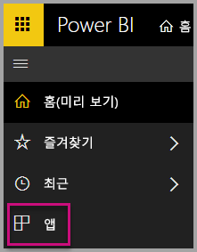
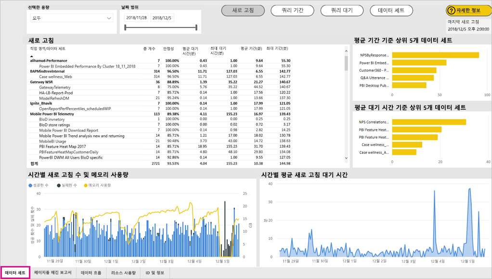

# Power BI Premium 및 Power BI Embedded 용량 모니터링

이 문서에서는 Power BI Premium 용량의 메트릭 모니터링에 대한 개요를 제공합니다. 용량 사용량 모니터링을 사용하면 정보를 기반으로 하여 용량을 관리할 수 있습니다.

Power BI Premium 용량 메트릭 앱 또는 관리 포털에서 용량을 모니터링할 수 있습니다. 앱이 더 자세한 내용을 제공하므로, 앱을 사용하는 것이 좋지만 이 문서에서는 두 가지 옵션을 모두 다룹니다.

<iframe width="560" height="315" src="https://www.youtube.com/embed/UgsjMbhi_Bk?rel=0&amp;showinfo=0" frameborder="0" allowfullscreen></iframe>

## 프리미엄 용량 메트릭 앱 설치

[프리미엄 용량 메트릭 앱](https://app.powerbi.com/groups/me/getapps/services/capacitymetrics)으로 바로 이동하거나 Power BI에서 다른 앱을 설치하는 것처럼 설치할 수 있습니다.

1. Power BI에서 **앱**을 클릭합니다.

    

2. 오른쪽에서 **앱 가져오기**를 클릭합니다.

3. **앱** 범주에서 **Power BI Premium 용량 메트릭 앱**을 검색합니다.

4. 구독하여 앱을 설치합니다.

이제 앱을 설치했으므로 조직의 용량에 대한 메트릭을 볼 수 있습니다. 사용 가능한 몇 가지 주요 메트릭을 살펴보겠습니다.

## 메트릭 앱 사용

앱을 열면 먼저 관리자 권한이 있는 모든 용량의 요약이 포함된 대시보드가 표시됩니다.

이 보고서에는 3개의 탭이 있으며 다음 섹션에서 각 탭을 좀 더 자세히 설명합니다.

* **모든 페이지에 적용된 필터**: 보고서의 다른 페이지를 특정 용량으로 필터링할 수 있습니다.
* **데이터 집합**: 용량 내 데이터 집합의 상태에 대한 자세한 메트릭을 제공합니다.
* **시스템**: 메모리 및 높은 CPU 사용률을 포함하는 전반적인 용량 메트릭을 제공합니다. 

### 모든 페이지 탭에 적용된 필터

**모든 페이지에 적용된 필터** 탭을 사용하면 지난 7일 이내의 용량, 데이터 집합 및/또는 날짜 범위를 선택할 수 있습니다. 그러면 필터가 보고서의 모든 관련 페이지 및 타일에 적용됩니다. 필터를 선택하지 않으면 보고서 기본값에 따라 사용자가 소유한 모든 용량에 대한 지난주의 메트릭이 표시됩니다.

### 데이터 집합 탭

**데이터 집합** 탭은 앱의 대량 메트릭을 제공합니다. 탭 맨 위에 있는 단추를 사용하여 **요약**, **새로 고침**, **쿼리 기간**, **쿼리 대기** 및 **데이터 집합** 영역으로 이동합니다.

#### 요약 영역

**요약** 영역에는 엔터티, 시스템 리소스 및 데이터 집합 워크로드에 따른 용량 보기가 표시됩니다.

| | **메트릭** |
| --- | --- |
| **엔터티** | * 사용자가 소유한 용량의 수입니다.  * 용량에 있는 데이터 집합의 고유 번호입니다.  * 용량의 고유한 작업 영역의 수입니다. |
| **시스템** | * 지난 7일간 평균 메모리 사용량(GB)입니다.  * 지난 7일간 최고 메모리 사용량(GB) 및 최고 메모리가 사용된 로컬 시간  * 지난 7일간 CPU가 임계값의 80%를 초과한 횟수(3분 버킷으로 분할됨)  * 지난 7일간 CPU가 80%을 가장 길게 초과한 경우(한 시간 버킷으로 분할됨) 및 CPU가 80%을 가장 길게 초과한 로컬 시간  * 지난 7일간 직접 쿼리/라이브 연결 수가 임계 값의 80%을 초과한 횟수(3분 버킷으로 분할됨)  * 지난 7일간 직접 쿼리/라이브 연결이 80%을 가장 길게 초과한 경우(한 시간 버킷으로 분할됨) 및 직접 쿼리/라이브 연결이 80%을 가장 길게 초과한 로컬 시간 |
| **데이터 집합 워크로드** | * 지난 7일간 총 새로 고침 수  * 지난 7일간 성공한 총 새로 고침 수  * 지난 7일간 실패한 총 새로 고침 수  * 메모리 부족으로 인해 실패한 총 새로 고침 수  * 평균 새로 고침 기간은 작업을 완료하는 데 걸리는 시간(분)으로 측정됨  * 평균 새로 고침 대기 시간은 예약된 시간과 작업 시작 사이의 평균 지연 시간(분)으로 측정됨  * 지난 7일간 실행된 총 쿼리 수  * 지난 7일간 성공한 총 쿼리 수  * 지난 7일간 실패한 총 쿼리 수  * 평균 쿼리 기간은 작업을 완료하는 데 걸리는 시간(분)으로 측정됨  * 메모리 부족으로 인해 제거된 총 모델 수 |
|  |  |

#### 새로 고침 영역

**새로 고침** 영역에는 지난 7일간 데이터 집합별로 세분화된 전체 새로 고침, 성공 측정값, 평균/최대 대기 시간 및 평균/최대 새로 고침 기간이 표시됩니다. 맨 아래 두 개의 차트에는 새로 고침 및 메모리 사용률(GB)과 한 시간 버킷으로 분할된 평균 대기 시간(로컬 시간으로 보고됨)이 표시됩니다. 맨 위의 막대형 차트에는 데이터 집합이 새로 고침을 완료하는 데 걸린 평균 시간(새로 고침 기간) 및 평균 새로 고침 대기 시간별로 상위 5개 데이터 집합이 나열됩니다. 새로 고침 대기 시간이 여러 번 급증한다면 용량이 많이 실행된다는 것을 나타냅니다.

#### 쿼리 기간 영역

**쿼리 기간** 영역에는 총 쿼리 실행 횟수와 평균/최대 기간(밀리초)이 나열됩니다. 이 데이터는 지난 7일 동안 데이터 집합, 작업 영역 및 시간별 버킷을 기준으로 분할됩니다. 맨 아래 차트에는 쿼리 수와 평균 기간(밀리초) 및 현지 시간으로 보고된 한 시간 버킷으로 분할된 메모리 사용량(GB)이 표시됩니다.

오른쪽 위 차트에는 쿼리 기간 분포 히스토그램이 표시됩니다. 히스토그램은 보고된 쿼리 기간(밀리초)을 기준으로 <= 30ms, 30-100ms, 100-300ms, 300ms-1초, 1초-3초, 3초-10초, 10초-30초 및 > 30초 간격 범주로 버킷 구성됩니다.

오른쪽 아래 차트에는 쿼리 완료에 든 평균 쿼리 기간에 따른 상위 5개 데이터 집합이 나열됩니다.

쿼리 기간이 길고 대기 시간이 길면 조회 지속 기간 및 장기 대기 시간은 용량이 과도하게 실행되고 있음을 나타냅니다. 또한 단일 데이터 집합에 문제가 있으며 추가 조사가 필요하다는 것을 의미할 수도 있습니다.

#### 쿼리 대기 영역

**쿼리 대기** 영역에는 실행된 총 쿼리 수, 실시간 쿼리/직접 쿼리의 총 쿼리 대기 횟수 및 보고된 평균/최대 대기 시간(밀리초)이 나열됩니다. 이 데이터는 지난 7일 동안 데이터 집합, 작업 영역 및 시간별 버킷을 기준으로 분할됩니다. 맨 아래 차트에는 쿼리 대기 수와 평균 대기 시간(밀리초) 및 현지 시간으로 보고된 한 시간 버킷으로 분할된 메모리 사용량(GB)이 표시됩니다.

오른쪽 위 차트에는 쿼리 대기 시간 분포 히스토그램이 표시됩니다. 히스토그램은 보고된 쿼리 기간(밀리초)을 기준으로 <= 50ms, 50-100ms, 100-200ms, 200-400ms, 400ms-1초, 1초-5초 및 > 5초 간격 범주로 버킷 구성됩니다.

오른쪽 아래 차트에는 쿼리 시작에 든 평균 대기 시간에 따른 상위 5개 데이터 집합이 나열됩니다.

#### 데이터 집합 영역

**데이터 집합** 영역에는 시간별로 메모리 부족으로 인해 제거된 전체 데이터 집합이 표시됩니다.

### 시스템 탭

**시스템** 탭에는 높은 CPU 사용률 횟수(80% 사용률을 초과한 횟수), 높은 직접 쿼리/실시간 연결 사용률 및 메모리 사용률이 표시됩니다.

## Power BI Embedded 용량 모니터링

Power BI Premium 용량 메트릭 앱을 사용하여 Power BI Embedded의 *A SKU* 용량을 모니터링할 수도 있습니다. 용량의 관리자이면 해당 용량이 보고서에 표시됩니다. 그러나 A SKU에서 Power BI에 대한 특정 권한을 부여하지 않으면 보고서를 새로 고치지 못합니다.

1. Azure Portal에서 용량을 엽니다.
1. **액세스 제어(IAM)** 를 클릭하고 판독기 역할에 “Power BI Premium” 앱을 추가합니다. 이름으로 앱을 찾을 수 없는 경우 클라이언트 ID: cb4dc29f-0bf4-402a-8b30-7511498ed654로 해당 앱을 추가할 수도 있습니다.

    

> [!NOTE]
> 앱 또는 Azure Portal에서 Power BI Embedded 용량 사용량을 모니터링할 수 있지만 Power BI 관리 포털에서는 모니터링할 수 없습니다.

## 관리 포털의 기본 모니터링

관리 포털의 **용량 설정** 영역은 지난 7일간 용량에 의해 배치된 로드 및 활용된 리소스를 나타내는 네 가지 계기를 제공합니다. 이러한 네 개의 타일은 지난 7일간 해당 메트릭이 80%를 초과하는 시간 수를 나타내는 시간별 기간에서 작동합니다. 이 메트릭은 최종 사용자 환경에 대한 잠재적인 성능 저하를 나타냅니다.

| **메트릭** | **설명** |
| --- | --- |
| CPU |CPU 사용률이 80%를 초과한 횟수입니다. |
| 메모리 쓰래싱 |백 엔드 코어에 대한 메모리 압력을 나타냅니다. 특히 이는 여러 데이터 집합의 사용으로 인한 메모리 압력에 따라 데이터 집합이 메모리에서 제거된 횟수를 나타내는 메트릭입니다. |
| 메모리 사용량 |GB(기가바이트)로 표시되는 평균 메모리 사용량입니다. |
| DQ/s | 직접 쿼리 및 라이브 연결이 제한의 80%를 초과한 횟수입니다.   * DirectQuery의 총수를 제한하고 라이브 연결은 초당 쿼리합니다. * 제한은 P1에 대해 30/s, P2에 대해 60/s 및 P3에 대해 120/s입니다. * 직접 쿼리 및 라이브 연결 쿼리 수가 위의 제한에 추가됩니다. 예를 들어 초당 15개의 DirectQueries 및 15개의 라이브 연결이 있는 경우 제한에 도달합니다. * 이는 온-프레미스 및 클라우드 연결에 동일하게 적용됩니다. |
|  |  |

메트릭은 지난 주 동안의 사용률을 반영합니다.  메트릭에 대한 자세한 보기를 보려면 요약 타일 중 하나를 클릭하면 됩니다.  그러면 프리미엄 용량의 각 메트릭에 대한 자세한 차트로 이동합니다. 다음 차트에는 CPU 메트릭에 대한 세부 정보가 표시됩니다.

이러한 차트는 지난 주에 대한 시간별로 요약되며, 프리미엄 용량에서 특정 성능 관련 이벤트가 발생한 경우를 격리하는 데 도움이 될 수 있습니다.

또한 메트릭 중 하나에 대한 기본 데이터를 csv 파일로 내보낼 수도 있습니다.  이 내보내기는 지난 주 매일 3분 간격으로 측정된 자세한 정보를 제공합니다.

## 다음 단계

이제 Power BI Premium 용량을 모니터링하는 방법을 이해했으므로 용량 최적화에 대해 자세히 알아보세요.

> [!div class="nextstepaction"]
> [Power BI Premium 용량 리소스 관리 및 최적화](service-premium-understand-how-it-works.md)
