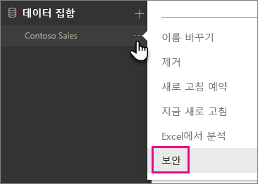
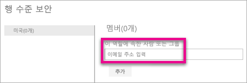
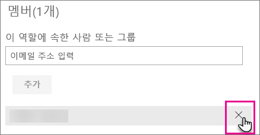

# Power BI를 사용하는 행 수준 보안(RLS)

Power BI를 사용하는 행 수준 보안(RLS)은 지정된 사용자에 데이터 액세스를 제한하는 데 사용됩니다. 필터는 행 수준에서 데이터 액세스를 제한하고 역할 내에서 필터를 정의할 수 있습니다. Power BI 서비스에서 작업 영역의 구성원은 작업 영역의 데이터 집합에 액세스할 수 있습니다. RLS는 이 데이터 액세스를 제한하지 않습니다.

Power BI Desktop으로 Power BI로 가져온 데이터 모델에 대한 RLS를 구성할 수 있습니다. SQL Server와 같은 DirectQuery를 사용하는 데이터 집합에서 RLS를 구성할 수도 있습니다. 이전에는 Power BI 외부의 온-프레미스 Analysis Services 모델 내에서 RLS를 구현할 수만 있었습니다. Analysis Services 라이브 연결의 경우 온-프레미스 모델에서 행 수준 보안을 구성합니다. 라이브 연결 데이터 집합에 보안 옵션이 표시되지 않습니다.

[!INCLUDE [include-short-name](./includes/rls-desktop-define-roles.md)]

기본적으로 행 수준 보안 필터링은 관계가 단방향 또는 양방향으로 설정되었는지 여부에 관계없이 단방향 필터를 사용합니다. 관계를 선택하고 **보안 필터 양방향으로 적용** 확인란을 선택하여 행 수준 보안으로 양방향 교차 필터를 수동으로 활성화할 수 있습니다. [동적 행 수준 보안](https://docs.microsoft.com/sql/analysis-services/supplemental-lesson-implement-dynamic-security-by-using-row-filters)을 구현할 때 이 확인란을 선택해야 하며, 여기서 사용자 이름 또는 로그인 ID를 기반으로 행 수준 보안을 제공합니다.

자세한 내용은 [Power BI Desktop에서 DirectQuery를 사용하여 양방향 교차 필터링](desktop-bidirectional-filtering.md) 및 [테이블 형식 BI 의미 체계 모델 보안](http://download.microsoft.com/download/D/2/0/D20E1C5F-72EA-4505-9F26-FEF9550EFD44/Securing%20the%20Tabular%20BI%20Semantic%20Model.docx) 기술 문서를 참조하세요.

[!INCLUDE [include-short-name](./includes/rls-desktop-view-as-roles.md)]

## 모델에 대한 보안 관리

데이터 모델에 대한 보안을 관리하려면 다음을 수행합니다.

1. 데이터 집합에 대해 **줄임표 (...)** 를 선택합니다.
2. **보안**을 선택합니다.
   
   

Power BI Desktop에서 만든 역할에 멤버를 추가할 수 있는 RLS 페이지로 이동합니다. 데이터 집합의 소유자만이 사용할 수 있는 보안이 표시됩니다. 데이터 집합이 그룹에 있는 경우 그룹의 관리자만이 보안 옵션을 확인할 수 있습니다. 

Power BI Desktop 내에서 역할을 만들거나 수정할 수만 있습니다.

## 멤버 작업

### 멤버 추가

전자 메일 주소 또는 추가하려는 사용자, 보안 그룹 및 배포 목록의 이름을 입력하여 역할에 멤버를 추가할 수 있습니다. 이 멤버는 조직 내에 있어야 합니다. Power BI 내에서 만든 그룹을 추가할 수 없습니다.

또한 역할 이름 옆 또는 멤버 옆에 있는 괄호에 있는 번호로 역할의 일부인 멤버의 수를 확인할 수 있습니다.

### 멤버 제거

해당 이름 옆에 있는 X를 선택하여 멤버를 제거할 수 있습니다. 

## Power BI 서비스 내에서 역할 유효성 검사

역할을 테스트하여 사용자가 정의한 역할이 제대로 작동하는지 확인할 수 있습니다. 

1. 역할 옆에 있는 **줄임표 (...)** 를 선택합니다.
2. **역할로 데이터 테스트**를 선택합니다.

이 역할에 사용 가능한 보고서가 표시됩니다. 대시보드는 이 보기에서 나타나지 않습니다. 위의 파란색 막대에서는 적용된 내용이 표시됩니다.

**지금 다른 형식으로 보기**를 선택하여 다른 역할 또는 역할의 조합을 테스트할 수 있습니다.

특정 사용자로 데이터를 볼 수 있습니다. 또는 사용 가능한 역할의 조합을 선택하여 작업을 검사할 수 있습니다. 

일반 보기로 돌아가려면 **행 수준 보안으로 돌아가기**를 선택합니다.

[!INCLUDE [include-short-name](./includes/rls-usernames.md)]

## Power BI에서 앱 작업 영역으로 RLS 사용

Power BI 서비스 내의 앱 작업 영역에 Power BI Desktop 보고서를 게시하는 경우 역할은 읽기 전용 멤버에 적용됩니다. 멤버는 앱 작업 영역 설정 내에서 Power BI 콘텐츠를 볼 수만 있다고 표시해야 합니다.

> [!WARNING]
> 구성원이 편집 권한을 갖도록 앱 작업 영역을 구성한 경우 RLS 역할이 적용되지 않습니다. 사용자는 모든 데이터를 확인할 수 있습니다.

[!INCLUDE [include-short-name](./includes/rls-limitations.md)]

[!INCLUDE [include-short-name](./includes/rls-faq.md)]

## 다음 단계
[Power BI Desktop을 사용하는 행 수준 보안(RLS)](desktop-rls.md)  

궁금한 점이 더 있나요? [Power BI 커뮤니티에 질문합니다.](http://community.powerbi.com/)