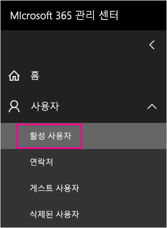

# <a name="understanding-the-power-bi-service-administrator-role"></a>Power BI 서비스 관리자 역할 이해

조직에서 Power BI 서비스 관리자 역할을 사용하는 방법을 알아봅니다. 이 역할의 사용자는 Power BI 테넌트 및 해당 관리 기능(라이선싱 제외)을 완전히 제어합니다.

Power BI 관리 포털에 액세스해야 하는 사용자에게 전체 Office 365 관리 액세스 권한을 부여하지 않고 Power BI 서비스 관리자 역할을 할당할 수 있습니다.

Office 365 사용자 관리 관리자는 Microsoft 365 관리 센터에서 또는 PowerShell 스크립트를 사용하여 Power BI 서비스 관리자 역할에 사용자를 할당합니다. 사용자가 할당되면 [Power BI 관리 포털](service-admin-portal.md)에 액세스할 수 있습니다. 여기서 테넌트 전체 사용 메트릭에 액세스하고 Power BI 기능의 테넌트 전체 사용을 제어할 수 있습니다.

## <a name="limitations-and-considerations"></a>제한 사항 및 고려 사항

Power BI 서비스 관리자 역할은 다음 기능을 제공하지 않습니다.

* Microsoft 365 관리 센터 내에서 사용자와 라이선스를 수정하는 기능,

* 감사 로그 액세스. 자세한 내용은 [조직 내에서 감사 사용](service-admin-auditing.md)을 참조하세요.

## <a name="assign-users-to-the-admin-role-in-office-365"></a>Office 365에서 관리자 역할에 사용자 할당

Microsoft 365 관리 센터에서 Power BI 관리자 역할에 사용자를 할당하려면 다음 단계를 수행합니다.

1. [Microsoft 365 관리 센터](https://portal.office.com/adminportal/home#/homepage)에서 **사용자** > **활성 사용자**를 선택합니다.

    

1. 역할을 할당하려는 사용자를 선택합니다.

1. **역할**에서 **편집**을 선택합니다.

    

1. **사용자 지정 관리자** > **Power BI 서비스 관리자**를 선택합니다.

    

1. **저장**, **닫기**를 차례로 선택합니다.

해당 사용자의 역할에 대해 나열된 **Power BI 서비스 관리자**가 표시되어야 합니다.


## <a name="assign-users-to-the-admin-role-with-powershell"></a>PowerShell을 사용하여 관리자 역할에 사용자 할당

PowerShell을 사용하여 역할에 사용자를 할당할 수도 있습니다. 사용자는 Azure AD(Azure Active Directory)에서 관리됩니다. Azure AD PowerShell 모듈이 없는 경우 [최신 버전을 다운로드하여 설치](https://www.powershellgallery.com/packages/AzureAD/)합니다.

1. 먼저 Azure AD에 연결합니다.
   ```
   PS C:\Windows\system32> Connect-AzureAD
   ```

1. 다음으로 **Power BI 서비스 관리자** 역할의 **ObjectId**를 가져옵니다. [Get AzureADDirectoryRole](/powershell/module/azuread/get-azureaddirectoryrole)을 실행하여 **ObjectId**를 가져올 수 있습니다.

    ```
    PS C:\Windows\system32> Get-AzureADDirectoryRole

    ObjectId                             DisplayName                        Description
    --------                             -----------                        -----------
    00f79122-c45d-436d-8d4a-2c0c6ca246bf Power BI Service Administrator     Full access in the Power BI Service.
    250d1222-4bc0-4b4b-8466-5d5765d14af9 Helpdesk Administrator             Helpdesk Administrator has access to perform..
    3ddec257-efdc-423d-9d24-b7cf29e0c86b Directory Synchronization Accounts Directory Synchronization Accounts
    50daa576-896c-4bf3-a84e-1d9d1875c7a7 Company Administrator              Company Administrator role has full access t..
    6a452384-6eb9-4793-8782-f4e7313b4dfd Device Administrators              Device Administrators
    9900b7db-35d9-4e56-a8e3-c5026cac3a11 AdHoc License Administrator        Allows access manage AdHoc license.
    a3631cce-16ce-47a3-bbe1-79b9774a0570 Directory Readers                  Allows access to various read only tasks in ..
    f727e2f3-0829-41a7-8c5c-5af83c37f57b Email Verified User Creator        Allows creation of new email verified users.
    ```

    이 경우 역할의 **ObjectId**는 00f79122-c45d-436d-8d4a-2c0c6ca246bf입니다.

1. 그런 다음, 사용자의 **ObjectId**를 가져옵니다. [Get AzureADUser](/powershell/module/azuread/get-azureaduser)를 실행하여 찾을 수 있습니다.

    ```
    PS C:\Windows\system32> Get-AzureADUser -ObjectId 'tim@contoso.com'

    ObjectId                             DisplayName UserPrincipalName      UserType
    --------                             ----------- -----------------      --------
    6a2bfca2-98ba-413a-be61-6e4bbb8b8a4c Tim         tim@contoso.com        Member
    ```

1. 역할에 멤버를 추가하려면 [Add-AzureADDirectoryRoleMember](/powershell/module/azuread/add-azureaddirectoryrolemember)를 실행합니다.

    | 매개 변수 | 설명 |
    | --- | --- |
    | ObjectId |역할 ObjectId |
    | RefObjectId |구성원 ObjectId |

    ```powershell
    Add-AzureADDirectoryRoleMember -ObjectId 00f79122-c45d-436d-8d4a-2c0c6ca246bf -RefObjectId 6a2bfca2-98ba-413a-be61-6e4bbb8b8a4c
    ```

## <a name="next-steps"></a>다음 단계

[조직에서 Power BI 관리](service-admin-administering-power-bi-in-your-organization.md)  
[Power BI 관리 포털](service-admin-portal.md)  

궁금한 점이 더 있나요? [Power BI 커뮤니티에 질문합니다.](http://community.powerbi.com/)