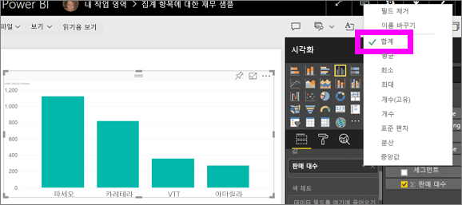
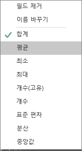
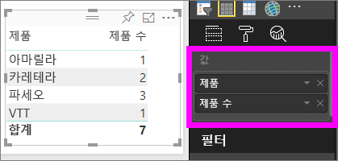

# Power BI 서비스에서 집계(합계, 평균 등) 사용

## 집계란?

데이터에서 값을 수학적으로 결합하려는 경우가 있습니다. 수학 연산은 합계, 평균, 최댓값, 개수 등이 될 수 있습니다. 데이터의 값을 결합하는 작업을 ‘집계’라고 합니다.  해당 수학 연산의 결과는 *집계*입니다.

Power BI 서비스 및 Power BI Desktop이 시각화를 만들면 데이터를 집계할 수 있습니다. 집계는 필요한 것일 뿐이지만 종종 값을 다른 방식으로 집계해야 하는 경우도 있습니다.  예를 들어, 합계와 평균을 비교하는 경우가 있습니다. Power BI가 시각화에서 사용하는 집계를 관리하고 변경하는 방법에는 여러 가지가 있습니다.

먼저, 데이터 형식에 따라 Power BI에서 집계할 수 있는지 여부와 방법이 결정되므로 데이터 ‘형식’을 살펴봅시다. 

## 데이터 유형

대부분의 데이터 세트에는 한 가지 이상의 데이터 유형이 있습니다. 가장 기본적인 수준에서, 데이터는 숫자이거나 숫자가 아닙니다. Power BI는 합계, 평균, 개수, 최소값, 분산 등을 사용하여 숫자 데이터를 집계할 수 있습니다. 서비스에서 ‘범주’ 데이터라고도 하는 텍스트 데이터도 집계할 수 있습니다.  **값**, **도구 설명** 등의 숫자 전용 버킷에 배치하여 범주별 필드를 집계하려고 하면, Power BI는 각 범주의 발생 횟수를 계산하거나 각 범주의 고유한 발생 횟수를 계산합니다. 날짜와 같은 특별한 데이터 형식에는 가장 이른 날짜, 가장 늦은 날짜, 첫 번째 날짜, 마지막 날짜 등의 몇 가지 고유한 집계 옵션이 있습니다.

아래 예제에서:

- **판매 대수** 및 **제조 가격**은 숫자 데이터를 포함하는 열입니다.

- **세그먼트**, **국가**, **제품**, **월** 및 **월 이름**은 범주별 데이터를 포함합니다.

   

Power BI에서 시각화를 만들 때, 서비스는 일부 범주별 필드에 대해 숫자 필드를 집계합니다(기본값은 ‘합계’임).   예를 들어 “***제품별*** 판매 대수”, “***월별*** 판매 대수”, “***세그먼트별*** 제조 가격” 등입니다. Power BI에서는 일부 숫자 필드를 **측정값**이라고 합니다. Power BI 보고서 편집기에서 측정값은 쉽게 확인할 수 있습니다. **필드** 목록에서 측정값 옆에는 ∑ 기호가 있습니다. 자세한 내용은 [보고서 편집기... 둘러보기](service-the-report-editor-take-a-tour.md)를 참조하세요.

## 내가 원하는 방식으로 작업이 집계되지 않는 이유는 무엇입니까?

Power BI 서비스의 집계 방식이 모호해 보일 수 있습니다. Power BI에서 숫자 필드의 집계를 변경할 수 없는 경우도 있습니다. 또는 연도와 같은 필드를 집계하지 않고, 발생 횟수만 계산하려는 경우가 있습니다.

일반적으로 기본 문제는 데이터 세트의 필드 정의입니다. 데이터 세트 소유자가 필드를 텍스트로 정의한 경우, Power BI에서 합계 또는 평균을 계산할 수 없습니다. [데이터 세트 소유자만 필드를 분류하는 방식을 변경할 수 있습니다](desktop-measures.md). 따라서 데스크톱이나 데이터 세트를 만드는 데 사용된 프로그램(예: Excel)에서 데이터 세트에 대한 소유자 권한이 있는 경우 이 문제를 해결할 수 있습니다. 그렇지 않으면 데이터 세트 소유자에게 도움을 요청해야 합니다.  

이 문서의 끝에 있는 특별 섹션인 [**고려 사항 및 문제 해결**](#considerations-and-troubleshooting)에서 팁과 지침을 제공합니다. 여기서 답을 찾을 수 없는 경우 [Power BI 커뮤니티 포럼](http://community.powerbi.com)에 질문을 게시하면 Power BI 팀에서 직접, 신속하게 답변해 드릴 것입니다.

## 숫자 필드가 집계되는 방식 변경

다른 제품의 판매 대수의 합계를 구하는 차트가 있지만 평균값을 구하려는 경우를 가정해 보겠습니다.

1. 측정값과 범주를 사용하는 **묶은 세로 막대형 차트**를 만듭니다. 이 예에서는 제품별 판매 대수를 사용하고 있습니다.  기본적으로 Power BI는 각 제품(**축** 영역으로 범주 끌기)의 판매 대수(**값** 영역으로 측정값 끌기) 합계를 보여 주는 차트를 만듭니다.

   

1. **시각화** 창에서 측정값을 마우스 오른쪽 단추로 클릭하고 필요한 집계 유형을 선택합니다. 이 예제에서는 **평균**을 선택하겠습니다. 필요한 집계가 표시되지 않는 경우, [**고려 사항 및 문제 해결**](#considerations-and-troubleshooting) 섹션을 참조하세요.

   

   > [!NOTE]
   > 드롭다운 목록에서 사용할 수 있는 옵션은 1) 선택된 필드와 2) 데이터 세트 소유자가 해당 필드를 분류한 방식에 따라 달라집니다.

1. 시각화는 이제 평균으로 집계됩니다.

   

## 데이터를 집계하는 방법

필드 집계에 사용 가능한 일부 옵션:

- **요약 안 함**. 이 옵션을 선택하면, Power BI는 해당 필드의 각 값을 개별적으로 처리하고 요약하지 않습니다. 서비스에서 합계를 계산하지 않아야 하는 숫자 ID 열이 있는 경우 이 옵션을 사용합니다.

- **합계**. 해당 필드의 모든 값을 더합니다.

- **평균**. 값의 산술 평균을 구합니다.

- **최소값**. 가장 작은 값을 보여줍니다.

- **최대값**. 가장 큰 값을 보여줍니다.

- **개수(비어 있지 않음).** 비어 있지 않는 해당 필드의 값 수를 계산합니다.

- **개수(고유):** 해당 필드에서 다른 값의 개수를 계산합니다.

- **표준 편차.**

- **분산**.

- **중앙값**.  중앙값(중간값)을 표시합니다. 이 값의 위와 아래에는 동일한 개수의 항목이 있습니다.  중앙값 두 개가 있는 경우 Power BI에서 평균을 계산합니다.

예를 들어, 이 데이터는

| 국가 | 금액 |
|:--- |:--- |
| 미국 |100 |
| 영국 |150 |
| 캐나다 |100 |
| 독일 |125 |
| 프랑스 | |
| 일본 |125 |
| 오스트레일리아 |150 |

다음 결과가 제공됩니다.

- **요약 안 함**: 각 값이 별도로 표시됩니다.

- **합계**: 750

- **평균**: 125

- **최대**:  150

- **최소**: 100

- **개수(비어 있지 않음):** 6

- **개수(고유):** 4

- **표준 편차:** 20.4124145...

- **분산:** 416.666...

- **중앙값:** 125

## 범주(텍스트) 필드를 사용하여 집계 만들기

숫자가 아닌 필드도 집계할 수 있습니다. 예를 들어 제품 이름 필드가 있는 경우 이를 값으로 추가한 다음 **개수**, **고유 개수**, **첫 번째** 또는 **마지막**으로 설정할 수 있습니다.

1. **제품** 필드를 **값** 영역으로 끕니다. **값** 영역은 일반적으로 숫자 필드에 사용됩니다. Power BI는 이 필드가 텍스트 필드임을 인식하고 집계를 **요약 안 함**으로 설정한 다음, 단일 열 테이블을 표시합니다.

   

1. 집계를 기본값인 **요약 안 함**에서 **개수(고유)** 로 변경하면, Power BI는 서로 다른 제품 수를 계산합니다. 이 예제에서는 4개가 있습니다.
  
   

1. 그리고 집계를 **개수**로 변경하면 Power BI는 총 수를 계산합니다. 이 예제에서는 **제품**에 7개 항목이 있습니다.

   

1. 같은 필드(이 예제에서는 **제품**)를 **값** 영역으로 끌고 기본 집계인 **요약 안 함**을 그대로 두면, Power BI는 제품별로 개수를 분석합니다.

   

## 고려 사항 및 문제 해결

Q:  **요약 안 함** 옵션이 없는 이유는 무엇인가요?

A:  선택한 필드는 Excel 또는 [Power BI Desktop](desktop-measures.md)에서 만든 계산된 측정값 또는 고급 측정값일 가능성이 큽니다. 각 계산된 측정값에는 하드 코딩된 고유한 수식이 있습니다. Power BI에서 사용하는 집계는 변경할 수 없습니다. 예를 들어, 합계인 경우 합계만 될 수 있습니다. **필드** 목록에서 *계산된 측정값*은 계산기 기호로 표시됩니다.

Q:  내 필드**는** 숫자인데, **개수** 및 **고유 개수**와 같은 선택만 나타나는 이유는 무엇인가요?

A1:  데이터 세트 소유자가 필드를 숫자로 분류하지 ‘않았을’ 가능성이 큽니다.  예를 들어 데이터 세트에 **연도** 필드가 있는 경우 데이터 세트 소유자가 값을 텍스트로 분류할 수 있습니다. 그러면 Power BI에서 **연도** 필드의 개수(예: 1974년 출생자 수)를 계산할 가능성이 더 많고, 합계 또는 평균을 계산할 가능성은 더 적습니다. 소유자는 Power BI Desktop에서 데이터 세트를 열고 **모델링** 탭을 사용하여 데이터 형식을 변경할 수 있습니다.

A2: 필드에 계산기 아이콘이 있는 경우 ‘계산된 측정값’을 의미합니다. 계산된 측정값마다 하드 코드된 고유 수식이 있으며, 데이터 세트 소유자만 변경할 수 있습니다. Power BI에서 사용하는 계산은 평균 또는 합계와 같은 간단한 집계일 수도 있고, “부모 범주에 대한 기여 비율”이나 “한 해 시작 이후 누계”와 같은 복잡한 집계일 수도 있습니다. Power BI는 결과의 합계 또는 평균을 계산하지 않습니다. 대신, 각 데이터 요소에 대해 하드 코드된 수식을 사용하여 다시 계산하기만 합니다.

A3:  또 다른 원인으로는 범주별 값만 허용하는 ‘버킷’에 필드를 놓은 경우입니다. 이 경우 유일한 옵션은 개수 및 고유 개수입니다.

A4:  네 번째 가능한 원인은 축 필드를 사용하는 경우입니다. 예를 들어, 가로 막대형 차트 축에서 Power BI는 각 고유 값에 하나의 막대를 표시합니다. 이 경우 필드 값을 전혀 집계하지 않습니다.

>[!NOTE]
>이 규칙의 예외는 분산형 차트로, X 및 Y축에 대해 집계된 값이 *필요*합니다.

Q:  SSAS(SQL Server Analysis Services) 데이터 원본에 대한 텍스트 필드를 집계할 수 없는 이유는 무엇인가요?

A:  SSAS 다차원 모델에 대한 라이브 연결에는 첫 번째, 마지막, 평균, 최소, 최대 및 집계를 포함한 클라이언트 쪽 집계가 허용되지 않습니다.

Q:  분산형 차트가 있고 내 필드를 집계하지 ‘않고자’ 합니다. 방법은?

A:  필드를 X 또는 Y축 버킷이 아닌 **세부 정보** 버킷에 추가하세요.

Q:  숫자 필드를 시각화에 추가할 때 대부분의 기본값은 합계를 계산되지만 일부 기본값은 평균을 계산하거나 개수를 세거나 일부 다른 집계를 수행합니다.  기본 집계가 항상 동일하지 않는 이유는 무엇입니까?

A:  데이터 세트 소유자는 각 필드에 대한 기본 요약을 설정할 수 있습니다. 데이터 세트 소유자인 경우, Power BI Desktop의 **모델링** 탭에서 기본 요약을 변경합니다.

Q:  저는 데이터 세트 소유자이며 필드가 집계되지 않도록 하려고 합니다.

A:  Power BI Desktop의 **모델링** 탭에서 **데이터 형식**을 **텍스트**로 설정합니다.

Q:  드롭다운 목록의 옵션으로 **요약 안 함**이 표시되지 않습니다.

A:  필드를 제거하고 다시 추가해보세요.

궁금한 점이 더 있나요? [Power BI 커뮤니티를 이용하세요.](http://community.powerbi.com/)
