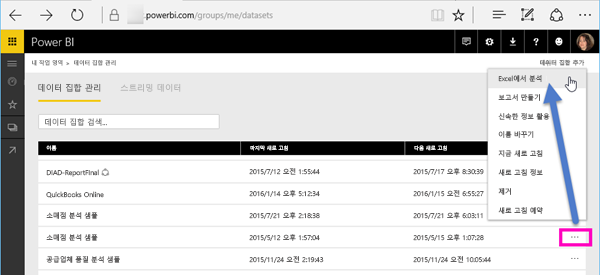
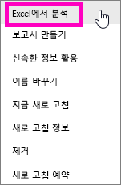
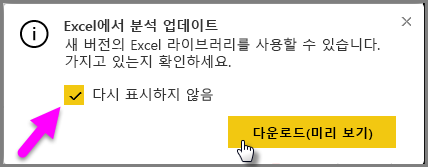
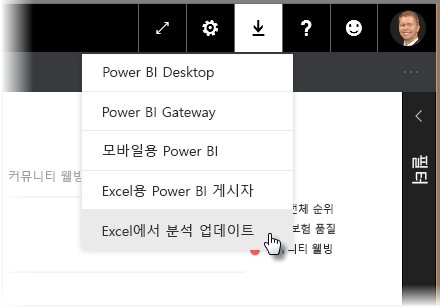
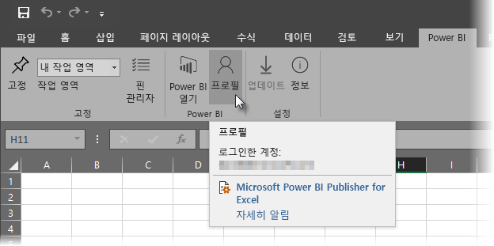
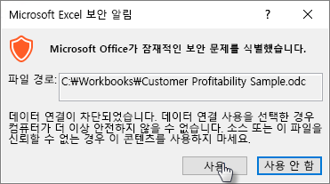
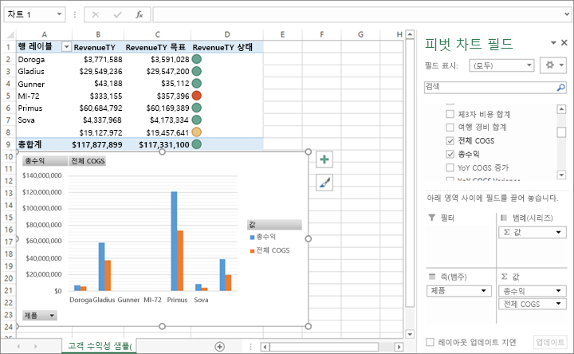

# Excel에서 분석
Excel을 사용하여 Power BI에 있는 데이터 집합을 살펴보고 조작하려는 경우가 있습니다. **Excel에서 분석**을 사용하면, 이것이 가능하고, Power BI에 존재하는 데이터 집합을 기반으로 Excel의 피벗 테이블, 차트, 슬라이서 기능에 액세스할 수 있습니다.

## 요구 사항
**Excel에서 분석**을 사용하려면 몇 가지 요구 사항이 있습니다.

* **Excel에서 분석**은 Microsoft Excel 2010 SP1 이상에 지원됩니다.
* Excel 피벗 테이블은 숫자 필드의 집계를 끌어서 놓도록 지원하지 않습니다. Power BI에서 데이터 집합은 *미리 정의된 측정값이어야 합니다*.
* 일부 조직에서는 Excel에 필수 **Excel에서 분석** 업데이트 설치를 막는 그룹 정책 규칙이 있을 수 있습니다. 업데이트를 설치할 수 없는 경우 관리자에게 확인합니다.
* **Excel에서 분석**하려면 Pro 라이선스가 필요합니다. 무료 라이선스와 Pro 라이선스 간 기능 차이에 대한 자세한 내용은 [Power BI Pro와 무료 버전 비교](service-free-vs-pro.md)를 참조하세요. 

## 어떻게 작동합니까?
**Power BI**의 데이터 집합이나 보고서와 연결된 줄임표 메뉴(...)에서 **Excel에서 분석**을 선택하면, Power BI에서 .ODC 파일을 만들고 브라우저에서 컴퓨터로 다운로드합니다.

Excel에서 그 파일을 열면, Power BI 데이터 집합의 테이블, 필드 및 측정값과 함께 빈 **피벗 테이블** 및 **필드** 목록이 표시됩니다. Excel에서 로컬 데이터 집합으로 작업하는 것처럼 피벗 테이블, 차트를 만들고 데이터 집합을 분석할 수 있습니다.

.ODC 파일에는 Power BI에 있는 데이터 집합에 연결하는 MSOLAP 연결 문자열이 있습니다. 데이터를 분석하거나 작업하는 경우, Excel은 Power BI의 해당 데이터 집합을 쿼리하고 결과를 Excel로 반환합니다. 데이터 집합이 DirectQuery를 사용하여 라이브 데이터 원본에 연결된 경우 Power BI는 데이터 원본을 쿼리하고 결과를 Excel로 반환합니다.

**Excel에서 분석**은 DAX(데이터 분석 식)를 사용하여 만든 모델 측정값이 있는 데이터 모델로, Power BI Desktop 파일 또는 Excel 통합 문서에서 또는 *분석 서비스 테이블 형식* 또는 다차원 데이터베이스에 연결하는 데이터 집합 및 보고서에 매우 유용합니다.

## Excel에서 분석 시작
Power BI에서 보고서나 데이터 집합 옆에 있는 줄임표 메뉴(보고서나 데이터 집합 이름 옆의 ...)를 선택하고, 표시되는 메뉴에서 **Excel에서 분석**을 선택합니다.

### Excel 업데이트 설치
**Excel에서 분석**을 처음 사용하는 경우, Excel 라이브러리에 업데이트를 설치해야 합니다. Excel 업데이트를 다운로드하여 설치하라는 메시지가 표시됩니다.(이를 통해 *SQL_AS_OLEDDB.msi* Windows Installer 패키지 설치가 시작됩니다.) 이 패키지는 **SQL Server 2016 RC0(미리 보기)에 대한 Microsoft AS OLE DB Provider**를 설치합니다.

> [!NOTE]
> **Excel 업데이트 설치** 대화 상자에서 **이 메시지를 다시 표시 안 함**을 확인해야 합니다. 업데이트를 한 번 설치하기만 하면 됩니다.
> 
> 

**Excel에서 분석**을 위해 Excel 업데이트를 설치해야 하는 경우에는, 아래 이미지와 같이, Power BI의 **다운로드** 아이콘을 통해 업데이트를 다운로드할 수 있습니다.

### Power BI에 로그인
브라우저에서 Power BI로 로그인했더라도 Excel에서 처음으로 새 .ODC 파일을 열면 Power BI 계정으로 Power BI에 로그인하라는 메시지가 나타날 수 있습니다. Excel에서 Power BI에 대한 연결을 인증합니다.

### Power BI 계정이 여러 개인 사용자
Power BI 계정이 여러 개인 사용자는, Power BI에 로그인한 계정과, Excel에서 분석에 사용되는 데이터 집합에 대한 액세스가 있는 계정이 다른 경우를 접할 수 있습니다. 이런 경우, Excel에서 분석 통합 문서에 사용되는 데이터 집합에 액세스를 시도하면 **사용할 수 없음** 오류가 발생하거나 로그인에 실패할 수 있습니다.

다시 로그인할 수 있는 기회가 제공되며, 이 때 Excel에서 분석에서 액세스하는 데이터 집합에 대한 액세스가 있는Power BI 계정으로 로그인할 수 있습니다. Excel에서 현재 로그인한 계정을 식별하고, 로그아웃할 수 있는(이어서, 다른 계정으로 로그인하는) 링크를 제공하는**Power BI** 리본 탭에서 **프로필**을 선택할 수도 있습니다.

### 데이터 연결 사용
Excel에서 Power BI 데이터를 분석하려는 경우, .odc 파일에 대한 파일 이름과 경로를 확인하라는 메시지가 표시되면 **사용**을 선택합니다.

> [!NOTE]
> Power BI 테넌트 관리자는 온-프레미스 데이터 집합을 Analysis Services(AS) 데이터베이스에 저장하고 *Power BI Admin Portal*을 사용하여 **Excel에서 분석** 사용을 비활성화할 수 있습니다. 이 옵션을 비활성화하면 AS 데이터베이스에서 **Excel에서 분석**이 비활성화되지만 다른 데이터 집합에는 계속 사용할 수 있습니다.
> 
> 

## 일단 수행
Excel이 열렸고 빈 피벗 테이블이 있으니, Power BI 데이터 집합으로 모든 종류의 분석을 수행할 준비가 되었습니다. 다른 로컬 통합문서처럼, Excel에서 분석을 사용하여 피벗 테이블과 차트를 만들고 다른 소스의 데이터를 추가하는 등의 작업을 수행할 수 있습니다. 물론, 데이터에 대한 모든 종류의 보기를 포함하는 다양한 워크시트를 만들 수 있습니다.

> [!NOTE]
> **Excel에서 분석**을 사용하여 데이터 집합에 대한 권한이 있는 사용자에게 모든 세부 수준 데이터가 노출됨에 유의하세요.
> 
> 

## 저장
Power BI 데이터 집합이 연결된 통합 문서를 다른 통합 문서처럼 저장할 수 있습니다. 하지만, 테이블에 데이터가 있거나 데이터 모델이 있는 Power BI에 통합 문서를 게시하거나 가져올 수만 있기 때문에, Power BI로 통합 문서를 다시 가져오거나 게시할 수는 없습니다. 새 통합 문서는 Power BI에 있는 데이터 집합에 대한 연결만을 포함하기 때문에, 그 문서를 Power BI에 가져오면 연결이 맴돌게 됩니다.

## 공유
통합 문서가 저장되면 조직에서 다른 Power BI 사용자와 공유할 수 있습니다.

통합 문서를 공유 받은 사용자가 통합 문서를 열면, 피벗 테이블과 데이터는 공유한 사용자가 통합 문서를 마지막으로 저장한 상태로 표시됩니다. 하지만 이것은 데이터의 최신 버전이 아닐 수 있습니다. 최신 데이터를 가져오려면, **데이터** 리본의 **새로 고침** 단추를 사용해야 합니다. 통합 문서가 Power BI의 데이터 집합에 연결되어 있기 때문에, 통합 문서를 새로 고치려는 사용하는 이 방법을 사용하여 업데이트를 처음 시도할 때 Power BI에 로그인해야 하고 Excel 업데이트를 설치해야 합니다.

데이터 집합을 새로 고쳐야 하고, Excel Online에서 외부 연결에 대한 새로 고침이 지원되지 않기 때문에, 컴퓨터의 데스크톱 버전 Excel에서 통합 문서를 여는 것이 좋습니다.

