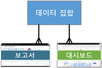
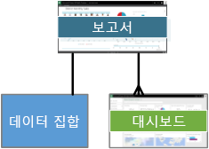
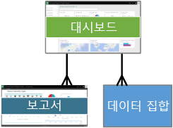
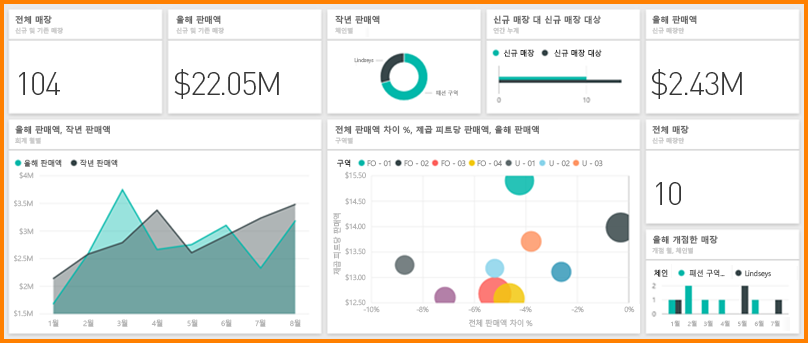

# Power BI - Power BI 서비스에 대한 기본 개념
<!-- Shared newnav Include -->
[!INCLUDE [newnavbydefault](./includes/newnavbydefault.md)]

이 문서에서는 이미 [Power BI에 등록](service-self-service-signup-for-power-bi.md)했고 [일부 데이터를 추가](service-get-data.md)했다고 가정합니다.

Power BI 서비스를 열면 ***대시보드***가 표시됩니다. 대시보드는 Power BI Desktop에서 Power BI 서비스를 구분할 수 있는 항목입니다.

Power BI 서비스 UI의 주요 기능은 다음과 같습니다.

1. 탐색 모음
2. 타일이 있는 대시보드
3. 질문 및 답변 질문하기 상자
4. 도움말 및 피드백 단추
5. 대시보드 제목
6. Office 365 앱 시작 관리자
7. Power BI 홈 단추
8. 추가 대시보드 작업

이러한 항목은 나중에 자세히 살펴보고 먼저 몇 가지 Power BI 개념에 대해 검토해 보겠습니다.

또는 이 문서의 나머지 부분을 읽기 전에 이 비디오를 시청하는 것이 좋습니다.  비디오에서 Power BI 서비스의 기본 개념을 검토하고 간략한 둘러보기를 제공합니다.

<iframe width="560" height="315" src="https://www.youtube.com/embed/B2vd4MQrz4M" frameborder="0" allowfullscreen></iframe>

## Power BI 개념
Power BI의 세 가지 주요 구성 요소는 ***대시보드***, ***보고서*** 및 ***데이터 집합***입니다. 데이터가 없는 대시보드나 보고서를 가질 수 없으므로(빈 대시보드와 빈 보고서가 있을 수 있지만 데이터가 있어야 유용합니다) **데이터 집합**을 시작하겠습니다.

## 데이터 집합
*데이터 집합*은 *가져오기* 또는 *연결*할 데이터의 컬렉션입니다. Power BI를 사용하면 모든 종류의 데이터 집합에 연결하고 가져와서 같은 위치에 모두 함께 표시할 수 있습니다.  

탐색 모음에서, 연결하거나 가져온 데이터 집합은 **데이터 집합** 제목에 나열됩니다. 나열된 각 데이터 집합은 OneDrive의 Excel 통합 문서, 온-프레미스 SSAS 표 형식 데이터 집합, Salesforce 데이터 집합 등 데이터의 단일 원본을 나타냅니다. 여러 가지 다양한 데이터 소스가 지원되며 계속해서 새로 추가할 예정입니다. [Power BI에서 사용할 수 있는 데이터 집합 형식 목록을 참조하세요](service-get-data.md).

**하나의** 데이터 집합은...

* 반복해서 사용할 수 있습니다.
* 여러 보고서에서 사용할 수 있습니다.
* 해당 데이터 집합의 시각화가 여러 대시보드에 표시될 수 있습니다.
  
  

[데이터 집합에 연결하거나 가져오려면](service-get-data.md) **데이터 가져오기**(탐색 모음의 맨 아래에 있음)를 선택하거나 **데이터 집합** 제목 옆에 있는 더하기 아이콘을 선택합니다. 지침에 따라 특정 원본에 연결하거나 가져오고 작업 영역에 데이터 집합을 추가합니다. 새 데이터 집합은 왼쪽 탐색 모음에 나열되며 노란색 별표로 표시됩니다. Power BI에서 작업을 수행해도 기본 데이터 집합은 변경되지 않습니다.

본인이 [***앱 작업 영역***의 일부](service-collaborate-power-bi-workspace.md)인 경우 한 작업 영역 구성원에 의해 추가된 데이터 집합은 다른 작업 영역 구성원이 사용할 수 있습니다.

데이터 집합을 새로 고치고, 이름을 변경하고, 탐색하고, 보고서를 만드는 데 사용하고 제거할 수 있습니다. 데이터 집합을 탐색하려면 선택합니다. 데이터를 자세히 살펴보고 시각화 만들기 시작할 수 있는 보고서 편집기에서 데이터 집합을 여는 작업을 실제로 수행하고 있습니다. 따라서 다음 항목인 보고서를 살펴보겠습니다.

### 심층적 분석:
* [Power BI 프리미엄이란?](service-premium.md)
* [Power BI에 대한 데이터 가져오기](service-get-data.md)
* [Power BI의 샘플 데이터 집합 및 콘텐츠 팩](sample-datasets.md)

## 보고서
Power BI 보고서는 한 장 이상의 시각화 페이지입니다(꺾은 선형 차트, 원형 차트, 트리맵 등 차트와 그래프). 시각화는 ***시각적 개체***라고도 합니다. 보고서의 모든 시각화는 단일 데이터 집합에서 제공합니다. 보고서는 Power BI 내에서 처음부터 새로 만들거나, 동료가 공유한 대시보드를 사용하여 가져오거나, Excel, Power BI Desktop, 데이터베이스, SaaS 응용 프로그램 및 [콘텐츠 팩](service-organizational-content-pack-introduction.md)의 데이터 집합에 연결할 경우 만들 수 있습니다.  예를 들어 파워 뷰 시트가 포함된 Excel 통합 문서에 연결하면 Power BI에서 해당 시트를 기반으로 보고서를 만듭니다. 또한 SaaS 응용 프로그램에 연결하면 Power BI에서 미리 작성된 보고서를 가져옵니다.

보고서는 [읽기용 보기](service-report-open-in-reading-view.md)와 [편집용 보기](service-interact-with-a-report-in-editing-view.md)의 두 가지 모드로 보고 상호 작용할 수 있습니다.  보고서, 공동 소유자 및 해당 권한 부여를 만든 사람만이 보고서에 대한 ***편집용 보기*** 의 탐색, 디자인, 구축, 공유 기능 모두에 대한 액세스 권한을 갖습니다. 그리고 보고서를 공유하는 사람들은 ***읽기용 보기***를 사용하여 보고서를 탐색하고 보고서와 상호 작용할 수 있습니다.   

탐색 창에서 보고서는 **보고서** 제목에 나열됩니다. 나열된 각 보고서는 하나의 기본 데이터 집합을 기반으로 하는 하나 이상의 시각화 페이지를 나타냅니다. 보고서를 열려면 선택하면 됩니다. 기본적으로 보고서는 읽기용 보기를 먼저 엽니다.  **보고서 편집**을 선택하여 필요한 사용 권한이 있는 경우 편집용 보기에서 엽니다.  공유된 대시보드에 보고서가 있는 경우 탐색 모음에 나열된 보고서가 표시되지 않습니다. 대신, 대시보드 타일(나중에 자세히 알아봄)을 선택하여 공유 대시보드에서 직접 공유 보고서를 엽니다.

**하나의** 보고서는...

* 여러 대시보드에 연결할 수 있습니다. 해당 보고서에 고정된 타일이 여러 대시보드에 나타날 수 있습니다.
* 하나의 데이터 집합의 데이터를 사용하여 만들 수 있습니다. Power BI Desktop에서 하나 이상의 데이터 집합을 단일 보고서에 결합하고 해당 보고서를 Power BI로 가져온 경우는 약간 예외입니다.
  
  

## 대시보드
*대시보드* 는 사용자가 직접 만드는 요소이거나 동료가 만들어 사용자와 공유하는 요소입니다. 또한 0개 이상의 타일 및 위젯이 포함된 단일 캔버스입니다. 각 타일에는 데이터 집합에서 만들고 대시보드에 고정된 단일 [시각화](power-bi-report-visualizations.md)가 표시됩니다. 대시보드에 타일을 추가할 수 있는 여러 가지 방법이 있지만 이 개요 항목에서 다루기엔 너무 많습니다. 자세히 알아보려면 [Power BI의 대시보드 타일](service-dashboard-tiles.md)을 참조하세요. 

탐색 모음에서, "사용자"의 대시보드는 **대시보드** 제목에 나열됩니다. "사용자"는 대시보드를 만든 사용자가 아닌 액세스 권한이 있는 사용자를 의미합니다. 각 대시보드는 기본 데이터 집합의 일부 하위 집합에 대한 사용자 지정 보기를 나타냅니다.  대시보드가 있는 경우 기본 데이터 집합에 액세스할 수 있고 해당 기본 데이터 집합이 **데이터 집합**의 탐색 모음에 나타납니다.  대시보드를 공유하는 경우 옆에 공유 아이콘 이 있으며 공유된 방법에 따라 탐색 모음에 나열된 기본 데이터 집합이 나타나지 않을 수 있습니다.

> [!NOTE]
> 고정 및 타일은 아래 “타일이 있는 대시보드”란 제목에서 자세히 다루어집니다.
> 
> 

**하나의** 대시보드는...

* 여러 데이터 집합의 시각화를 표시할 수 있습니다.
* 여러 보고서의 시각화를 표시할 수 있습니다.
* 다른 도구(예: Excel)에서 고정된 시각화를 표시할 수 있습니다.
  
  

### 심층적 분석:
**대시보드는 [처음부터 새로 만들](service-dashboard-create.md)** 수 있습니다. 즉, 비어 있는 새 대시보드를 만든 다음 일부 데이터를 가져옵니다. 

**사용자 또는 동료가 대시보드를 만들고 [공유할](service-share-dashboards.md)** 수 있습니다. 초대를 수락하면 공유 대시보드(와 연결된 보고서 및 데이터 집합)가 탐색 모음에 추가됩니다. Power BI Pro는 대시보드를 공유하고 공유한 대시보드를 보는 데 필요합니다.

**경우에 따라 대시보드는 데이터 집합과 함께 가져오거나 데이터 집합에 연결할 때 만들어집니다**. 예를 들어 Salesforce의 **데이터 가져오기** 마법사에서는 데이터 집합에서 대시보드 및/또는 보고서를 만들지 여부를 묻습니다. 

**대시보드를 만드는 이유는 무엇인가요?**  다음은 몇 가지 이유입니다.

* 의사 결정을 내리는 데 필요한 모든 정보를 한 눈에 보기 위해서
* 비즈니스에 가장 중요한 정보를 모니터링하기 위해서
* 모든 동료가 동일한 페이지에서 동일한 정보를 보고 사용하도록 하기 위해서
* 비즈니스, 제품, 사업부, 마케팅 캠페인 등의 상태를 모니터링하기 위해서
* 더 큰 대시보드의 개인 설정된 보기를 만들어 자신에게 중요한 모든 메트릭을 표시하기 위해서

## 내 작업 영역
Power BI 대시보드 및 작업 영역으로 다시 돌아갑니다. Power BI 서비스에 대한 방문 페이지를 구성하는 부분을 자세히 살펴보겠습니다.

### 1. **탐색 모음**(navbar)
탐색 모음을 사용하여 Power BI 구성 요소인 대시보드, 보고서 및 데이터 집합 간을 이동할 수 있습니다.  

  

* **데이터 가져오기**를 선택하여 [Power BI에 데이터 집합, 보고서 및 대시보드를 추가](service-get-data.md)합니다.
* 이 아이콘 로 탐색 모음을 확장하고 축소합니다.
* **Search**를 사용하여 탐색 모음에서 특정 항목을 찾을 수 있습니다.
* 더하기 아이콘 을 선택하여 새 대시보드를 만들거나 새 데이터 집합을 가져옵니다.
* 나열된 **대시보드, 보고서** 및 **데이터 집합** 은 사용할 수 있습니다.  공유 대시보드는 읽기 전용이며 공유 아이콘 을 표시합니다.
* 대시보드, 보고서 및 데이터 집합 이름은 일반적으로 기본 데이터 집합 파일의 이름과 일치하지만 [이름을 바꿀](service-rename.md) 수 있습니다.
* 대시보드, 보고서 또는 데이터 집합을 마우스 오른쪽 단추로 클릭하여 상황 의존적인 메뉴를 표시합니다. 
  
  

한 번 클릭 동작의 결과

* 제목을 확장하거나 축소합니다.
* 대시보드는 표시됩니다.
* 보고서를 읽기용 보기로 엽니다.
* 데이터 집합은 탐색됩니다.

### 2. **타일이 있는 대시보드**
대시보드는 [타일](service-dashboard-tiles.md)로 구성됩니다.  타일은 보고서 편집용 보기, 질문 및 답변, 기타 대시보드에서 생성되고, Excel, SSRS 등에서 고정될 수 있습니다. [위젯](service-dashboard-add-widget.md)이라는 특수한 형식의 타일은 대시보드에 직접 추가됩니다. 대시보드에 나타나는 타일은 보고서 작성자/소유자가 특별히 대시보드에 배치한 것입니다.  대시보드에 타일을 추가하는 동작을 *고정*이라고 합니다.

자세한 내용은 **대시보드**(위)를 참조하세요.

### 3. **질문 및 답변 질문하기 상자**
데이터를 탐색하는 한 가지 방법은 질문을 하여 Power BI 질문 및 답변에서 시각화 형태로 답변을 제공하도록 하는 것입니다. 질문 및 답변을 사용하여 보고서에 콘텐츠를 추가할 수 없으며, 대시보드에만 타일의 형태로 콘텐츠를 추가할 수 있습니다.

질문 및 답변은 대시보드에 연결된 데이터 집합에서 답변을 찾습니다.  연결된 데이터 집합은 해당 대시보드에 고정된 타일이 하나 이상 있는 데이터 집합입니다.

질문 입력을 시작하는 즉시 질문 및 답변 페이지로 이동합니다. 입력할 때 질문 및 답변을 사용하면 적절하게 질문을 하고 고쳐 말하기, 자동 채우기, 제안 등으로 최상의 답변을 찾을 수 있습니다. 원하는 시각화(답변)가 있으면 대시보드에 고정합니다. 자세한 내용은 [Power BI의 질문 및 답변](service-q-and-a.md)을 참조하세요.

### 4. **전체 화면, 알림, 설정, 다운로드, 도움말 및 피드백**
오른쪽 위에 있는 아이콘은 설정, 알림, 다운로드, 도움말 보기 및 Power BI 팀에 피드백 제공에 필요한 리소스입니다. 이중 화살표를 선택하여 **전체 화면** 모드에서 대시보드를 엽니다.  

### 5. **대시보드 제목**(즉, 활성 상태인 대시보드)
활성 상태인 대시보드를 항상 쉽게 찾을 수 있는 것은 아닙니다.  대시보드 제목은 대시보드 보기 페이지, 질문 및 답변 페이지, 보고서 편집용 보기 및 보고서 읽기용 보기에 나타나고 데이터 집합을 열 때 나타납니다.   

### 6. **Office 365 앱 시작 관리자**
앱 시작 관리자는 Office 365 앱을 시작하는 데 도움이 되도록 설계되었습니다.

### 7. **Power BI 홈**
이를 선택하면 가장 최근에 본 대시보드로 돌아갑니다.

   

### 8. **옵션**
이 작업 영역의 영역은 대시보드와 상호 작용하기 위한 아이콘을 포함합니다.  **타일 추가**, **즐겨찾기** 및 **공유** 외에도 줄임표를 선택하면 대시보드를 복제, 인쇄 및 새로 고침하는 옵션이 표시됩니다.

   

## 다음 단계
[Power BI 시작](service-get-started.md)  
[Power BI 비디오](videos.md)  
[Power BI 프리미엄이란?](service-premium.md)

궁금한 점이 더 있나요? [Power BI 커뮤니티에 질문합니다.](http://community.powerbi.com/)

