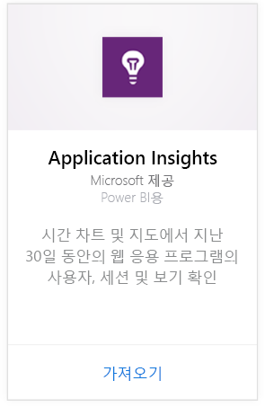
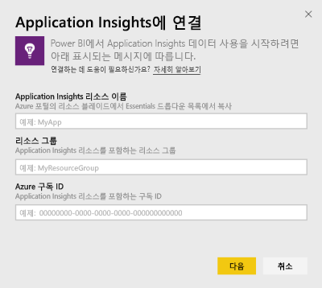
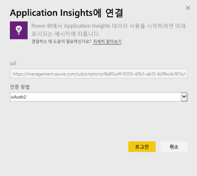
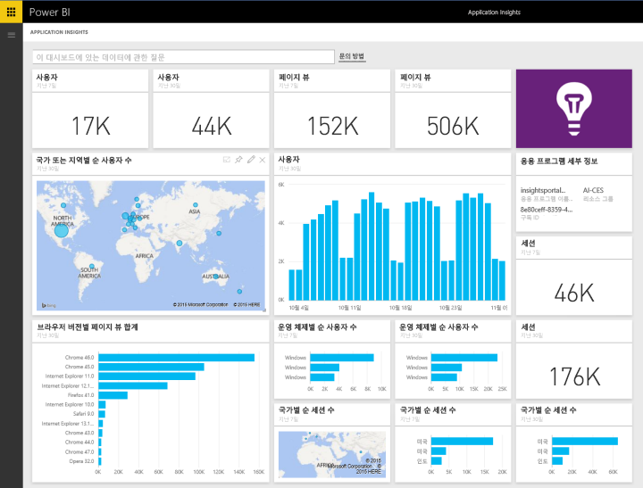
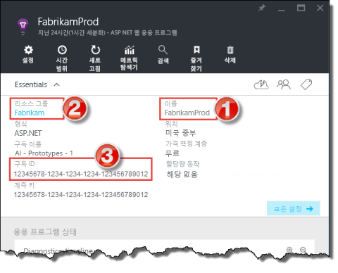
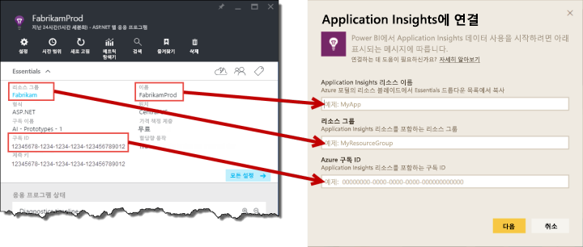

# Power BI로 Application Insights에 연결
Power BI를 사용하여 [Application Insights](/azure/application-insights/app-insights-overview/) 원격 분석에서 강력한 사용자 지정 대시보드를 만듭니다. 새로운 방식으로 앱 원격 분석을 구상합니다. 여러 앱 또는 구성 요소 서비스에서 하나의 대시보드에 메트릭을 결합합니다. Application Insights용 Power BI 콘텐츠 팩의 첫 번째 버전은 활성 사용자, 페이지 보기, 세션, 브라우저와 OS 버전 및 맵에서 사용자의 지리적 분포와 같은 일반적인 사용 관련 메트릭에 대한 위젯을 포함합니다.

[Power BI용 Application Insights 콘텐츠 팩](https://app.powerbi.com/getdata/services/application-insights)에 연결합니다.

>[!NOTE]
>이 통합 메서드는 이제 **사용되지 않습니다**. Power BI에 Application Insights를 연결하는 기본 설정 방법에 대해 자세히 알아보려면 [분석 쿼리 기능 내보내기](https://docs.microsoft.com/azure/application-insights/app-insights-export-power-bi#export-analytics-queries)를 사용합니다.

## 연결 방법
1. 왼쪽 탐색 창의 맨 아래에 있는 **데이터 가져오기** 를 선택합니다.
   
    
2. **서비스** 상자에서 **가져오기**를 선택합니다.
   
    
3. **Application Insights** > **가져오기**를 선택합니다.
   
    
4. **Application Insights 리소스 이름**, **리소스 그룹**및 **구독 ID**를 포함하여 연결하려는 응용 프로그램의 세부 정보를 제공합니다. 자세한 내용은 아래 [Application Insights 매개 변수 찾기](#FindingAppInsightsParams)를 참조하세요.
   
        
5. **로그인** 을 선택하고 연결할 화면을 따릅니다.
   
    
6. 가져오기 프로세스가 자동으로 시작됩니다. 완료되면 알림이 보여지고 새 대시보드, 보고서 및 모델이 별표로 표시된 탐색 창에 나타납니다.  대시보드를 선택하여 가져온 데이터를 표시합니다.
   
    

**다음 단계**

* 대시보드 맨 위에 있는 [질문 및 답변 상자에 질문](consumer/end-user-q-and-a.md)합니다.
* 대시보드에서 [타일을 변경](service-dashboard-edit-tile.md)합니다.
* [타일을 선택](consumer/end-user-tiles.md)하여 원본 보고서를 엽니다.
* 데이터 집합을 매일 새로 고치도록 예약하는 경우 새로 고침 일정을 변경하거나 **지금 새로 고침**을 사용하여 필요할 때 새로 고칠 수 있습니다.

## 포함된 내용
Application Insights 콘텐츠 팩은 다음 테이블 및 메트릭을 포함합니다.  

    ´´´
    - ApplicationDetails  
    - UniqueUsersLast7Days   
    - UniqueUsersLast30Days   
    - UniqueUsersDailyLast30Days  
    - UniqueUsersByCountryLast7Days  
    - UniqueUsersByCountryLast30Days   
    - PageViewsDailyLast30Days   
    - SessionsLast7Days   
    - SessionsLast30Days  
    - PageViewsByBrowserVersionDailyLast30Days   
    - UniqueUsersByOperatingSystemLast7Days   
    - UniqueUsersByOperatingSystemLast30Days    
    - SessionsDailyLast30Days   
    - SessionsByCountryLast7Days   
    - SessionsByCountryLast30Days   
    - PageViewsByCountryDailyLast30Days  
    ´´´ 

## 매개 변수 찾기
리소스 이름, 리소스 그룹 및 구독 ID는 모두 Azure Portal에서 찾을 수 있습니다. 이름을 선택하면 세부 정보 보기가 열리고 Essentials 드롭 다운을 사용하여 필요한 모든 값을 찾을 수 있습니다.

Power BI의 이러한 필드에 복사하고 붙여넣습니다.

## 다음 단계
[Power BI에서 시작](service-get-started.md)

[Power BI에서 데이터 가져오기](service-get-data.md)

